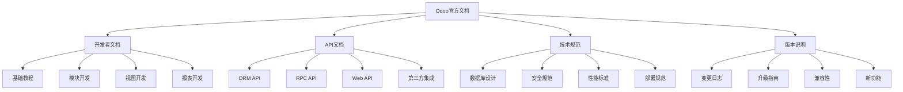

# Odoo开发文档

## 🎯 概述

Odoo官方开发文档是Odoo平台最权威的技术文档来源，涵盖系统架构、API参考、模块开发、数据库管理等多个方面的详细说明。

## 📊 文档结构

### 官方文档分类图


## 📚 核心开发文档

### Odoo ORM参考文档
```python
# 文档引用示例
"""
Odoo ORM参考文档 - 数据模型开发指南

1. 模型定义
- _name: 模型的技术名称
- _description: 模型的描述信息
- _rec_name: 记录的表示名称
- _order: 记录的默认排序

2. 字段类型
- Char: 字符串字段
- Text: 长文本字段
- Integer: 整数字段
- Float: 浮点数字段
- Boolean: 布尔字段
- Date: 日期字段
- Datetime: 日期时间字段
- Many2one: 多对一关系
- One2many: 一对多关系
- Many2many: 多对多关系

3. 字段属性
- required: 是否必填
- readonly: 是否只读
- help: 字段帮助信息
- string: 字段标签
- default: 默认值
- states: 状态相关属性

4. 方法装饰器
- @api.model: 模型级别方法
- @api.multi: 多记录方法
- @api.depends: 计算字段依赖
- @api.constrains: 约束装饰器
- @api.onchange: 字段变化方法
- @api.returns: 返回值注解
"""

# 示例：标准的模型定义
from odoo import models, fields, api
from odoo.exceptions import ValidationError

class ExampleModel(models.Model):
    _name = 'example.model'
    _description = '示例模型'
    _rec_name = 'name'
    _order = 'create_date desc'
    
    # 基础字段
    name = fields.Char(string='名称', required=True)
    description = fields.Text(string='描述')
    active = fields.Boolean(string='激活', default=True)
    
    # 关系字段
    partner_id = fields.Many2one('res.partner', string='客户')
    line_ids = fields.One2many('example.line', 'model_id', string='明细行')
    tag_ids = fields.Many2many('example.tag', string='标签')
    
    # 计算字段
    amount_total = fields.Float(
        string='总金额',
        compute='_compute_total',
        store=True
    )
    
    @api.depends('line_ids.amount')
    def _compute_total(self):
        for record in self:
            record.amount_total = sum(record.line_ids.mapped('amount'))
    
    @api.constrains('amount_total')
    def _check_amount(self):
        for record in self:
            if record.amount_total < 0:
                raise ValidationError('总金额不能为负数')
```

### Web API开发文档
```javascript
// Odoo Web API文档示例

// 1. RPC调用示例
odoo.define('my_module.my_widget', function(require) {
    "use strict";
    
    var rpc = require('web.rpc');
    var AbstractField = require('web.AbstractField');
    
    var CustomField = AbstractField.extend({
        _render: function() {
            var self = this;
            
            // 异步RPC调用
            rpc.query({
                model: 'my.model',
                method: 'get_data',
                args: [context],
                kwargs: {
                    domain: [['active', '=', True]]
                }
            }).then(function(result) {
                self.handleSuccess(result);
            }).fail(function(error) {
                self.handleError(error);
            });
        },
        
        handleSuccess: function(data) {
            // 处理成功返回的数据
            this.$el.html(
                '<div>' + JSON.stringify(data) + '</div>'
            );
        },
        
        handleError: function(error) {
            // 处理错误
            console.error('RPC调用失败:', error);
        }
    });
    
    return CustomField;
});

// 2. 动作和视图API
odoo.define('my_module.actions', function(require) {
    "use strict";
    
    var AbstractAction = require('web.AbstractAction');
    
    var MyAction = AbstractAction.extend({
        template: 'my_template',
        
        start: function() {
            var self = this;
            
            // 获取解析后的context
            var context = this.do_action.context;
            
            // 获取当前记录信息
            var record = this.initialState;
            
            // 创建窗口动作
            this.do_action({
                name: '记录详情',
                type: 'ir.actions.act_window',
                res_model: 'my.model',
                res_id: record.id,
                view_mode: 'form',
                target: 'current'
            });
        }
    });
    
    return MyAction;
});

// 3. 事件处理
odoo.define('my_module.events', function(require) {
    "use strict";
    
    var core = require('web.core');
    var bus = require('web.bus');
    
    // 事件订阅
    bus.on('my_event', this, function(data) {
        console.log('接收到事件:', data);
    });
    
    // 事件发布
    bus.trigger('my_event', {
        message: 'Hello World',
        timestamp: new Date()
    });
});
```

### 模块结构文档
```xml
<!-- Odoo模块结构文档示例 -->

<!-- 1. __manifest__.py -->
{
    'name': 'My Custom Module',
    'version': '16.0.1.0.0',
    'category': 'Custom',
    'summary': '模块摘要',
    'description': '''
        模块详细描述信息
        - 功能特性1
        - 功能特性2
        - 功能特性3
    ''',
    'author': 'Your Company',
    'website': 'https://www.yourcompany.com',
    'license': 'LGPL-3',
    
    'depends': [
        'base',
        'web',
        'sale',
    ],
    
    'data': [
        'security/ir.model.access.csv',
        'security/res_groups.xml',
        'views/res_partner_view.xml',
        'views/sale_order_view.xml',
        'data/res_partner_data.xml',
    ],
    
    'demo': [
        'demo/demo_data.xml',
    ],
    
    'installable': True,
    'auto_install': False,
    'application': False,
    
    'external_dependencies': {
        'python': [
            'requests',
            'xmltodict',
        ],
    },
}

<!-- 2. XML视图文档 -->
<record id="view_res_partner_form_inherited" model="ir.ui.view">
    <field name="name">res.partner form inherited</field>
    <field name="model">res.partner</field>
    <field name="inherit_id" ref="base.view_partner_form"/>
    <field name="arch" type="xml">
        
        <!-- 定位到具体元素 -->
        <xpath expr="//field[@name='vat']" position="after">
            
            <!-- 添加新字段 -->
            <field name="custom_identifier"/>
            
            <!-- 添加新分组 -->
            <separator string="Custom Information"/>
            
            <!-- 添加按钮 -->
            <group>
                <button name="custom_action" 
                        type="object"
                        string="Click Me"
                        class="btn-primary"/>
            </group>
            
        </xpath>
        
    </field>
</record>

<!-- 3. QWeb模板文档 -->
<template id="my_template" name="My Custom Template">
    
    <!-- 基础模板结构 -->
    <div class="my_custom_template">
        <h1>标题: <t t-esc="record.name"/></h1>
        
        <!-- 条件渲染 -->
        <t t-if="record.state == 'done'">
            <div class="alert alert-success">已完成</div>
        </t>
        
        <!-- 循环渲染 -->
        <t t-foreach="record.line_ids" t-as="line">
            <div class="line-item">
                <span t-esc="line.name"/>
                <span t-esc="line.amount"/>
            </div>
        </t>
        
        <!-- 设置变量 -->
        <t t-set="total" t-value="sum(line.amount for line in record.line_ids)"/>
        
        <!-- 格式化 -->
        <div class="total">
            总计: <span class="amount"><t t-esc="'{:,.2f}'.format(total)"/></span>
        </div>
    </div>
    
</template>

<!-- 4. 报表模板文档 -->
<report id="my_report"
        string="My Report"
        model="my.model"
        file="my_module.report_template"
        paperformat="a4"
        attachment_use="True"/>
```

### 数据库和安全文档
```sql
-- Odoo数据库文档示例

-- 1. 表结构设计规范
CREATE TABLE example_table (
    id SERIAL PRIMARY KEY,
    name VARCHAR NOT NULL,
    description TEXT,
    amount DECIMAL(10,2),
    partner_id INTEGER REFERENCES res_partner(id),
    create_date TIMESTAMP DEFAULT NOW(),
    write_date TIMESTAMP DEFAULT NOW(),
    create_uid INTEGER REFERENCES res_users(id),
    write_uid INTEGER REFERENCES res_users(id)
);

-- 2. 索引设计规范
CREATE INDEX idx_example_table_partner_id ON example_table(partner_id);
CREATE INDEX idx_example_table_name ON example_table(name);
CREATE INDEX idx_example_table_amount ON example_table(amount);

-- 3. 权限控制示例
-- 访问控制规则
<record id="rule_example_model_access" model="ir.rule">
    <field name="name">规则名称</field>
    <field name="model_id" ref="model_example_model"/>
    <field name="domain_force">[('partner_id.company_id', '=', user.company_id.id)]</field>
    <field name="groups" eval="[(4, ref('base.group_user'))]"/>
</record>

-- 4. 组权限示例
<record id="group_example_user" model="res.groups">
    <field name="name">示例用户组</field>
    <field name="category_id" ref="base.module_category_custom"/>
    <field name="implied_ids" eval="[(4, ref('base.group_user'))]"/>
</record>
```

## 📋 API参考指南

### ORM API参考
| 方法类型 | 方法名 | 说明 | 示例 |
|---------|--------|------|------|
| 创建 | create | 创建单条记录 | record = self.env['model'].create(values) |
| 读取 | read | 读取记录字段 | records.read(['name', 'amount']) |
| 更新 | write | 更新记录 | record.write({'name': 'new_name'}) |
| 删除 | unlink | 删除记录 | record.unlink() |
| 搜索 | search | 搜索记录 | records = self.env['model'].search(domain) |
| 搜索读取 | search_read | 搜索并读取 | data = self.env['model'].search_read(domain, fields) |
| 过滤 | filtered | 过滤记录集 | filtered_records = records.filtered(lambda r: r.active) |
| 映射 | mapped | 获取字段值列表 | names = records.mapped('name') |
| 排序 | sorted | 排序记录集 | sorted_records = records.sorted('name') |

### RPC API参考
```python
# RPC API文档示例

# 1. XML-RPC调用示例
import xmlrpc.client

# 连接Odoo服务器
url = 'http://localhost:8069'
db = 'my_database'
username = 'admin'
password = 'password'

# 创建连接
common = xmlrpc.client.ServerProxy('{}/xmlrpc/2/common'.format(url))
uid = common.authenticate(db, username, password, {})

models = xmlrpc.client.ServerProxy('{}/xmlrpc/2/object'.format(url))

# 执行操作
if uid:
    # 搜索记录
    partner_ids = models.execute_kw(
        db, uid, password, 'res.partner', 'search',
        [[['is_company', '=', True]]]
    )
    
    # 读取记录
    partners = models.execute_kw(
        db, uid, password, 'res.partner', 'read',
        [partner_ids], {'fields': ['name', 'email']}
    )
    
    # 创建记录
    partner_id = models.execute_kw(
        db, uid, password, 'res.partner', 'create',
        [{'name': 'New Company', 'is_company': True}]
    )

# 2. JSON-RPC调用示例
import requests
import json

url = 'http://localhost:8069/jsonrpc'

headers = {
    'Content-Type': 'application/json',
}

def rpc_call(method, params):
    payload = {
        'jsonrpc': '2.0',
        'method': 'call',
        'params': params,
        'id': 1
    }
    
    response = requests.post(url, headers=headers, data=json.dumps(payload))
    return response.json()

# 获取UID
params = {
    'db': 'my_database',
    'login': 'admin',
    'password': 'password'
}

uid = rpc_call('/web/session/authenticate', params)

# 搜索记录
params = {
    'service': 'object',
    'method': 'execute_kw',
    'args': [
        'my_database',
        uid,
        'password',
        'res.partner',
        'search',
        [['is_company', '=', True]]
    ]
}

result = rpc_call('/web/dataset/call_kw', params)
```

## 🔗 相关链接

### 官方资源
- [[Odoo开发者文档]] - Odoo开发者文档完整指南
- [[API完整参考]] - API完整参考手册
- [[升级迁移指南]] - 升级和迁移指南

### 学习资源
- [[开发最佳实践]] - Odoo开发最佳实践
- [[模块开发指南]] - 模块开发完整指南
- [[测试与调试]] - 测试和调试指南

## 📝 文档使用指南

### 文档导航
- **按功能分类**: 根据开发需要查找特定功能的文档
- **按版本查找**: 确保文档版本与开发环境一致
- **交叉引用**: 利用文档间的交叉引用深入理解
- **示例代码**: 参考官方示例代码加快开发

### 查找技巧
- **关键词搜索**: 使用准确的技术术语进行搜索
- **错误信息匹配**: 根据错误信息定位到相关文档章节
- **API方法查找**: 直接搜索API方法名找到详细说明
- **组件类型**: 按组件类型（模型、视图、API等）分类查找

### 实践建议
- **边学边练**: 结合文档和实际开发实践
- **版本对照**: 注意文档版本与实际使用版本的一致性
- **社区反馈**: 参考社区讨论和问题反馈
- **源码分析**: 结合源码分析深入理解实现细节

---

**文档版本**: Odoo 16.0  
**最后更新**: 2024年  
**维护状态**: 官方维护
