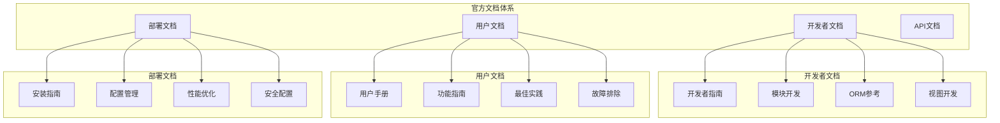

# 官方文档导航

## Odoo 17 官方文档概览

Odoo 17官方文档是学习和开发Odoo系统的重要资源。本文档提供了完整的导航指南，帮助您快速找到所需的信息。

### 文档结构图


## 核心文档链接

### 开发者文档
| 文档类型 | 链接 | 描述 |
|----------|------|------|
| **开发者指南** | https://www.odoo.com/documentation/17.0/developer.html | 完整的开发者指南和教程 |
| **ORM参考** | https://www.odoo.com/documentation/17.0/developer/reference/orm.html | ORM API详细参考 |
| **视图开发** | https://www.odoo.com/documentation/17.0/developer/reference/views.html | 视图开发指南 |
| **JavaScript API** | https://www.odoo.com/documentation/17.0/developer/reference/javascript_reference.html | JavaScript API参考 |
| **QWeb模板** | https://www.odoo.com/documentation/17.0/developer/reference/qweb.html | QWeb模板引擎文档 |

### 用户文档
| 文档类型 | 链接 | 描述 |
|----------|------|------|
| **用户手册** | https://www.odoo.com/documentation/17.0/applications.html | 各应用模块用户手册 |
| **CRM用户指南** | https://www.odoo.com/documentation/17.0/applications/sales/crm.html | CRM系统使用指南 |
| **销售管理** | https://www.odoo.com/documentation/17.0/applications/sales/sales.html | 销售管理功能指南 |
| **库存管理** | https://www.odoo.com/documentation/17.0/applications/inventory.html | 库存管理使用指南 |
| **财务管理** | https://www.odoo.com/documentation/17.0/applications/finance.html | 财务管理功能指南 |

### 部署文档
| 文档类型 | 链接 | 描述 |
|----------|------|------|
| **安装指南** | https://www.odoo.com/documentation/17.0/administration/install.html | 系统安装指南 |
| **部署指南** | https://www.odoo.com/documentation/17.0/administration/deploy.html | 生产环境部署 |
| **配置管理** | https://www.odoo.com/documentation/17.0/administration/config.html | 系统配置管理 |
| **性能优化** | https://www.odoo.com/documentation/17.0/administration/performance.html | 性能优化指南 |
| **安全配置** | https://www.odoo.com/documentation/17.0/administration/security.html | 安全配置指南 |

## 开发者资源

### 核心开发概念
1. **模块系统**
   - 模块结构
   - 清单文件
   - 依赖管理
   - 继承机制

2. **数据模型**
   - 模型定义
   - 字段类型
   - 关系字段
   - 计算字段

3. **视图系统**
   - 表单视图
   - 列表视图
   - 看板视图
   - 图表视图

4. **业务逻辑**
   - 方法定义
   - 约束验证
   - 工作流
   - 自动化

### API参考
```python
# 模型定义示例
from odoo import models, fields, api

class MyModel(models.Model):
    _name = 'my.model'
    _description = 'My Model'
    
    name = fields.Char('Name', required=True)
    value = fields.Float('Value')
    
    @api.model
    def create(self, vals):
        return super().create(vals)
    
    def write(self, vals):
        return super().write(vals)
```

### 视图开发
```xml
<!-- 表单视图示例 -->
<record id="view_my_model_form" model="ir.ui.view">
    <field name="name">my.model.form</field>
    <field name="model">my.model</field>
    <field name="arch" type="xml">
        <form>
            <sheet>
                <group>
                    <field name="name"/>
                    <field name="value"/>
                </group>
            </sheet>
        </form>
    </field>
</record>
```

## 用户指南

### 基础操作
1. **系统导航**
   - 主菜单使用
   - 搜索功能
   - 过滤器应用
   - 视图切换

2. **数据管理**
   - 记录创建
   - 数据编辑
   - 批量操作
   - 数据导入导出

3. **报表功能**
   - 报表生成
   - 数据透视
   - 图表分析
   - 自定义报表

### 高级功能
1. **工作流管理**
   - 状态管理
   - 审批流程
   - 自动化规则
   - 通知设置

2. **集成功能**
   - 邮件集成
   - 文档管理
   - 第三方集成
   - API访问

## 部署指南

### 系统要求
| 组件 | 最低要求 | 推荐配置 |
|------|----------|----------|
| **操作系统** | Ubuntu 20.04+ | Ubuntu 22.04 LTS |
| **Python** | 3.8+ | 3.10+ |
| **PostgreSQL** | 12+ | 15+ |
| **内存** | 4GB | 8GB+ |
| **存储** | 20GB | 100GB+ SSD |

### 安装步骤
1. **环境准备**
   ```bash
   # 更新系统
   sudo apt update && sudo apt upgrade -y
   
   # 安装Python和依赖
   sudo apt install python3 python3-pip python3-dev
   
   # 安装PostgreSQL
   sudo apt install postgresql postgresql-contrib
   ```

2. **Odoo安装**
   ```bash
   # 下载Odoo
   wget https://nightly.odoo.com/17.0/nightly/src/odoo_17.0.latest.tar.gz
   
   # 解压
   tar -xzf odoo_17.0.latest.tar.gz
   
   # 安装Python依赖
   pip3 install -r requirements.txt
   ```

3. **配置启动**
   ```bash
   # 创建配置文件
   ./odoo-bin -d odoo17 --init=base --stop-after-init
   
   # 启动服务
   ./odoo-bin -c odoo.conf
   ```

### 生产环境部署
1. **系统优化**
   - 数据库优化
   - 缓存配置
   - 负载均衡
   - 监控设置

2. **安全配置**
   - SSL证书
   - 防火墙设置
   - 用户权限
   - 数据备份

## API文档

### REST API
```python
# 认证示例
import requests

# 获取访问令牌
auth_url = 'http://localhost:8069/web/session/authenticate'
auth_data = {
    'jsonrpc': '2.0',
    'method': 'call',
    'params': {
        'db': 'odoo17',
        'login': 'admin',
        'password': 'admin'
    }
}

response = requests.post(auth_url, json=auth_data)
session_id = response.json()['result']['session_id']
```

### XML-RPC API
```python
import xmlrpc.client

# 连接Odoo
url = 'http://localhost:8069'
db = 'odoo17'
username = 'admin'
password = 'admin'

common = xmlrpc.client.ServerProxy(f'{url}/xmlrpc/2/common')
uid = common.authenticate(db, username, password, {})

models = xmlrpc.client.ServerProxy(f'{url}/xmlrpc/2/object')

# 创建记录
models.execute_kw(db, uid, password, 'res.partner', 'create', [{
    'name': 'Test Partner',
    'email': 'test@example.com'
}])
```

## 社区资源

### 官方社区
| 资源类型 | 链接 | 描述 |
|----------|------|------|
| **社区论坛** | https://www.odoo.com/forum | 官方社区论坛 |
| **GitHub仓库** | https://github.com/odoo/odoo | 源代码仓库 |
| **应用商店** | https://apps.odoo.com | 第三方应用商店 |
| **帮助中心** | https://www.odoo.com/help | 帮助和支持中心 |

### 学习资源
| 资源类型 | 链接 | 描述 |
|----------|------|------|
| **在线课程** | https://www.odoo.com/slides | 在线学习课程 |
| **视频教程** | https://www.youtube.com/odoo | YouTube官方频道 |
| **技术博客** | https://www.odoo.com/blog | 技术博客和更新 |
| **开发者文档** | https://www.odoo.com/documentation/17.0/developer.html | 开发者文档 |

## 版本信息

### Odoo 17 新特性
1. **用户界面改进**
   - 新的设计系统
   - 改进的移动端体验
   - 更好的可访问性

2. **性能优化**
   - 更快的页面加载
   - 优化的数据库查询
   - 改进的缓存机制

3. **新功能**
   - 增强的报表功能
   - 新的集成选项
   - 改进的工作流

### 版本历史
| 版本 | 发布日期 | 主要特性 |
|------|----------|----------|
| **17.0** | 2023-10-01 | 最新版本，新UI设计 |
| **16.0** | 2022-10-01 | 性能优化，新模块 |
| **15.0** | 2021-10-01 | 改进的移动端 |
| **14.0** | 2020-10-01 | 新的架构改进 |

## 故障排除

### 常见问题
1. **安装问题**
   - 依赖包冲突
   - 权限问题
   - 端口占用

2. **运行问题**
   - 数据库连接失败
   - 模块加载错误
   - 性能问题

3. **开发问题**
   - 语法错误
   - 继承问题
   - 视图错误

### 调试技巧
1. **日志分析**
   ```bash
   # 启用调试模式
   ./odoo-bin -d odoo17 --log-level=debug
   
   # 查看特定模块日志
   tail -f /var/log/odoo/odoo.log | grep "my_module"
   ```

2. **数据库调试**
   ```sql
   -- 查看表结构
   \d table_name
   
   -- 查看索引
   \di
   
   -- 分析查询性能
   EXPLAIN ANALYZE SELECT * FROM table_name;
   ```

## 最佳实践

### 开发实践
1. **代码规范**
   - 遵循PEP 8
   - 使用有意义的变量名
   - 添加适当的注释

2. **模块设计**
   - 单一职责原则
   - 松耦合设计
   - 可扩展架构

3. **测试策略**
   - 单元测试
   - 集成测试
   - 用户验收测试

### 部署实践
1. **环境管理**
   - 开发环境
   - 测试环境
   - 生产环境

2. **版本控制**
   - Git工作流
   - 分支策略
   - 发布管理

3. **监控维护**
   - 系统监控
   - 性能监控
   - 日志分析

## 学习建议

### 初学者路径
1. **基础学习**（1-2周）
   - 了解Odoo概念
   - 学习基本操作
   - 完成用户教程

2. **开发入门**（2-4周）
   - 学习Python基础
   - 理解Odoo架构
   - 创建第一个模块

3. **进阶开发**（1-2个月）
   - 深入学习ORM
   - 掌握视图开发
   - 学习业务逻辑

### 进阶学习
1. **高级开发**（2-3个月）
   - 性能优化
   - 集成开发
   - 自定义报表

2. **架构设计**（3-6个月）
   - 系统架构
   - 模块设计
   - 团队协作

## 相关链接
- [[API参考手册]] - API详细参考
- [[开发者指南]] - 开发指南
- [[部署指南]] - 部署指南
- [[安全指南]] - 安全配置
- [[版本发布说明]] - 版本更新
