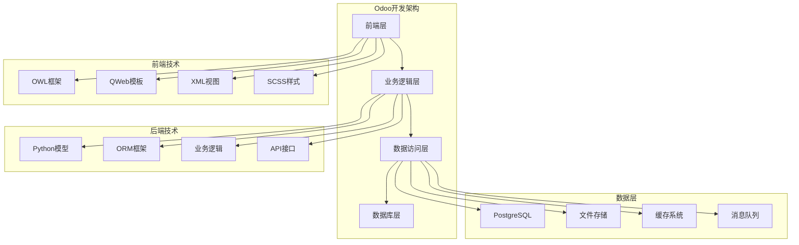

# 开发者指南

## Odoo 17 开发概览

Odoo 17开发者指南提供了完整的开发框架和最佳实践，帮助开发者快速构建高质量的企业级应用。

### 开发架构图


## 开发环境搭建

### 系统要求
| 组件 | 最低要求 | 推荐配置 |
|------|----------|----------|
| **操作系统** | Ubuntu 20.04+ | Ubuntu 22.04 LTS |
| **Python** | 3.8+ | 3.10+ |
| **PostgreSQL** | 12+ | 15+ |
| **Node.js** | 14+ | 18+ |
| **内存** | 4GB | 8GB+ |
| **存储** | 20GB | 100GB+ SSD |

### 环境安装
```bash
# 1. 更新系统
sudo apt update && sudo apt upgrade -y

# 2. 安装Python和依赖
sudo apt install python3 python3-pip python3-dev python3-venv
sudo apt install libxml2-dev libxslt1-dev libevent-dev libsasl2-dev
sudo apt install libldap2-dev libpq-dev libjpeg-dev zlib1g-dev

# 3. 安装PostgreSQL
sudo apt install postgresql postgresql-contrib
sudo -u postgres createuser -s $USER

# 4. 安装Node.js
curl -fsSL https://deb.nodesource.com/setup_18.x | sudo -E bash -
sudo apt install nodejs

# 5. 安装Git
sudo apt install git
```

### Odoo安装
```bash
# 1. 创建项目目录
mkdir odoo17-dev
cd odoo17-dev

# 2. 克隆Odoo源码
git clone https://github.com/odoo/odoo.git --branch 17.0 --depth 1

# 3. 创建虚拟环境
python3 -m venv venv
source venv/bin/activate

# 4. 安装Python依赖
pip install -r odoo/requirements.txt

# 5. 安装前端依赖
cd odoo
npm install
```

### 开发配置
```bash
# 创建配置文件
cat > odoo.conf << EOF
[options]
addons_path = addons,odoo/addons
data_dir = ./data
db_host = localhost
db_port = 5432
db_user = $USER
db_password = 
db_name = odoo17_dev
http_port = 8069
log_level = debug
dev_mode = True
EOF

# 启动开发服务器
./odoo-bin -c odoo.conf
```

## 模块开发基础

### 模块结构
```
my_module/
├── __manifest__.py          # 模块清单
├── __init__.py              # 模块初始化
├── models/                  # 数据模型
│   ├── __init__.py
│   └── my_model.py
├── views/                   # 视图定义
│   ├── my_model_views.xml
│   └── menu.xml
├── security/                # 权限配置
│   ├── ir.model.access.csv
│   └── security.xml
├── data/                    # 数据文件
│   └── demo_data.xml
├── static/                  # 静态资源
│   ├── description/
│   │   ├── icon.png
│   │   └── index.html
│   └── src/
│       ├── js/
│       ├── css/
│       └── xml/
└── tests/                   # 测试文件
    ├── __init__.py
    └── test_my_model.py
```

### 模块清单
```python
# __manifest__.py
{
    'name': 'My Custom Module',
    'version': '17.0.1.0.0',
    'category': 'Custom',
    'summary': 'Custom module for Odoo 17',
    'description': '''
        This module provides custom functionality
        for Odoo 17 development.
    ''',
    'author': 'Your Company',
    'website': 'https://www.yourcompany.com',
    'depends': ['base', 'sale'],
    'data': [
        'security/ir.model.access.csv',
        'security/security.xml',
        'data/demo_data.xml',
        'views/my_model_views.xml',
        'views/menu.xml',
    ],
    'demo': [
        'data/demo_data.xml',
    ],
    'installable': True,
    'auto_install': False,
    'application': False,
    'license': 'LGPL-3',
}
```

### 模型定义
```python
# models/my_model.py
from odoo import models, fields, api
from odoo.exceptions import ValidationError

class MyModel(models.Model):
    _name = 'my.model'
    _description = 'My Custom Model'
    _order = 'name'
    _rec_name = 'name'
    
    name = fields.Char('Name', required=True, index=True)
    description = fields.Text('Description')
    active = fields.Boolean('Active', default=True)
    sequence = fields.Integer('Sequence', default=10)
    
    # 关系字段
    partner_id = fields.Many2one('res.partner', 'Partner')
    line_ids = fields.One2many('my.model.line', 'model_id', 'Lines')
    
    # 计算字段
    total_amount = fields.Float('Total Amount', compute='_compute_total', store=True)
    
    @api.depends('line_ids.amount')
    def _compute_total(self):
        for record in self:
            record.total_amount = sum(record.line_ids.mapped('amount'))
    
    @api.model
    def create(self, vals):
        # 创建前验证
        if not vals.get('name'):
            raise ValidationError("名称不能为空")
        return super().create(vals)
    
    def write(self, vals):
        # 更新前验证
        if 'name' in vals and not vals['name']:
            raise ValidationError("名称不能为空")
        return super().write(vals)
    
    def action_confirm(self):
        """确认操作"""
        self.write({'state': 'confirmed'})
        return True
```

## 视图开发

### 表单视图
```xml
<!-- views/my_model_views.xml -->
<odoo>
    <record id="view_my_model_form" model="ir.ui.view">
        <field name="name">my.model.form</field>
        <field name="model">my.model</field>
        <field name="arch" type="xml">
            <form>
                <header>
                    <button name="action_confirm" type="object" 
                            string="Confirm" class="btn-primary"/>
                    <field name="state" widget="statusbar" 
                           statusbar_visible="draft,confirmed,done"/>
                </header>
                <sheet>
                    <div class="oe_title">
                        <h1>
                            <field name="name" placeholder="Enter name..."/>
                        </h1>
                    </div>
                    <group>
                        <group>
                            <field name="partner_id"/>
                            <field name="sequence"/>
                        </group>
                        <group>
                            <field name="active"/>
                            <field name="total_amount"/>
                        </group>
                    </group>
                    <notebook>
                        <page string="Description">
                            <field name="description"/>
                        </page>
                        <page string="Lines">
                            <field name="line_ids">
                                <tree editable="bottom">
                                    <field name="name"/>
                                    <field name="amount"/>
                                </tree>
                            </field>
                        </page>
                    </notebook>
                </sheet>
            </form>
        </field>
    </record>
</odoo>
```

### 列表视图
```xml
<record id="view_my_model_tree" model="ir.ui.view">
    <field name="name">my.model.tree</field>
    <field name="model">my.model</field>
    <field name="arch" type="xml">
        <tree>
            <field name="name"/>
            <field name="partner_id"/>
            <field name="total_amount"/>
            <field name="active" widget="boolean_toggle"/>
        </tree>
    </field>
</record>
```

### 看板视图
```xml
<record id="view_my_model_kanban" model="ir.ui.view">
    <field name="name">my.model.kanban</field>
    <field name="model">my.model</field>
    <field name="arch" type="xml">
        <kanban>
            <field name="name"/>
            <field name="partner_id"/>
            <field name="total_amount"/>
            <templates>
                <t t-name="kanban-box">
                    <div class="oe_kanban_card oe_kanban_global_click">
                        <div class="oe_kanban_content">
                            <div class="o_kanban_record_top">
                                <div class="o_kanban_record_headings">
                                    <strong class="o_kanban_record_title">
                                        <field name="name"/>
                                    </strong>
                                </div>
                            </div>
                            <div class="o_kanban_record_body">
                                <field name="partner_id"/>
                                <field name="total_amount"/>
                            </div>
                        </div>
                    </div>
                </t>
            </templates>
        </kanban>
    </field>
</record>
```

## 业务逻辑开发

### 方法定义
```python
class MyModel(models.Model):
    _name = 'my.model'
    
    @api.model
    def create(self, vals):
        """创建记录"""
        # 自定义创建逻辑
        if not vals.get('name'):
            vals['name'] = self._generate_name()
        return super().create(vals)
    
    def write(self, vals):
        """更新记录"""
        # 自定义更新逻辑
        if 'name' in vals:
            vals['name'] = vals['name'].strip().title()
        return super().write(vals)
    
    def unlink(self):
        """删除记录"""
        # 自定义删除逻辑
        for record in self:
            if record.state == 'confirmed':
                raise ValidationError("已确认的记录不能删除")
        return super().unlink()
    
    @api.model
    def _generate_name(self):
        """生成名称"""
        sequence = self.env['ir.sequence'].next_by_code('my.model')
        return f"MODEL-{sequence}"
    
    def action_confirm(self):
        """确认操作"""
        self.ensure_one()
        if self.state != 'draft':
            raise UserError("只能确认草稿状态的记录")
        
        # 业务逻辑
        self.write({'state': 'confirmed'})
        
        # 发送通知
        self._send_notification()
        return True
    
    def _send_notification(self):
        """发送通知"""
        message = {
            'body': f"记录 {self.name} 已确认",
            'message_type': 'notification',
            'subtype_id': self.env.ref('mail.mt_note').id,
        }
        self.message_post(**message)
```

### 约束验证
```python
from odoo.exceptions import ValidationError

class MyModel(models.Model):
    _name = 'my.model'
    
    name = fields.Char('Name', required=True)
    amount = fields.Float('Amount')
    date = fields.Date('Date')
    
    @api.constrains('name')
    def _check_name(self):
        """检查名称约束"""
        for record in self:
            if len(record.name) < 3:
                raise ValidationError("名称长度不能少于3个字符")
    
    @api.constrains('amount')
    def _check_amount(self):
        """检查金额约束"""
        for record in self:
            if record.amount < 0:
                raise ValidationError("金额不能为负数")
    
    @api.constrains('name', 'amount')
    def _check_name_amount(self):
        """检查名称和金额的组合约束"""
        for record in self:
            if record.name == 'VIP' and record.amount < 1000:
                raise ValidationError("VIP客户金额不能少于1000")
```

### 工作流管理
```python
class MyModel(models.Model):
    _name = 'my.model'
    
    state = fields.Selection([
        ('draft', 'Draft'),
        ('confirmed', 'Confirmed'),
        ('approved', 'Approved'),
        ('done', 'Done'),
        ('cancelled', 'Cancelled')
    ], 'State', default='draft')
    
    def action_confirm(self):
        """确认"""
        self.write({'state': 'confirmed'})
        return True
    
    def action_approve(self):
        """审批"""
        if self.state != 'confirmed':
            raise UserError("只能审批已确认的记录")
        self.write({'state': 'approved'})
        return True
    
    def action_done(self):
        """完成"""
        if self.state != 'approved':
            raise UserError("只能完成已审批的记录")
        self.write({'state': 'done'})
        return True
    
    def action_cancel(self):
        """取消"""
        if self.state in ['done']:
            raise UserError("已完成的记录不能取消")
        self.write({'state': 'cancelled'})
        return True
    
    def action_reset(self):
        """重置"""
        self.write({'state': 'draft'})
        return True
```

## 前端开发

### OWL组件开发
```javascript
// static/src/js/my_component.js
import { Component, useState } from "@odoo/owl";

export class MyComponent extends Component {
    static template = "my_module.MyComponent";
    static props = ["record", "onUpdate"];
    
    setup() {
        this.state = useState({
            isEditing: false,
            value: this.props.record.name
        });
    }
    
    onEdit() {
        this.state.isEditing = true;
    }
    
    onSave() {
        this.props.onUpdate(this.state.value);
        this.state.isEditing = false;
    }
    
    onCancel() {
        this.state.value = this.props.record.name;
        this.state.isEditing = false;
    }
}
```

### QWeb模板
```xml
<!-- static/src/xml/my_component.xml -->
<templates>
    <t t-name="my_module.MyComponent">
        <div class="my-component">
            <t t-if="state.isEditing">
                <input t-model="state.value" class="form-control"/>
                <button t-on-click="onSave" class="btn btn-primary">Save</button>
                <button t-on-click="onCancel" class="btn btn-secondary">Cancel</button>
            </t>
            <t t-else="">
                <span t-esc="state.value"/>
                <button t-on-click="onEdit" class="btn btn-link">Edit</button>
            </t>
        </div>
    </t>
</templates>
```

### SCSS样式
```scss
// static/src/css/my_component.scss
.my-component {
    padding: 1rem;
    border: 1px solid #ddd;
    border-radius: 4px;
    
    .form-control {
        margin-bottom: 0.5rem;
    }
    
    .btn {
        margin-right: 0.5rem;
        
        &.btn-primary {
            background-color: #007bff;
            color: white;
        }
        
        &.btn-secondary {
            background-color: #6c757d;
            color: white;
        }
    }
}
```

## 测试开发

### 单元测试
```python
# tests/test_my_model.py
from odoo.tests.common import TransactionCase
from odoo.exceptions import ValidationError

class TestMyModel(TransactionCase):
    
    def setUp(self):
        super().setUp()
        self.partner = self.env['res.partner'].create({
            'name': 'Test Partner',
            'email': 'test@example.com'
        })
    
    def test_create_model(self):
        """测试创建模型"""
        model = self.env['my.model'].create({
            'name': 'Test Model',
            'partner_id': self.partner.id
        })
        
        self.assertEqual(model.name, 'Test Model')
        self.assertEqual(model.partner_id, self.partner)
        self.assertTrue(model.active)
    
    def test_name_validation(self):
        """测试名称验证"""
        with self.assertRaises(ValidationError):
            self.env['my.model'].create({
                'name': 'AB',  # 长度少于3个字符
                'partner_id': self.partner.id
            })
    
    def test_action_confirm(self):
        """测试确认操作"""
        model = self.env['my.model'].create({
            'name': 'Test Model',
            'partner_id': self.partner.id
        })
        
        model.action_confirm()
        self.assertEqual(model.state, 'confirmed')
    
    def test_compute_total(self):
        """测试计算字段"""
        model = self.env['my.model'].create({
            'name': 'Test Model',
            'partner_id': self.partner.id
        })
        
        # 创建行记录
        line1 = self.env['my.model.line'].create({
            'model_id': model.id,
            'name': 'Line 1',
            'amount': 100
        })
        
        line2 = self.env['my.model.line'].create({
            'model_id': model.id,
            'name': 'Line 2',
            'amount': 200
        })
        
        # 触发计算
        model._compute_total()
        self.assertEqual(model.total_amount, 300)
```

### 集成测试
```python
# tests/test_workflow.py
from odoo.tests.common import TransactionCase

class TestWorkflow(TransactionCase):
    
    def test_complete_workflow(self):
        """测试完整工作流"""
        # 创建记录
        model = self.env['my.model'].create({
            'name': 'Workflow Test',
            'partner_id': self.env.ref('base.res_partner_1').id
        })
        
        # 确认
        model.action_confirm()
        self.assertEqual(model.state, 'confirmed')
        
        # 审批
        model.action_approve()
        self.assertEqual(model.state, 'approved')
        
        # 完成
        model.action_done()
        self.assertEqual(model.state, 'done')
```

## 部署和发布

### 模块打包
```bash
# 创建模块包
tar -czf my_module_17.0.1.0.0.tar.gz my_module/

# 或者使用Git标签
git tag -a v17.0.1.0.0 -m "Version 17.0.1.0.0"
git push origin v17.0.1.0.0
```

### 安装模块
```bash
# 本地安装
./odoo-bin -d odoo17 -i my_module

# 从应用商店安装
# 通过Odoo界面安装
```

### 升级模块
```bash
# 升级模块
./odoo-bin -d odoo17 -u my_module

# 升级所有模块
./odoo-bin -d odoo17 -u all
```

## 最佳实践

### 代码规范
1. **命名规范**
   - 模块名使用小写字母和下划线
   - 类名使用驼峰命名法
   - 方法名使用小写字母和下划线

2. **文档规范**
   - 为每个方法添加文档字符串
   - 使用清晰的变量名
   - 添加适当的注释

3. **错误处理**
   - 使用适当的异常类型
   - 提供有意义的错误消息
   - 记录错误日志

### 性能优化
1. **数据库优化**
   - 使用适当的索引
   - 避免N+1查询问题
   - 使用批量操作

2. **前端优化**
   - 减少DOM操作
   - 使用事件委托
   - 优化图片和资源

### 安全考虑
1. **权限控制**
   - 实现适当的访问控制
   - 验证用户输入
   - 防止SQL注入

2. **数据保护**
   - 加密敏感数据
   - 实现审计日志
   - 定期备份数据

## 相关链接
- [[官方文档导航]] - 官方文档导航
- [[API参考手册]] - API详细参考
- [[模块开发指南]] - 模块开发指南
- [[视图开发指南]] - 视图开发指南
- [[测试指南]] - 测试开发指南
