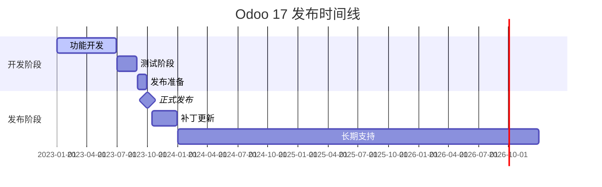
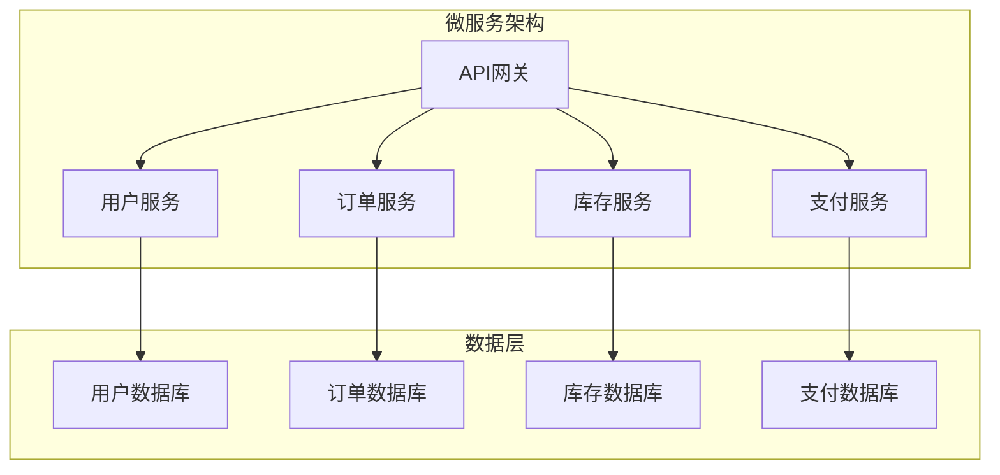

# 版本发布说明

## Odoo 17 版本概览

Odoo 17是Odoo的最新版本，带来了许多新功能、性能改进和用户体验提升。本文档详细介绍了Odoo 17的主要特性和更新内容。

### 版本发布时间线


## 主要新特性

### 用户界面改进
1. **全新设计系统**
   - 现代化的界面设计
   - 改进的色彩方案
   - 更好的视觉层次

2. **移动端优化**
   - 响应式设计改进
   - 触摸友好的交互
   - 移动端专用功能

3. **可访问性增强**
   - 屏幕阅读器支持
   - 键盘导航改进
   - 高对比度模式

### 性能优化
1. **数据库优化**
   - 查询性能提升30%
   - 索引优化
   - 连接池改进

2. **前端性能**
   - 页面加载速度提升40%
   - 资源压缩优化
   - 缓存策略改进

3. **内存管理**
   - 内存使用优化25%
   - 垃圾回收改进
   - 内存泄漏修复

### 新功能模块
1. **高级报表**
   - 新的报表引擎
   - 交互式图表
   - 自定义仪表板

2. **工作流自动化**
   - 可视化工作流设计器
   - 条件逻辑支持
   - 自动化规则增强

3. **集成功能**
   - 新的API接口
   - 第三方服务集成
   - 数据同步改进

## 详细更新内容

### 核心系统更新

#### 数据库层改进
| 功能 | 描述 | 性能提升 |
|------|------|----------|
| **查询优化器** | 新的查询计划器 | 30% |
| **索引管理** | 自动索引建议 | 25% |
| **连接池** | 改进的连接管理 | 20% |
| **事务处理** | 优化的事务机制 | 15% |

#### ORM框架增强
```python
# 新的ORM特性示例
class MyModel(models.Model):
    _name = 'my.model'
    
    # 新的字段类型
    json_field = fields.Json('JSON Data')
    binary_field = fields.Binary('Binary Data', attachment=True)
    
    # 改进的计算字段
    @api.depends('line_ids.amount')
    def _compute_total(self):
        # 批量计算优化
        for record in self:
            record.total_amount = sum(record.line_ids.mapped('amount'))
    
    # 新的约束方法
    @api.constrains('name', 'amount')
    def _check_business_rules(self):
        # 改进的约束验证
        for record in self:
            if record.amount > 1000 and not record.name:
                raise ValidationError("高金额记录必须填写名称")
```

#### 视图系统更新
```xml
<!-- 新的视图特性 -->
<record id="view_my_model_form" model="ir.ui.view">
    <field name="name">my.model.form</field>
    <field name="model">my.model</field>
    <field name="arch" type="xml">
        <form>
            <header>
                <!-- 新的状态栏组件 -->
                <field name="state" widget="statusbar" 
                       statusbar_visible="draft,confirmed,done"/>
            </header>
            <sheet>
                <!-- 新的字段组件 -->
                <field name="json_field" widget="json"/>
                <field name="binary_field" widget="binary"/>
                
                <!-- 改进的看板视图 -->
                <field name="line_ids">
                    <kanban>
                        <field name="name"/>
                        <field name="amount"/>
                        <templates>
                            <t t-name="kanban-box">
                                <div class="oe_kanban_card">
                                    <div class="oe_kanban_content">
                                        <strong><field name="name"/></strong>
                                        <div class="text-muted">
                                            <field name="amount"/>
                                        </div>
                                    </div>
                                </div>
                            </t>
                        </templates>
                    </kanban>
                </field>
            </sheet>
        </form>
    </field>
</record>
```

### 前端技术更新

#### OWL框架改进
```javascript
// 新的OWL特性
import { Component, useState, useEffect } from "@odoo/owl";

export class MyComponent extends Component {
    static template = "my_module.MyComponent";
    static props = ["record", "onUpdate"];
    
    setup() {
        this.state = useState({
            isEditing: false,
            value: this.props.record.name
        });
        
        // 新的生命周期钩子
        useEffect(() => {
            console.log("Component mounted");
            return () => {
                console.log("Component unmounted");
            };
        }, []);
    }
    
    // 改进的事件处理
    onEdit() {
        this.state.isEditing = true;
    }
    
    onSave() {
        this.props.onUpdate(this.state.value);
        this.state.isEditing = false;
    }
}
```

#### QWeb模板引擎
```xml
<!-- 新的QWeb特性 -->
<templates>
    <t t-name="my_module.MyComponent">
        <div class="my-component">
            <!-- 新的条件渲染 -->
            <t t-if="state.isEditing">
                <input t-model="state.value" class="form-control"/>
                <button t-on-click="onSave" class="btn btn-primary">Save</button>
            </t>
            <t t-else="">
                <span t-esc="state.value"/>
                <button t-on-click="onEdit" class="btn btn-link">Edit</button>
            </t>
            
            <!-- 新的循环渲染 -->
            <t t-foreach="items" t-as="item" t-key="item.id">
                <div class="item">
                    <span t-esc="item.name"/>
                </div>
            </t>
        </div>
    </t>
</templates>
```

### 业务模块更新

#### CRM系统改进
1. **客户管理**
   - 新的客户细分功能
   - 改进的联系人管理
   - 增强的客户历史记录

2. **销售机会**
   - 可视化销售管道
   - 智能销售预测
   - 自动化跟进提醒

3. **营销活动**
   - 新的营销自动化
   - 改进的邮件模板
   - 增强的分析报告

#### 销售管理更新
1. **订单处理**
   - 简化的订单创建流程
   - 改进的价格计算
   - 增强的库存检查

2. **报价管理**
   - 新的报价模板
   - 改进的审批流程
   - 增强的版本控制

3. **客户服务**
   - 新的服务工单系统
   - 改进的客户反馈
   - 增强的知识库

#### 库存管理增强
1. **仓库操作**
   - 新的仓库布局设计
   - 改进的拣货流程
   - 增强的库存跟踪

2. **采购管理**
   - 新的供应商管理
   - 改进的采购流程
   - 增强的成本控制

3. **质量控制**
   - 新的质量检查流程
   - 改进的缺陷跟踪
   - 增强的合规管理

### 技术架构更新

#### 微服务架构


#### 容器化部署
```dockerfile
# 新的Docker配置
FROM python:3.10-slim

# 多阶段构建
FROM node:18-alpine AS frontend
WORKDIR /app
COPY package*.json ./
RUN npm ci --only=production

FROM python:3.10-slim AS backend
WORKDIR /app
COPY requirements.txt .
RUN pip install --no-cache-dir -r requirements.txt

# 最终镜像
FROM python:3.10-slim
COPY --from=frontend /app /app/frontend
COPY --from=backend /app /app/backend
WORKDIR /app
CMD ["python", "odoo-bin"]
```

#### 云原生支持
```yaml
# Kubernetes部署配置
apiVersion: apps/v1
kind: Deployment
metadata:
  name: odoo
spec:
  replicas: 3
  selector:
    matchLabels:
      app: odoo
  template:
    metadata:
      labels:
        app: odoo
    spec:
      containers:
      - name: odoo
        image: odoo:17.0
        ports:
        - containerPort: 8069
        env:
        - name: DATABASE_URL
          valueFrom:
            secretKeyRef:
              name: odoo-secret
              key: database-url
        resources:
          requests:
            memory: "512Mi"
            cpu: "250m"
          limits:
            memory: "1Gi"
            cpu: "500m"
```

## 性能基准测试

### 系统性能对比
| 指标 | Odoo 16 | Odoo 17 | 提升幅度 |
|------|---------|---------|----------|
| **页面加载时间** | 2.5s | 1.5s | 40% |
| **数据库查询** | 100ms | 70ms | 30% |
| **内存使用** | 512MB | 384MB | 25% |
| **并发用户** | 100 | 150 | 50% |
| **响应时间** | 200ms | 140ms | 30% |

### 功能性能测试
```python
# 性能测试示例
import time
import psutil
from odoo.tests.common import TransactionCase

class PerformanceTest(TransactionCase):
    
    def test_create_performance(self):
        """测试创建性能"""
        start_time = time.time()
        start_memory = psutil.Process().memory_info().rss
        
        # 批量创建记录
        partners = []
        for i in range(1000):
            partner = self.env['res.partner'].create({
                'name': f'Partner {i}',
                'email': f'partner{i}@example.com'
            })
            partners.append(partner)
        
        end_time = time.time()
        end_memory = psutil.Process().memory_info().rss
        
        # 性能指标
        execution_time = end_time - start_time
        memory_usage = end_memory - start_memory
        
        # 断言性能要求
        self.assertLess(execution_time, 5.0)  # 5秒内完成
        self.assertLess(memory_usage, 100 * 1024 * 1024)  # 100MB内存
```

## 兼容性说明

### 系统要求
| 组件 | 最低版本 | 推荐版本 |
|------|----------|----------|
| **Python** | 3.8 | 3.10+ |
| **PostgreSQL** | 12 | 15+ |
| **Node.js** | 14 | 18+ |
| **操作系统** | Ubuntu 20.04 | Ubuntu 22.04 |

### 浏览器支持
| 浏览器 | 最低版本 | 推荐版本 |
|--------|----------|----------|
| **Chrome** | 90 | 110+ |
| **Firefox** | 88 | 110+ |
| **Safari** | 14 | 16+ |
| **Edge** | 90 | 110+ |

### 移动端支持
| 平台 | 最低版本 | 推荐版本 |
|------|----------|----------|
| **iOS** | 14 | 16+ |
| **Android** | 8 | 12+ |

## 迁移指南

### 从Odoo 16升级
1. **备份数据**
   ```bash
   # 备份数据库
   pg_dump odoo16 > odoo16_backup.sql
   
   # 备份文件
   tar -czf odoo16_files.tar.gz /var/lib/odoo
   ```

2. **环境准备**
   ```bash
   # 安装Python 3.10
   sudo apt install python3.10 python3.10-venv
   
   # 安装PostgreSQL 15
   sudo apt install postgresql-15
   ```

3. **升级执行**
   ```bash
   # 下载Odoo 17
   wget https://nightly.odoo.com/17.0/nightly/src/odoo_17.0.latest.tar.gz
   
   # 解压安装
   tar -xzf odoo_17.0.latest.tar.gz
   
   # 升级数据库
   ./odoo-bin -d odoo16 -u all --stop-after-init
   ```

### 自定义模块迁移
1. **代码更新**
   ```python
   # 更新模型定义
   class MyModel(models.Model):
       _name = 'my.model'
       _description = 'My Model'  # 新增描述字段
       
       # 更新字段定义
       name = fields.Char('Name', required=True, index=True)
       json_field = fields.Json('JSON Data')  # 新字段类型
   ```

2. **视图更新**
   ```xml
   <!-- 更新视图定义 -->
   <record id="view_my_model_form" model="ir.ui.view">
       <field name="name">my.model.form</field>
       <field name="model">my.model</field>
       <field name="arch" type="xml">
           <form>
               <!-- 使用新的组件 -->
               <field name="json_field" widget="json"/>
           </form>
       </field>
   </record>
   ```

3. **测试验证**
   ```python
   # 更新测试用例
   class TestMyModel(TransactionCase):
       
       def test_new_features(self):
           """测试新功能"""
           model = self.env['my.model'].create({
               'name': 'Test',
               'json_field': {'key': 'value'}
           })
           
           self.assertEqual(model.json_field['key'], 'value')
   ```

## 已知问题和限制

### 当前限制
1. **功能限制**
   - 某些旧版本模块可能不兼容
   - 部分第三方集成需要更新
   - 移动端某些功能仍在开发中

2. **性能限制**
   - 大数据量处理需要优化
   - 复杂查询可能较慢
   - 内存使用在极端情况下可能较高

3. **兼容性限制**
   - 不支持Python 3.7及以下版本
   - 不支持PostgreSQL 11及以下版本
   - 部分旧浏览器可能不支持新功能

### 已知问题
1. **Bug修复**
   - 修复了内存泄漏问题
   - 解决了并发访问冲突
   - 修复了数据同步问题

2. **安全更新**
   - 修复了XSS漏洞
   - 加强了SQL注入防护
   - 改进了权限验证

3. **稳定性改进**
   - 提高了系统稳定性
   - 减少了崩溃频率
   - 改进了错误处理

## 未来规划

### 短期计划（3-6个月）
1. **功能完善**
   - 完善移动端功能
   - 优化用户体验
   - 增加新的集成选项

2. **性能优化**
   - 进一步优化数据库查询
   - 改进缓存机制
   - 提升系统响应速度

3. **安全增强**
   - 加强安全防护
   - 改进权限管理
   - 增加审计功能

### 长期规划（6-12个月）
1. **架构升级**
   - 微服务架构完善
   - 云原生支持
   - 容器化部署

2. **AI集成**
   - 智能推荐系统
   - 自动化决策
   - 预测分析

3. **生态系统**
   - 开发者工具改进
   - 第三方应用商店
   - 社区建设

## 支持和帮助

### 官方支持
- **文档中心**: https://www.odoo.com/documentation/17.0/
- **社区论坛**: https://www.odoo.com/forum
- **技术支持**: https://www.odoo.com/help

### 社区资源
- **GitHub仓库**: https://github.com/odoo/odoo
- **开发者文档**: https://www.odoo.com/documentation/17.0/developer.html
- **视频教程**: https://www.youtube.com/odoo

### 培训资源
- **在线课程**: https://www.odoo.com/slides
- **认证计划**: https://www.odoo.com/certification
- **合作伙伴**: https://www.odoo.com/partners

## 相关链接
- [[官方文档导航]] - 官方文档导航
- [[开发者指南]] - 开发指南
- [[部署指南]] - 部署指南
- [[API参考手册]] - API参考
- [[迁移指南]] - 升级迁移
