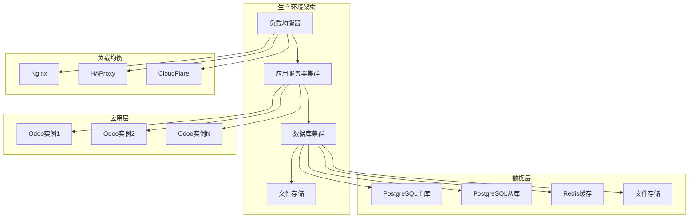
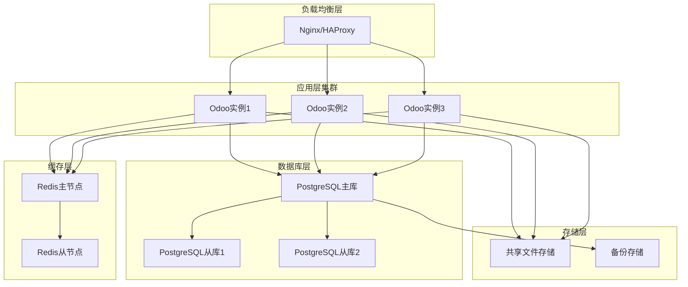

# 部署指南

## Odoo 17 部署概览

Odoo 17部署指南提供了从开发环境到生产环境的完整部署方案，包括单机部署、集群部署和云部署等多种方式。

### 部署架构图


## 单机部署

### 系统要求
| 组件 | 最低要求 | 推荐配置 |
|------|----------|----------|
| **CPU** | 2核心 | 4核心+ |
| **内存** | 4GB | 8GB+ |
| **存储** | 50GB | 200GB+ SSD |
| **网络** | 100Mbps | 1Gbps+ |
| **操作系统** | Ubuntu 20.04+ | Ubuntu 22.04 LTS |

### 基础环境安装
```bash
# 1. 更新系统
sudo apt update && sudo apt upgrade -y

# 2. 安装基础依赖
sudo apt install -y wget curl git unzip software-properties-common

# 3. 安装Python 3.10
sudo add-apt-repository ppa:deadsnakes/ppa -y
sudo apt update
sudo apt install -y python3.10 python3.10-venv python3.10-dev

# 4. 安装系统依赖
sudo apt install -y libxml2-dev libxslt1-dev libevent-dev libsasl2-dev
sudo apt install -y libldap2-dev libpq-dev libjpeg-dev zlib1g-dev
sudo apt install -y libfreetype6-dev liblcms2-dev libwebp-dev
sudo apt install -y libharfbuzz-dev libfribidi-dev libxcb1-dev

# 5. 安装PostgreSQL
sudo apt install -y postgresql postgresql-contrib
sudo systemctl start postgresql
sudo systemctl enable postgresql

# 6. 创建数据库用户
sudo -u postgres createuser -s odoo
sudo -u postgres psql -c "ALTER USER odoo PASSWORD 'odoo_password';"
```

### Odoo安装
```bash
# 1. 创建odoo用户
sudo adduser --system --home=/opt/odoo --group odoo

# 2. 下载Odoo
cd /opt/odoo
sudo wget https://nightly.odoo.com/17.0/nightly/src/odoo_17.0.latest.tar.gz
sudo tar -xzf odoo_17.0.latest.tar.gz
sudo mv odoo-17.0* odoo
sudo chown -R odoo:odoo /opt/odoo

# 3. 创建虚拟环境
sudo -u odoo python3.10 -m venv /opt/odoo/venv
sudo -u odoo /opt/odoo/venv/bin/pip install -r /opt/odoo/odoo/requirements.txt

# 4. 创建配置目录
sudo mkdir /etc/odoo
sudo mkdir /var/log/odoo
sudo chown odoo:odoo /var/log/odoo
```

### 配置文件
```bash
# 创建配置文件
sudo tee /etc/odoo/odoo.conf > /dev/null <<EOF
[options]
addons_path = /opt/odoo/odoo/addons,/opt/odoo/addons
data_dir = /var/lib/odoo
db_host = localhost
db_port = 5432
db_user = odoo
db_password = odoo_password
db_name = False
http_port = 8069
log_level = info
logfile = /var/log/odoo/odoo.log
proxy_mode = True
workers = 4
max_cron_threads = 2
limit_memory_hard = 2684354560
limit_memory_soft = 2147483648
limit_request = 8192
limit_time_cpu = 600
limit_time_real = 1200
EOF

# 创建数据目录
sudo mkdir /var/lib/odoo
sudo chown odoo:odoo /var/lib/odoo
```

### 系统服务
```bash
# 创建systemd服务文件
sudo tee /etc/systemd/system/odoo.service > /dev/null <<EOF
[Unit]
Description=Odoo ERP
After=postgresql.service

[Service]
Type=simple
SyslogIdentifier=odoo
PermissionsStartOnly=true
User=odoo
Group=odoo
ExecStart=/opt/odoo/venv/bin/python3 /opt/odoo/odoo/odoo-bin -c /etc/odoo/odoo.conf
StandardOutput=journal+console

[Install]
WantedBy=multi-user.target
EOF

# 启动服务
sudo systemctl daemon-reload
sudo systemctl enable odoo
sudo systemctl start odoo
sudo systemctl status odoo
```

### Nginx配置
```bash
# 安装Nginx
sudo apt install -y nginx

# 创建Nginx配置
sudo tee /etc/nginx/sites-available/odoo > /dev/null <<EOF
upstream odoo {
    server 127.0.0.1:8069;
}

upstream odoochat {
    server 127.0.0.1:8072;
}

server {
    listen 80;
    server_name your-domain.com;

    # 日志
    access_log /var/log/nginx/odoo.access.log;
    error_log /var/log/nginx/odoo.error.log;

    # 代理设置
    proxy_read_timeout 720s;
    proxy_connect_timeout 720s;
    proxy_send_timeout 720s;
    proxy_set_header X-Forwarded-Host \$host;
    proxy_set_header X-Forwarded-For \$proxy_add_x_forwarded_for;
    proxy_set_header X-Forwarded-Proto \$scheme;
    proxy_set_header X-Real-IP \$remote_addr;

    # 静态文件
    location ~* /web/static/ {
        proxy_cache_valid 200 90m;
        proxy_buffering on;
        expires 864000;
        proxy_pass http://odoo;
    }

    # 长轮询
    location /longpolling {
        proxy_pass http://odoochat;
    }

    # 主应用
    location / {
        proxy_redirect off;
        proxy_pass http://odoo;
    }
}
EOF

# 启用站点
sudo ln -s /etc/nginx/sites-available/odoo /etc/nginx/sites-enabled/
sudo nginx -t
sudo systemctl restart nginx
```

## 集群部署

### 架构设计


### 应用服务器配置
```bash
# 在每个应用服务器上安装Odoo
# 1. 安装Odoo
sudo apt update
sudo apt install -y python3.10 python3.10-venv python3.10-dev
sudo apt install -y libxml2-dev libxslt1-dev libevent-dev libsasl2-dev
sudo apt install -y libldap2-dev libpq-dev libjpeg-dev zlib1g-dev

# 2. 创建odoo用户
sudo adduser --system --home=/opt/odoo --group odoo

# 3. 下载Odoo
cd /opt/odoo
sudo wget https://nightly.odoo.com/17.0/nightly/src/odoo_17.0.latest.tar.gz
sudo tar -xzf odoo_17.0.latest.tar.gz
sudo mv odoo-17.0* odoo
sudo chown -R odoo:odoo /opt/odoo

# 4. 创建虚拟环境
sudo -u odoo python3.10 -m venv /opt/odoo/venv
sudo -u odoo /opt/odoo/venv/bin/pip install -r /opt/odoo/odoo/requirements.txt
```

### 集群配置文件
```bash
# 创建集群配置文件
sudo tee /etc/odoo/odoo-cluster.conf > /dev/null <<EOF
[options]
addons_path = /opt/odoo/odoo/addons,/opt/odoo/addons
data_dir = /mnt/odoo-data
db_host = db-master.example.com
db_port = 5432
db_user = odoo
db_password = odoo_password
db_name = False
http_port = 8069
log_level = info
logfile = /var/log/odoo/odoo.log
proxy_mode = True
workers = 2
max_cron_threads = 1
limit_memory_hard = 2684354560
limit_memory_soft = 2147483648
limit_request = 8192
limit_time_cpu = 600
limit_time_real = 1200
EOF
```

### 负载均衡配置
```bash
# HAProxy配置
sudo tee /etc/haproxy/haproxy.cfg > /dev/null <<EOF
global
    log /dev/log    local0
    chroot /var/lib/haproxy
    stats socket /run/haproxy/admin.sock mode 660 level admin
    stats timeout 30s
    user haproxy
    group haproxy
    daemon

defaults
    mode http
    log global
    option httplog
    option dontlognull
    option log-health-checks
    option forwardfor
    option httpchk
    timeout connect 5000
    timeout client 50000
    timeout server 50000

frontend odoo_frontend
    bind *:80
    default_backend odoo_backend

backend odoo_backend
    balance roundrobin
    option httpchk GET /web/health
    server odoo1 10.0.1.10:8069 check
    server odoo2 10.0.1.11:8069 check
    server odoo3 10.0.1.12:8069 check

listen stats
    bind *:8404
    stats enable
    stats uri /stats
    stats refresh 5s
EOF
```

### 数据库主从复制
```bash
# 主库配置
sudo tee -a /etc/postgresql/15/main/postgresql.conf > /dev/null <<EOF
# 主从复制配置
wal_level = replica
max_wal_senders = 3
max_replication_slots = 3
hot_standby = on
archive_mode = on
archive_command = 'cp %p /var/lib/postgresql/15/main/archive/%f'
EOF

# 创建复制用户
sudo -u postgres psql -c "CREATE USER replicator REPLICATION LOGIN CONNECTION LIMIT 3 ENCRYPTED PASSWORD 'replicator_password';"

# 配置pg_hba.conf
sudo tee -a /etc/postgresql/15/main/pg_hba.conf > /dev/null <<EOF
# 复制连接
host replication replicator 10.0.1.0/24 md5
EOF

# 重启PostgreSQL
sudo systemctl restart postgresql
```

## 云部署

### Docker部署
```dockerfile
# Dockerfile
FROM python:3.10-slim

# 安装系统依赖
RUN apt-get update && apt-get install -y \
    wget \
    curl \
    git \
    unzip \
    libxml2-dev \
    libxslt1-dev \
    libevent-dev \
    libsasl2-dev \
    libldap2-dev \
    libpq-dev \
    libjpeg-dev \
    zlib1g-dev \
    && rm -rf /var/lib/apt/lists/*

# 创建odoo用户
RUN adduser --system --home=/opt/odoo --group odoo

# 下载Odoo
WORKDIR /opt/odoo
RUN wget https://nightly.odoo.com/17.0/nightly/src/odoo_17.0.latest.tar.gz
RUN tar -xzf odoo_17.0.latest.tar.gz
RUN mv odoo-17.0* odoo
RUN chown -R odoo:odoo /opt/odoo

# 安装Python依赖
RUN pip install -r odoo/requirements.txt

# 创建数据目录
RUN mkdir -p /var/lib/odoo
RUN chown odoo:odoo /var/lib/odoo

# 切换到odoo用户
USER odoo

# 暴露端口
EXPOSE 8069

# 启动命令
CMD ["python", "/opt/odoo/odoo/odoo-bin", "-c", "/etc/odoo/odoo.conf"]
```

### Docker Compose配置
```yaml
# docker-compose.yml
version: '3.8'

services:
  db:
    image: postgres:15
    environment:
      POSTGRES_DB: odoo
      POSTGRES_USER: odoo
      POSTGRES_PASSWORD: odoo_password
    volumes:
      - odoo-db-data:/var/lib/postgresql/data
    ports:
      - "5432:5432"

  odoo:
    build: .
    depends_on:
      - db
    ports:
      - "8069:8069"
    volumes:
      - odoo-data:/var/lib/odoo
      - ./config:/etc/odoo
      - ./addons:/opt/odoo/addons
    environment:
      - HOST=db
      - USER=odoo
      - PASSWORD=odoo_password

  nginx:
    image: nginx:alpine
    ports:
      - "80:80"
    volumes:
      - ./nginx.conf:/etc/nginx/nginx.conf
    depends_on:
      - odoo

volumes:
  odoo-db-data:
  odoo-data:
```

### Kubernetes部署
```yaml
# k8s-deployment.yaml
apiVersion: apps/v1
kind: Deployment
metadata:
  name: odoo
  labels:
    app: odoo
spec:
  replicas: 3
  selector:
    matchLabels:
      app: odoo
  template:
    metadata:
      labels:
        app: odoo
    spec:
      containers:
      - name: odoo
        image: odoo:17.0
        ports:
        - containerPort: 8069
        env:
        - name: HOST
          value: "postgres-service"
        - name: USER
          value: "odoo"
        - name: PASSWORD
          valueFrom:
            secretKeyRef:
              name: odoo-secret
              key: password
        volumeMounts:
        - name: odoo-data
          mountPath: /var/lib/odoo
      volumes:
      - name: odoo-data
        persistentVolumeClaim:
          claimName: odoo-pvc

---
apiVersion: v1
kind: Service
metadata:
  name: odoo-service
spec:
  selector:
    app: odoo
  ports:
  - port: 8069
    targetPort: 8069
  type: ClusterIP

---
apiVersion: v1
kind: PersistentVolumeClaim
metadata:
  name: odoo-pvc
spec:
  accessModes:
    - ReadWriteMany
  resources:
    requests:
      storage: 10Gi
```

## 性能优化

### 数据库优化
```sql
-- PostgreSQL配置优化
-- postgresql.conf
shared_buffers = 256MB
effective_cache_size = 1GB
work_mem = 4MB
maintenance_work_mem = 64MB
checkpoint_completion_target = 0.9
wal_buffers = 16MB
default_statistics_target = 100
random_page_cost = 1.1
effective_io_concurrency = 200

-- 创建索引
CREATE INDEX CONCURRENTLY idx_res_partner_name ON res_partner(name);
CREATE INDEX CONCURRENTLY idx_sale_order_date ON sale_order(date_order);
CREATE INDEX CONCURRENTLY idx_account_move_date ON account_move(date);

-- 分析表
ANALYZE res_partner;
ANALYZE sale_order;
ANALYZE account_move;
```

### 应用优化
```bash
# Odoo配置优化
sudo tee -a /etc/odoo/odoo.conf > /dev/null <<EOF
# 性能优化
workers = 4
max_cron_threads = 2
limit_memory_hard = 2684354560
limit_memory_soft = 2147483648
limit_request = 8192
limit_time_cpu = 600
limit_time_real = 1200
db_maxconn = 64
db_template = template0
EOF
```

### 缓存配置
```bash
# Redis配置
sudo apt install -y redis-server

# 修改Redis配置
sudo tee -a /etc/redis/redis.conf > /dev/null <<EOF
# 内存配置
maxmemory 512mb
maxmemory-policy allkeys-lru

# 持久化配置
save 900 1
save 300 10
save 60 10000

# 网络配置
tcp-keepalive 300
timeout 0
EOF

# 重启Redis
sudo systemctl restart redis-server
```

## 监控和日志

### 系统监控
```bash
# 安装监控工具
sudo apt install -y htop iotop nethogs

# 创建监控脚本
sudo tee /usr/local/bin/odoo-monitor.sh > /dev/null <<EOF
#!/bin/bash
echo "=== Odoo System Monitor ==="
echo "Date: $(date)"
echo ""

echo "=== CPU Usage ==="
top -bn1 | grep "Cpu(s)" | awk '{print $2}' | cut -d'%' -f1

echo "=== Memory Usage ==="
free -h

echo "=== Disk Usage ==="
df -h

echo "=== Odoo Process ==="
ps aux | grep odoo | grep -v grep

echo "=== Database Connections ==="
sudo -u postgres psql -c "SELECT count(*) FROM pg_stat_activity WHERE datname='odoo';"

echo "=== Log Tail ==="
tail -n 20 /var/log/odoo/odoo.log
EOF

sudo chmod +x /usr/local/bin/odoo-monitor.sh

# 设置定时任务
echo "*/5 * * * * /usr/local/bin/odoo-monitor.sh >> /var/log/odoo-monitor.log" | sudo crontab -
```

### 日志管理
```bash
# 配置日志轮转
sudo tee /etc/logrotate.d/odoo > /dev/null <<EOF
/var/log/odoo/*.log {
    daily
    missingok
    rotate 30
    compress
    delaycompress
    notifempty
    create 644 odoo odoo
    postrotate
        systemctl reload odoo
    endscript
}
EOF
```

## 备份和恢复

### 数据库备份
```bash
# 创建备份脚本
sudo tee /usr/local/bin/odoo-backup.sh > /dev/null <<EOF
#!/bin/bash
BACKUP_DIR="/var/backups/odoo"
DATE=$(date +%Y%m%d_%H%M%S)
DB_NAME="odoo"

# 创建备份目录
mkdir -p $BACKUP_DIR

# 备份数据库
sudo -u postgres pg_dump $DB_NAME | gzip > $BACKUP_DIR/odoo_db_$DATE.sql.gz

# 备份文件
tar -czf $BACKUP_DIR/odoo_files_$DATE.tar.gz /var/lib/odoo

# 清理旧备份（保留30天）
find $BACKUP_DIR -name "*.gz" -mtime +30 -delete

echo "Backup completed: $DATE"
EOF

sudo chmod +x /usr/local/bin/odoo-backup.sh

# 设置定时备份
echo "0 2 * * * /usr/local/bin/odoo-backup.sh" | sudo crontab -
```

### 恢复脚本
```bash
# 创建恢复脚本
sudo tee /usr/local/bin/odoo-restore.sh > /dev/null <<EOF
#!/bin/bash
BACKUP_DIR="/var/backups/odoo"
DB_NAME="odoo"

if [ $# -ne 1 ]; then
    echo "Usage: $0 <backup_date>"
    echo "Available backups:"
    ls -la $BACKUP_DIR/*.sql.gz | awk '{print $9}' | sed 's/.*odoo_db_//' | sed 's/.sql.gz//'
    exit 1
fi

BACKUP_DATE=$1
DB_BACKUP="$BACKUP_DIR/odoo_db_$BACKUP_DATE.sql.gz"
FILES_BACKUP="$BACKUP_DIR/odoo_files_$BACKUP_DATE.tar.gz"

if [ ! -f "$DB_BACKUP" ]; then
    echo "Database backup not found: $DB_BACKUP"
    exit 1
fi

if [ ! -f "$FILES_BACKUP" ]; then
    echo "Files backup not found: $FILES_BACKUP"
    exit 1
fi

echo "Stopping Odoo..."
sudo systemctl stop odoo

echo "Restoring database..."
sudo -u postgres dropdb $DB_NAME
sudo -u postgres createdb $DB_NAME
gunzip -c $DB_BACKUP | sudo -u postgres psql $DB_NAME

echo "Restoring files..."
sudo rm -rf /var/lib/odoo/*
sudo tar -xzf $FILES_BACKUP -C /

echo "Starting Odoo..."
sudo systemctl start odoo

echo "Restore completed!"
EOF

sudo chmod +x /usr/local/bin/odoo-restore.sh
```

## 安全配置

### SSL证书配置
```bash
# 安装Certbot
sudo apt install -y certbot python3-certbot-nginx

# 获取SSL证书
sudo certbot --nginx -d your-domain.com

# 自动续期
echo "0 12 * * * /usr/bin/certbot renew --quiet" | sudo crontab -
```

### 防火墙配置
```bash
# 配置UFW防火墙
sudo ufw enable
sudo ufw allow ssh
sudo ufw allow 80/tcp
sudo ufw allow 443/tcp
sudo ufw deny 8069/tcp
```

### 安全加固
```bash
# 修改默认端口
sudo tee -a /etc/odoo/odoo.conf > /dev/null <<EOF
# 安全配置
http_port = 8069
admin_passwd = your_secure_password
EOF

# 限制数据库访问
sudo tee -a /etc/postgresql/15/main/pg_hba.conf > /dev/null <<EOF
# 限制本地访问
local   all             odoo                                    md5
host    all             odoo            127.0.0.1/32            md5
EOF
```

## 故障排除

### 常见问题
1. **服务启动失败**
   ```bash
   # 检查日志
   sudo journalctl -u odoo -f
   
   # 检查配置文件
   sudo -u odoo /opt/odoo/venv/bin/python /opt/odoo/odoo/odoo-bin -c /etc/odoo/odoo.conf --test-enable
   ```

2. **数据库连接失败**
   ```bash
   # 检查数据库状态
   sudo systemctl status postgresql
   
   # 测试连接
   sudo -u postgres psql -c "SELECT version();"
   ```

3. **性能问题**
   ```bash
   # 检查系统资源
   htop
   iotop
   nethogs
   
   # 检查数据库性能
   sudo -u postgres psql -c "SELECT * FROM pg_stat_activity;"
   ```

### 调试工具
```bash
# 安装调试工具
sudo apt install -y strace lsof tcpdump

# 监控系统调用
sudo strace -p $(pgrep odoo)

# 检查网络连接
sudo netstat -tlnp | grep odoo

# 检查文件描述符
sudo lsof -p $(pgrep odoo)
```

## 相关链接
- [[官方文档导航]] - 官方文档导航
- [[性能优化指南]] - 性能优化
- [[安全配置指南]] - 安全配置
- [[监控指南]] - 系统监控
- [[备份恢复指南]] - 备份恢复
