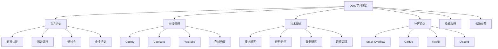
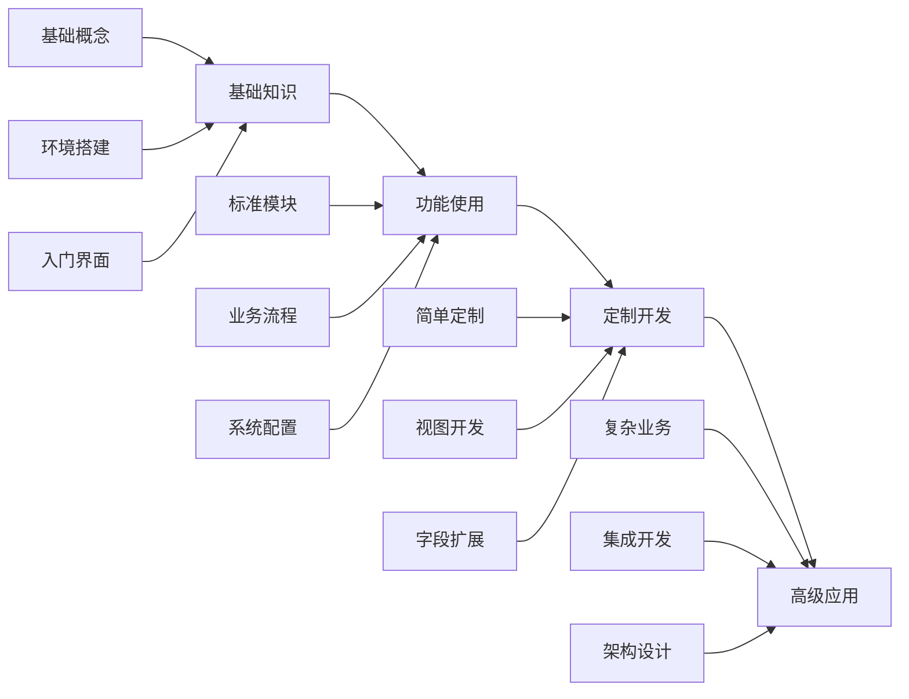

# 学习资源汇总

## 🎯 概述

Odoo社区学习资源汇总，包括官方培训、认证体系、在线课程、技术博客、社区论坛等学习渠道和资源，为广大开发者提供全面的学习参考。

## 📊 资源分类

### 学习资源分类图


## 📚 官方培训资源

### Odoo官方认证体系
```markdown
# Odoo官方认证体系

## 1. Functional Consultant认证
### 要求
- 具备Odoo功能使用经验
- 完成官方培训课程
- 通过认证考试

### 证书优势
- 官方认可的能力证明
- 优先获得技术支持
- 企业项目机会

## 2. Technical Developer认证
### 要求
- Python编程能力
- Odoo框架熟悉度
- 模块开发经验
- 通过技术考试

### 学习路径
1. Python基础
2. Odoo框架学习
3. 模块开发实践
4. 认证考试准备

## 3. Implementation Specialist认证
### 范围
- 业务流程分析
- 系统配置
- 用户培训
- 项目管理
```

### 官方培训课程详情
| 课程名称 | 时长 | 难度 | 目标学员 | 价格 |
|---------|------|------|---------|------|
| Odoo开发者基础 | 40小时 | 初级 | 应届生/转行人员 | ¥3,000 |
| Odoo高级开发 | 60小时 | 中级 | 有经验开发者 | ¥4,500 |
| Odoo功能顾问 | 32小时 | 中级 | 业务顾问 | ¥2,500 |
| Odoo架构师 | 80小时 | 高级 | 技术架构师 | ¥6,000 |
| Odoo部署专家 | 24小时 | 中级 | 运维工程师 | ¥2,000 |

## 🎥 在线课程平台

### Udemy优秀课程推荐
```markdown
# Udemy Odoo课程推荐

## 1. Complete Odoo 16 Development Course
- 讲师：DevTech Education
- 评分：4.7/5.0
- 时长：52小时
- 学生数：18,500+
- 价格：$89

### 课程特色
- 从零基础到高级开发
- 包含实际项目案例
- 持续更新最新版本
- 提供源码下载

### 课程大纲
1. Odoo环境搭建
2. 基础模块开发
3. 数据库设计
4. 视图开发
5. 报表定制
6. 高级功能实现

## 2. Odoo 16 Functional Training
- 讲师：Business Apps Training
- 评分：4.6/5.0
- 时长：35小时
- 学生数：12,000+
- 价格：$79

### 课程特色
- 专注业务流程
- 实际业务场景
- 多行业案例
- 功能配置指南
```

### Coursera专业课程
```markdown
# Coursera Odoo专业课程

## 1. Odoo ERP Certification Specialization
- 提供方：UC Irvine
- 包含4门课程
- 认证证书
- 时长：8个月

### 课程安排
1. ERP系统基础理论
2. Odoo核心模块学习
3. 定制化开发实践
4. 项目管理与运维

## 2. Business Process Automation
- 提供方：IBM
- 涵盖Odoo工作流
- 自动化最佳实践
- 6周课程
```

## 📖 技术博客资源

### 优秀技术博客推荐
| 博客名称 | 网址 | 特色 | 更新频率 |
|---------|------|------|---------|
| Odoo官方技术文档 | https://www.odoo.com/documentation | 权威技术文档 | 持续更新 |
| OCA技术博客 | https://odoo-community.org/blog | 社区技术分享 | 每周 |
| OdooMates | https://www.odoomates.com/blog | 深度技术分析 | 每月 |
| PlanetOdoo | http://planet.odoo.com/ | 开发者博客聚合 | 每日 |
| ERPNext vs Odoo | https://blogs.compareeve.com | 对比分析 | 不定期 |

### 博主推荐和资源
```markdown
# 知名Odoo博主

## 1. Fabien Pinckaers
- Odoo创始人兼CEO
- 官方网站: https://www.fabienpinckaers.com/
- Twitter: @fabienpinckaers
- 主要分享: 公司战略、技术趋势

## 2. Daniel Reis
- OCA核心成员
- GitHub: https://github.com/akretion
- 主要领域: 技术架构、最佳实践

## 3. Joan Oriol
- Odoo认证讲师
- 个人网站: https://joanoriol.com/
- 主要分享: 教学案例、开发技巧

## 4. Nicolas Bessi
- Camptocamp技术专家
- 博客: https://blogs.camptocamp.com/
- 主要领域: 高级开发、性能优化
```

## 🖥️ 视频教程资源

### YouTube优质频道
| 频道名称 | 订阅数 | 视频数 | 语言 | 特色 |
|---------|--------|--------|------|------|
| Odoo Official | 50K+ | 200+ | 英文 | 官方教程 |
| OdooMates | 25K+ | 80+ | 英文 | 技术深度解析 |
| TechUltra | 15K+ | 120+ | 英文 | 入门到进阶 |
| Odoo India | 8K+ | 60+ | 印地语 | 本地化内容 |
| Odoo中国 | 5K+ | 40+ | 中文 | 中文教程 |

### 精选教程系列
```markdown
# YouTube精选教程

## 1. Odoo 16 Complete Development Tutorial
- 频道: OdoorMates
- 播放列表: 35个视频
- 总时长: 15小时
- 难度: 初级到中级

### 章节内容
1. 环境搭建与模块基础
2. 数据模型设计
3. 视图开发详解
4. 业务逻辑实现
5. 报表定制
6. 部署与维护

## 2. Odoo Functional Course
- 频道: Odoo Official
- 播放列表: 20个视频
- 总时长: 10小时
- 难度: 初级

### 主要模块
1. CRM客户管理
2. 销售管理
3. 采购管理
4. 库存管理
5. 财务记账
6. 人力资源
```

## 📰 书籍资源

### 推荐技术书籍
| 书名 | 作者 | 语言 | 难度 | 适用范围 |
|------|------|------|------|---------|
| Odoo 14 Development Essentials | Daniel Reis & Greg Mader | 英文 | 中级 | 开发者 |
| Python Odoo开发实战 | 刘金明 | 中文 | 中级 | 开发者 |
| ERP系统实施指南 | 邵兵等 | 中文 | 初级 | 用户 |
| Odoo Functional Documentation | 官方 | 英文 | 初级 | 功能顾问 |

### 电子书资源
```markdown
# 免费电子书

## 1. Odoo Development Guidelines
- 来源: OCA (Odoo Community Organization)
- 地址: https://github.com/OCA/maintainer-tools
- 内容: 开发规范和最佳实践
- 格式: Markdown

## 2. Odoo Cookbook
- 网址: https://subscription-cookbook.vuejs.org/
- 内容: 编程经验和解决方案
- 更新: 定期更新
- 语言: 英文/中文

## 3. Odoo技术白皮书
- 来源: 各大咨询公司
- 内容: 行业解决方案
- 格式: PDF
- 获取: 官网注册下载
```

## 🌐 社区论坛资源

### 技术问答平台
| 平台 | URL | 活跃度 | 特色 |
|------|-----|--------|------|
| Stack Overflow | https://stackoverflow.com/ | 高 | 技术问题解答 |
| Odoo论坛 | https://www.odoo.com/fórum | 中 | 官方技术支持 |
| Reddit r/Odoo | https://reddit.com/r/Odoo | 高 | 社区讨论 |
| Discord Odoo社区 | https://discord.gg/odoo | 中 | 实时交流 |

### 开源项目资源
```markdown
# GitHub优秀项目

## 1. OCA (Odoo Community Organization)
- URL: https://github.com/OCA
- 星标: 500+ 仓库
- 贡献者: 1000+
- 主要模块:
  - OCA/addons
  - OCA/web
  - OCA/server-tools
  - OCA/maintainer-tools

## 2. 企业级扩展模块
- URL: https://github.com/odoo/odoo
- 星标: 25K+
- 贡献者: 500+
- 更新频率: 持续

## 3. 部署和运维工具
- Docker Odoo: https://github.com/docker-library/docker-o­doo
- Kubernetes Helm: https://github.com/helm/charts/tree/main/stable/odoo
- PostgreSQL备份: https://github.com/github/backup-utils
```

## 📱 移动学习应用

### 推荐移动应用
| 应用名 | 平台 | 功能 | 价格 |
|--------|------|------|------|
| Odoo Mobile | iOS/Android | 官方移动端 | 免费 |
| Python Learning | iOS/Android | Python基础 | 免费 |
| Pocket Git | iOS | Git使用 | $1.99 |
| Markdown Editor | 全平台 | 技术文档编写 | 免费 |

## 🎯 学习路径建议

### 初学者学习路径


### 各阶段推荐资源
```markdown
# 分阶段学习资源

## 初级阶段 (0-3个月)
### 推荐资源:
- Odoo官方入门教程
- YouTube基础教程系列
- 官方文档快速入门
- Stack Overflow基础问题

### 学习目标:
- 了解Odoo基本概念
- 掌握标准模块使用
- 完成简单系统配置

## 中级阶段 (3-12个月)
### 推荐资源:
- Udemy开发课程
- 技术博客深度文章
- OCA社区模块研究
- GitHub代码分析

### 学习目标:
- 独立开发定制模块
- 掌握业务逻辑实现
- 理解ORM和工作流

## 高级阶段 (12个月+)
### 推荐资源:
- Odoo官方认证课程
- 技术会议演讲
- 开源项目贡献
- 行业专家交流

### 学习目标:
- 主导大型项目实施
- 贡献核心代码
- 成为技术专家
```

## 🔗 相关链接

### 官方资源
- [[Odoo开发文档]] - 官方开发文档
- [[在线社区]] - Odoo在线社区资源

### 学习资源
- [[培训机构推荐]] - 可靠的培训机构推荐
- [[认证考试指南]] - 认证考试备考指南

## 📝 学习建议

### 学习方法
- **循序渐进**: 从基础概念开始，逐步深入
- **实践为主**: 理论学习结合实际项目练习
- **持续更新**: 关注最新版本和技术趋势
- **社区参与**: 积极参与社区讨论和贡献

### 学习效率
- **制定计划**: 设定明确的学习目标和时间安排
- **记录笔记**: 记录重要概念和实际经验
- **项目练习**: 通过实际项目验证学习效果
- **寻求帮助**: 遇到问题积极寻求社区帮助

---

**资源版本**: v1.0.0  
**最后更新**: 2024年  
**覆盖范围**: Odoo 16.0及以下版本
