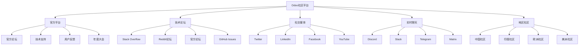

# 社区交流平台

## 🎯 概述

Odoo社区交流平台是开发者和用户进行技术交流、问题解答、经验分享的重要场所。本文档汇总了各种官方和第三方的交流平台，帮助用户找到合适的交流社区。

## 📊 平台分类

### 交流平台分类图


## 🌐 官方交流平台

### Odoo官方论坛
```markdown
# Odoo官方论坛使用指南

## 1. 论坛概况
- URL: https://www.odoo.com/forum
- 成立于: 2005年
- 注册用户: 500,000+
- 活跃程度: 高
- 语言支持: 多语言

## 2. 主要板块

### 技术讨论区
- Odoo Developers: 开发技术讨论
- Odoo Functional: 功能使用咨询
- Install/Upgrade: 安装升级问题
- Third-party Apps: 第三方应用

### 行业应用区
- Industry-Specific: 行业专用解决方案
- Localization: 本地化和区域化
- Integration: 系统集成
- Migration: 系统迁移咨询

### 社区活动区
- Events: 社区活动通知
- Jobs: 招聘求职信息
- Success Stories: 成功案例分享
- Feedback: 用户反馈建议

## 3. 发帖规范
- 提供详细的问题描述
- 包含错误日志或截图
- 描述已尝试的解决方法
- 使用清晰明确的标题
- 选择合适的板块分类
```

### GitHub社区互动
```markdown
# GitHub Odoo社区

## 1. 主要仓库
- https://github.com/odoo/odoo: 官方核心代码
- https://github.com/OCA: Odoo社区组织
- https://github.com/odoo/thailand: 泰国本地化
- https://github.com/odoo/odoo.com: 官网源码

## 2. 参与方式
### Issues和Bug报告
- 报告前先搜索相关问题
- 提供完整的重现步骤
- 包含系统和版本信息
- 附上相关错误日志

### Pull Requests贡献
- Fork仓库到个人账号
- 创建特性分支
- 编写清晰的提交信息
- 通过代码审查流程

### Discussion和Q&A
- 使用Discussions功能
- 分享使用经验和技巧
- 讨论新功能建议
- 参与技术讨论

## 3. 行为准则
- 保持专业和礼貌
- 提供有价值的贡献
- 尊重不同观点
- 遵循开源协议
```

## 💬 实时交流平台

### Discord社区
```markdown
# Odoo Discord社区

## 1. 服务器信息
- 邀请链接: https://discord.gg/odoo
- 成员数: 15,000+
- 在线人数: 800-1,200 (日常)
- 创建时间: 2019年

## 2. 频道组织
### 技术支持
- #general: 一般讨论
- #python-help: Python技术问题
- #installation: 安装问题
- #functional: 功能使用

### 开发讨论
- #development: 开发讨论
- #addons: 插件开发
- #bug-reports: Bug报告
- #feature-requests: 功能请求

### 社区活动
- #announcements: 重要公告
- #events: 活动信息
- #jobs: 工作机会
- #showcase: 项目展示

## 3. 使用指南
### 新成员须知
1. 仔细 reading频道的说明
2. 在#introduce-yourself 自我介绍
3. 搜索历史讨论避免重复问题
4. 使用合适的频道提问

### 提问技巧
- 提供详细的问题描述
- 包含相关的代码或错误信息
- 说明已尝试的解决方案
- 使用@mention 联系专家

### 贡献指导
- 分享有用的资源和链接
- 帮助回答新人的问题
- 参与技术讨论和交流
- 遵守社区规矩和礼仪
```

### Slack工作区
```markdown
# Odoo社区 Slack工作区

## 1. OCA Slack
- 加入方式: 官网申请
- 主要用途: OCA项目协作
- 成员: 500+
- 活跃度: 中等

## 2. 地区性Slack
### 中国开发者Slack
- 维护者: 中国Odoo用户组
- 语言: 中文
- 定时技术分享

### 印度开发者Slack
- 成立时间: 2020年
- 成员: 200+
- 特色: 多语言支持

## 3. 企业Slack工作区
- 大型企业对内部的Odoo支持
- 私有工作区邀请制
- 专业化技术支持
```

## 📱 社交媒体平台

### Twitter活跃账户
| 账户名称 | 类型 | 关注者 | 特色内容 |
|---------|------|--------|---------|
| @Odoo | 官方 | 150K+ | 官方公告、新闻 |
| @fabienpinckaers | CEO | 50K+ | 公司战略、技术展望 |
| @odooCommunity | 社区 | 25K+ | 社区动态、技术文章 |
| @OCA_Association | OCA组织 | 15K+ | 开源项目、代码贡献 |

### LinkedIn专业网络
```markdown
# LinkedIn Odoo专业人士

## 1. 知名专业人士
- Fabien Pinckaers (CEO)
- Marc Van Hecke (CTO)
- Olivier Dony (VP Engineering)
- Daniel Reis (架构师)

## 2. 公司页面
- Odoo S.A.: 官方公司页面
- OCA (Odoo Community Association)
- Odoo Partners公司
- 咨询和开发公司

## 3. 专业群组
- Odoo Users Group (50K+成员)
- Odoo Developers (25K+成员)
- Odoo Consultants (15K+成员)
- Odoo Open Source ERP (30K+成员)

## 4. 使用建议
- 关注行业动态和人员流动
- 分享项目经验和最佳实践
- 建立专业人脉网络
- 参与行业讨论和投票
```

### YouTube频道社区
| 频道名称 | 订阅者 | 视频类型 | 更新频率 |
|---------|--------|---------|---------|
| Odoo Official | 50K+ | 官方教程、产品介绍 | 每周 |
| OdooMates | 25K+ | 技术深度解析 | 每月 |
| TechUltra | 15K+ | 入门到进阶教程 | 不定期 |
| Odoo中国 | 5K+ | 中文教程、本地化 | 每月 |

## 🏆 地区社区组织

### 中国Odoo社区
```markdown
# 中国Odoo社区

## 1. 用户组信息
- 网站: https://www.odoo.cn
- WeChat群: 多个技术群
- QQ群: 500人的开发群
- 年会: 每年举办中国Odoo大会

## 2. 主要活动
- 月度线下Meetup
- 年度技术Conference
- 在线Webinar分享
- Hackathon编程马拉松

## 3. 知名企业
- 开源智造
- OpenERP中国
- 上海企通
- 广州飞致

## 4. 学习资源
- 中文文档翻译
- 本地化模块开发
- 产业解决方案
- 认证培训课程
```

### 欧洲Odoo社区
```markdown
# 欧洲Odoo社区

## 1. OCA (Odoo Community Association)
- 总部: 比利时布鲁塞尔
- 成员: 来自30+国家
- 活动: Odoo Experience大会
- 贡献: 500+开源模块

## 2. 德国社区
- Camptocamp GmbH
- 技术活跃度: 非常高
- GitHub贡献: 持续

## 3. 法国社区
- Akretion
- Nexedi
- 法语技术文档丰富

## 4. 英国社区
- Odoo UK Hub
- 独立开发者联盟
- 企业级解决方案
```

### 印度和亚太社区
```markdown
# 印度Odoo社区

## 1. 社区概况
- 官方Partner: 20+
- 年增长率: 50%+
- 技术人员: 5000+
- 主要城市: 班加罗尔、钦奈、孟买

## 2. 技术特点
- 多语言本地化支持
- 低成本定制解决方案
- 大规模项目实施经验
- 远程开发和维护服务

## 3. 主要公司
- Cybrosys Technologies
- Eminent IT Services
- Serpent CS
- TechUltra Solutions
```

## 🎪 年度大会和活动

### Odoo Experience大会
| 年份 | 地点 | 参与者 | 主题 |
|------|------|--------|------|
| 2023 | 比利时布鲁塞尔 | 2000+ | "The Future of Business Software" |
| 2022 | 线上虚拟 | 3000+ | "Digital Transformation" |
| 2021 | 比利时布鲁塞尔 | 1500+ | "Odoo 15.0 Reveal" |
| 2020 | 线上虚拟 | 2500+ | "Going to Scale" |

### 地区性会议
```markdown
# 地区性Odoo会议

## 1. 中国Moscow (莫斯科)
- 时间: 每年秋季
- 参与者: 500+
- 特色: 中欧技术交流

## 2. Odoo India Summit
- 地点: 班加罗尔
- 频率: 每年一次
- 规模: 1000+ 参会者

## 3. Odoo Brasil Conference
- 地点: 圣保罗
- 语言: 葡萄牙语
- 特色: 南美市场

## 4. Odoo Japan Meetup
- 地点: 东京
- 频率: 季度活动
- 规模: 200+ 本地开发者
```

## 🎓 教育与培训

### 在线教育平台
| 平台 | Odoo课程数 | 学员总数 | 特色 |
|------|-----------|---------|------|
| Udemy | 50+ | 100,000+ | 多语言支持 |
| Coursera | 5+ | 25,000+ | 认证证书 |
| LinkedIn Learning | 10+ | 15,000+ | 企业培训 |
| Pluralsight | 8+ | 8,000+ | 进阶技术 |

### 正式培训机构
```markdown
# 官方认证培训机构

## 1. Odoo官方培训中心
- 地点: 比利时、美国、中国
- 课程: 开发者、功能顾问、实施专家
- 认证: 官方认证证书

## 2. 教育伙伴项目
- 大学合作伙伴: UC Berkeley, 巴黎索邦大学
- 社区学院: 职业技术课程
- 商业培训: 企业定制培训

## 3. 在线学习平台
- Odoo官方学习门户
- 自定进度的课程模块
- 互动式代码编辑器
- 项目式学习评估
```

## 🔗 相关链接

### 官方资源
- [[Odoo官方网站]] - 官方信息门户
- [[培训课程安排]] - 官方培训课程

### 社区资源
- [[开源项目]] - OCA开源项目组织
- [[地区活动]] - 各地区Odoo活动

## 📝 参与建议

### 新用户指南
- **选择合适平台**: 根据需求和语言选择交流平台
- **自我介绍**: 在相应的介绍板块自我介绍
- **搜索历史**: 提问前先搜索历史讨论
- **遵守规范**: 严格遵守各平台的社区规矩

### 活跃用户建议
- **乐于助人**: 积极帮助回答他人问题
- **分享经验**: 分享项目经验和最佳实践
- **参与讨论**: 积极参与技术讨论和决策
- **建立声誉**: 通过持续贡献建立良好声誉

### 企业参与指南
- **技术支持**: 为社区用户提供技术支持
- **赞助活动**: 赞助会议等社区活动
- **招聘渠道**: 利用社区网络招聘人才
- **产品反馈**: 收集用户反馈改进产品

---

**平台版本**: v1.0.0  
**最后更新**: 2024年  
**覆盖范围**: 全球主要Odoo社区
