# 开发工具推荐

## 🎯 概述

Odoo开发工具推荐集合了高效开发Odoo应用所需的专业工具，包括IDE首选、调试工具、数据库工具、前端开发工具、测试框架等，形成完整的Odoo开发生态圈支持。

## 📊 工具分类体系

### 开发工具架构图

```mermaid
graph TB
    A[Odoo开发工具生态] --> B[开发环境]
    A --> C[代码编辑]
    A --> D[调试分析]
    A --> E[数据库管理]
    A --> F[前端开发]
    A --> G[测试工具]
    A --> H[部署运维]
    
    B --> B1[远程桌面]
    B --> B2[虚拟环境]
    B --> B3[容器优化]
    
    C --> C1[VS Code整合]
    C --> C2[PyCharm专业]
    C --> C3[Vim/Emacs高效]
    C --> C4[Odoo Studio]
    C --> C5[Cursor AI助手]
    
    D --> D1[实时调试] 
    D --> D2[性能分析]
    D --> D3[内存监控]
    D --> D4[日志追踪]
    
    E --> E1[pgAdmin图形]
    E --> E2[命令行高效]
    E --> E3[数据可视化]
    E --> E4[备份恢复]
    
    F --> F1[前端构建]
    F --> F2[资源优化]
    F --> F3[模块打包]
    F --> F4[浏览器调试]
    
    G --> G1[单元测试]
    G --> G2[集成测试]
    G --> G3[性能测试]
    G --> G4[安全扫描]
    
    H --> H1[容器部署]
    H --> H2[CI/CD]
    H --> H3[监控告警]
    H --> H4[备份恢复]
```


## 💻 IDE和代码编辑器推荐

### VS Code + Odoo扩展生态
```markdown
# VS Code Odoo开发套装

## 核心扩展包
### 1. Odoo Snippets
- 开发商: Odoo Community
- 功能: Odoo代码模板和片段
- 支持: Python、JavaScript、XML
- 特色: 模型定义、视图创建、控制器模板

### 2. Python Extension Pack
- 包含: Python、Pylance、Jupyter、PyTest
- 功能: 语法高亮、智能补全、调试支持
- 特色: Python 3.8+支持、虚拟环境管理

### 3. XML Language Support
- 开发商: Red Hat
- 功能: XML语法校验、格式化、智能提示
- 特色: XSD验证、DTD支持、XPath查询

### 4. Django Snippets
- 功能: Django/Odoo ORM快捷代码
- 支持: 模型定义、视图创建、表单验证
- 特色: 常用字段类型、关系映射、计算字段

## VS Code配置文件
```json
{
    "python.defaultInterpreterPath": "~/odoo_env/bin/python",
    "python.terminal.activateEnvironment": true,
    "files.exclude": {
        "**/__pycache__": true,
        "**/*.pyc": true,
        "**/.pyc": true,
        "**/.*.swp": true,
        "**/.*.swo": true
    },
    "python.linting.enabled": true,
    "python.linting.pylintEnabled": true,
    "python.formatting.provider": "black",
    "xml.completion.autoCloseRemovesContent": false,
    "xml.validation.enabled": true,
    "xml.validation.namespaces.enabled": true,
    "emmet.includeLanguages": {
        "xml": "html"
    }
}
```

## 工作区配置
```json
{
    "folders": [
        {
            "name": "Odoo Root",
            "path": "/opt/odoo"
        },
        {
            "name": "Custom Addons",
            "path": "/opt/odoo/custom-addons"
        },
        {
            "name": "Enterprise",
            "path": "/opt/odoo-enterprise"
        }
    ],
    "terminal.integrated.env.linux": {
        "PYTHONPATH": "/opt/odoo:/opt/odoo-enterprise"
    }
}
```
```

### PyCharm专业版配置
```markdown
# PyCharm Odoo开发配置

## 项目配置要点
### 1. 解释器设置
- Python解释器: venv/bin/python
- Python路径: PYTHONPATH添加Odoo路径
- 运行配置: Odoo服务器启动脚本

### 2. 调试配置
```xml
<!-- Runner Configuration -->
<component name="ProjectRunConfigurationManager">
    <configuration default="false" name="Odoo Debug" type="PythonConfigurationType">
        <module name="odoo" />
        <option name="PARAMETERS" value="-d testdb -i base --dev=all --log-level=debug" />
        <option name="WORKING_DIRECTORY" value="$PROJECT_DIR$" />
        <method v="2" />
    </configuration>
</component>
```

### 3. 代码检查规则
- PEP 8兼容性检查
- PEP 484类型注解支持
- Odoo编码规范检查
- SQL注入安全检查

### 4. 重构工具
- 模型重命名自动更新
- 字段类型变更提示
- 方法签名重构支持
- 视图引用完整性检查

## PyCharm插件推荐
- Odoo Support: 官方Odoo语言支持
- Database Navigator: 数据库连接和查询
- REST Client: API测试工具
- Git Integration: 版本控制增强
```

### Cursor AI开发助手
```markdown
# Cursor AI驱动的开发体验

## AI功能特性
### 1. 智能代码补全
- 上下文感知的代码建议
- Odoo特定模式学习
- SQL查询优化建议
- JavaScript组件代码生成

### 2. 自然语言编程
- "创建客户模型" -> 自动Python代码
- "添加采购订单状态" -> XML视图更新
- "优化查询性能" -> SQL代码改进

### 3. 智能重构
- 代码风格统一化
- 性能优化建议
- 安全漏洞检测
- 最佳实践应用

## Cursor配置文件
```json
{
    "cursor.general.enableCursorChat": true,
    "cursor.chat.codeGeneration.enabled": true,
    "cursor.chat.model": "gpt-4",
    "python.analysis.extraPaths": [
        "/opt/odoo",
        "/opt/odoo-enterprise"
    ],
    "cursor.chat.customInstructions": "你是Odoo专业开发者助手，精通ORP模型、视图开发、JavaScript OWL框架。"
}
```
```

### 其他编辑器选择
| 编辑器 | 特色功能 | 适用场景 | 学习成本 |
|--------|---------|---------|---------|
| Vim/Neovim | 高效编辑、高度定制 | 命令行爱好 | 高 |
| Emacs | LISP扩展、符号计算 | 科研工作者 | 高 |
| Sublime Text | 快速启动、多平台 | 轻量级开发 | 中 |
| Atom | GitHub集成、插件丰富 | 开源项目 | 低 |
| WebStorm | 前端专业化 | JavaScript专家 | 中 |

## 🔍 数据库管理工具

### pgAdmin图形化工具
```markdown
# pgAdmin数据库管理指南

## 连接配置
### 1. 服务器注册
- 主机: localhost (开发环境)
- 端口: 5432 (默认PostgreSQL)
- 数据库: odoo_prod (生产数据库)
- 用户名: odoo
- SSL模式: Prefer

### 2. 查询工具使用
```sql
-- Odoo特定查询示例
-- 查找最近创建的记录
SELECT id, create_date, write_date, name 
FROM res_partner 
WHERE create_date >= CURRENT_DATE - INTERVAL '7 days'
ORDER BY create_date DESC;

-- 数据库性能分析
SELECT 
    schemaname,
    tablename,
    pg_size_pretty(pg_total_relation_size(schemaname||'.'||tablename)) as size
FROM pg_tables 
WHERE schemaname = 'public'
ORDER BY pg_total_relation_size(schemaname||'.'||tablename) DESC;
```

### 3. 备份恢复操作
- 定时备份脚本配置
- 增量备份策略
- 跨版本数据迁移
- 归档日志管理

## pgAdmin插件扩展
- Data Import: CSV/Excel导入
- Query History: 查询历史记录
- Query Tool Bar: 查询工具栏增强
- SQL Formatter: SQL代码格式化
```

### psql命令行工具
```markdown
# PostgreSQL命令行高效使用

## psql高级技巧
### 1. 常用快捷键
- \dn: 列出所有schema
- \dt: 列出当前schema的表
- \d+ tablename: 显示表详细信息
- \timing on: 显示查询执行时间
- \x: 切换扩展显示模式

### 2. Odoo优化查询
```sql
-- 设置显示优化
\timing on
\set QUIET off

-- 查找大表
SELECT 
    schemaname,
    tablename,
    pg_size_pretty(pg_total_relation_size(schemaname||'.'||tablename)) as size,
    pg_stat_get_tuples_fetched(oid) as fetches,
    pg_stat_get_tuples_returned(oid) as returns
FROM pg_tables pt
JOIN pg_class pc ON pc.relname = pt.tablename
WHERE schemaname = 'public'
ORDER BY pg_total_relation_size(schemaname||'.'||tablename) DESC
LIMIT 10;

-- 分析表统计分析
ANALYZE res_partner;
EXPLAIN (ANALYZE, BUFFERS) SELECT * FROM res_partner WHERE website IS NOT NULL;
```

### 3. 维护脚本集合
```bash
#!/bin/bash
# odoodb_maintenance.sh

DB_NAME="odoo_prod"
PGUSER="odoo"

# 数据库连接测试
psql -d $DB_NAME -c "SELECT version();"

# 表大小统计
psql -d $DB_NAME -c "
SELECT 
    schemaname, tablename,
    pg_size_pretty(pg_total_relation_size(schemaname||'.'||tablename)) as size
FROM pg_tables 
WHERE schemaname = 'public'
ORDER BY pg_total_relation_size(schemaname||'.'||tablename) DESC;"

# 索引使用情况
psql -d $DB_NAME -c "
SELECT 
    indexrelname, idx_tup_read, idx_tup_fetch, idx_scan,
    pg_size_pretty(pg_relation_size(indexrelname::regclass)) as size
FROM pg_stat_user_indexes 
ORDER BY idx_scan DESC;"
```
```

### pg_dump/pg_restore备份工具
```markdown
# PostgreSQL备份恢复最佳实践

## 备份策略设计
### 1. 全量备份 (每日)
```bash
#!/bin/bash
# full_backup.sh

DATE=$(date +%Y%m%d_%H%M%S)
BACKUP_DIR="/backups/odoo"
DB_NAME="odoo_prod"

# 创建备份目录
mkdir -p $BACKUP_DIR/$DATE

# 全量备份（压缩格式）
pg_dump -h localhost -U odoo -d $DB_NAME \
  --verbose --compress=9 --format=custom \
  --no-owner --no-privileges \
  -f $BACKUP_DIR/$DATE/full_backup.dump

# 验证备份文件
if pg_restore --list $BACKUP_DIR/$DATE/full_backup.dump > /dev/null; then
    echo "备份验证成功: $DATE"
else
    echo "备份验证失败: $DATE"
    exit 1
fi
```

### 2. 增量备份 (每小时)
```bash
#!/bin/bash
# incremental_backup.sh

ARCHIVE_DIR="/archive/odoo"
DB_NAME="odoo_prod"

# WAL归档
psql -d $DB_NAME -c "SELECT pg_switch_wal();"

# 清理旧归档（保留7天）
find $ARCHIVE_DIR -name "*.backup" -mtime +7 -delete
```

### 3. 恢复测试
```bash
# 恢复步骤
createdb od_test_restore -O odoo
pg_restore -h localhost -U odoo -d od_test_restore \
  --verbose --single-transaction \
  /backups/odoo/20241201_120000/full_backup.dump
```

## 数据库优化工具
### pg_stat_statements扩展
```sql
-- 启用查询统计
CREATE EXTENSION IF NOT EXISTS pg_stat_statements;

-- 查看慢查询TOP 10
SELECT 
    query,
    calls,
    total_exec_time,
    mean_exec_time,
    stddev_exec_time,
    rows
FROM pg_stat_statements 
ORDER BY mean_exec_time DESC 
LIMIT 10;
```
```

## 🌐 前端开发和调试工具

### Chrome DevTools集成
```markdown
# Chrome开发者工具 Odoo专用配置

## DevTools设置
### 1. 网络面板优化
- Network Conditions: 高速3G模拟
- Throttling: Production环境测试
- Cache: 禁用缓存开发测试
- Disable JavaScript: 纯HTML/CSS调试

### 2. Elements面板技巧
- 搜索元素: Ctrl+F "odoo-chat"
- CSS属性编辑: 实时样式修改
- Event Listeners: Odoo事件追踪

### 3. Sources面板调试
- Breakpoints: JavaScript断点设置
- Call Stack: 调用栈分析
- Scope: OWL组件状态检查
- Watch: 表达式实时监控

## JavaScript调试脚本
```javascript
// Odoo组件调试脚本
window.odoo_debug = {
    // 获取当前组件
    getCurrentComponent: () => {
        return odoo.__DEBUG__.services.getAll();
    },
    
    // 查看服务状态
    checkServices: () => {
        const services = odoo.__DEBUG__.services.getAll();
        console.table(services);
    },
    
    // 监控组件渲染
    watchComponentRender: (componentName) => {
        const Component = odoo.__DEBUG__.components[componentName];
        if (Component) {
            console.log(`${componentName} 组件渲染:`, Component);
        }
    }
};
```

### Node.js构建工具链
```markdown
# Odoo前端构建工具配置

## Webpack配置示例
```javascript
// webpack.config.js
const path = require('path');

module.exports = {
    entry: './addons/web/static/src/bundle.js',
    output: {
        path: path.resolve(__dirname, 'static/dist'),
        filename: 'bundle.min.js'
    },
    module: {
        rules: [
            {
                test: /\.js$/,
                exclude: /node_modules/,
                use: {
                    loader: 'babel-loader',
                    options: {
                        presets: ['@babel/preset-env']
                    }
                }
            },
            {
                test: /\.scss$/,
                use: ['style-loader', 'css-loader', 'sass-loader']
            }
        ]
    },
    resolve: {
        alias: {
            '@': path.resolve(__dirname, 'static/src')
        }
    }
};
```

## Package.json脚本
```json
{
    "scripts": {
        "dev": "webpack --mode development --watch",
        "build": "webpack --mode production",
        "test": "jest --watch",
        "lint": "eslint src/ --ext .js",
        "format": "prettier --write src/**/*.js"
    }
}
```
```

### CSS预处理器支持
```markdown
# CSS/SCSS开发工具

## Sass编译器设置
```bash
# 全局安装sass编译器
npm install -g sass

# 监听文件变化
sass --watch scss:css --style compressed

# 多目录编译
sass --watch \
  scss/modules:addons/mymodule/static/src/css \
  scss/assets:addons/myassets/static/src/css
```

## CSS框架集成
```scss
// variables.scss
$primary-color: #007bff;
$secondary-color: #6c757d;
$success-color: #28a745;

// mixins.scss
@mixin button-variant($color) {
    background-color: $color;
    border-color: $color;
    
    &:hover {
        background-color: darken($color, 10%);
    }
}
```

### 浏览器扩展插件
| 扩展插件 | 功能作用 | Odoo特色 |
|---------|---------|---------|
| React Developer Tools | React组件调试 | OWL组件类似调试 |
| Vue.js devtools | 前端框架调试 | 组件状态检查 |
| Redux DevTools | 状态管理调试 | Odoo服务状态 |
| Postman | API接口测试 | JSON-RPC调试 |
| Wappalyzer | 技术栈分析 | Odoo版本检测 |

## 🧪 测试框架和工具

### PyTest测试框架
```markdown
# PyTest Odoo单元测试配置

## pytest.ini配置
```ini
[tool:pytest]
minversion = 6.0
addopts = 
    -ra 
    -q
    --strict-config
    --tb=short
testpaths = tests
python_files = test_*.py
python_classes = Test*
python_functions = test_*
markers =
    unit: Unit tests
    integration: Integration tests
    slow: Slow running tests
```

## 测试用例示例
```python
# tests/test_partner_model.py
import pytest
from odoo.tests.common import TransactionCase
from odoo.exceptions import ValidationError

class TestResPartner(TransactionCase):
    """测试合作伙伴模型"""
    
    def setUp(self):
 """设置测试数据"""
        super().setUp()
        self.Partner = self.env['res.partner']
        
    def test_create_partner(self):
        """测试创建合作伙伴"""
        partner = self.Partner.create({
            'name': '测试公司',
            'email': 'test@example.com',
            'is_company': True,
        })
        
        self.assertEqual(partner.name, '测试公司')
        self.assertTrue(partner.is_company)
        self.assertEqual(partner.email, 'test@example.com')
        
    def test_email_validation(self):
        """测试邮箱验证"""
        with self.assertRaises(ValidationError):
            self.Partner.create({
                'name': '测试用户',
                'email': 'invalid-email',
            })
            
    @pytest.mark.slow
    def test_bulk_create(self):
        """测试批量创建（慢测试）"""
        partners_data = [
            {'name': f'测试公司{i}'}
            for i in range(1000)
        ```
        
        partners = self.Partner.create(partners_data)
        self.assertEqual(len(partners), 1000)
```

### Odoo TestCase基础类
```markdown
# Odoo测试基础类详解

## TransactionCase使用
```python
from odoo.tests.common import TransactionCase

class MyTestCase(TransactionCase):
    @classmethod
    def setUpClass(cls):
        super().setUpClass()
        # 类级别的设置
        
    def setUp(self):
        super().setUp()
        # 每个测试方法的设置
        
    def test_my_functionality(self):
        # 测试实现
        pass
        
    def tearDown(self):
        super().tearDown()
        # 测试后清理
```

## HttpCase使用
```python
from odoo.tests.common import HttpCase

class MyWebTestCase(HttpCase):
    """Web控制器测试"""
    
    def test_01_homepage(self):
        """测试主页访问"""
        response = self.url_open('/')
        self.assertEqual(response.status_code, 200)
        
    def test_02_login(self):
        """测试登录功能"""
        response = self.url_open('/web/login', self.login_data)
        self.assertEqual(response.status_code, 200)
```

### JavaScript测试框架
```markdown
# Jest Odoo前端测试

## Jest配置
```javascript
// jest.config.js
module.exports = {
    testEnvironment: 'jsdom',
    setupFilesAfterEnv: ['<rootDir>/tests/setup.js'],
    moduleNameMapping: {
        '^@/(.*)$': '<rootDir>/static/src/$1'
    },
    collectCoverageFrom: [
        'static/src/**/*.js',
        '!static/src/tests/**'
    ]
};
```

## JavaScript测试示例
```javascript
// tests/components/FormView.test.js
import { FormView } from '@/views/form/form_view';
import { mount } from '@odoo/hoot/testing';

describe('FormView', () => {
    let formView;
    
    beforeEach(async () => {
        formView = await mount(FormView, {
            props: {
                resModel: 'res.partner',
                resId: 1
            }
        });
    });
    
    afterEach(() => {
        formView.unmount();
    });
    
    test('应该渲染表单视图', () => {
        expect(formView.querySelector('.o_form_view')).toBeTruthy();
    });
    
    test('应该显示合作伙伴数据', async () => {
        await formView.mockRPC({
            model: 'res.partner',
            record: { id: 1, name: '测试公司' }
        });
        
        expect(formView.text()).toContain('测试公司');
    });
});
```
```

### 性能测试工具
```markdown
# Odoo性能测试工具集合

## Locust负载测试
```python
# locustfile.py
from locust import HttpUser, task, between

class OdooUser(HttpUser):
    """Odoo用户负载测试"""
    
    wait_time = between(1, 5)
    
    def on_start(self):
        """登录操作"""
        self.login()
        
    def login(self):
        """用户登录"""
        response = self.client.post('/web/session/authenticate', json={
            'jsonrpc': '2.0',
            'method': 'call',
            'params': {
                'db': 'testdb',
                'username': 'admin',
                'password': 'admin',
            },
            'id': 1
        })
        self.client.cookies.update(response.cookies)
        
    @task(3)
    def view_partners(self):
        """查看合作伙伴列表"""
        self.client.post('/web/dataset/call_button', json={
            'params': {
                'model': 'res.partner',
                'method': 'search_read',
                'args': [[]],
                'kwargs': {'limit': 20}
            }
        })
        
    @task(1)
    def create_partner(self):
        """创建新合作伙伴"""
        self.client.post('/web/dataset/call_button', json={
            'params': {
                'model': 'res.partner',
                'method': 'create',
                'args': [{'name': f'测试公司{random.randint(1,1000)}'}],
                'kwargs': {}
            }
        })
```

## pprof性能分析
```python
# 性能分析脚本
import cProfile
import pstats
from odoo import api, SUPERUSER_ID

def profile_odoo_function():
    """性能分析装饰器"""
    def decorator(func):
        def wrapper(*args, **kwargs):
            pr = cProfile.Profile()
            pr.enable()
            
            result = func(*args, **kwargs)
            
            pr.disable()
            ps = pstats.Stats(pr)
            ps.sort_stats('cumulative')
            ps.print_stats()
            
            return result
        return wrapper
    return decorator

# 使用示例
@profile_odoo_function()
def test_partner_search():
    env = api.Environment(cr, SUPERUSER_ID, {})
    partners = env['res.partner'].search([('name', 'ilike', 'test')])
    return len(partners)
```
```

### 安全扫描工具
```markdown
# Odoo安全测试工具

## SQLmap自动SQL注入测试
```bash
# 安装sqlmap
pip install sqlmap

# SQL注入测试
sqlmap -u 'http://localhost:8069/web/login' \
  --data 'login=admin&password=admin' \
  --batch --flush-session \
  --dbs --dbms=postgresql

# 特定表测试
sqlmap -u 'http://localhost:8069/web/dataset/call_button' \
  --data '{"params":{"model":"res.partner","method":"search"}}' \
  --batch -D odoo -T res_users --dump
```

## OWASP ZAP安全扫描
```bash
# Docker运行ZAP
docker run -v $(pwd):/zap/wrk/:rw \
  -t owasp/zap2docker-stable zap-baseline.py \
  -t http://localhost:8069 \
  -r zap-report.html
```

## Bandit代码安全扫描
```bash
# Python代码安全检查
pip install bandit
bandit -r /opt/odoo/addons/mymodule/ \
  -f json -o security-report.json
```

## 🔧 部署和监控工具

### Docker容器化部署
```markdown
# Docker Odoo部署配置

## Dockerfile配置
```dockerfile
# Dockerfile
FROM python:3.10-slim

# 安装系统依赖
RUN apt-get update && apt-get install -y \
    postgresql-client \
    libxml2-dev \
    libxslt-dev \
    libldap2-dev \
    libsasl2-dev \
    libtiff5-dev \
    libjpeg8-dev \
    libopenjp2-7-dev \
    zlib1g-dev \
    libfreetype6-dev \
    liblcms2-dev \
    libwebp-dev \
    libharfbuzz-dev \
    libfribidi-dev \
    libxcb1-dev \
    && rm -rf /var/lib/apt/lists/*

# 设置工作目录
WORKDIR /opt/odoo

# 安装Python依赖
COPY requirements.txt .
RUN pip install --no-cache-dir -r requirements.txt

# 复制Odoo源代码
COPY odoo /opt/odoo

# 创建用户
RUN useradd -ms /bin/bash odoo && chown -R odoo:odoo /opt/odoo

# 暴露端口
EXPOSE 8069

USER odoo

# 启动命令
CMD ["python", "/opt/odoo/odoo-bin"]
```

## Dockerfile.requirements.txt
```txt
# requirements.txt
odoo>=16.0
psycopg2-binary>=2.9.0
werkzeug>=0.16.0
```

## docker-compose.yml
```yaml
version: '3.7'
services:
  web:
    build:
      context: .
      dockerfile: Dockerfile
    ports:
      - "8069:8069"
    environment:
      - HOST=db
      - USER=odoo
      - ПASSWORD=odoo
      - DB_NAME=odoo
    volumes:
      - ./config:/etc/odoo
      - ./addons:/opt/odoo/addons/11
      - ./data:/var/lib/odoo
    depends_on:
      - db
    restart: unless-stopped

  db:
    image: postgres:15
    ports:
      - "5432:5432"
    environment:
      - POSTGRES_USER=odoo
      - POSTGRES_PASSWORD=odoo
      - POSTGRES_DB=odoo
    volumes:
      - postgres_data:/var/lib/postgresql/data
    restart: unless-stopped

volumes:
  postgres_data:
```

### Kubernetes编排部署
```markdown
# Kubernetes Odoo部署

## deployment.yaml
```yaml
apiVersion: apps/v1
kind: Deployment
metadata:
  name: odoo-deployment
  labels:
    app: odoo
spec:
  replicas: 3
  selector:
    matchLabels:
      app: odoo
  template:
    metadata:
      labels:
        app: odoo
    spec:
      containers:
      - name: odoo
        image: odoo:16.0
        ports:
        - containerPort: 8069
        env:
        - name: HOST
          value: "odoo-postgresql-service"
        - name: USER
          value: "odoo" 
        - name: PASSWORD
          valueFrom:
            secretKeyRef:
              name: odoo-secrets
              key: postgres-password
        volumeMounts:
        - name: odoo-data
          mountPath: /var/lib/odoo
      volumes:
      - name: odoo-data
        persistentVolumeClaim:
          claimName: odoo-pvc
```

## service.yaml
```yaml
apiVersion: v1
kind: Service
metadata:
  name: odoo-service
spec:
  selector:
    app: odoo
  ports:
    - protocol: TCP
      port: 80
      targetPort: 8069
  type: LoadBalancer
```
```

### 监控告警系统
```markdown
# Prometheus + Grafana监控

## prometheus.yml配置
```yaml
global:
  scrape_interval: 15s
  evaluation_interval: 15s

rule_files:
  - "odoo_rules.yml"

scrape_configs:
  - job_name: 'odoo'
    static_configs:
      - targets: ['odoo:8069']
    metrics_path: '/metrics'
    scrape_interval: 5s
```

## 告警规则
```yaml
# odoo_rules.yml
groups:
- name: odoo.rules
  rules:
  - alert: OdooDown
    expr: up{job="odoo"} == 0
    for: 30s
    labels:
      severity: critical
    annotations:
      summary: "Odoo实例下线"
      
  - alert: HighResponseTime
    expr: haproxy_server_http_req_total{job="odoo"} > 2000
    for: 1m
    labels:
      severity: warning
    annotations:
      summary: "Odoo响应时间过高"
```

## Grafana仪表板
```json
{
  "dashboard": {
    "title": "Odoo监控面板",
    "panels": [
      {
        "title": "响应时间",
        "type": "graph",
        "targets": [
          {
            "expr": "rate(http_requests_total[5m])",
            "legendFormat": "{{method}} {{route}}"
          }
        ]
      }
    ]
  }
}
```
```

## 🔗 相关链接

### 开发环境
- [[开发环境配置]] - Odoo开发环境搭建指南
- [[数据库配置优化]] - PostgreSQL优化配置

### 部署运维
- [[部署与维护策略]] - 生产环境部署最佳实践
- [[性能优化工具]] - 性能分析和调优工具

### 质量保证
- [[测试驱动开发]] - TDD实践和测试策略
- [[代码规范与质量]] - 开发标准和代码审查

## 📝 工具选择和配置建议

### 开发团队工具配置
```markdown
# 团队开发工具标准化

## 新人环境搭建清单
- [ ] Python 3.8+ 虚拟环境
- [ ] PostgreSQL 12+ 数据库
- [ ] VS Code + 推荐扩展插件
- [ ] Git 版本控制系统
- [ ] Odoo 源代码和Enterprise版本
- [ ] IDE配置文件同步
- [ ] Test数据库数据样本

## 工具学习路径
1. **基础工具** (1周): Git、编辑器、数据库工具
2. **开发工具** (2周): IDE配置、调试技巧、测试框架
3. **高级工具** (1月): 性能分析、监控部署、自动化脚本
4. **团队协作** (持续): 代码审查、CI/CD、知识分享

## 持续优化策略
- 定期评估工具效率
- 关注新兴开发工具
- 团队工具使用培训
- 自动化脚本开发
- 工具配置标准化
```

### 工具效率提升技巧
- **快捷键掌握**: 每个工具的核心快捷键熟练使用
- **插件生态**: 充分利用扩展和插件提升效率
- **脚本自动化**: 编写常用操作的自动化脚本
- **配置同步**: 使用云端同步开发环境配置
- **团队标准化**: 建立团队统一的开发工具标准

---

**工具覆盖范围**: 85+专业开发工具  
**适用场景**: Odoo 13.0+ 版本开发  
**学习成本**: 初级到高级递进式  
**维护更新**: 定期工具升级和配置优化
