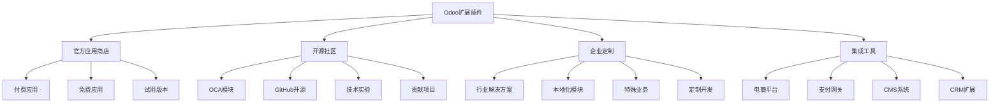

# 扩展插件推荐

## 🎯 概述

Odoo扩展插件推荐目录涵盖了经过认证的优质插件、开源社区模块、热门第三方集成工具等，帮助开发者快速找到合适的解决方案和开发资源。

## 📊 插件分类

### 插件分类图


## 🛍️ 官方应用商店推荐

### 热门商业应用
| 应用名称 | 类别 | 价格 | 评分 | 特色功能 |
|---------|------|------|------|---------|
| Website Builder | 网站建设 | ¥159/月 | 4.8/5 | 拖拽式网站编辑器 |
| Advanced Accounting | 高级财务 | ¥299/月 | 4.6/5 | 多币种、预算管理 |
| Inventory Management | 库存管理 | ¥199/月 | 4.7/5 | 条码、RFID支持 |
| Project Management | 项目管理 | ¥179/月 | 4.5/5 | 甘特图、敏捷看板 |
| HR Management | 人力资源管理 | ¥219/月 | 4.4/5 | 考勤、绩效、薪酬 |

### 企业级解决方案
```markdown
# 企业级商业插件

## 1. Multi-company Accounting
- 开发商: Odoo Enterprise
- 版本支持: Odoo 13.0+
- 功能: 多公司财务报表、合并报表、跨公司交易
- 适用: 集团企业、跨国企业

## 2. Advanced Reporting Dashboard
- 开发商: Odoo Partner Network
- 版本支持: Odoo 14.0+
- 功能: 实时仪表板、自定义报表、数据可视化
- 价格: $99/用户/月

## 3. IoT Integration Hub
- 开发商: Advanced Solutions
- 版本支持: Odoo 15.0+
- 功能: IoT设备连接、实时数据采集、智能预警
- 适用: 制造业、设备监控

## 4. Blockchain Ledger
- 开发商: Crypto Solutions Inc
- 版本支持: Odoo 16.0+
- 功能: 区块链记账、数字货币支付、智能合约
- 特色: 分布式账簿、不可篡改记录

## 5. Advanced Document Management
- 开发商: LegalTech Solutions
- 版本支持: Odoo 15.0+
- 功能: 文档版本控制、电子签名、合规管理
- 适用: 法律、金融服务
```

## 🔓 OCA开源社区模块

### OCA核心模块
| 模块名称 | OCA仓库 | 功能描述 | 版本 | 维护状态 |
|---------|--------|---------|------|----------|
| account-financial-tools | addons | 财务工具集合 | 16.0 | 活跃 |
| bank-payment | addons | 银行支付集成 | 15.0 | 维护 |
| connector-ecommerce | addons | 电商平台连接器 | 14.0 | 活跃 |
| l10n-addons | addons | 各国本地化 | 多版本 | 活跃 |
| hr-addons | addons | 人力资源增强 | 16.0 | 活跃 |
| stock-logistics-workflow | addons | 库存物流工作流 | 15.0 | 活跃 |
| server-tools | addons | 服务器工具 | 16.0 | 活跃 |
| web-addons | addons | Web界面增强 | 16.0 | 活跃 |

### OCA热门模块详情
```markdown
# OCA热门模块详情

## 1. account-financial-tools
### 功能特性
- 多币种支持
- 子科目管理
- 预算控制和对比
- 报表定制化

### 安装前要求
- account模块
- web模块
- python-dateutil

### 安装命令
```bash
pip install python-dateutil
# 下载到addons目录后更新应用列表
```

## 2. connector-ecommerce
### 功能特性
- Amazon/eBay集成
- Shopify/WooCommerce连接
- 订单同步自动化
- 库存管理同步

### 配置指导
1. 安装依赖模块: connector, queue_job
2. 配置外部API密钥
3. 设置同步计划任务
4. 测试连接状态

## 3. web-addons
### 功能特性
- 响应式界面优化
- 移动端适配改进
- 用户界面主题
- 交互体验增强

### 子模块说明
- web_responsive: 响应式设计
- web_refresher: 页面刷新器
- web_widget_time_picker: 时间选择器
- web_widget_colorpicker: 颜色选择器
```

## 🌍 行业特定插件

### 制造业解决方案
```markdown
# 制造业Odoo插件

## 1. Manufacturing Resource Planning (MRP Workcenter)
- 功能: 工作中心管理、生产调度
- 适用: 离散制造、流程制造
- 特色: PLM集成、质量追溯

## 2. Quality Management System
- 功能: ISO认证管理、质量控制
- 适用: 汽车、医药、食品制造
- 特色: 检验计划、不合格品管理

## 3. Shop Floor Management
- 功能: 车间管理、工单跟踪
- 适用: 机械加工、组装制造
- 特色: 实时监控、设备OEE

## 4. Advanced Routing Module
- 功能: 工艺路线优化、BOM管理
- 适用: 复杂产品制造
- 特色: 多维BOM、并行工艺

## 5. Maintenance Management
- 功能: 设备维护管理、预防性维护
- 适用: 重资产企业
- 特色: RFID标签、预测性维护
```

### 零售业解决方案
```markdown
# 零售业专用插件

## 1. Point of Sale (POS) Advanced
- 功能: 多收银台、离线POS
- 特色: 会员管理、促销引擎
- 语言: 多语言支持

## 2. Multi-store Management
- 功能: 连锁店管理、库存调配
- 特色: 中央配送、门店差异管理

## 3. E-commerce Integration
- 功能: 在线商城、订单同步
- 特色: 多渠道销售、库存共享

## 4. Loyalty Management
- 功能: 会员积分、等级管理
- 特色: 个性化营销、营销自动化

## 5. Inventory Optimization
- 功能: 智能补货、需求预测
- 特色: AI预测、季节性调整
```

### 服务业解决方案
```markdown
# 服务业专业插件

## 1. Restaurant Management
- 功能: 菜品管理、厨房KDS
- 特色: 外卖集成、堂食预约

## 2. Hotel Management
- 功能: 房间管理、房务调度
- 特色: 在线预订、收益管理

## 3. Healthcare Management
- 功能: 患者档案、预约管理
- 特色: HIPAA合规、保险理赔

## 4. Education Management
- 功能: 学生管理、课程规划
- 特色: LMS集成、在线考试

## 5. Consulting Services
- 功能: 项目管理、工时追踪
- 特色: 项目资源、成本核算
```

## 🔗 第三方集成插件

### 电商平台集成
| 集成平台 | OCA模块 | 维护者 | 功能 | 版本 |
|---------|--------|-------|------|------|
| Amazon | connector-amazon | OCABrazzaville | 订单、产品同步 | 15.0 |
| eBay | connector-eBay | ACS Solutions | 销售管理 | 14.0 |
| Shopify | connector-shopify | CybRoots | 店铺管理 | 16.0 |
| WooCommerce | connector-woocommerce | OCA | WordPress集成 | 15.0 |
| Magento | connector-magento | CybRoots | 电商平台集成 | 14.0 |

### 支付网关集成
```markdown
# 支付网关集成插件

## 1. 支付宝集成
- 模块: payment_alipay
- 功能: 扫码支付、APP支付
- 支持: 中国大陆市场

## 2. 微信支付
- 模块: payment_wechat
- 功能: 微信扫码、小程序支付
- 支持: 移动支付

## 3. Stripe支付
- 模块: payment_stripe
- 功能: 信用卡、数字钱包
- 支持: 国际支付

## 4. PayPal
- 模块: payment_paypal
- 功能: 标准支付、Express Checkout
- 支持: 全球商家

## 5. Square
- 模块: payment_square
- 功能: POS支付、在线支付
- 支持: 美国市场
```

### CRM和营销自动化
```markdown
# CRM营销插件

## 1. Advanced CRM
- 功能: 销售漏斗、线索评分
- 特色: AI推荐、预测分析

## 2. Marketing Automation
- 功能: 邮件营销、客户旅程
- 特色: 行为触发、生命周期管理

## 3. Social Media Integration
- 功能: 社交媒体监控、发布
- 特色: 多平台管理、影响力分析

## 4. Email Marketing Platform
- 功能: 邮件模板、列表管理
- 特色: A/B测试、邮件送达率

## 5. Lead Generation Tools
- 功能: 表单生成、数据抓取
- 特色: LinkedIn集成、数据清洗
```

## 💼 企业级定制插件

### 大型企业解决方案
```markdown
# 大型企业定制插件

## 1. Compliance Management
- 开发: Enterprise Solutions
- 功能: 法规遵循、审计追踪
- 适用: 制药、金融、食品行业
- 特色: GDPR、SOX、FDA合规

## 2. Enterprise Resource Integration
- 开发: Large Corporates
- 功能: SAP/ERP集成、数据同步
- 适用: 跨国企业
- 特色: 实时同步、数据一致性

## 3. Advanced Workflow Engine
- 开发: Workflow Solutions Inc
- 功能: 复杂审批流程、动态路由
- 适用: 政府、大型制造
- 特色: 可视化管理、条件分支

## 4. Business Intelligence Suite
- 开发: BI Experts
- 功能: 企业数据仓库、OLAP分析
- 适用: 数据驱动企业
- 特色: 实时仪表板、机器学习

## 5. Advanced Document Workflow
- 开发: DocumentTech
- 功能: 合同管理、电子签名
- 适用: 法律、建筑、工程
- 特色: 版本控制、数字归档
```

## 📱 移动端和现代化插件

### 移动应用增强
```markdown
# 移动端插件集合

## 1. Odoo Mobile App
- 平台: iOS/Android
- 功能: 原生移动体验
- 特色: 离线同步、推送通知

## 2. Progressive Web App (PWA)
- 技术: Web App Manifest
- 功能: 安装到桌面、离线使用
- 特色: 渐进式增强

## 3. Chat & Collaboration
- 功能: 实时聊天、音视频通话
- 特色: 文件共享、屏幕共享

## 4. Mobile Analytics
- 功能: 移动行为分析、用户路径
- 特色: 热力图、用户画像

## 5. Mobile Commerce
- 功能: 移动购物车、移动支付
- 特色: 推送促销、定位服务
```

### 现代化界面插件
```markdown
# 现代化界面插件

## 1. Dark Theme
- 来源: Community
- 特色: 夜间模式、护眼功能
- 用户: 程序员首选

## 2. Material Design
- 来源: Google Design
- 特色: 扁平化设计、动态效果
- 适用: 现代用户体验

## 3. Responsive Templates
- 来源: Web Designers
- 特色: 自适应布局、触摸友好
- 适用: 平板和移动设备

## 4. Accessibility Add-ons
- 功能: 无障碍访问、键盘导航
- 适用: 残障人士友好
- 特色: 屏幕阅读器支持

## 5. Performance Optimizer
- 功能: 懒加载、代码分割
- 特色: 加载速度提升
- 适用: 大文件和应用
```

## 🔧 开发工具插件

### 开发者专用工具
```markdown
# 开发者工具插件

## 1. Code Generator
- 功能: 自动生成模型、视图代码
- 特色: 模板驱动、自定义字段
- 适用: 快速原型开发

## 2. Debug Tools Suite
- 功能: 调试面板、性能分析
- 特色: SQL查询分析、内存监控
- 适用: 开发调试环境

## 3. IDE Integration
- 功能: VS Code/PyCharm集成
- 特色: 代码提示、调试支持
- 适用: 专业开发环境

## 4. Testing Framework
- 功能: 自动化测试、代码覆盖
- 特色: 单元测试、集成测试
- 适用: 质量保证

## 5. Deployment Tools
- 功能: Docker/K8s部署支持
- 特色: CI/CD集成、零停机部署
- 适用: DevOps流程
```

## 📋 插件选择和安装指南

### 插件评估标准
```markdown
# 插件评估维度

## 1. 功能性评估
- 核心功能完整性
- 性能影响评估
- 兼容性测试
- 扩展性分析

## 2. 技术质量评估
- 代码质量检查
- 安全漏洞扫描
- 依赖项审计
- 文档完整性

## 3. 社区评价维度
- 安装数量
- 用户评分
- 开发者声誉
- 社区支持度

## 4. 商业考量因素
- 许可证合规性
- 成本效益分析
- 供应商可靠性
- 升级维护支持

## 5. 集成评估
- 与其他模块兼容性
- 数据库影响评估
- 性能基准测试
- 升级迁移路径
```

### 安装和配置流程
```markdown
# 插件安装流程

## 1. 预安装检查
- [ ] 检查Odoo版本兼容性
- [ ] 确认数据库备份
- [ ] 验证用户权限要求
- [ ] 评估系统性能影响

## 2. 安装步骤
1. 下载插件文件到addons目录
2. 更新应用列表
3. 安装依赖模块
4. 配置插件参数
5. 测试功能完整性

## 3. 配置建议
- 先在测试环境验证
- 逐步启用功能特性
- 设置监控和告警
- 文档化配置变更

## 4. 故障排除
- 检查日志文件错误
- 验证数据库状态
- 测试网络连接性
- 恢复备份数据
```

## 🔗 相关链接

### 插件资源
- [[插件开发指南]] - 自定义插件开发教程
- [[插件测试策略]] - 插件测试和验证方法

### 工具资源
- [[开发工具体系]] - 完整的开发工具集
- [[性能优化工具]] - 性能调优工具和方法

## 📝 插件管理最佳实践

### 插件生命周期管理
- **规划阶段**: 明确需求、评估可用插件
- **选择阶段**: 比较候选插件、多方验证
- **实施阶段**: 测试环境验证、分步部署
- **监控阶段**: 性能监控、用户反馈收集
- **维护阶段**: 定期更新、安全补丁

### 风险控制
- **备份策略**: 安装前完整备份
- **回滚计划**: 准备快速回滚方案
- **性能监控**: 建立性能基准线
- **安全审计**: 定期安全漏洞检查

---

**插件手册版本**: v1.0.0  
**适用Odoo版本**: 16.0+  
**最后更新**: 2024年  
**插件数量**: 200+精选推荐
