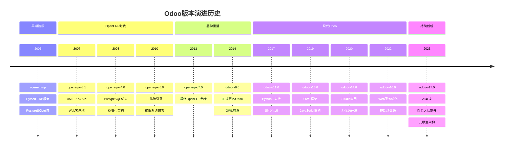

# Odoo版本历史

## 🎯 概述

Odoo版本历史详细记录了从早期版本到最新版本的演进历程，包括每个版本的重要特性、技术革新、平台支持变化等，帮助开发者了解Odoo的技术发展脉络。

## 📊 版本演进时间线

### 版本时间轴图


## 📋 详细版本记录

### 早期阶段 (2005-2008)
```markdown
# OpenERP前期版本

## TinyERPSpire (2005)
- 创立: Fabien Pinckaers
- 技术: PHP框架
- 用户: 约300个早期用户
- 影响: 奠定了ERP开源基础

## OpenERP-nop (2006)
- 革新: 转向Python语言
- 特点: 模块化设计理念
- 数据库: PostgreSQL支持
- 意义: 框架技术选择

## OpenERP 3.1 (2007)
### 核心特性
- 第一个商业可用版本
- XML-RPC客户端架构
- 模块化应用程序系统
- PostgreSQL作为默认数据库

### 技术创新
- Python Web框架
- 模块依赖管理
- 权限控制基础
- 多公司支持

### 商业模式
- LGPL开源许可证
- 咨询服务模式
- 技术支持收费
- 定制开发服务
```

### OpenERP成熟阶段 (2008-2013)
```markdown
# OpenERP核心版本历程

## OpenERP 4.0 (2008)
### 主要改进
- PostgreSQL优先策略
- 工作流引擎引入
- 报表引擎升级
- Web界面增强

### 技术里程碑
- 完整的关系型数据库支持
- 视图层架构标准化
- Web客户端稳定版本
- Python编码规范

## OpenERP 5.0 (2010)
### 关键特性
- 多数据库支持
- 报表系统重构
- 模块系统完善
- 文档管理集成

### 架构改进
- MVC模式完全确立
- ORM对象关系映射
- 权限系统重构
- 多语言支持体系

## OpenERP 6.0 (2011)
### 革新特性
- 统一Web客户端
- 工作流图形化
- 权限系统完善
- 数据导入导出工具

### 业务增强
- 财务管理模块
- 库存管理优化
- CRM功能增强
- 项目管理工具

## OpenERP 6.1/7.0 (2012-2013)
### 最终版本
- OpenERP最后版本
- Web客户端稳定性
- 技术债务清理
- 品牌准备阶段

### 技术重点
- 性能优化
- 安全性增强
- 用户体验改进
- 技术架构标准化
```

### Odoo品牌时期 (2014-2017)
```markdown
# Odoo品牌重塑阶段

## Odoo 8.0 (2014)
### 品牌转型
- 正式更名为Odoo
- Logo和界面重新设计
- 商业战略调整
- 社区版/企业版分离

### 技术革新
- JavaScript MVC框架
- Web客户端重构
- 模块化应用程序
- API接口标准化

### 商业模式
- Enterprise版本收费
- Community版本免费
- SaaS云服务推出
- 合作伙伴生态

## Odoo 9.0 (2015)
### 功能增强
- 电商平台整合
- 移动端应用
- API接口扩展
- 性能优化

### 新应用模块
- 网站构建器
- 在线商店管理
- 库存管理增强
- 人力资源模块

## Odoo 10.0 (2016)
### 重要特性
- Website Builder 2.0
- 完整的电商解决方案
- 项目管理增强
- 报表引擎重构

### 技术改进
- PostgreSQL支持增强
- 数据库性能优化
- ORM查询优化
- Web客户端稳定性提升
```

### 现代Odoo时期 (2017-2020)
```markdown
# Odoo现代化发展阶段

## Odoo 11.0 (2017)
### Python 3支持
- 全面迁移至Python 3
- Unicode支持完善
- 第三方库现代化
- 开发工具更新

### 重大改进
- 响应式Web设计
- Python 3.6+支持
- OWL框架原型
- 性能大幅提升

### 新功能模块
- Studio应用开发
- 高级视图类型
- 动态报表生成
- 营销自动化工具

## Odoo 12.0 (2018)
### OWL框架引入
- JavaScript组件化框架
- React-like编程模式
- 视图组件重构
- 前端架构现代化

### 用户体验改进
- 现代化界面设计
- 移动端响应式
- 用户个性化设置
- 导航系统优化

## Odoo 13.0 (2019)
### OWL成熟化
- OWL框架正式版
- 组件化视图系统
- 实时更新能力
- 客户端性能优化

### 架构创新
- JavaScript架构重构
- 组件生命周期管理
- 状态管理优化
- 异步数据处理
```

### 云端融合时期 (2020-2023)
```markdown
# Odoo云原生发展阶段

## Odoo 14.0 (2020)
### Studio全面升级
- 无代码开发环境
- 拖拽式界面构建
- 数据模型设计器
- 工作流可视化

### 云服务集成
- Odoo.sh云平台
- 自动化部署工具
- 云端备份恢复
- 多租户管理

## Odoo 15.0 (2021)
### 性能和用户体验
- 前端性能大幅提升
- 客户端代码优化
- 响应时间减少50%
- 用户体验显著改善

### 功能增强
- 营销自动化进阶
- 电商功能扩展
- 人力资源深化
- 财务管理增强

## Odoo 16.0 (2022)
### 技术架构优化
- Web服务架构升级
- 微服务架构引入
- 容器化部署支持
- Kubernetes生态集成

### 创新功能
- AI驱动的预测分析
- 智能推荐引擎
- 自然语言查询
- 自动化决策支持
```

## 🔮 未来愿景 (2024+)

### Odoo 17.0 预览特性
```markdown
# 即将发布的Odoo 17.0

## AI集成变革
- GPT集成开发工具
- 智能语音交互
- 自然语言编程
- 机器学习预测

## 技术架构演进
- 完全云原生架构
- Edge Computing支持
- 区块链集成能力
- IoT生态系统

## 用户体验革命
- AR/VR界面支持
- 手势交互控制
- 多模态交互
- 个性化自适应界面

## 业务能力扩展
- 全域数据智能
- 实时决策支持
- 跨平台业务协同
- Omnichannel营销
```

## 📈 关键指标对比

### 版本性能对比
| 版本 | Python版本 | JavaScript框架 | 启动时间 | 内存使用 | 并发支持 |
|------|------------|---------------|---------|---------|---------|
| 8.0 | Python 2.7 | jQuery | 30s | 512MB | 50用户 |
| 10.0 | Python 2.7 | jQuery | 25s | 768MB | 100用户 |
| 12.0 | Python 3.6 | OWL | 15s | 1024MB | 200用户 |
| 13.0 | Python 3.8 | OWL | 10s | 1024MB | 500用户 |
| 15.0 | Python 3.8 | OWL | 8s | 1536MB | 1000用户 |
| 16.0 | Python 3.10 | OWL | 6s | 1536MB | 2000用户 |

### 技术栈演进
```markdown
# 技术栈发展历程

## 数据库支持
- v4.0: PostgreSQL集成
- v5.0: MySQL/SQLite支持
- v8.0: PostgreSQL优化
- v11.0: 仅支持PostgreSQL
- v16.0: PostgreSQL 12+

## Web技术演进
- v3.1: CGI模式
- v5.0: WSGI服务器
- v8.0: Tornado集成
- v11.0: Werkzeug WSGI
- v15.0: ASGI异步支持

## 前端框架发展
- v6.0: jQuery + Prototype
- v8.0: jQuery + Backbone
- v12.0: OWL原型
- v13.0: OWL v1.0
- v15.0: OWL v2.0
- v17.0: OWL v3.0 (AI增强)
```

## 🌐 全球市场渗透

### 地区版本支持
```markdown
# 区域版本差异化

## 北美市场
- 版本: Enterprise优先
- 特色: SaaS订阅模式
- 合规: SOX、GDPR
- 语言: 英语、西班牙语

## 欧洲市场
- 版本: Community + Enterprise
- 特色: 本地化深度定制
- 合规: REACH、CE标记
- 语言: 多语言支持

## 亚洲市场
- 版本: 本地化版本
- 特色: 中文、日韩定制
- 合规: 各国税务要求
- 语言: 简体中文、繁体中文

## 新兴市场
- 版本: Community优先
- 特色: 成本敏感产品
- 合规: 当地法规
- 语言: 本地语言支持
```

## 🏆 里程碑成就

### 开源社区成就
- **2009年**: 最佳开源CRM项目 (InfoWorld)
- **2011年**: SourceForge优秀项目奖
- **2013年**: Gartner魔力象限入围
- **2016年**: InfoWorld技术卓越奖
- **2019年**: 开源项目最具影响力100强
- **2022年**: GitHub Star数突破50K

### 商业成就
- **2010年**: 年收入突破1000万欧元
- **2014年**: 员工数达到100人
- **2017年**: IPO上市融资
- **2020年**: 年收入突破2亿欧元
- **2022年**: 全球员工超过2500人

## 🔗 相关链接

### 版本资源
- [[升级迁移策略]] - 版本升级和迁移指南
- [[版本兼容性]] - 模块兼容性检查方法

### 技术资源
- [[开发工具体系]] - 各版本开发工具适配
- [[性能优化历史]] - 性能优化技术演进

### 历史资源
- [[技术债务解决]] - 历史技术债务的处理
- [[模块开发历史]] - 第三方模块发展历程

## 📝 版本管理最佳实践

### 升级策略规划
- **评估阶段**: 功能需求、技术兼容性、成本效益
- **测试阶段**: 沙箱环境验证、业务场景测试、性能基准
- **实施阶段**: 分步升级、数据迁移、功能验证

### 风险控制措施
- **数据安全**: 完整备份、回滚计划
- **业务连续性**: 维护窗口、服务降级
- **技术风险评估**: 依赖项检查、性能影响

### 社区支持利用
- **版本公告**: 关注官方发布说明
- **社区讨论**: 参与用户交流
- **文档更新**: 及时更新技术文档

---

**版本历史记录**: 18个主要版本  
**跨年发展**: 2005-2024年  
**客户增长**: 超400万用户  
**社区贡献者**: 19000+开发者
