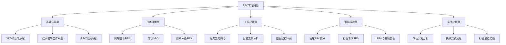

# SEO学习路径图

> **学习理念**：采用金字塔模型 + 费曼学习法 + 刻意练习，构建完整的SEO知识体系

## 🎯 学习路径概览

## 📚 五阶段学习路径

### 第一阶段：基础认知（1-2周）
**目标**：建立SEO基础认知框架

| 学习模块 | 核心内容 | 学习目标 | 实践任务 |
|---------|---------|---------|---------|
| [[01-1-SEO概念与原理]] | SEO定义、目标、生态系统 | 理解SEO本质和价值 | 分析3个网站的SEO现状 |
| [[01-2-搜索引擎工作原理]] | 爬虫、索引、算法机制 | 掌握搜索引擎工作原理 | 模拟搜索引擎工作流程 |
| [[01-3-SEO发展历程]] | 历史演进、技术变革、未来趋势 | 了解SEO发展脉络 | 预测未来SEO趋势 |

**费曼学习法应用**：
- 用简单语言向他人解释什么是SEO
- 画出搜索引擎工作原理图
- 总结SEO发展的关键节点

### 第二阶段：技术理解（2-3周）
**目标**：掌握SEO技术实现方法

| 学习模块 | 核心内容 | 学习目标 | 实践任务 |
|---------|---------|---------|---------|
| [[02-1-网站技术SEO]] | 架构、页面、移动端优化 | 掌握技术SEO实现 | 优化一个网站的技术SEO |
| [[02-2-内容SEO]] | 关键词研究、内容优化 | 掌握内容SEO策略 | 制定内容SEO计划 |
| [[02-3-用户体验SEO]] | 用户体验指标、优化方法 | 理解UX与SEO关系 | 分析网站用户体验 |

**刻意练习要点**：
- 每天练习一个技术SEO技能
- 每周完成一个内容SEO项目
- 持续监控和优化用户体验指标

### 第三阶段：工具应用（2-3周）
**目标**：熟练使用SEO工具

| 学习模块 | 核心内容 | 学习目标 | 实践任务 |
|---------|---------|---------|---------|
| [[03-1-免费工具使用]] | Google工具、百度工具 | 掌握免费工具使用 | 建立SEO监控体系 |
| [[03-2-付费工具分析]] | Ahrefs、SEMrush、Moz | 了解付费工具功能 | 对比分析工具优劣 |
| [[03-3-数据监控体系]] | 数据收集、分析、报告 | 建立数据监控体系 | 制作SEO数据报告 |

**实践方法**：
- 每天使用至少2个SEO工具
- 每周制作一份SEO数据报告
- 建立个人SEO工具使用手册

### 第四阶段：策略精通（3-4周）
**目标**：制定高级SEO策略

| 学习模块 | 核心内容 | 学习目标 | 实践任务 |
|---------|---------|---------|---------|
| [[04-1-高级SEO技术]] | 国际SEO、本地SEO、电商SEO | 掌握高级SEO技术 | 制定国际SEO策略 |
| [[04-2-行业专项SEO]] | B2B、电商、内容网站SEO | 了解行业SEO特点 | 分析行业SEO案例 |
| [[04-3-SEO与营销整合]] | SEO与PPC、内容营销整合 | 整合SEO与营销策略 | 制定整合营销方案 |

**精通标准**：
- 能够独立制定SEO策略
- 能够解决复杂SEO问题
- 能够指导他人进行SEO优化

### 第五阶段：实战应用（持续）
**目标**：通过实战案例提升能力

| 学习模块 | 核心内容 | 学习目标 | 实践任务 |
|---------|---------|---------|---------|
| [[05-1-成功案例分析]] | 电商、企业、内容网站案例 | 学习成功经验 | 分析成功案例关键因素 |
| [[05-2-失败案例反思]] | 常见错误、算法更新应对 | 避免常见错误 | 总结失败案例教训 |
| [[05-3-行业最佳实践]] | 各行业SEO特点、团队建设 | 掌握最佳实践 | 制定行业SEO指南 |

## 🎯 学习效果评估

### 认知层评估
- [ ] 能够清晰解释SEO概念和原理
- [ ] 理解搜索引擎工作原理
- [ ] 了解SEO发展历史和趋势

### 理解层评估
- [ ] 掌握技术SEO实现方法
- [ ] 能够制定内容SEO策略
- [ ] 理解用户体验与SEO关系

### 应用层评估
- [ ] 熟练使用主流SEO工具
- [ ] 能够分析SEO数据
- [ ] 能够制定SEO优化方案

### 精通层评估
- [ ] 能够解决复杂SEO问题
- [ ] 能够指导他人进行SEO优化
- [ ] 能够预测SEO发展趋势

## 📖 学习建议

### 费曼学习法应用
1. **选择概念**：选择一个SEO概念
2. **简单解释**：用简单语言向他人解释
3. **识别盲点**：找出解释不清楚的地方
4. **重新学习**：回到资料重新学习
5. **简化表达**：用更简单的语言表达

### 刻意练习方法
1. **明确目标**：设定具体的学习目标
2. **专注练习**：专注于特定技能的练习
3. **及时反馈**：获得及时的反馈和指导
4. **持续改进**：根据反馈持续改进

### 学习节奏控制
- **每日学习**：每天学习1-2小时
- **每周复习**：每周复习本周学习内容
- **每月总结**：每月总结学习成果
- **持续更新**：持续关注SEO行业动态

## 🔗 相关链接

- [[SEO知识体系总览]] - 了解整体知识架构
- [[学习进度跟踪]] - 跟踪学习进度
- [[快速参考指南]] - 快速查找关键信息

---

**下一步**：开始学习 [[01-1-SEO概念与原理]]，建立SEO基础认知
