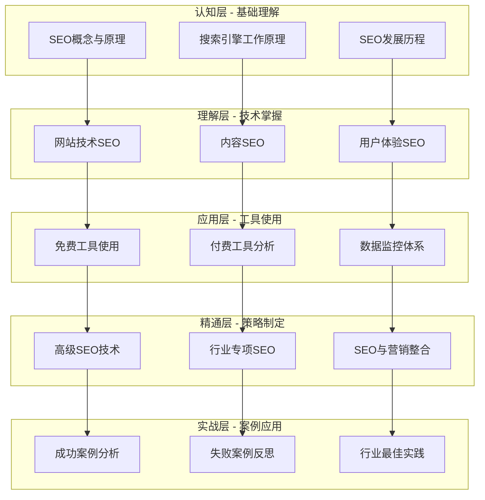
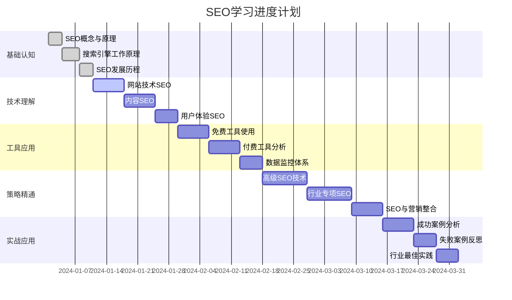

# SEO知识体系总览

> **核心理念**：构建完整的SEO知识金字塔，从认知到精通，从理论到实践

## 🏗️ 知识体系架构

## 📊 知识层次详解

### 🎯 认知层（基础理解）
**目标**：建立SEO基础认知框架

| 模块 | 核心内容 | 学习重点 | 实践任务 |
|------|---------|---------|---------|
| [[01-1-SEO概念与原理]] | SEO定义、价值、目标、生态系统 | 理解SEO本质和商业价值 | 分析网站SEO现状 |
| [[01-2-搜索引擎工作原理]] | 爬虫机制、索引建立、排名算法 | 掌握搜索引擎工作原理 | 模拟搜索引擎工作流程 |
| [[01-3-SEO发展历程]] | 历史演进、技术变革、未来趋势 | 了解SEO发展脉络 | 预测SEO发展趋势 |

**费曼学习法应用**：
- 用一句话解释什么是SEO
- 画出搜索引擎工作原理图
- 总结SEO发展的3个关键节点

### 🔍 理解层（技术掌握）
**目标**：掌握SEO技术实现方法

| 模块 | 核心内容 | 学习重点 | 实践任务 |
|------|---------|---------|---------|
| [[02-1-网站技术SEO]] | 架构优化、页面技术、移动端优化 | 掌握技术SEO实现 | 优化网站技术SEO |
| [[02-2-内容SEO]] | 关键词研究、内容创作、内容优化 | 掌握内容SEO策略 | 制定内容SEO计划 |
| [[02-3-用户体验SEO]] | 用户体验指标、优化方法 | 理解UX与SEO关系 | 分析网站用户体验 |

**刻意练习要点**：
- 每天练习一个技术SEO技能
- 每周完成一个内容SEO项目
- 持续监控用户体验指标

### 📊 应用层（工具使用）
**目标**：熟练使用SEO工具

| 模块 | 核心内容 | 学习重点 | 实践任务 |
|------|---------|---------|---------|
| [[03-1-免费工具使用]] | Google工具、百度工具、其他免费工具 | 掌握免费工具使用 | 建立SEO监控体系 |
| [[03-2-付费工具分析]] | Ahrefs、SEMrush、Moz等付费工具 | 了解付费工具功能 | 对比分析工具优劣 |
| [[03-3-数据监控体系]] | 数据收集、分析、报告制作 | 建立数据监控体系 | 制作SEO数据报告 |

**实践方法**：
- 每天使用至少2个SEO工具
- 每周制作一份SEO数据报告
- 建立个人SEO工具使用手册

### 🚀 精通层（策略制定）
**目标**：制定高级SEO策略

| 模块 | 核心内容 | 学习重点 | 实践任务 |
|------|---------|---------|---------|
| [[04-1-高级SEO技术]] | 国际SEO、本地SEO、电商SEO | 掌握高级SEO技术 | 制定国际SEO策略 |
| [[04-2-行业专项SEO]] | B2B、电商、内容网站SEO | 了解行业SEO特点 | 分析行业SEO案例 |
| [[04-3-SEO与营销整合]] | SEO与PPC、内容营销整合 | 整合SEO与营销策略 | 制定整合营销方案 |

**精通标准**：
- 能够独立制定SEO策略
- 能够解决复杂SEO问题
- 能够指导他人进行SEO优化

### 💡 实战层（案例应用）
**目标**：通过实战案例提升能力

| 模块 | 核心内容 | 学习重点 | 实践任务 |
|------|---------|---------|---------|
| [[05-1-成功案例分析]] | 电商、企业、内容网站成功案例 | 学习成功经验 | 分析成功案例关键因素 |
| [[05-2-失败案例反思]] | 常见错误、算法更新应对 | 避免常见错误 | 总结失败案例教训 |
| [[05-3-行业最佳实践]] | 各行业SEO特点、团队建设 | 掌握最佳实践 | 制定行业SEO指南 |

## 🎯 学习目标体系

### 认知目标
- [ ] 能够清晰解释SEO概念和原理
- [ ] 理解搜索引擎工作原理
- [ ] 了解SEO发展历史和趋势
- [ ] 掌握SEO生态系统构成

### 理解目标
- [ ] 掌握技术SEO实现方法
- [ ] 能够制定内容SEO策略
- [ ] 理解用户体验与SEO关系
- [ ] 掌握SEO优化基本原理

### 应用目标
- [ ] 熟练使用主流SEO工具
- [ ] 能够分析SEO数据
- [ ] 能够制定SEO优化方案
- [ ] 能够监控SEO效果

### 精通目标
- [ ] 能够解决复杂SEO问题
- [ ] 能够指导他人进行SEO优化
- [ ] 能够预测SEO发展趋势
- [ ] 能够制定长期SEO策略

## 📈 学习进度跟踪

### 学习里程碑

### 学习检查点
- **第1周**：完成基础认知层学习
- **第3周**：完成技术理解层学习
- **第5周**：完成工具应用层学习
- **第8周**：完成策略精通层学习
- **第10周**：完成实战应用层学习

## 🔗 知识关联图

```mermaid
graph LR
    subgraph "核心概念"
        A[SEO定义] --> B[搜索引擎工作原理]
        B --> C[SEO价值]
    end
    
    subgraph "技术实现"
        D[网站架构] --> E[内容优化]
        E --> F[用户体验]
    end
    
    subgraph "工具应用"
        G[免费工具] --> H[付费工具]
        H --> I[数据监控]
    end
    
    subgraph "策略制定"
        J[高级技术] --> K[行业专项]
        K --> L[营销整合]
    end
    
    subgraph "实战应用"
        M[成功案例] --> N[失败反思]
        N --> O[最佳实践]
    end
    
    C --> D
    F --> G
    I --> J
    L --> M
```

## 📚 学习资源推荐

### 必读资料
- [[快速参考指南]] - 核心概念速查
- [[学习进度跟踪]] - 学习进度管理
- [[SEO学习路径图]] - 学习路径规划

### 扩展阅读
- Google SEO指南
- 百度SEO指南
- 行业专家博客
- SEO工具官方文档

### 实践项目
- 个人网站SEO优化
- 企业网站SEO分析
- SEO工具使用练习
- 竞争对手分析报告

## 🎯 学习效果评估

### 自我评估标准
| 层次 | 评估标准 | 通过标准 |
|------|---------|---------|
| 认知层 | 能够解释SEO基本概念 | 90%正确率 |
| 理解层 | 能够分析SEO技术问题 | 80%正确率 |
| 应用层 | 能够使用SEO工具 | 熟练操作 |
| 精通层 | 能够制定SEO策略 | 独立完成 |
| 实战层 | 能够分析SEO案例 | 深度分析 |

### 学习成果展示
- **学习笔记**：完整的SEO学习笔记
- **实践报告**：SEO优化实践报告
- **案例分析**：深度SEO案例分析
- **策略方案**：SEO策略制定方案

---

**开始学习**：[[SEO学习路径图]] → [[01-1-SEO概念与原理]]
