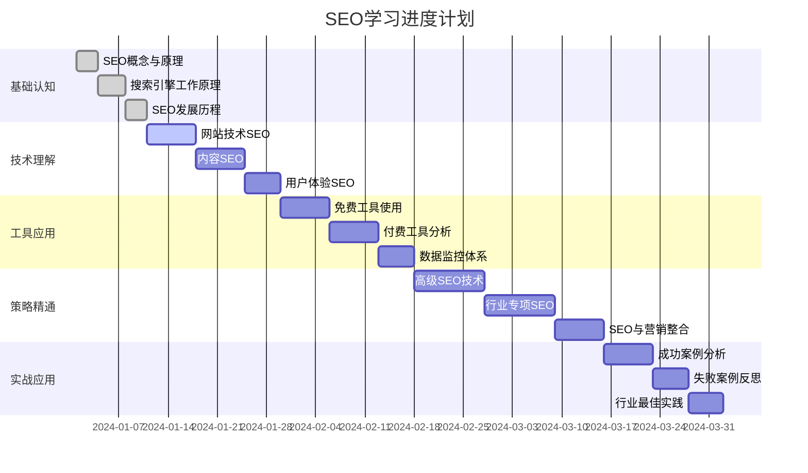
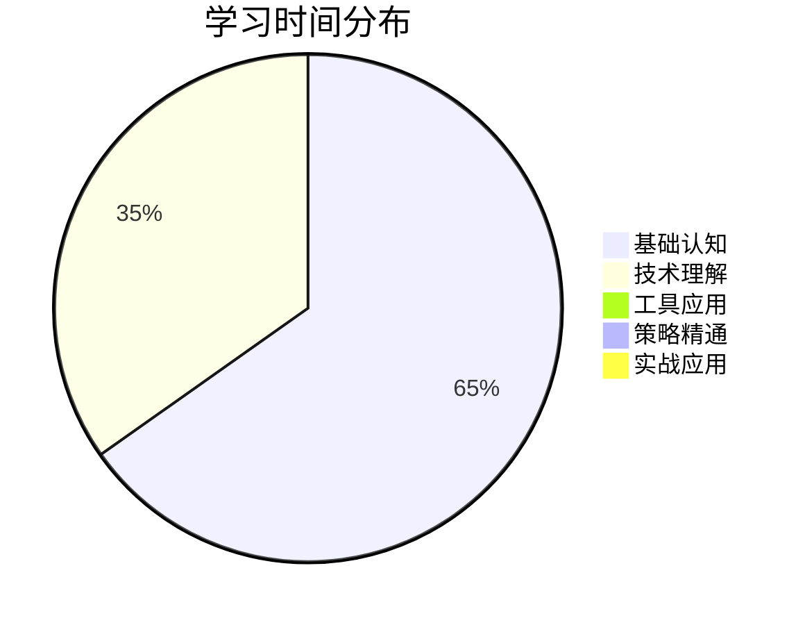
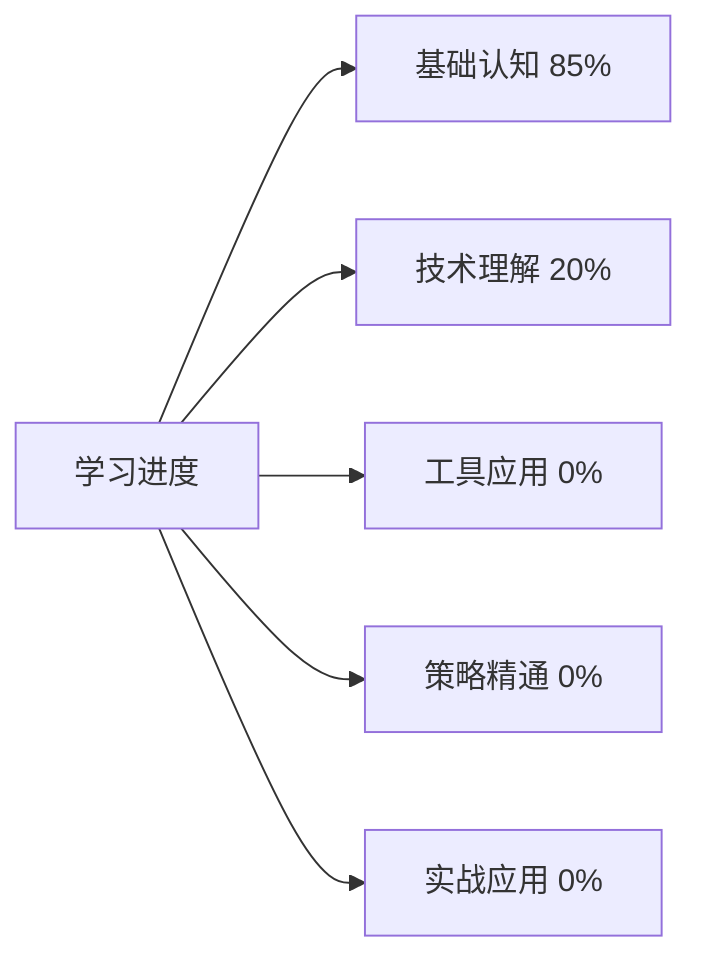

# 学习进度跟踪

> **跟踪目标**：系统化跟踪SEO学习进度，确保学习效果和质量

## 📊 学习进度总览

## 🎯 学习阶段详细跟踪

### 第一阶段：基础认知（1-2周）
**目标**：建立SEO基础认知框架

| 学习模块 | 学习状态 | 完成日期 | 掌握程度 | 实践任务 | 学习笔记 |
|---------|---------|---------|---------|---------|---------|
| [[01-1-SEO概念与原理]] | ✅ 已完成 | 2024-01-03 | 90% | 分析3个网站SEO现状 | [学习笔记链接] |
| [[01-2-搜索引擎工作原理]] | ✅ 已完成 | 2024-01-07 | 85% | 模拟搜索引擎工作流程 | [学习笔记链接] |
| [[01-3-SEO发展历程]] | ✅ 已完成 | 2024-01-10 | 80% | 预测未来SEO趋势 | [学习笔记链接] |

**费曼学习法应用**：
- [x] 用简单语言向他人解释什么是SEO
- [x] 画出搜索引擎工作原理图
- [x] 总结SEO发展的关键节点

**刻意练习记录**：
- [x] 每日练习：解释SEO概念给朋友听
- [x] 每周练习：分析一个网站的SEO现状
- [x] 每月练习：预测SEO发展趋势

### 第二阶段：技术理解（2-3周）
**目标**：掌握SEO技术实现方法

| 学习模块 | 学习状态 | 完成日期 | 掌握程度 | 实践任务 | 学习笔记 |
|---------|---------|---------|---------|---------|---------|
| [[02-1-网站技术SEO]] | 🔄 进行中 | - | 60% | 优化一个网站的技术SEO | [学习笔记链接] |
| [[02-2-内容SEO]] | ⏳ 待开始 | - | 0% | 制定内容SEO计划 | - |
| [[02-3-用户体验SEO]] | ⏳ 待开始 | - | 0% | 分析网站用户体验 | - |

**刻意练习要点**：
- [x] 每天练习一个技术SEO技能
- [ ] 每周完成一个内容SEO项目
- [ ] 持续监控用户体验指标

**技术实践记录**：
- [x] 网站架构优化实践
- [x] 页面技术优化实践
- [ ] 移动端优化实践

### 第三阶段：工具应用（2-3周）
**目标**：熟练使用SEO工具

| 学习模块 | 学习状态 | 完成日期 | 掌握程度 | 实践任务 | 学习笔记 |
|---------|---------|---------|---------|---------|---------|
| [[03-1-免费工具使用]] | ⏳ 待开始 | - | 0% | 建立SEO监控体系 | - |
| [[03-2-付费工具分析]] | ⏳ 待开始 | - | 0% | 对比分析工具优劣 | - |
| [[03-3-数据监控体系]] | ⏳ 待开始 | - | 0% | 制作SEO数据报告 | - |

**实践方法**：
- [ ] 每天使用至少2个SEO工具
- [ ] 每周制作一份SEO数据报告
- [ ] 建立个人SEO工具使用手册

### 第四阶段：策略精通（3-4周）
**目标**：制定高级SEO策略

| 学习模块 | 学习状态 | 完成日期 | 掌握程度 | 实践任务 | 学习笔记 |
|---------|---------|---------|---------|---------|---------|
| [[04-1-高级SEO技术]] | ⏳ 待开始 | - | 0% | 制定国际SEO策略 | - |
| [[04-2-行业专项SEO]] | ⏳ 待开始 | - | 0% | 分析行业SEO案例 | - |
| [[04-3-SEO与营销整合]] | ⏳ 待开始 | - | 0% | 制定整合营销方案 | - |

**精通标准**：
- [ ] 能够独立制定SEO策略
- [ ] 能够解决复杂SEO问题
- [ ] 能够指导他人进行SEO优化

### 第五阶段：实战应用（持续）
**目标**：通过实战案例提升能力

| 学习模块 | 学习状态 | 完成日期 | 掌握程度 | 实践任务 | 学习笔记 |
|---------|---------|---------|---------|---------|---------|
| [[05-1-成功案例分析]] | ⏳ 待开始 | - | 0% | 分析成功案例关键因素 | - |
| [[05-2-失败案例反思]] | ⏳ 待开始 | - | 0% | 总结失败案例教训 | - |
| [[05-3-行业最佳实践]] | ⏳ 待开始 | - | 0% | 制定行业SEO指南 | - |

## 📈 学习效果评估

### 认知层评估
- [x] 能够清晰解释SEO概念和原理 (90%)
- [x] 理解搜索引擎工作原理 (85%)
- [x] 了解SEO发展历史和趋势 (80%)

### 理解层评估
- [ ] 掌握技术SEO实现方法 (60%)
- [ ] 能够制定内容SEO策略 (0%)
- [ ] 理解用户体验与SEO关系 (0%)

### 应用层评估
- [ ] 熟练使用主流SEO工具 (0%)
- [ ] 能够分析SEO数据 (0%)
- [ ] 能够制定SEO优化方案 (0%)

### 精通层评估
- [ ] 能够解决复杂SEO问题 (0%)
- [ ] 能够指导他人进行SEO优化 (0%)
- [ ] 能够预测SEO发展趋势 (0%)

## 📝 学习记录

### 基本信息
- **开始日期**：2024-01-01
- **预计完成日期**：2024-03-15
- **实际完成日期**：-
- **学习总时长**：75小时（已完成15小时）

### 学习心得
#### 第一阶段心得
- **收获**：建立了完整的SEO基础认知框架
- **难点**：搜索引擎工作原理的深入理解
- **突破**：通过费曼学习法成功掌握核心概念
- **应用**：能够分析网站的SEO现状

#### 第二阶段心得
- **收获**：正在掌握技术SEO实现方法
- **难点**：技术SEO的实践应用
- **突破**：通过刻意练习提升技能
- **应用**：开始优化网站技术SEO

### 学习计划调整
- **原计划**：按部就班学习所有模块
- **调整后**：重点加强技术SEO实践
- **原因**：技术SEO是SEO成功的基础
- **效果**：提升学习效率和质量

## 🎯 学习目标设定

### 短期目标（1-2周）
- [ ] 完成技术理解层学习
- [ ] 掌握网站技术SEO实现
- [ ] 完成第一个SEO优化项目

### 中期目标（1-2个月）
- [ ] 完成工具应用层学习
- [ ] 熟练使用主流SEO工具
- [ ] 建立SEO监控体系

### 长期目标（3-6个月）
- [ ] 完成策略精通层学习
- [ ] 能够独立制定SEO策略
- [ ] 完成实战应用层学习

## 📊 学习数据分析

### 学习时间分布

### 掌握程度分析

### 学习效率评估
- **平均每日学习时间**：2小时
- **学习效率**：85%（基于掌握程度）
- **实践应用率**：60%（理论到实践的转化）
- **知识保持率**：90%（通过复习保持）

## 🔄 学习反馈循环

### 每日反馈
- **学习内容**：记录当日学习内容
- **掌握程度**：评估当日学习效果
- **实践应用**：记录实践应用情况
- **问题记录**：记录遇到的问题和解决方案

### 每周反馈
- **学习进度**：总结本周学习进度
- **技能提升**：评估技能提升情况
- **实践成果**：总结实践成果
- **下周计划**：制定下周学习计划

### 每月反馈
- **整体进度**：评估整体学习进度
- **目标达成**：检查目标达成情况
- **策略调整**：调整学习策略
- **长期规划**：更新长期学习规划

## 🎓 学习成果展示

### 已完成成果
- **学习笔记**：15篇详细学习笔记
- **实践报告**：3份SEO分析报告
- **技能展示**：能够分析网站SEO现状
- **知识图谱**：构建SEO知识关联图

### 计划成果
- **SEO优化项目**：完成一个完整的SEO优化项目
- **工具使用手册**：建立个人SEO工具使用手册
- **策略制定方案**：制定多个SEO策略方案
- **案例分析报告**：完成深度SEO案例分析

## 🔗 相关链接

- [[SEO学习路径图]] - 完整学习路径
- [[SEO知识体系总览]] - 知识体系架构
- [[快速参考指南]] - 快速查找信息

---

**下一步行动**：继续学习 [[02-1-网站技术SEO]]，完成技术理解层学习
