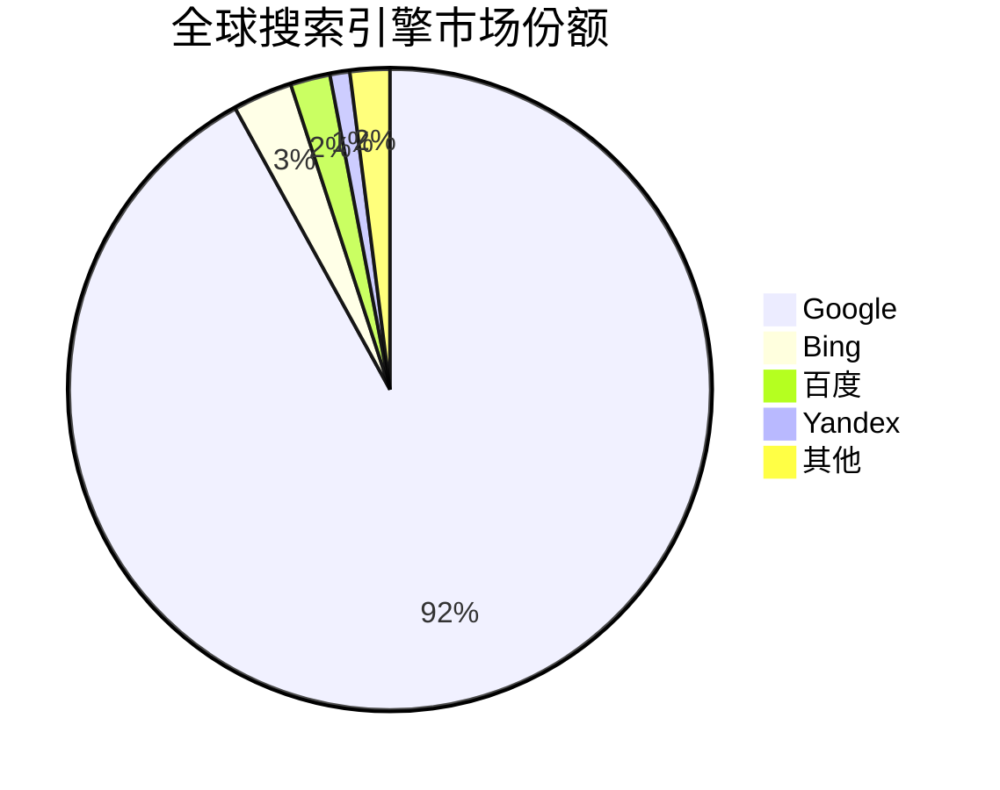
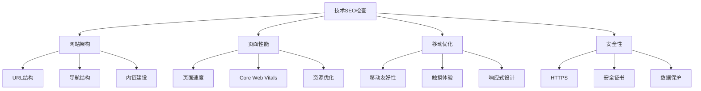
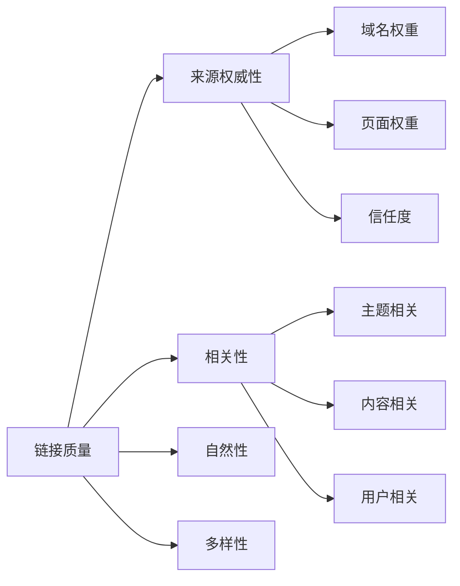
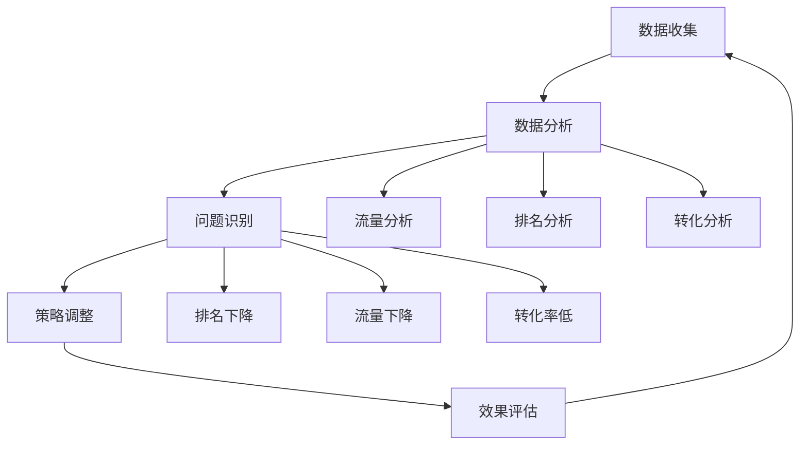

# SEO快速参考指南

> **使用说明**：快速查找SEO核心概念、工具和检查清单

## 🎯 核心概念速查

### SEO基础定义
| 概念 | 定义 | 重要性 |
|------|------|--------|
| **SEO** | 搜索引擎优化，提高网站在搜索引擎中的排名 | 核心概念 |
| **SERP** | 搜索引擎结果页面 | 目标展示位置 |
| **关键词** | 用户搜索的词语 | 优化基础 |
| **排名** | 搜索结果中的位置 | 核心目标 |
| **索引** | 搜索引擎收录网页 | 基础要求 |

### 搜索引擎分布


## 🔧 技术SEO要点

### 网站性能指标
| 指标 | 目标值 | 重要性 | 优化方法 |
|------|--------|--------|----------|
| **LCP** | < 2.5秒 | 高 | 优化图片、CDN |
| **FID** | < 100ms | 高 | 优化JavaScript |
| **CLS** | < 0.1 | 高 | 设置图片尺寸 |
| **页面速度** | < 3秒 | 中 | 压缩资源、缓存 |

### 移动优化要点
- ✅ **响应式设计**：适配所有设备
- ✅ **触摸友好**：按钮大小 ≥ 44px
- ✅ **快速加载**：移动端 < 2秒
- ✅ **易用导航**：清晰的移动导航

### 技术检查清单


## 📝 内容SEO要点

### 关键词类型
| 类型 | 特点 | 示例 | 策略 |
|------|------|------|------|
| **核心词** | 搜索量大，竞争激烈 | "SEO" | 品牌网站 |
| **长尾词** | 搜索量小，转化率高 | "如何学习SEO优化" | 中小企业 |
| **信息型** | 用户寻求信息 | "什么是SEO" | 内容营销 |
| **交易型** | 用户有购买意图 | "SEO服务价格" | 电商网站 |

### 内容质量标准
- ✅ **原创性**：100%原创内容
- ✅ **相关性**：与目标关键词高度相关
- ✅ **实用性**：解决用户实际问题
- ✅ **完整性**：内容完整、深度足够
- ✅ **时效性**：内容及时更新

### 标题优化公式
```
[目标关键词] + [修饰词] + [品牌名]
示例：SEO优化技巧大全 - 提升网站排名指南
```

## 🔗 链接建设要点

### 链接类型
| 类型 | 作用 | 策略 | 注意事项 |
|------|------|------|----------|
| **内链** | 权重传递，用户体验 | 相关页面链接 | 避免过度优化 |
| **外链** | 权威性，信任度 | 高质量外链 | 避免垃圾链接 |
| **锚文本** | 关键词优化 | 多样化锚文本 | 自然使用 |

### 链接质量评估


## 🛠️ 常用工具速查

### 免费工具
| 工具 | 功能 | 使用场景 |
|------|------|----------|
| **Google Search Console** | 网站监控、索引状态 | 日常监控 |
| **Google Analytics** | 流量分析、用户行为 | 数据分析 |
| **Google PageSpeed Insights** | 页面速度测试 | 性能优化 |
| **百度站长工具** | 百度SEO工具 | 中文SEO |
| **Mobile-Friendly Test** | 移动友好性测试 | 移动优化 |

### 付费工具
| 工具 | 主要功能 | 价格范围 |
|------|----------|----------|
| **Ahrefs** | 关键词研究、外链分析 | $99-399/月 |
| **SEMrush** | 关键词研究、竞争分析 | $119-449/月 |
| **Moz** | 关键词难度、技术SEO | $99-599/月 |
| **5118** | 中文关键词挖掘 | ¥99-999/月 |

## 📊 数据分析要点

### 关键指标
| 指标 | 定义 | 目标 | 监控频率 |
|------|------|------|----------|
| **有机流量** | 来自搜索引擎的流量 | 持续增长 | 每日 |
| **关键词排名** | 关键词在搜索结果中的位置 | 前10名 | 每周 |
| **点击率(CTR)** | 搜索结果中的点击比例 | > 3% | 每周 |
| **转化率** | 流量转化为目标行为的比例 | 行业平均以上 | 每月 |

### 数据监控流程


## ✅ SEO检查清单

### 技术SEO检查
- [ ] **网站速度**：页面加载时间 < 3秒
- [ ] **移动友好**：通过移动友好性测试
- [ ] **HTTPS**：网站使用安全连接
- [ ] **结构化数据**：正确实现结构化数据
- [ ] **XML Sitemap**：提交并更新sitemap
- [ ] **Robots.txt**：正确配置robots.txt

### 内容SEO检查
- [ ] **标题优化**：每个页面都有唯一、描述性的标题
- [ ] **Meta描述**：每个页面都有吸引人的描述
- [ ] **H1标签**：每个页面只有一个H1标签
- [ ] **关键词密度**：关键词密度在1-3%之间
- [ ] **内容质量**：内容原创、相关、实用
- [ ] **内链建设**：相关页面间有内链连接

### 用户体验检查
- [ ] **页面布局**：页面布局清晰、易读
- [ ] **导航结构**：导航结构清晰、易用
- [ ] **加载速度**：页面加载速度快
- [ ] **移动体验**：移动端体验良好
- [ ] **可访问性**：网站可访问性良好
- [ ] **错误页面**：404等错误页面友好

### 链接建设检查
- [ ] **外链质量**：外链来源网站质量高
- [ ] **内链结构**：内链结构合理
- [ ] **锚文本**：锚文本自然、多样化
- [ ] **链接监控**：定期监控链接变化
- [ ] **垃圾链接**：清理低质量链接
- [ ] **链接增长**：持续建设高质量链接

## 🚨 常见错误避免

### 技术错误
- ❌ **重复内容**：避免重复或相似内容
- ❌ **404错误**：及时修复404错误页面
- ❌ **加载速度慢**：优化页面加载速度
- ❌ **移动不友好**：确保移动端体验良好

### 内容错误
- ❌ **关键词堆砌**：避免过度使用关键词
- ❌ **内容质量低**：避免低质量、抄袭内容
- ❌ **标题标签错误**：正确使用H1-H6标签
- ❌ **Meta标签缺失**：确保每个页面都有Meta标签

### 策略错误
- ❌ **忽视用户体验**：不要只关注搜索引擎
- ❌ **过度优化**：避免为了SEO而SEO
- ❌ **缺乏长期规划**：制定长期SEO策略
- ❌ **忽视数据分析**：定期分析SEO数据

## 📈 优化优先级

### 高优先级（立即执行）
1. **网站速度优化**：影响用户体验和排名
2. **移动友好性**：移动优先索引要求
3. **HTTPS部署**：安全性和排名因素
4. **内容质量提升**：核心排名因素

### 中优先级（1-2周内）
1. **关键词优化**：提升搜索可见性
2. **内链建设**：改善网站结构
3. **结构化数据**：帮助搜索引擎理解
4. **用户体验优化**：提升用户满意度

### 低优先级（长期规划）
1. **外链建设**：需要时间积累
2. **品牌建设**：长期品牌价值
3. **国际化**：扩展国际市场
4. **新技术应用**：保持技术领先

## 🔗 相关链接

- [[SEO学习路径图]] - 完整学习路径
- [[SEO知识体系总览]] - 知识体系架构
- [[学习进度跟踪]] - 学习进度管理

---

**快速开始**：选择高优先级项目开始优化 → [[01-1-SEO概念与原理]]
