# SEO与SEM区别

> **核心理念**：SEO和SEM是搜索引擎营销的两个重要组成部分，各有优势，最佳策略是协同使用

## 🎯 基本概念对比

### SEO（Search Engine Optimization）
**SEO = 搜索引擎优化**

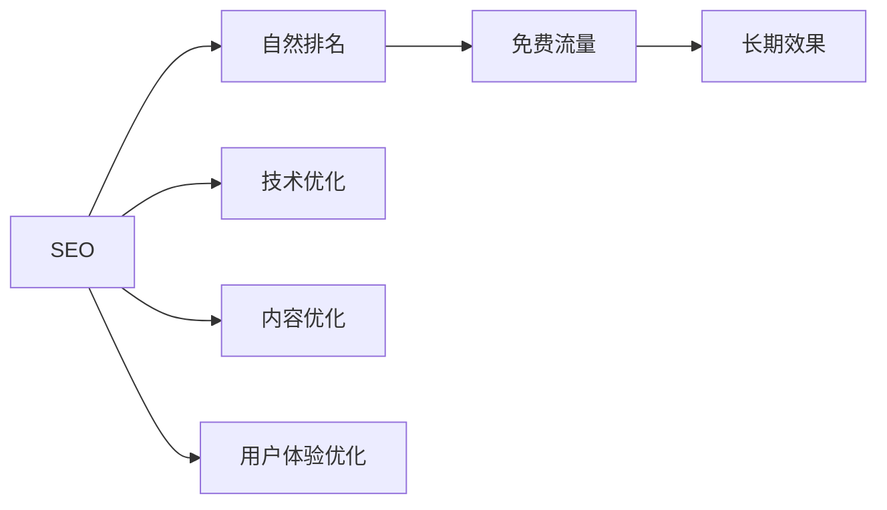

**SEO特点**：
- **免费流量**：通过自然排名获得免费流量
- **长期效果**：一旦获得排名，效果相对稳定
- **需要时间**：通常需要3-6个月才能看到明显效果
- **用户信任度高**：用户更信任自然搜索结果

### SEM（Search Engine Marketing）
**SEM = 搜索引擎营销**

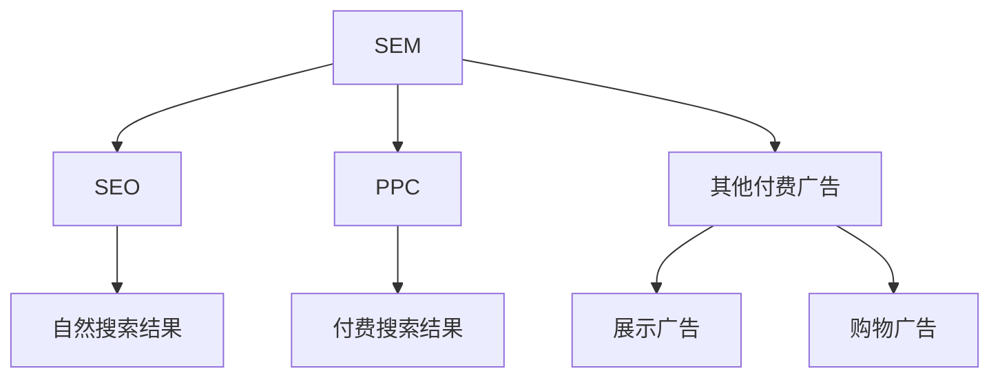

**SEM特点**：
- **综合策略**：包含SEO和付费广告的综合营销策略
- **即时效果**：付费广告可以立即获得流量
- **成本投入**：需要持续的广告投入
- **全面覆盖**：可以覆盖更多搜索场景

### PPC（Pay-Per-Click）
**PPC = 按点击付费广告**

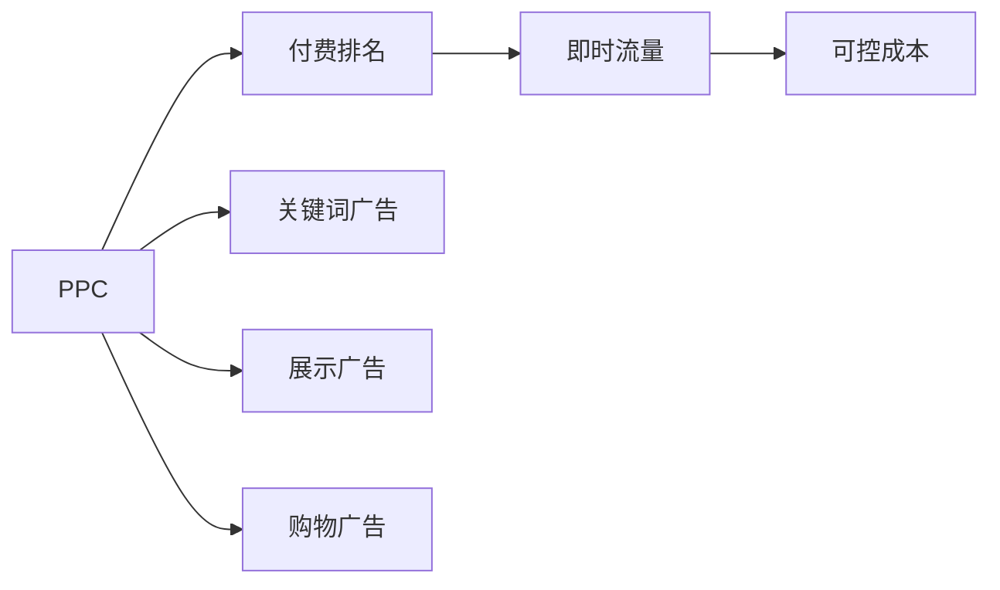

**PPC特点**：
- **付费流量**：通过付费获得搜索结果中的广告位
- **即时效果**：广告上线后立即获得流量
- **成本可控**：可以精确控制广告预算和成本
- **精准定位**：可以精确控制目标用户

## 📊 详细对比分析

### 成本结构对比
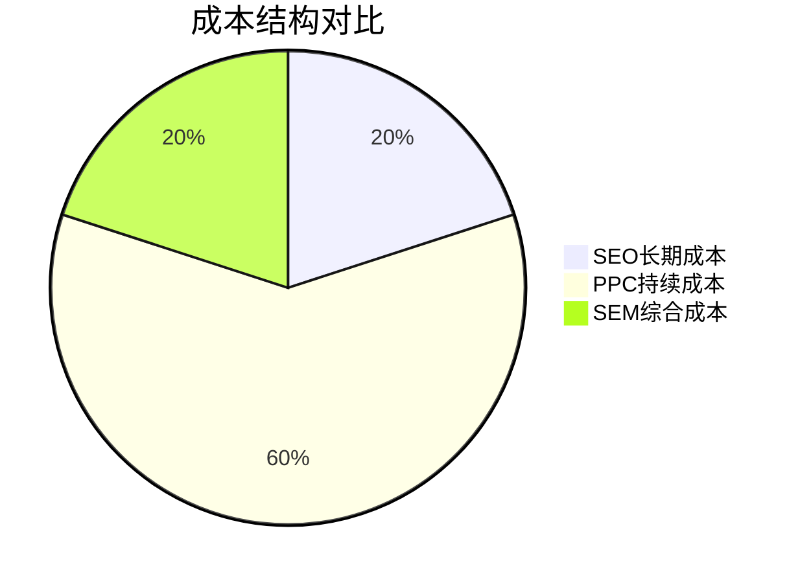

| 方面 | SEO | PPC | SEM |
|------|-----|-----|-----|
| **初期成本** | 低（人力成本） | 高（广告费用） | 中等（综合投入） |
| **长期成本** | 低（维护成本） | 持续高（广告费） | 中等（平衡投入） |
| **成本控制** | 固定预算 | 灵活控制 | 综合控制 |
| **ROI** | 高（300-500%） | 中等（100-200%） | 高（200-400%） |

### 效果时间对比
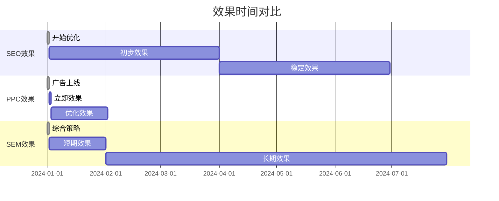

| 方面 | SEO | PPC | SEM |
|------|-----|-----|-----|
| **见效时间** | 3-6个月 | 立即 | 1-2周 |
| **效果持续性** | 长期稳定 | 停止付费即停止 | 长期稳定 |
| **效果稳定性** | 相对稳定 | 受竞争影响 | 综合稳定 |
| **效果可预测性** | 中等 | 高 | 高 |

### 流量质量对比
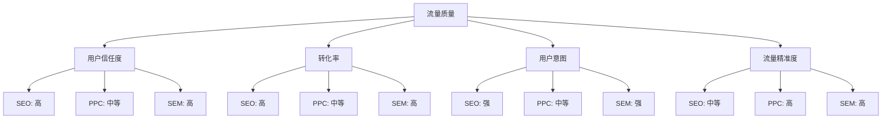

| 方面 | SEO | PPC | SEM |
|------|-----|-----|-----|
| **用户信任度** | 高（自然结果） | 中等（广告标识） | 高（综合策略） |
| **转化率** | 高（精准用户） | 中等（广告用户） | 高（精准定位） |
| **用户意图** | 强（主动搜索） | 中等（被动点击） | 强（主动搜索） |
| **流量精准度** | 中等 | 高 | 高 |

## 🎯 选择策略

### 适合SEO的情况
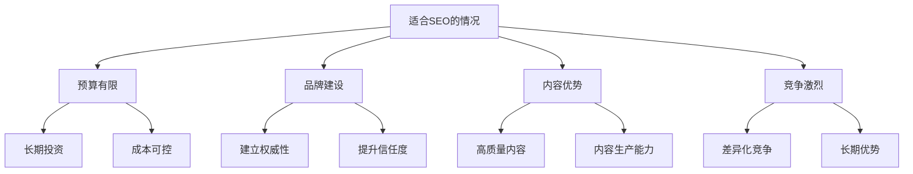

**SEO适用场景**：
- **预算有限**：长期投资，成本可控
- **品牌建设**：建立权威性和信任度
- **内容优势**：有高质量内容生产能力
- **竞争激烈**：需要差异化竞争
- **长期规划**：有长期营销规划

### 适合PPC的情况
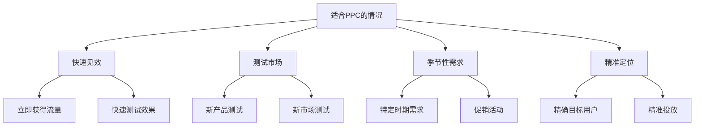

**PPC适用场景**：
- **快速见效**：需要立即获得流量
- **测试市场**：新产品或新市场测试
- **季节性需求**：特定时期的流量需求
- **精准定位**：需要精确的目标用户
- **品牌保护**：保护品牌关键词

### 适合SEM的情况
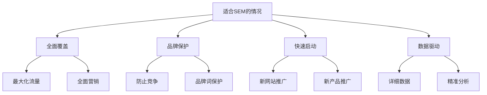

**SEM适用场景**：
- **全面覆盖**：需要最大化搜索引擎流量
- **品牌保护**：防止竞争对手抢占品牌词
- **快速启动**：新网站或新产品推广
- **数据驱动**：需要详细的转化数据
- **资源充足**：有足够的营销预算

## 🔄 整合策略

### SEO + PPC协同策略
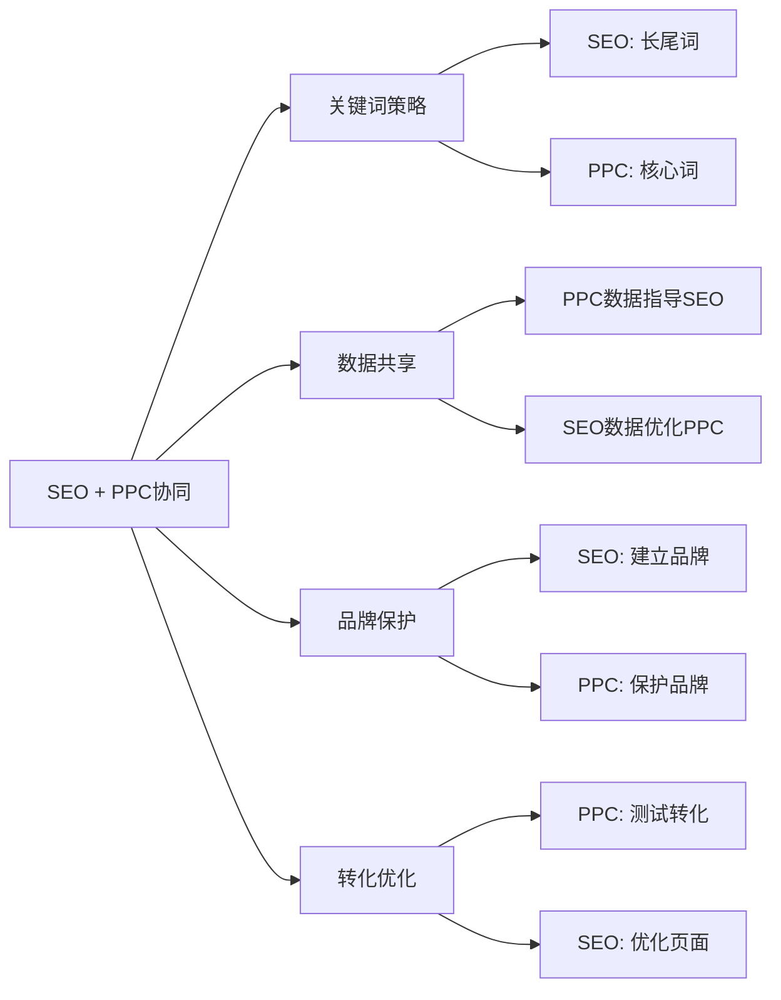

#### 协同策略详解
| 策略类型 | SEO角色 | PPC角色 | 协同效果 |
|---------|---------|---------|----------|
| **关键词策略** | 优化长尾关键词 | 投放核心关键词 | 全面覆盖 |
| **数据共享** | 利用PPC转化数据 | 利用SEO排名数据 | 数据驱动优化 |
| **品牌保护** | 建立品牌权威性 | 保护品牌关键词 | 品牌全面保护 |
| **转化优化** | 优化页面体验 | 测试转化路径 | 转化率提升 |

### 实施建议
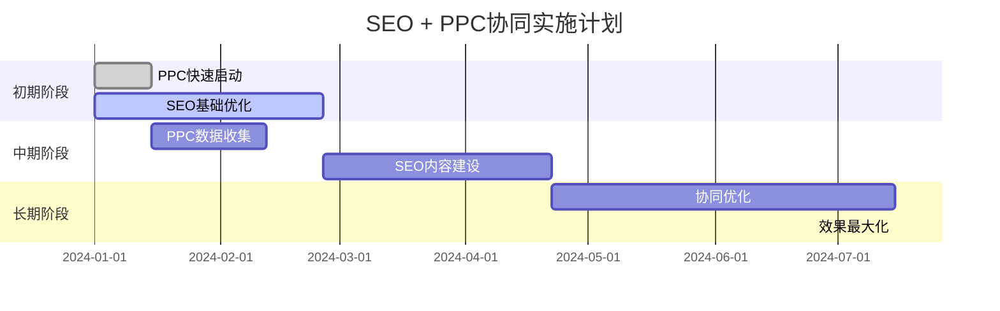

#### 分阶段实施策略
1. **初期（1-3个月）**：
   - PPC快速获得流量和数据
   - SEO进行基础优化和内容建设
   - 建立数据监控体系

2. **中期（3-6个月）**：
   - SEO建设长期流量基础
   - PPC优化转化效果
   - 数据共享和策略调整

3. **长期（6个月以上）**：
   - 两者协同，最大化效果
   - 持续监控和调整策略
   - 建立可持续的营销体系

## 📈 成功案例

### 案例1：电商网站SEO+PPC协同
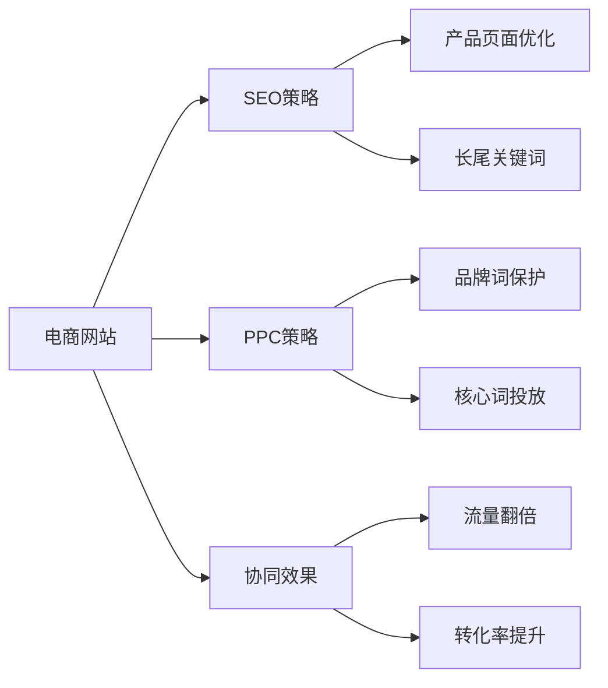

**实施效果**：
- **流量增长**：有机流量增长150%，付费流量增长200%
- **转化率提升**：整体转化率提升80%
- **ROI提升**：营销ROI从200%提升到350%

### 案例2：B2B企业SEO建立权威
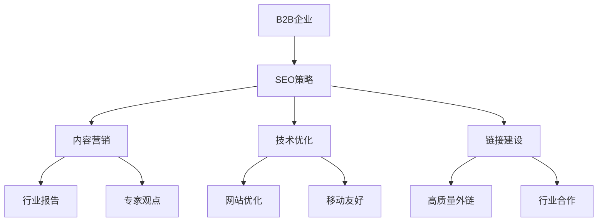

**实施效果**：
- **品牌搜索量**：增长300%
- **行业权威性**：建立行业专家形象
- **销售线索**：质量提升150%

### 案例3：本地服务PPC快速获客
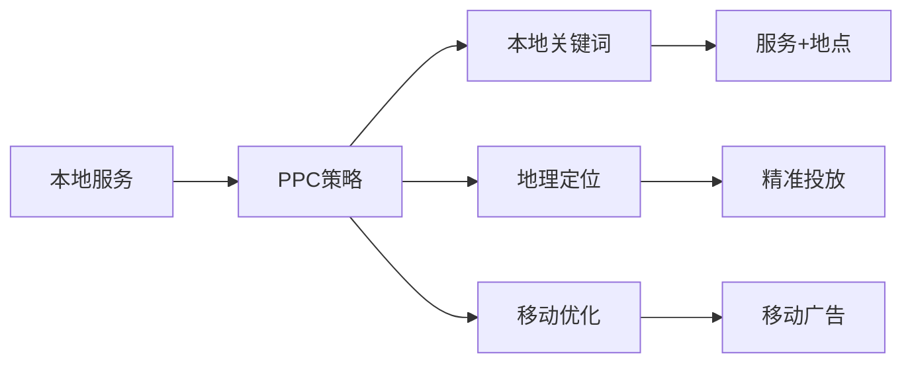

**实施效果**：
- **客户获取**：3个月内获得500+新客户
- **成本控制**：获客成本降低40%
- **转化率**：移动端转化率提升120%

## 🎯 费曼学习法应用

### 用简单语言解释SEO与SEM区别
**向朋友解释**：
"SEO就像是开一家店，通过装修和宣传让顾客自然找到你；PPC就像是花钱在热门地段租广告位，让顾客立即看到你；SEM就是把这两种方法结合起来，既要有自然客流，也要有付费广告。"

### 核心概念简化
1. **SEO = 自然流量，免费但需要时间**
2. **PPC = 付费流量，立即但需要花钱**
3. **SEM = 两者结合，效果最大化**

## 🔗 相关链接

- [[SEO定义与价值]] - 了解SEO的基本概念
- [[SEO核心目标]] - 了解SEO的具体目标
- [[SEO生态系统]] - 了解SEO的生态系统
- [[基础概念速查表]] - 快速查找SEO概念

---

**下一步学习**：了解 [[SEO生态系统]]，理解SEO的完整生态系统
