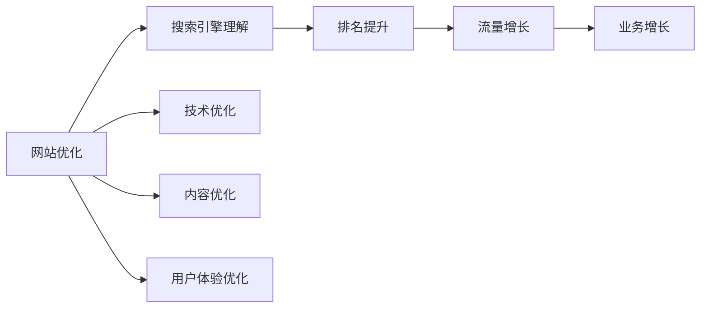
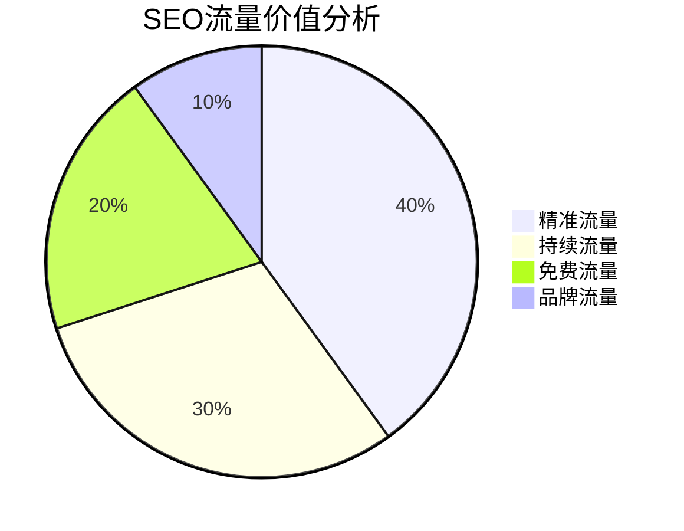
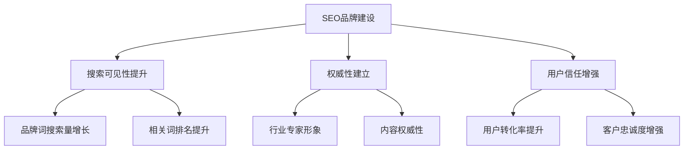
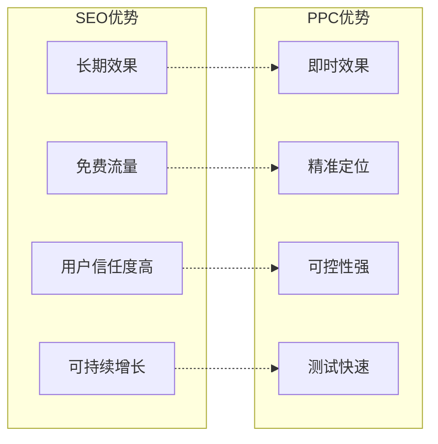
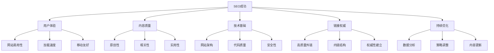
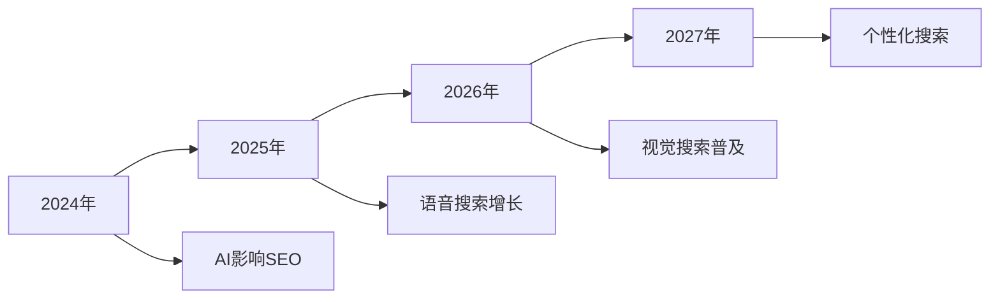

# SEO定义与价值

> **核心理念**：SEO是通过优化网站，让搜索引擎更好地理解和推荐你的内容，从而获得更多精准用户

## 🎯 SEO基本定义

### 什么是SEO
**SEO（Search Engine Optimization）** = 搜索引擎优化



**简单理解**：SEO就是让你的网站在搜索引擎中更容易被找到，排名更靠前。

### SEO的核心要素
| 要素 | 作用 | 重要性 | 示例 |
|------|------|--------|------|
| **技术优化** | 让搜索引擎能够抓取和理解网站 | 基础 | 网站速度、移动友好性 |
| **内容优化** | 提供用户需要的高质量内容 | 核心 | 关键词研究、内容质量 |
| **链接建设** | 建立网站的权威性和信任度 | 重要 | 内链策略、外链获取 |

## 💰 SEO的商业价值

### 流量获取价值


#### 流量类型分析
| 流量类型 | 特点 | 价值 | 获取难度 |
|---------|------|------|----------|
| **自然流量** | 通过搜索引擎获得的免费流量 | 高 | 中等 |
| **精准流量** | 基于用户搜索意图的精准用户 | 极高 | 高 |
| **持续流量** | 长期稳定的流量来源 | 高 | 高 |
| **品牌流量** | 用户主动搜索品牌相关词 | 极高 | 中等 |

### 品牌建设价值
#### 品牌曝光提升
- **搜索结果可见性**：提高品牌在搜索结果中的出现频率
- **权威性建立**：通过高质量内容建立行业权威
- **用户信任度**：搜索引擎排名提升用户对品牌的信任

#### 品牌价值量化


### 成本效益分析
#### ROI对比
| 营销方式 | 初期成本 | 长期成本 | ROI | 可持续性 |
|---------|---------|---------|-----|----------|
| **SEO** | 中等 | 低 | 高 | 高 |
| **PPC** | 高 | 高 | 中等 | 中等 |
| **社交媒体** | 低 | 中等 | 中等 | 中等 |
| **内容营销** | 中等 | 中等 | 高 | 高 |

#### 成本效益公式
```
SEO ROI = (SEO带来的收入 - SEO投入成本) / SEO投入成本 × 100%

典型SEO ROI：300-500%
```

## 🔄 SEO与其他营销方式对比

### SEO vs PPC（付费广告）


| 对比维度 | SEO | PPC | 最佳策略 |
|---------|-----|-----|----------|
| **见效时间** | 3-6个月 | 立即 | 结合使用 |
| **成本结构** | 一次性投入 | 持续付费 | SEO长期，PPC短期 |
| **流量质量** | 高信任度 | 中等信任度 | SEO优先 |
| **可控性** | 中等 | 高 | PPC测试，SEO优化 |

### SEO vs 社交媒体营销
| 对比维度 | SEO | 社交媒体 | 整合策略 |
|---------|-----|----------|----------|
| **用户意图** | 主动搜索 | 被动浏览 | 互补 |
| **转化率** | 高 | 中等 | SEO转化，社交传播 |
| **内容形式** | 文字为主 | 多媒体 | 内容复用 |
| **算法依赖** | 搜索引擎算法 | 社交平台算法 | 分散风险 |

## 🎯 SEO成功的关键因素

### 成功要素金字塔


### 关键因素详解
#### 1. 用户体验（最重要）
- **网站易用性**：导航清晰、布局合理
- **加载速度**：页面加载时间 < 3秒
- **移动友好**：适配所有设备
- **内容可读性**：字体、颜色、排版

#### 2. 内容质量（核心）
- **原创性**：100%原创内容
- **相关性**：与目标关键词高度相关
- **实用性**：解决用户实际问题
- **完整性**：内容完整、深度足够

#### 3. 技术基础（基础）
- **网站架构**：清晰的URL结构、导航
- **代码质量**：符合Web标准
- **安全性**：HTTPS、数据保护
- **可访问性**：搜索引擎可抓取

#### 4. 链接权威（重要）
- **高质量外链**：来自权威网站
- **内链结构**：合理的内部链接
- **权威性建立**：行业专家形象
- **信任度提升**：用户信任度

#### 5. 持续优化（关键）
- **数据分析**：定期分析SEO数据
- **策略调整**：根据数据调整策略
- **内容更新**：持续更新内容
- **技术升级**：跟上技术发展

## 📊 SEO价值量化

### 流量价值计算
```
SEO流量价值 = 月访问量 × 平均转化率 × 客单价

示例：
- 月访问量：10,000
- 平均转化率：2%
- 客单价：500元
- SEO流量价值 = 10,000 × 2% × 500 = 100,000元/月
```

### 品牌价值提升
| 指标 | 优化前 | 优化后 | 提升幅度 |
|------|--------|--------|----------|
| **品牌搜索量** | 1,000/月 | 5,000/月 | 400% |
| **品牌提及** | 100/月 | 500/月 | 400% |
| **用户信任度** | 60% | 85% | 42% |
| **转化率** | 1.5% | 3.2% | 113% |

## 🚀 SEO发展趋势

### 未来价值预测


### 价值增长趋势
- **搜索量增长**：全球搜索量每年增长10-15%
- **移动搜索**：移动搜索占比超过70%
- **语音搜索**：语音搜索快速增长
- **本地搜索**：本地搜索需求增加

## 🎯 费曼学习法应用

### 用简单语言解释SEO
**向朋友解释**：
"SEO就像是给你的网站做广告，但不是花钱买广告位，而是通过优化网站内容和技术，让搜索引擎觉得你的网站很好，然后免费推荐给用户。"

### 核心概念简化
1. **SEO = 让搜索引擎喜欢你**
2. **目标 = 在搜索结果中排名靠前**
3. **方法 = 优化网站内容和技术**
4. **结果 = 获得更多免费流量**

## 🔗 相关链接

- [[SEO核心目标]] - 了解SEO的具体目标
- [[SEO与SEM区别]] - 区分SEO和其他营销方式
- [[SEO生态系统]] - 了解SEO的生态系统
- [[基础概念速查表]] - 快速查找SEO概念

---

**下一步学习**：了解 [[SEO核心目标]]，明确SEO的具体目标
