# SEO核心目标

> **核心理念**：SEO的目标不仅仅是排名，而是通过优化获得更多精准用户，实现业务增长

## 🎯 SEO的三大核心目标

### 1. 流量获取
#### 自然流量增长
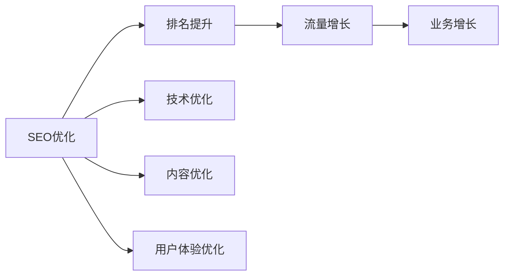

| 目标 | 指标 | 策略 | 预期效果 |
|------|------|------|----------|
| **提高自然搜索流量** | 有机流量增长 | 关键词优化、内容营销 | 流量增长50-200% |
| **提升关键词排名** | 前10名关键词数量 | 技术优化、内容建设 | 排名提升3-5位 |
| **增加点击率** | CTR > 3% | 标题优化、描述优化 | 点击率提升100% |

#### 精准流量获取
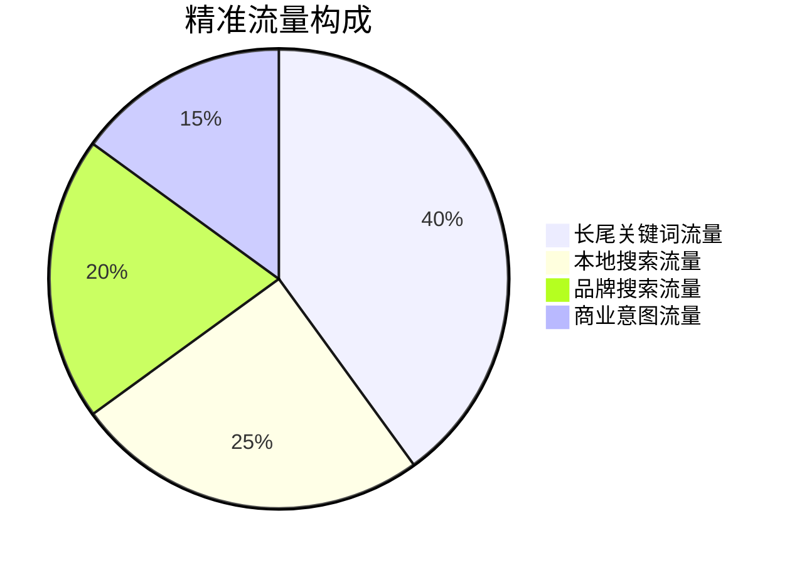

**精准流量特点**：
- **高转化率**：用户搜索意图明确，转化率更高
- **低成本**：相比付费广告，获客成本更低
- **可持续**：一旦获得排名，流量相对稳定
- **可扩展**：通过长尾关键词持续扩展流量

### 2. 品牌建设
#### 品牌曝光提升
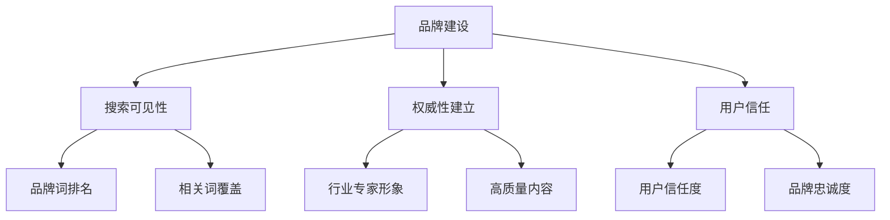

**品牌建设策略**：
- **品牌关键词优化**：优化品牌相关关键词排名
- **内容营销**：创建高质量品牌内容
- **PR建设**：通过媒体报道提升品牌知名度
- **社交媒体整合**：整合社交媒体提升品牌影响力

#### 权威性建立
| 权威性指标 | 优化方法 | 预期效果 |
|-----------|----------|----------|
| **行业专家形象** | 专业内容、专家观点 | 行业认可度提升 |
| **内容权威性** | 深度内容、原创研究 | 用户信任度提升 |
| **媒体提及** | 媒体报道、行业报告 | 品牌知名度提升 |
| **用户评价** | 用户评价、案例展示 | 社会证明增强 |

### 3. 转化优化
#### 转化率提升
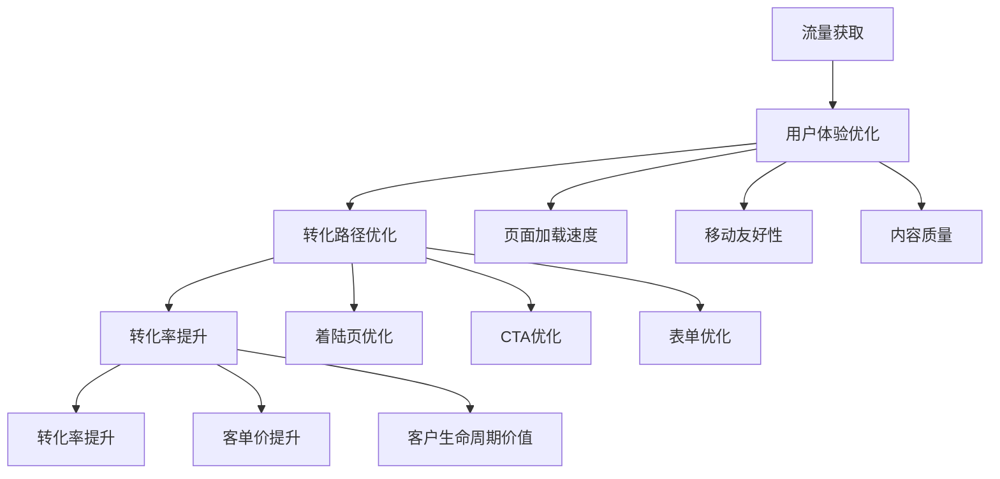

**转化优化策略**：
- **着陆页优化**：优化转化页面的用户体验
- **CTA优化**：优化行动号召按钮和文案
- **表单优化**：简化表单流程，提高提交率
- **信任信号**：添加信任信号和保障信息

#### 业务增长
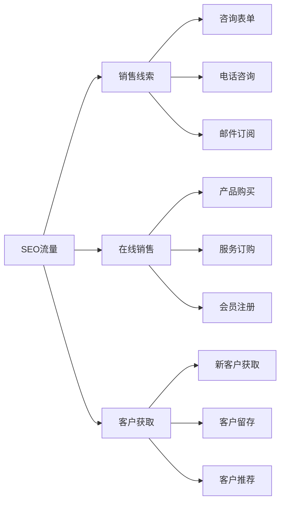

## 📊 SEO目标设定原则

### SMART原则应用
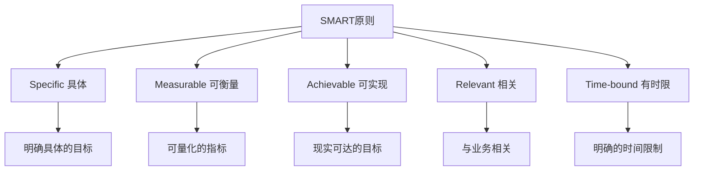

#### SMART目标示例
| 目标类型 | 具体目标 | 可衡量指标 | 可实现性 | 相关性 | 时间限制 |
|---------|---------|-----------|----------|--------|----------|
| **流量目标** | 提高有机流量 | 月流量增长50% | 基于现有基础 | 业务增长相关 | 6个月内 |
| **排名目标** | 提升关键词排名 | 10个关键词进入前10 | 竞争度适中 | SEO效果相关 | 3个月内 |
| **转化目标** | 提高转化率 | 转化率提升30% | 通过优化实现 | 业务价值相关 | 4个月内 |

### 目标优先级矩阵
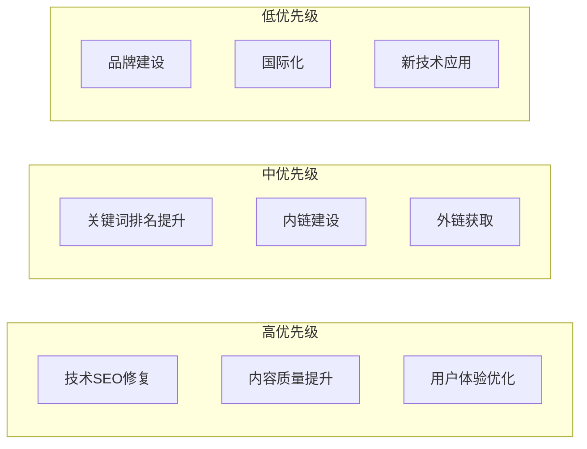

#### 优先级设定标准
- **高优先级**：直接影响排名和用户体验的问题
- **中优先级**：有助于提升SEO效果的措施
- **低优先级**：长期品牌建设和扩展性工作

## 🏢 不同行业的SEO目标差异

### 电商网站SEO目标
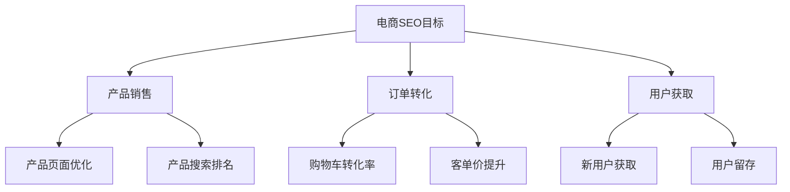

| 目标 | 关键指标 | 优化重点 | 预期效果 |
|------|---------|---------|----------|
| **产品销售** | 产品页面流量、转化率 | 产品页面SEO优化 | 销售额增长 |
| **订单转化** | 购物车转化率、客单价 | 转化路径优化 | 转化率提升 |
| **用户获取** | 新用户数量、获客成本 | 精准流量获取 | 用户增长 |

### 企业官网SEO目标
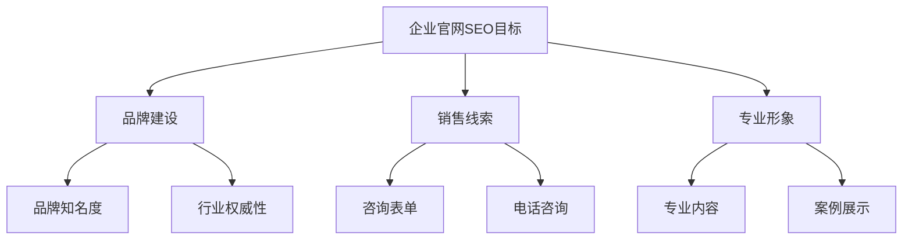

| 目标 | 关键指标 | 优化重点 | 预期效果 |
|------|---------|---------|----------|
| **品牌建设** | 品牌搜索量、提及量 | 品牌内容建设 | 品牌知名度提升 |
| **销售线索** | 咨询表单、电话咨询 | 着陆页优化 | 线索质量提升 |
| **专业形象** | 行业关键词排名 | 专业内容创作 | 行业地位提升 |

### 内容网站SEO目标
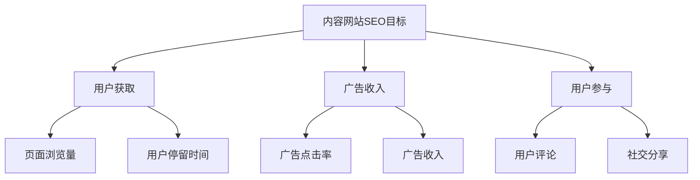

| 目标 | 关键指标 | 优化重点 | 预期效果 |
|------|---------|---------|----------|
| **用户获取** | 页面浏览量、用户数 | 内容SEO优化 | 用户增长 |
| **广告收入** | 广告点击率、收入 | 用户体验优化 | 收入增长 |
| **用户参与** | 评论、分享、订阅 | 内容质量提升 | 用户粘性提升 |

### 本地服务SEO目标
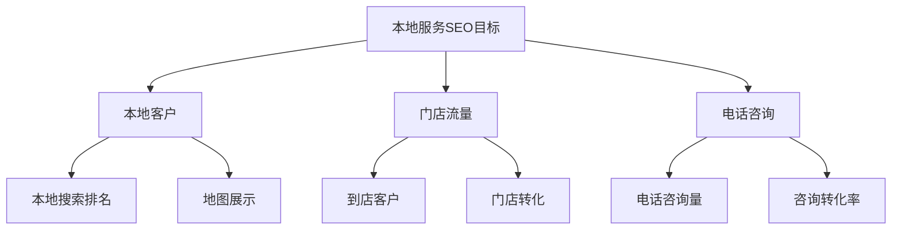

| 目标 | 关键指标 | 优化重点 | 预期效果 |
|------|---------|---------|----------|
| **本地客户** | 本地搜索排名、地图展示 | 本地SEO优化 | 本地客户增长 |
| **门店流量** | 到店客户、门店转化 | 本地内容优化 | 门店业绩提升 |
| **电话咨询** | 咨询量、转化率 | 联系信息优化 | 业务咨询增长 |

## 📈 目标达成策略

### 短期目标策略（1-3个月）
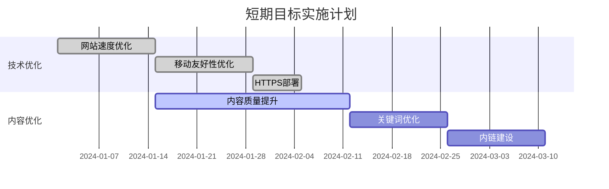

**短期目标重点**：
- **技术问题修复**：解决影响排名的技术问题
- **基础优化**：完成基础的SEO优化工作
- **内容质量**：提升现有内容的质量

### 中期目标策略（3-6个月）
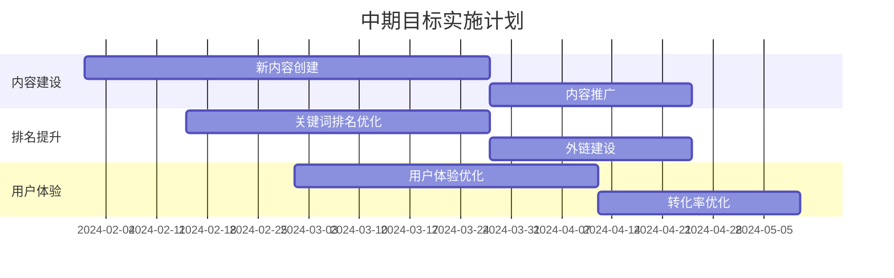

**中期目标重点**：
- **内容建设**：创建高质量的新内容
- **排名提升**：提升关键词排名
- **用户体验**：优化用户体验和转化率

### 长期目标策略（6-12个月）
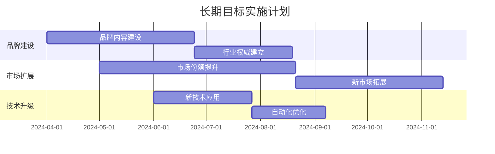

**长期目标重点**：
- **品牌建设**：建立行业权威和品牌影响力
- **市场扩展**：提升市场份额，拓展新市场
- **技术升级**：应用新技术，提升竞争优势

## 🎯 费曼学习法应用

### 用简单语言解释SEO目标
**向朋友解释**：
"SEO的目标就像是开一家店，你要让更多顾客找到你的店（流量获取），让顾客信任你的品牌（品牌建设），然后让顾客买东西（转化优化）。"

### 核心目标简化
1. **流量获取 = 让更多人找到你**
2. **品牌建设 = 让更多人信任你**
3. **转化优化 = 让更多人买你的东西**

## 🔗 相关链接

- [[SEO定义与价值]] - 了解SEO的基本概念和价值
- [[SEO与SEM区别]] - 区分SEO和其他营销方式
- [[SEO生态系统]] - 了解SEO的生态系统
- [[基础概念速查表]] - 快速查找SEO概念

---

**下一步学习**：了解 [[SEO与SEM区别]]，明确SEO在营销体系中的位置
