# SEO生态系统

> **核心理念**：SEO是一个复杂的生态系统，涉及搜索引擎、网站、用户、竞争对手等多个参与方，理解这个生态系统是SEO成功的关键

## 🌐 SEO生态系统概述

### 什么是SEO生态系统
**SEO生态系统** = 搜索引擎 + 网站 + 用户 + 竞争对手 + 工具 + 服务商

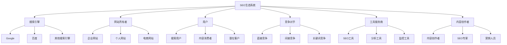

**简单理解**：SEO生态系统就像是一个复杂的市场，搜索引擎是"市场管理者"，网站是"商家"，用户是"顾客"，大家在这个市场中相互影响、相互竞争。

## 🔍 生态系统参与者

### 1. 搜索引擎
#### 主要搜索引擎分布
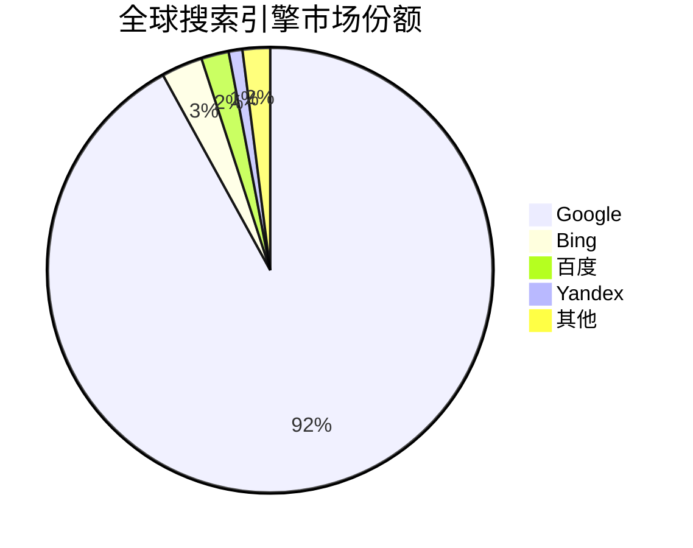

#### 搜索引擎角色分析
| 搜索引擎 | 市场份额 | 主要市场 | 特点 | SEO重点 |
|---------|---------|---------|------|---------|
| **Google** | 92% | 全球 | 算法复杂、技术先进 | 用户体验、内容质量 |
| **百度** | 2% | 中国 | 中文优化、本土化 | 中文内容、本地化 |
| **Bing** | 3% | 企业市场 | 微软生态、企业友好 | 技术SEO、结构化数据 |
| **Yandex** | 1% | 俄罗斯 | 俄语优化、本地化 | 俄语内容、本地SEO |

#### 搜索引擎职责
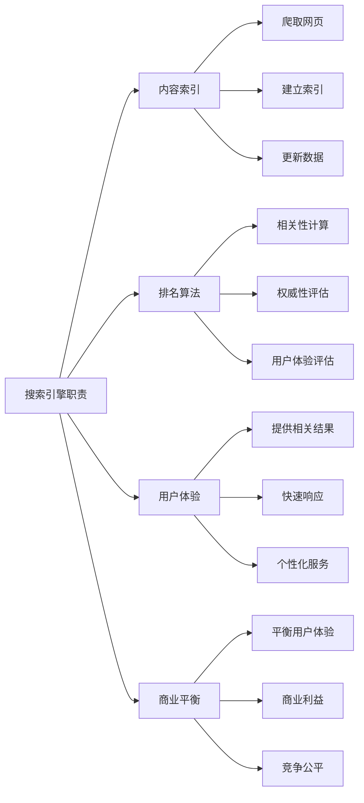

### 2. 网站所有者
#### 网站类型分析
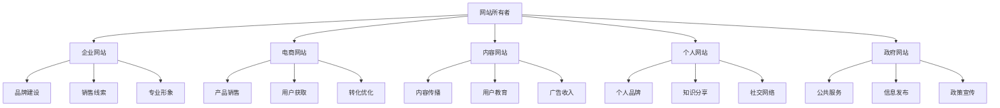

#### 网站所有者目标
| 网站类型 | 主要目标 | SEO策略 | 关键指标 |
|---------|---------|---------|----------|
| **企业网站** | 品牌建设、销售线索 | 品牌SEO、内容营销 | 品牌搜索量、咨询量 |
| **电商网站** | 产品销售、用户获取 | 产品SEO、转化优化 | 产品流量、转化率 |
| **内容网站** | 用户获取、广告收入 | 内容SEO、用户体验 | 页面浏览量、用户停留 |
| **个人网站** | 个人品牌、知识分享 | 个人品牌SEO | 个人知名度、影响力 |

### 3. 用户
#### 用户行为分析
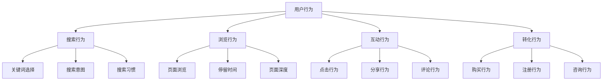

#### 用户需求层次
| 需求层次 | 用户行为 | SEO策略 | 内容类型 |
|---------|---------|---------|----------|
| **信息需求** | 寻求信息、学习知识 | 信息型关键词优化 | 教程、指南、解释 |
| **导航需求** | 寻找特定网站 | 品牌SEO、导航优化 | 品牌页面、导航页面 |
| **交易需求** | 购买产品或服务 | 交易型关键词优化 | 产品页面、服务页面 |
| **商业需求** | 比较选择 | 商业型关键词优化 | 比较页面、评测内容 |

### 4. 竞争对手
#### 竞争类型分析
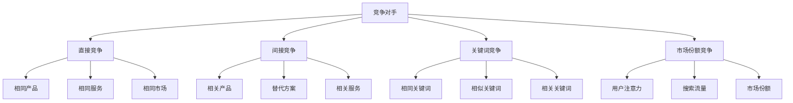

#### 竞争策略
| 竞争类型 | 竞争重点 | 策略方法 | 成功要素 |
|---------|---------|---------|----------|
| **直接竞争** | 相同关键词排名 | 内容质量、技术优化 | 差异化、专业化 |
| **间接竞争** | 相关关键词覆盖 | 内容扩展、长尾关键词 | 创新、独特价值 |
| **关键词竞争** | 关键词排名 | 关键词优化、内容建设 | 相关性、权威性 |
| **市场份额竞争** | 用户获取 | 品牌建设、用户体验 | 品牌影响力、用户忠诚 |

## 🔄 生态系统关系

### 搜索引擎与网站关系
#### 互利共生关系
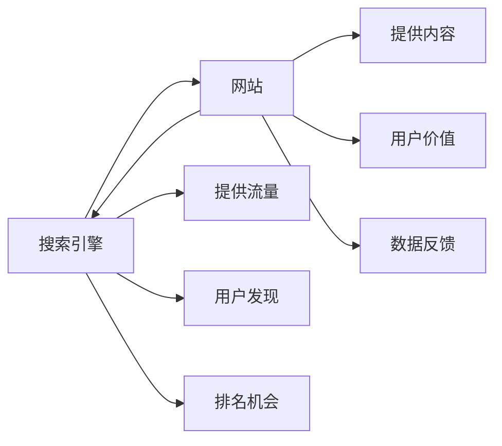

#### 关系特点
- **互利性**：搜索引擎需要内容，网站需要流量
- **动态性**：关系随算法更新而变化
- **竞争性**：网站间竞争搜索引擎的青睐
- **依赖性**：网站依赖搜索引擎获得流量

### 网站与用户关系
#### 价值交换关系
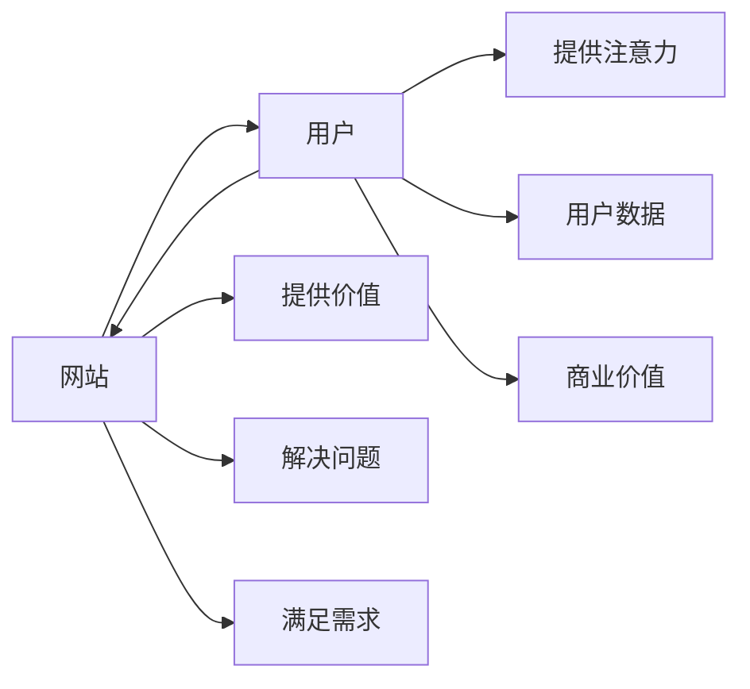

#### 关系优化
- **价值提供**：网站提供用户真正需要的价值
- **用户体验**：优化用户体验提升满意度
- **信任建立**：通过高质量内容建立用户信任
- **长期关系**：建立长期用户关系

### 竞争对手关系
#### 竞争与合作
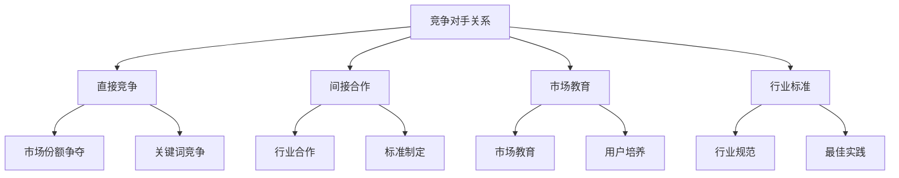

## 🌍 生态系统影响因素

### 技术因素
#### 技术发展趋势
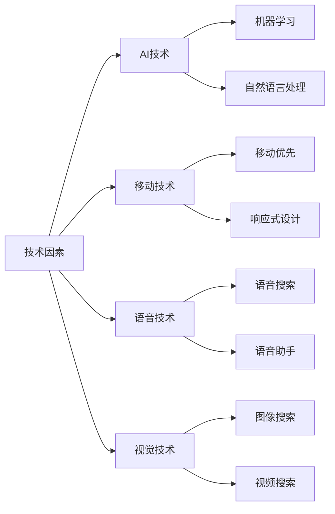

#### 技术影响分析
| 技术趋势 | 对SEO的影响 | 应对策略 | 未来展望 |
|---------|------------|----------|----------|
| **AI技术** | 算法更智能、个性化 | 内容质量、用户体验 | 高度个性化 |
| **移动技术** | 移动优先索引 | 移动优化、响应式设计 | 移动主导 |
| **语音技术** | 语音搜索增长 | 自然语言优化 | 语音搜索普及 |
| **视觉技术** | 图像视频搜索 | 多媒体内容优化 | 视觉搜索发展 |

### 市场因素
#### 市场环境变化
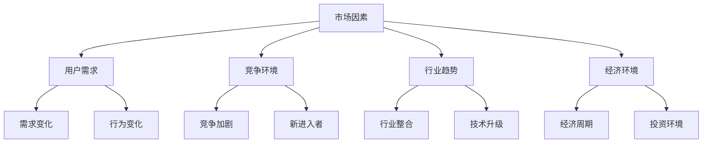

### 社会因素
#### 社会环境影响
| 社会因素 | 对SEO的影响 | 应对策略 | 重要性 |
|---------|------------|----------|--------|
| **文化差异** | 不同地区文化影响搜索行为 | 本地化、文化适配 | 高 |
| **语言差异** | 多语言SEO复杂性 | 多语言优化、翻译质量 | 高 |
| **法律法规** | 隐私保护、数据安全法规 | 合规性、数据保护 | 中 |
| **社会趋势** | 社会价值观变化影响内容 | 内容策略调整 | 中 |

## 🎯 生态系统优化策略

### 对搜索引擎优化
#### 技术优化
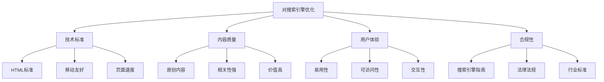

#### 优化策略
- **技术标准**：遵循搜索引擎技术标准
- **内容质量**：提供高质量、原创内容
- **用户体验**：优化用户体验指标
- **合规性**：遵守搜索引擎指南和法规

### 对用户优化
#### 用户需求满足
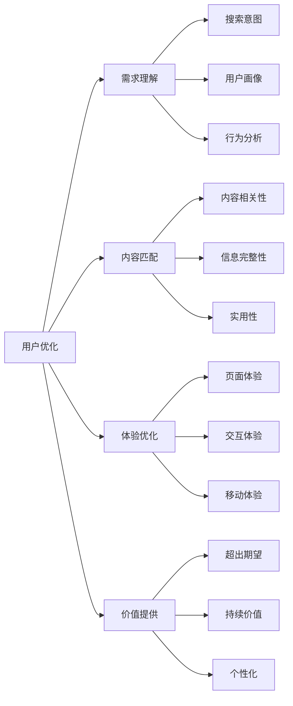

### 对竞争对手策略
#### 竞争分析
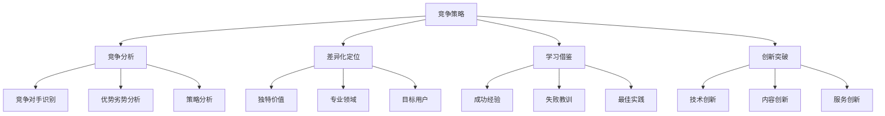

## 📊 生态系统监控

### 监控维度
#### 多维度监控
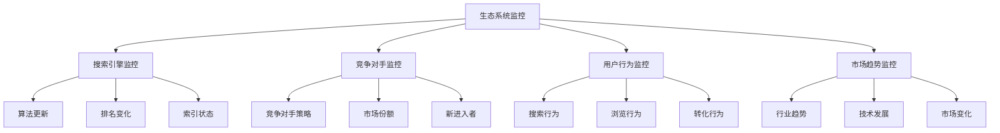

### 监控工具
| 监控类型 | 工具推荐 | 监控内容 | 监控频率 |
|---------|---------|---------|----------|
| **搜索引擎** | Google Search Console | 排名、索引、错误 | 每日 |
| **竞争对手** | Ahrefs、SEMrush | 关键词、流量、策略 | 每周 |
| **用户行为** | Google Analytics | 流量、行为、转化 | 每日 |
| **市场趋势** | Google Trends | 搜索趋势、热点 | 每周 |

## 🎯 费曼学习法应用

### 用简单语言解释SEO生态系统
**向朋友解释**：
"SEO生态系统就像是一个大市场，搜索引擎是市场管理员，网站是商家，用户是顾客，竞争对手是其他商家。大家在这个市场中相互影响，你要做的就是了解这个市场的规则，提供好的商品（内容），让顾客（用户）满意，管理员（搜索引擎）就会给你更好的位置。"

### 核心概念简化
1. **生态系统 = 相互影响的复杂网络**
2. **搜索引擎 = 市场管理员**
3. **网站 = 商家**
4. **用户 = 顾客**
5. **竞争对手 = 其他商家**

## 🔗 相关链接

- [[SEO定义与价值]] - 了解SEO的基本概念
- [[SEO核心目标]] - 了解SEO的具体目标
- [[SEO与SEM区别]] - 区分SEO和其他营销方式
- [[基础概念速查表]] - 快速查找SEO概念

---

**下一步学习**：查看 [[基础概念速查表]]，快速掌握SEO核心概念