# 搜索引擎发展趋势

> **核心理念**：了解搜索引擎技术发展脉络，把握未来趋势，为SEO策略制定提供前瞻性指导

## 🌍 当前搜索引擎发展现状

### 全球市场格局
#### 市场份额分布
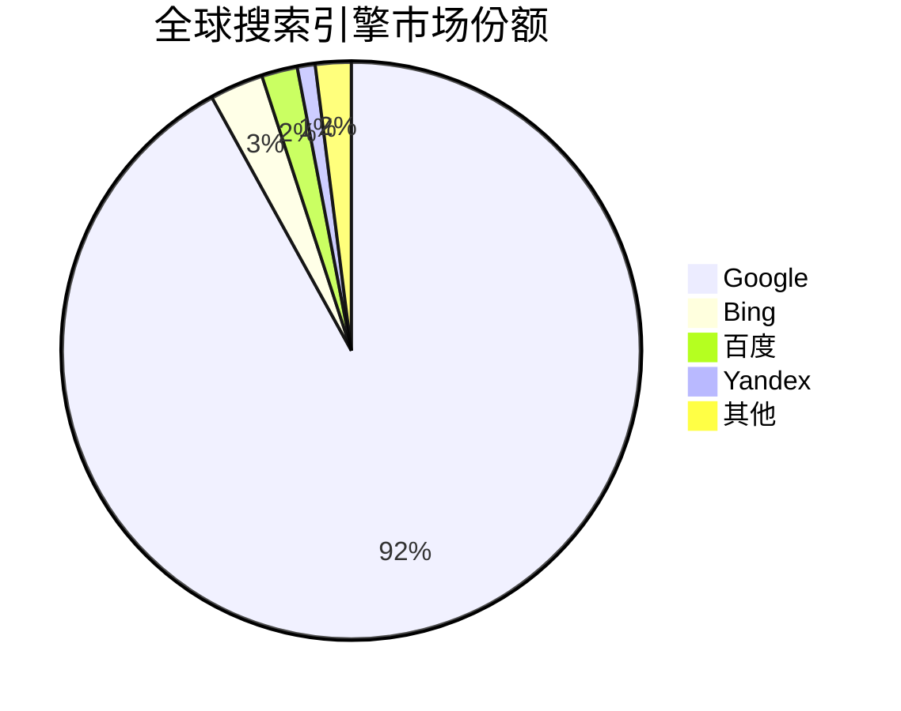

#### 主要搜索引擎特点
| 搜索引擎 | 市场份额 | 技术特点 | 主要优势 |
|---------|---------|---------|---------|
| **Google** | 92% | AI技术领先、全球化 | 技术先进、覆盖面广 |
| **百度** | 2% | 中文搜索、AI应用 | 中文理解、本土化 |
| **Bing** | 3% | 企业集成、AI助手 | 企业市场、生态整合 |
| **Yandex** | 1% | 俄语搜索、本土化 | 俄语市场、本地优势 |
| **DuckDuckGo** | <1% | 隐私保护、无追踪 | 隐私优先、差异化 |

### 技术发展特点
#### 核心技术趋势
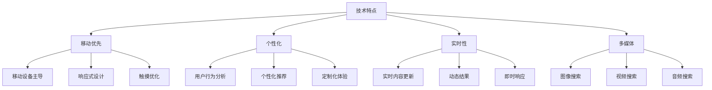

#### 技术特点分析
| 技术特点 | 发展程度 | 影响范围 | SEO重要性 |
|---------|---------|---------|----------|
| **移动优先** | 成熟 | 全球 | 极高 |
| **个性化** | 发展中 | 主要市场 | 高 |
| **实时性** | 快速发展 | 特定领域 | 中 |
| **多媒体** | 快速发展 | 内容领域 | 高 |

## 🤖 技术发展趋势

### 人工智能与机器学习
#### AI技术架构
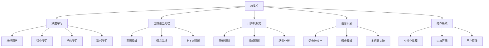

#### AI技术发展
| 技术领域 | 当前水平 | 发展趋势 | SEO影响 |
|---------|---------|---------|---------|
| **自然语言处理** | 成熟 | 深度理解、多语言 | 极高 |
| **计算机视觉** | 快速发展 | 实时识别、场景理解 | 高 |
| **语音识别** | 成熟 | 多语言、噪音处理 | 中 |
| **推荐系统** | 成熟 | 个性化、实时推荐 | 高 |

#### 算法演进趋势
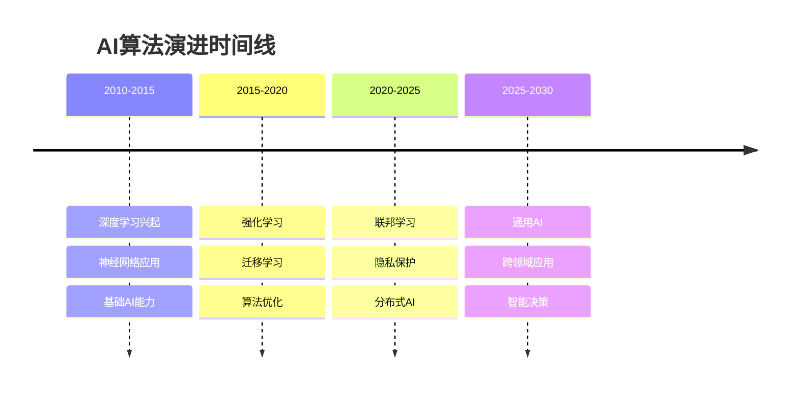

### 语音搜索技术
#### 语音技术架构
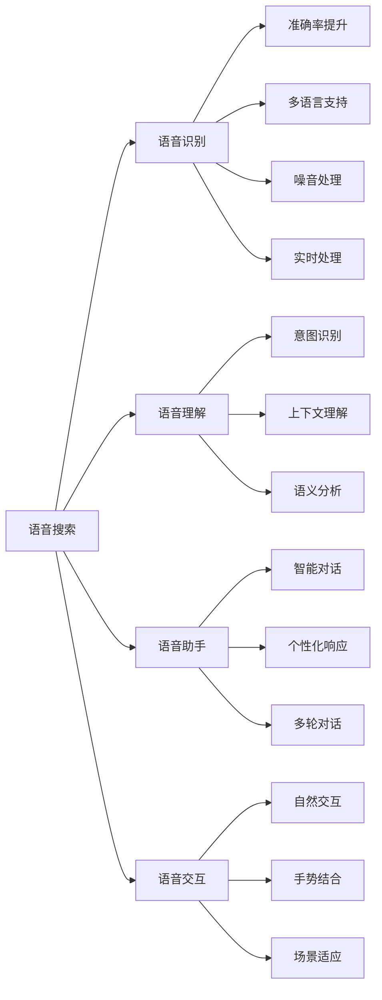

#### 语音搜索发展
| 技术方面 | 发展水平 | 主要挑战 | SEO机会 |
|---------|---------|---------|---------|
| **语音识别** | 成熟 | 多语言、噪音 | 语音优化 |
| **语音理解** | 发展中 | 复杂查询、上下文 | 对话式内容 |
| **语音助手** | 快速发展 | 个性化、多轮对话 | 智能交互 |
| **语音交互** | 发展中 | 自然性、场景适应 | 用户体验 |

### 视觉搜索技术
#### 视觉技术架构
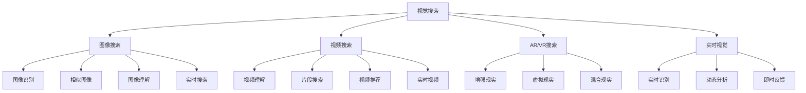

#### 视觉搜索发展
| 技术领域 | 发展水平 | 主要应用 | SEO机会 |
|---------|---------|---------|---------|
| **图像搜索** | 成熟 | 商品识别、场景搜索 | 图像优化 |
| **视频搜索** | 快速发展 | 内容理解、片段搜索 | 视频SEO |
| **AR/VR搜索** | 发展中 | 沉浸式体验、空间搜索 | 新体验优化 |
| **实时视觉** | 发展中 | 实时识别、动态分析 | 实时内容 |

### 新兴搜索技术
#### 技术发展趋势
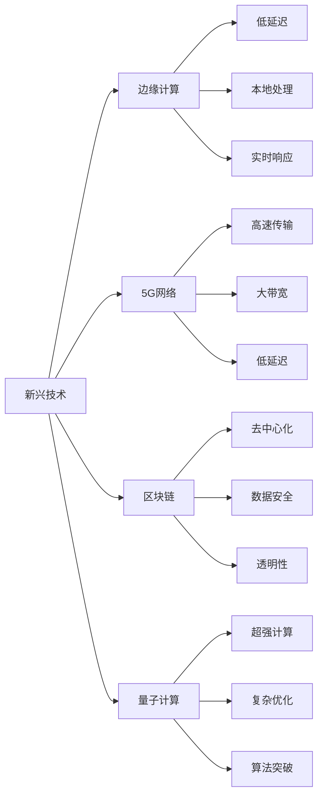

#### 新兴技术影响
| 技术类型 | 发展程度 | 预期影响 | SEO准备 |
|---------|---------|---------|---------|
| **边缘计算** | 发展中 | 响应速度提升 | 性能优化 |
| **5G网络** | 快速发展 | 移动体验提升 | 移动优化 |
| **区块链** | 早期 | 数据安全、去中心化 | 安全优化 |
| **量子计算** | 研究阶段 | 算法突破 | 长期规划 |

## 👥 用户体验发展趋势

### 搜索界面演进
#### 交互方式发展
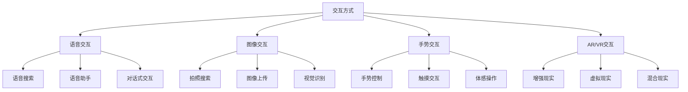

#### 结果展示演进
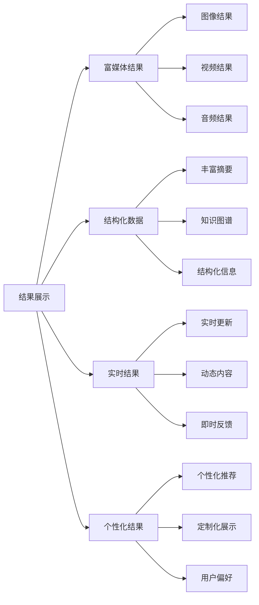

#### 用户体验趋势
| 体验方面 | 发展趋势 | 技术支撑 | SEO影响 |
|---------|---------|---------|---------|
| **交互方式** | 多模态、自然化 | AI、AR/VR | 交互优化 |
| **结果展示** | 富媒体、个性化 | 结构化数据、AI | 内容优化 |
| **响应速度** | 实时、即时 | 边缘计算、5G | 性能优化 |
| **个性化** | 深度定制 | 机器学习、用户画像 | 用户体验 |

### 搜索场景扩展
#### 垂直搜索发展
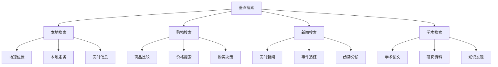

#### 跨平台搜索发展
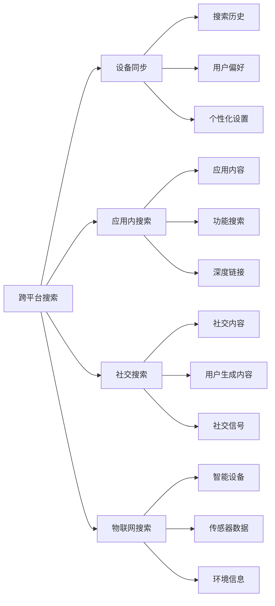

#### 搜索场景分析
| 搜索场景 | 发展程度 | 主要特点 | SEO机会 |
|---------|---------|---------|---------|
| **本地搜索** | 成熟 | 地理位置、实时性 | 本地SEO |
| **购物搜索** | 成熟 | 商品比较、购买决策 | 电商SEO |
| **新闻搜索** | 快速发展 | 实时性、时效性 | 新闻SEO |
| **学术搜索** | 发展中 | 专业性、权威性 | 学术SEO |
| **跨平台搜索** | 发展中 | 无缝体验、数据同步 | 全平台优化 |

## 💰 商业模式发展趋势

### 广告模式创新
#### 广告技术发展
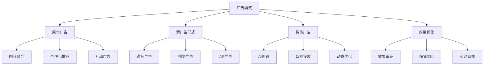

#### 广告模式分析
| 广告类型 | 发展程度 | 主要特点 | SEO影响 |
|---------|---------|---------|---------|
| **原生广告** | 成熟 | 内容融合、用户体验 | 内容营销 |
| **语音广告** | 发展中 | 语音交互、自然融入 | 语音优化 |
| **视觉广告** | 快速发展 | 图像视频、视觉冲击 | 视觉内容 |
| **AR广告** | 早期 | 沉浸式体验、互动性 | 新体验优化 |

### 数据价值挖掘
#### 数据应用架构
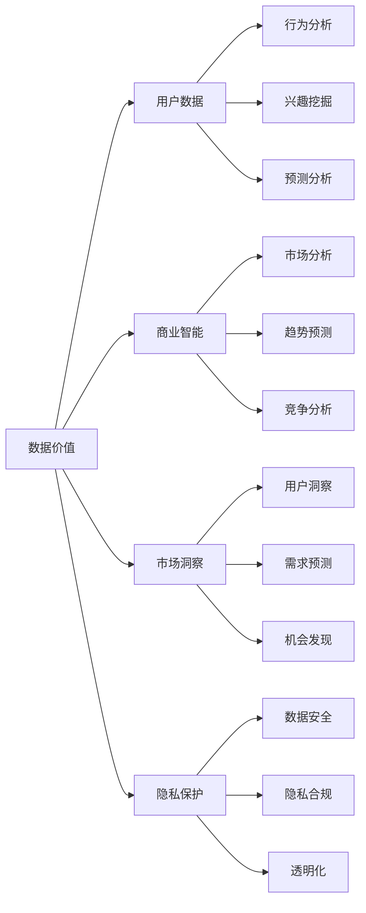

#### 数据价值分析
| 数据应用 | 价值程度 | 主要用途 | SEO机会 |
|---------|---------|---------|---------|
| **用户行为分析** | 极高 | 个性化、优化体验 | 用户行为优化 |
| **市场洞察** | 高 | 趋势预测、机会发现 | 市场策略 |
| **竞争分析** | 高 | 竞争情报、策略制定 | 竞争策略 |
| **隐私保护** | 中 | 合规、用户信任 | 信任建设 |

### 商业模式演进
#### 商业模式趋势
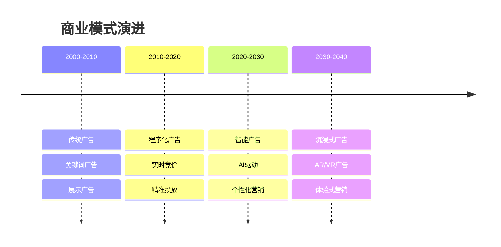

#### 商业模式对比
| 商业模式 | 发展阶段 | 主要特点 | 技术支撑 |
|---------|---------|---------|---------|
| **传统广告** | 成熟 | 标准化、大规模 | 基础技术 |
| **程序化广告** | 成熟 | 自动化、精准化 | 大数据、算法 |
| **智能广告** | 发展中 | AI驱动、个性化 | AI、机器学习 |
| **沉浸式广告** | 早期 | 体验式、互动性 | AR/VR、5G |

## ⚖️ 挑战与机遇

### 主要挑战分析
#### 技术挑战
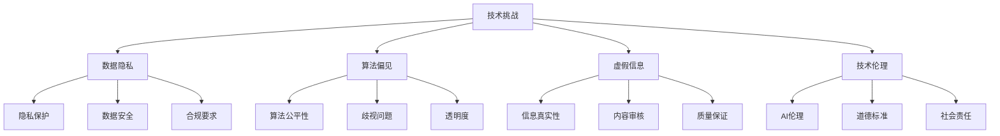

#### 商业挑战
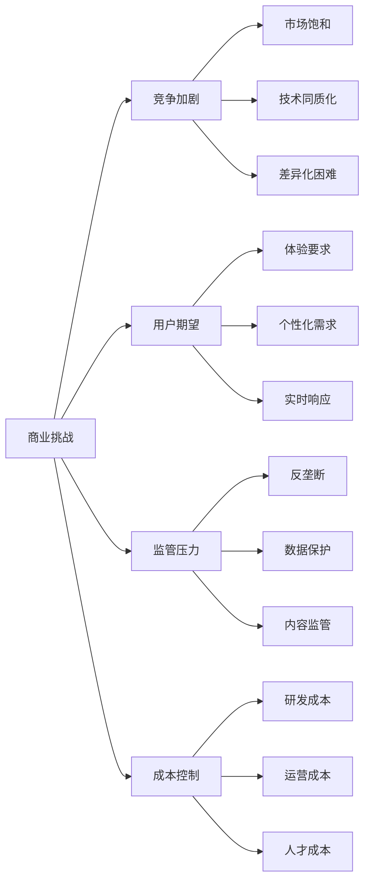

#### 挑战影响分析
| 挑战类型 | 影响程度 | 主要表现 | 应对策略 |
|---------|---------|---------|----------|
| **数据隐私** | 极高 | 合规压力、用户信任 | 隐私保护、透明化 |
| **算法偏见** | 高 | 公平性问题、社会影响 | 算法审计、多样性 |
| **虚假信息** | 高 | 内容质量、用户信任 | 内容审核、事实核查 |
| **竞争加剧** | 中 | 市场压力、创新需求 | 差异化、技术创新 |

### 发展机遇分析
#### 技术机遇
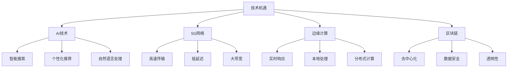

#### 市场机遇
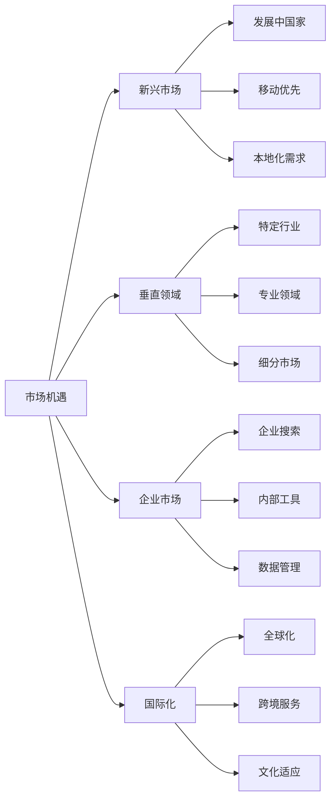

#### 机遇分析
| 机遇类型 | 发展潜力 | 主要特点 | 实施建议 |
|---------|---------|---------|----------|
| **AI技术** | 极高 | 智能化、个性化 | 技术投入、人才培养 |
| **5G网络** | 高 | 高速、低延迟 | 基础设施、应用开发 |
| **新兴市场** | 高 | 增长潜力、本地化 | 市场调研、本地化策略 |
| **垂直领域** | 中 | 专业化、细分市场 | 专业能力、行业深耕 |

## 🎯 对SEO的影响

### SEO策略调整
#### 内容策略演进
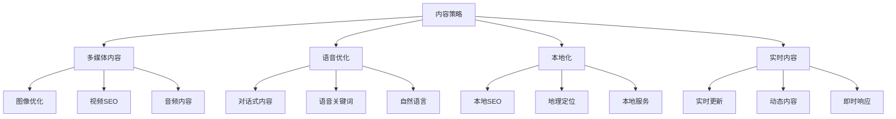

#### 技术优化演进
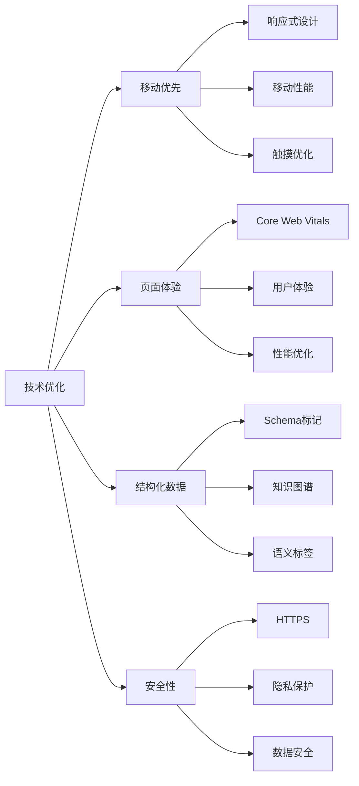

#### SEO策略对比
| 策略方面 | 传统SEO | 现代SEO | 未来SEO |
|---------|---------|---------|---------|
| **内容策略** | 关键词优化 | 用户体验 | 智能化内容 |
| **技术优化** | 基础技术 | 性能体验 | AI驱动优化 |
| **用户体验** | 次要考虑 | 核心指标 | 个性化体验 |
| **数据分析** | 基础统计 | 深度分析 | 预测分析 |

### 未来SEO准备
#### 技术准备策略
```mermaid
graph TD
    A[技术准备] --> B[AI技术]
    A --> C[新标准]
    A --> D[工具更新]
    A --> E[技能提升]
    
    B --> B1[机器学习]
    B --> B2[自然语言处理]
    B --> B3[计算机视觉]
    
    C --> C1[技术标准]
    C --> C2[最佳实践]
    C --> C3[行业规范]
    
    D --> D1[SEO工具]
    D --> D2[分析工具]
    D --> D3[自动化工具]
    
    E --> E1[持续学习]
    E --> E2[技能升级]
    E --> E3[知识更新]
```

#### 策略调整方向
```mermaid
graph LR
    A[策略调整] --> B[用户体验]
    A --> C[数据驱动]
    A --> D[长期规划]
    A --> E[创新思维]
    
    B --> B1[用户中心]
    B --> B2[体验优化]
    B --> B3[满意度提升]
    
    C --> C1[数据分析]
    C --> C2[决策支持]
    C --> C3[效果评估]
    
    D --> D1[战略规划]
    D --> D2[目标设定]
    D --> D3[持续改进]
    
    E --> E1[创新方法]
    E --> E2[开放态度]
    E --> E3[技术探索]
```

#### 准备优先级
| 准备方面 | 优先级 | 实施难度 | 预期效果 |
|---------|--------|---------|---------|
| **AI技术学习** | 极高 | 中等 | 长期竞争力 |
| **用户体验优化** | 极高 | 中等 | 即时效果 |
| **数据分析能力** | 高 | 低 | 决策支持 |
| **创新思维培养** | 中 | 低 | 持续发展 |

## 🎯 费曼学习法应用

### 用简单语言解释搜索引擎发展趋势
**向朋友解释**：
"搜索引擎发展趋势就像是手机从功能机到智能手机的进化，从只能搜索文字，到可以语音搜索、图像搜索，再到AI智能助手，越来越智能、越来越方便。"

### 核心概念简化
1. **发展趋势 = 搜索引擎的进化方向**
2. **技术趋势 = 支撑发展的技术**
3. **用户体验 = 用户使用感受的提升**
4. **SEO影响 = 对网站优化的要求变化**

## 🔗 相关链接

- [[搜索引擎排名算法]] - 了解算法如何影响排名
- [[搜索引擎索引建立]] - 了解索引技术的发展
- [[SEO核心目标]] - 理解SEO的最终目标
- [[SEO未来趋势]] - 掌握SEO的发展方向

---

**下一步学习**：了解 [[SEO发展历程]]，掌握SEO的历史演进和未来趋势
