# 搜索引擎排名算法

> **核心理念**：理解搜索引擎如何决定网页排名，掌握影响排名的关键因素，制定有效的SEO策略

## 🎯 排名算法概述

### 什么是排名算法
**搜索引擎排名算法** = 多因素综合评估 + 机器学习优化 + 用户体验导向

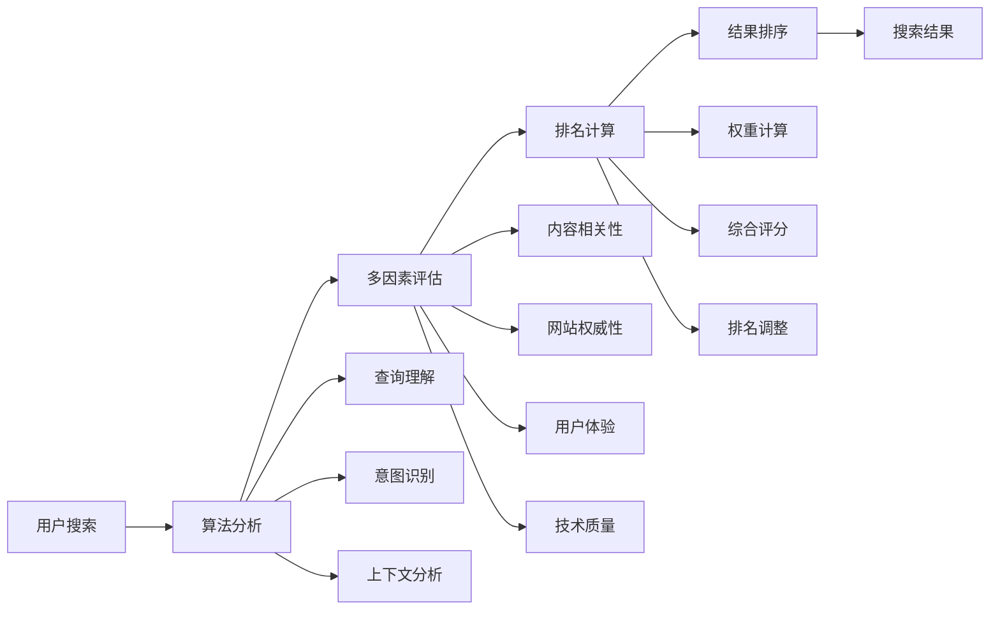

**简单理解**：搜索引擎排名算法就像是一个智能评分系统，它会根据多个标准给每个网页打分，然后按照分数高低排列搜索结果。

### 算法发展历程
#### 演进时间线
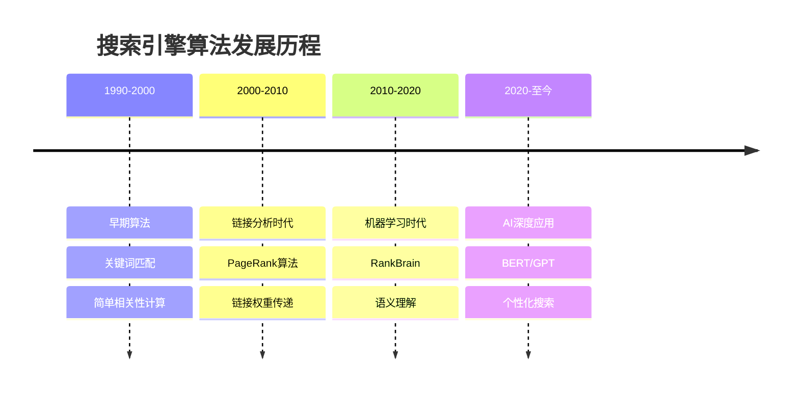

#### 发展阶段特征
| 发展阶段 | 核心技术 | 主要特点 | SEO重点 |
|---------|---------|---------|---------|
| **早期算法** | 关键词匹配 | 简单相关性 | 关键词优化 |
| **链接分析** | PageRank | 权威性评估 | 外链建设 |
| **机器学习** | RankBrain | 语义理解 | 内容质量 |
| **AI时代** | BERT/GPT | 个性化 | 用户体验 |

## 📊 主要排名因素

### 内容相关性因素
#### 关键词匹配机制
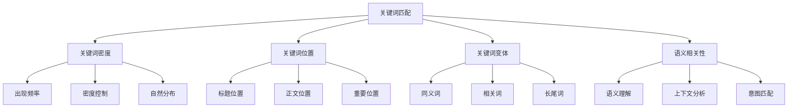

#### 关键词优化要点
| 优化方面 | 优化方法 | 权重 | 最佳实践 |
|---------|---------|------|----------|
| **关键词密度** | 2-3%自然分布 | 中 | 避免堆砌，自然融入 |
| **关键词位置** | 标题、开头、结尾 | 高 | 重要位置优先 |
| **关键词变体** | 同义词、相关词 | 中 | 语义相关词扩展 |
| **语义相关性** | 主题相关、意图匹配 | 高 | 深度理解用户需求 |

#### 内容质量评估
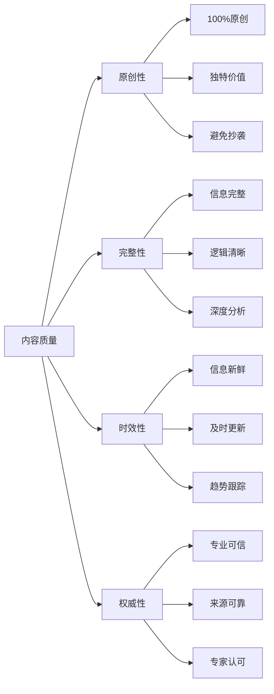

#### 内容质量标准
| 质量维度 | 评估标准 | 权重 | 优化建议 |
|---------|---------|------|----------|
| **原创性** | 100%原创，独特价值 | 极高 | 独立创作，避免抄袭 |
| **完整性** | 信息完整，逻辑清晰 | 高 | 全面覆盖，结构清晰 |
| **时效性** | 信息新鲜，及时更新 | 中 | 定期更新，跟踪趋势 |
| **权威性** | 专业可信，来源可靠 | 高 | 专业内容，权威来源 |

### 技术因素
#### 网站性能优化
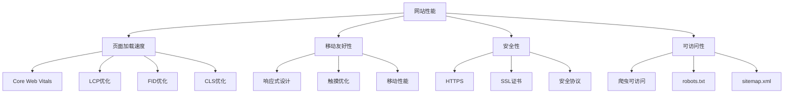

#### 性能优化要点
| 性能方面 | 关键指标 | 权重 | 优化方法 |
|---------|---------|------|----------|
| **页面加载速度** | LCP < 2.5s | 极高 | 优化资源、CDN、缓存 |
| **移动友好性** | 移动优先设计 | 极高 | 响应式设计、触摸优化 |
| **安全性** | HTTPS、SSL证书 | 高 | 安全连接、证书配置 |
| **可访问性** | 爬虫可访问 | 高 | robots.txt、sitemap |

#### 网站结构优化
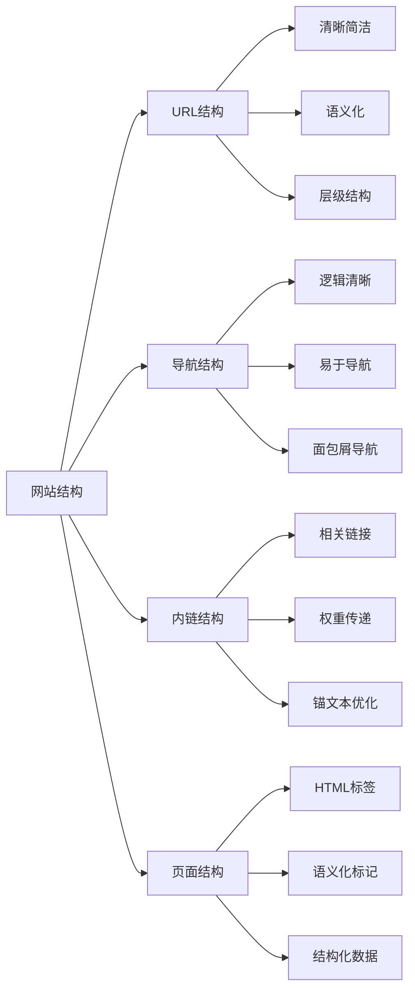

#### 结构优化要点
| 结构方面 | 优化要点 | 权重 | 最佳实践 |
|---------|---------|------|----------|
| **URL结构** | 清晰、简洁、语义化 | 中 | 短URL、关键词包含 |
| **导航结构** | 逻辑清晰、易于导航 | 中 | 面包屑、清晰层级 |
| **内链结构** | 相关链接、权重传递 | 高 | 主题相关、锚文本优化 |
| **页面结构** | HTML标签、语义化 | 中 | H1-H6、语义标签 |

### 权威性因素
#### 链接权威性分析
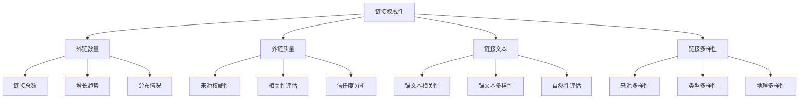

#### 链接权威性要点
| 链接方面 | 评估标准 | 权重 | 优化建议 |
|---------|---------|------|----------|
| **外链数量** | 高质量外链数量 | 高 | 建设权威外链 |
| **外链质量** | 来源权威性、相关性 | 极高 | 行业权威、相关性高 |
| **链接文本** | 锚文本相关性、自然性 | 中 | 自然锚文本、相关性强 |
| **链接多样性** | 来源、类型、地理多样性 | 中 | 多样化链接建设 |

#### 域名权威性分析
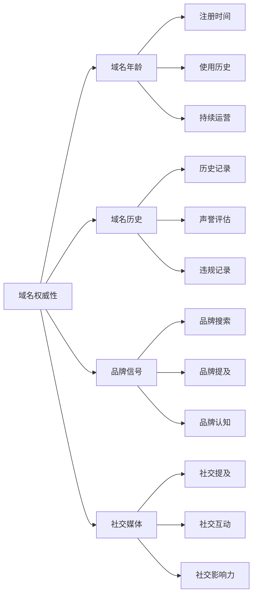

#### 域名权威性要点
| 权威方面 | 影响因素 | 权重 | 建设建议 |
|---------|---------|------|----------|
| **域名年龄** | 注册时间、使用历史 | 中 | 长期运营、持续优化 |
| **域名历史** | 历史记录、声誉评估 | 高 | 良好历史、避免违规 |
| **品牌信号** | 品牌搜索、提及 | 高 | 品牌建设、知名度提升 |
| **社交媒体** | 社交提及、互动 | 中 | 社交营销、用户互动 |

### 用户体验因素
#### 用户行为分析
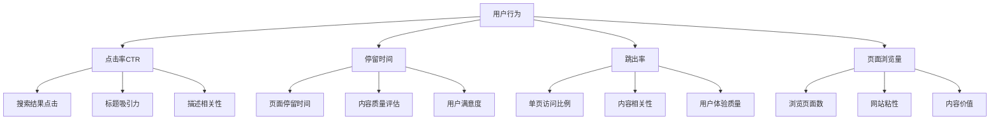

#### 用户行为指标
| 行为指标 | 影响因素 | 权重 | 优化建议 |
|---------|---------|------|----------|
| **点击率CTR** | 标题吸引力、描述相关性 | 高 | 优化标题、描述 |
| **停留时间** | 内容质量、用户体验 | 高 | 提升内容质量 |
| **跳出率** | 内容相关性、用户体验 | 中 | 提升相关性、体验 |
| **页面浏览量** | 内容价值、网站粘性 | 中 | 提升内容价值 |

#### 用户参与度分析
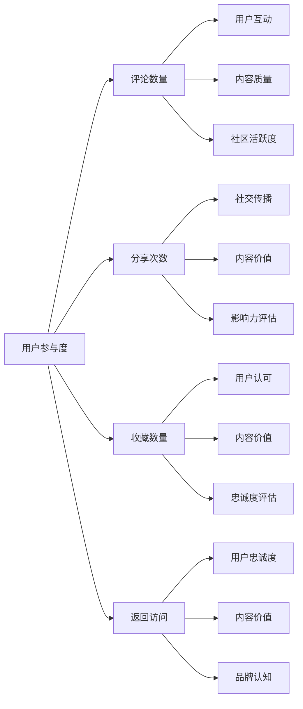

#### 参与度优化要点
| 参与方面 | 优化目标 | 权重 | 实施方法 |
|---------|---------|------|----------|
| **评论数量** | 增加用户互动 | 中 | 优质内容、互动设计 |
| **分享次数** | 提升社交传播 | 中 | 社交优化、内容营销 |
| **收藏数量** | 提升用户认可 | 中 | 内容价值、用户体验 |
| **返回访问** | 提升用户忠诚度 | 高 | 持续价值、品牌建设 |

## 🔍 主要搜索引擎算法

### Google算法体系
#### 核心算法架构
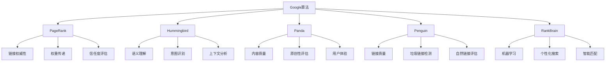

#### Google算法特点
| 算法名称 | 主要功能 | 影响因素 | SEO重点 |
|---------|---------|---------|---------|
| **PageRank** | 链接权威性评估 | 外链质量、数量 | 高质量外链建设 |
| **Hummingbird** | 语义搜索理解 | 内容语义、意图 | 语义化内容优化 |
| **Panda** | 内容质量评估 | 内容质量、原创性 | 提升内容质量 |
| **Penguin** | 链接质量检测 | 链接自然性、质量 | 自然链接建设 |
| **RankBrain** | 机器学习优化 | 用户行为、个性化 | 用户体验优化 |

#### 重要更新时间线
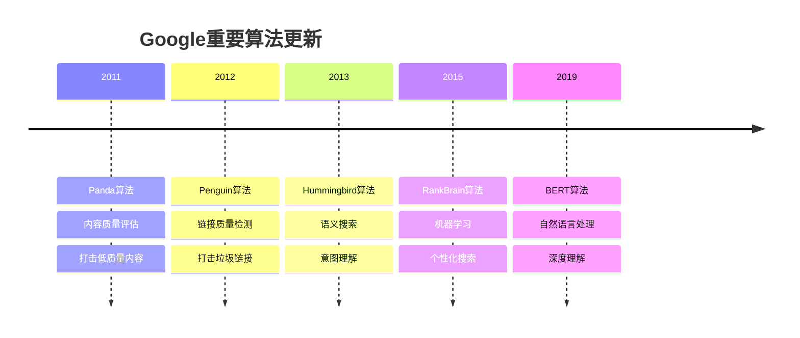

### 百度算法体系
#### 核心算法架构
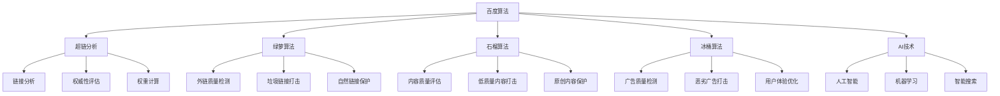

#### 百度算法特点
| 算法名称 | 主要功能 | 影响因素 | SEO重点 |
|---------|---------|---------|---------|
| **超链分析** | 链接权威性评估 | 外链质量、相关性 | 高质量外链建设 |
| **绿萝算法** | 外链质量检测 | 链接自然性、质量 | 自然外链建设 |
| **石榴算法** | 内容质量评估 | 内容质量、原创性 | 提升内容质量 |
| **冰桶算法** | 广告质量检测 | 广告质量、用户体验 | 优化广告体验 |
| **AI技术** | 智能搜索优化 | 个性化、智能化 | 用户体验优化 |

#### 百度重要更新
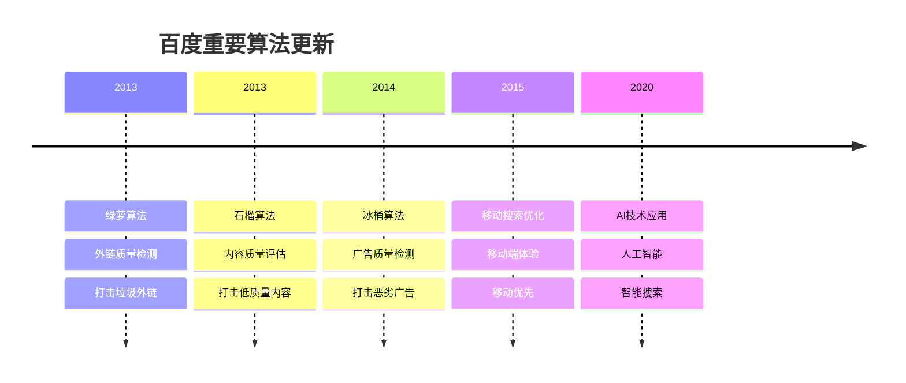

## 🛡️ 算法更新应对策略

### 监控算法更新
#### 监控体系
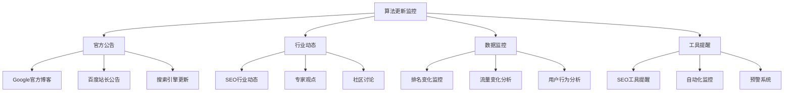

#### 监控要点
| 监控方面 | 监控内容 | 频率 | 重要性 |
|---------|---------|------|--------|
| **官方公告** | 搜索引擎官方更新 | 每日 | 极高 |
| **行业动态** | SEO行业讨论、专家观点 | 每日 | 高 |
| **数据监控** | 排名、流量、用户行为 | 每日 | 极高 |
| **工具提醒** | SEO工具预警、自动化监控 | 实时 | 高 |

### 应对策略
#### 短期应对策略
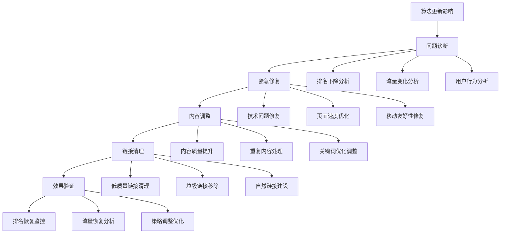

#### 长期应对策略
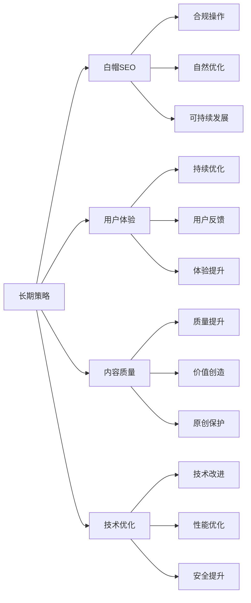

#### 应对策略对比
| 策略类型 | 时间周期 | 主要措施 | 预期效果 |
|---------|---------|---------|---------|
| **短期应对** | 1-4周 | 问题诊断、紧急修复 | 快速恢复 |
| **中期调整** | 1-3个月 | 内容优化、链接调整 | 稳定提升 |
| **长期策略** | 3-12个月 | 全面优化、持续改进 | 持续增长 |

### 预防措施
#### 预防体系
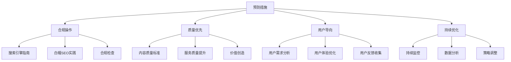

#### 预防要点
| 预防方面 | 具体措施 | 实施频率 | 重要性 |
|---------|---------|---------|--------|
| **合规操作** | 遵守搜索引擎指南 | 持续 | 极高 |
| **质量优先** | 提升内容和服务质量 | 持续 | 极高 |
| **用户导向** | 以用户需求为导向 | 持续 | 高 |
| **持续优化** | 监控和优化网站 | 持续 | 高 |

## 🚀 算法趋势和未来

### 当前趋势分析
#### 主要趋势
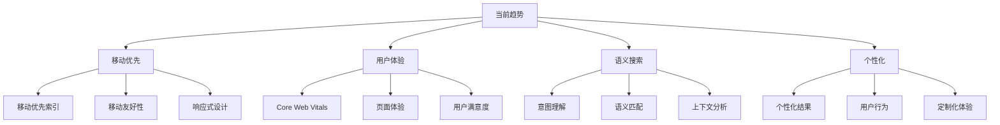

#### 趋势影响分析
| 趋势类型 | 影响程度 | 主要变化 | SEO应对 |
|---------|---------|---------|---------|
| **移动优先** | 极高 | 移动设备优先索引 | 移动优先设计 |
| **用户体验** | 极高 | Core Web Vitals重要性 | 性能优化 |
| **语义搜索** | 高 | 意图理解、语义匹配 | 语义化内容 |
| **个性化** | 中 | 个性化搜索结果 | 用户行为优化 |

### 未来发展方向
#### 技术发展方向
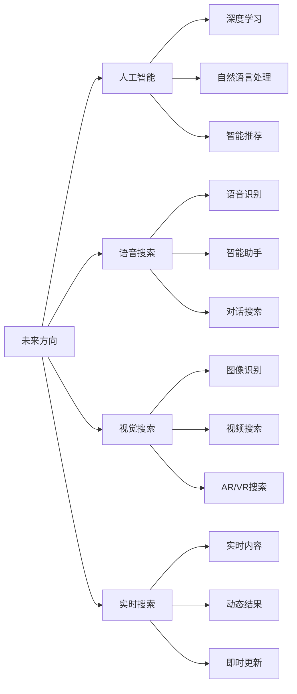

#### 发展方向预测
| 发展方向 | 技术特点 | 预期影响 | 准备建议 |
|---------|---------|---------|----------|
| **人工智能** | AI深度应用、智能理解 | 极高 | 内容智能化、用户体验 |
| **语音搜索** | 语音交互、智能助手 | 高 | 语音优化、对话式内容 |
| **视觉搜索** | 图像识别、视频搜索 | 中 | 多媒体优化、视觉内容 |
| **实时搜索** | 实时内容、动态更新 | 中 | 内容实时性、更新频率 |

### 应对建议
#### 综合应对策略
```mermaid
graph TD
    A[应对建议] --> B[技术准备]
    A --> C[内容策略]
    A --> D[用户体验]
    A --> E[数据驱动]
    
    B --> B1[新技术学习]
    B --> B2[技术升级]
    B --> B3[系统优化]
    
    C --> C1[内容智能化]
    C --> C2[多媒体内容]
    C --> C3[实时内容]
    
    D --> D1[体验持续优化]
    D --> D2[个性化体验]
    D --> D3[交互优化]
    
    E --> E1[数据分析]
    E --> E2[决策支持]
    E --> E3[效果评估]
```

#### 应对优先级
| 应对方面 | 优先级 | 实施难度 | 预期效果 |
|---------|--------|---------|---------|
| **技术准备** | 极高 | 中等 | 长期竞争力 |
| **内容策略** | 高 | 中等 | 内容优势 |
| **用户体验** | 极高 | 中等 | 用户满意度 |
| **数据驱动** | 高 | 低 | 决策准确性 |

## 🎯 费曼学习法应用

### 用简单语言解释排名算法
**向朋友解释**：
"搜索引擎排名算法就像一个智能评分系统，它会根据多个标准给每个网页打分，比如内容质量、网站速度、用户喜欢程度等，然后按照分数高低排列搜索结果。"

### 核心概念简化
1. **排名算法 = 智能评分系统**
2. **影响因素 = 评分标准**
3. **优化 = 提升各项评分**
4. **趋势 = 评分标准的变化**

## 🔗 相关链接

- [[搜索引擎索引建立]] - 了解索引如何影响排名
- [[搜索引擎爬虫机制]] - 了解爬虫如何发现网页
- [[SEO核心目标]] - 理解SEO的最终目标
- [[技术SEO检查清单]] - 学习技术优化方法

---

**下一步学习**：了解 [[SEO发展趋势]]，掌握未来SEO的发展方向
