# 搜索引擎爬虫机制

> **核心理念**：理解搜索引擎爬虫的工作原理，优化网站让爬虫更好地发现、抓取和索引你的内容

## 🕷️ 爬虫基本概念

### 什么是搜索引擎爬虫
**搜索引擎爬虫** = 自动化程序 + 网页发现 + 内容抓取 + 数据存储

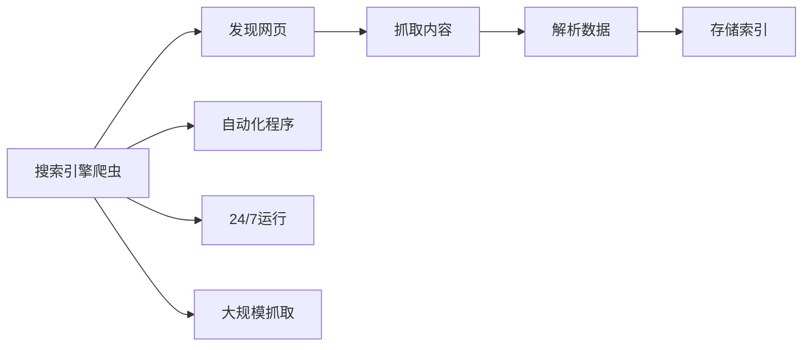

**简单理解**：爬虫就像是搜索引擎派出的"侦察兵"，在互联网上不断寻找新网页，把内容带回来给搜索引擎分析。

### 爬虫工作原理
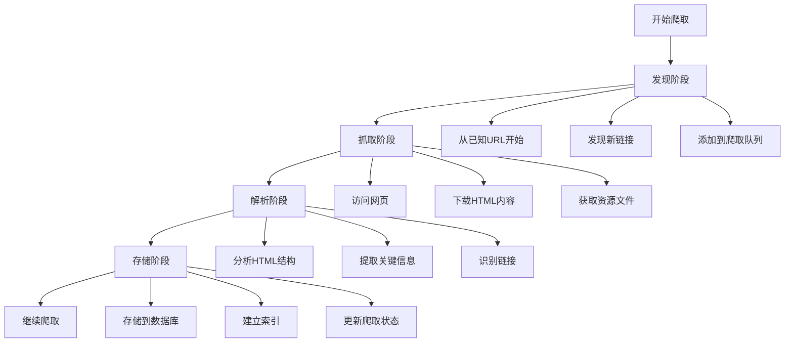

## 🔍 主要搜索引擎爬虫

### Google爬虫家族
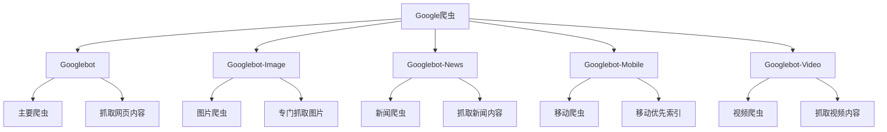

| 爬虫类型 | 主要功能 | 爬取内容 | 更新频率 |
|---------|---------|---------|----------|
| **Googlebot** | 主要网页爬虫 | HTML页面、文本内容 | 每日 |
| **Googlebot-Image** | 图片爬虫 | 图片文件、Alt文本 | 每周 |
| **Googlebot-News** | 新闻爬虫 | 新闻文章、实时内容 | 实时 |
| **Googlebot-Mobile** | 移动爬虫 | 移动版页面 | 每日 |
| **Googlebot-Video** | 视频爬虫 | 视频文件、元数据 | 每周 |

### 百度爬虫体系
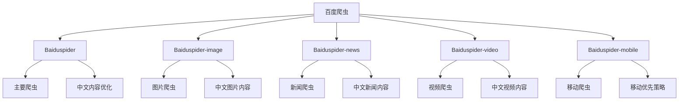

### 其他搜索引擎爬虫
| 搜索引擎 | 爬虫名称 | 特点 | 主要市场 |
|---------|---------|------|----------|
| **Bing** | Bingbot | 微软技术 | 企业市场 |
| **Yandex** | YandexBot | 俄语优化 | 俄罗斯市场 |
| **DuckDuckGo** | DuckDuckBot | 隐私保护 | 隐私用户 |
| **Naver** | Yeti | 韩语优化 | 韩国市场 |

## 🎯 爬虫行为特征

### 爬取频率分析
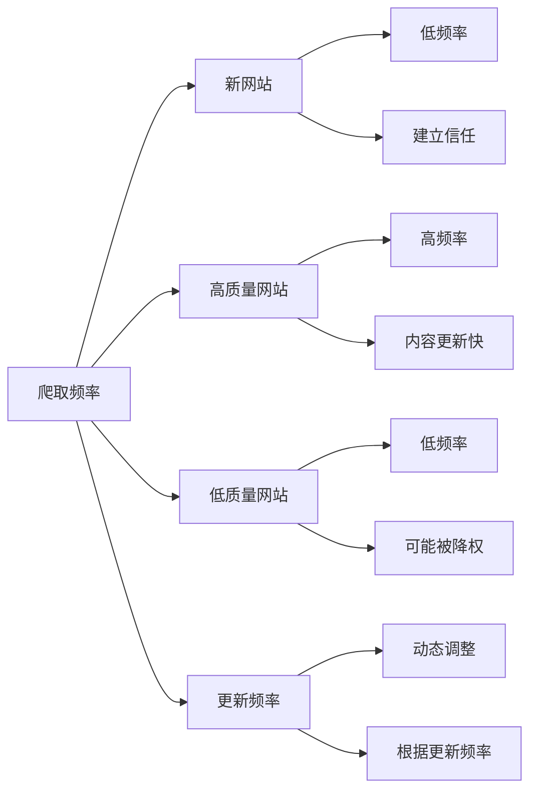

#### 爬取频率影响因素
| 因素 | 影响程度 | 说明 | 优化建议 |
|------|---------|------|----------|
| **网站权威性** | 高 | 权威网站爬取频率高 | 建立网站权威性 |
| **内容更新频率** | 高 | 更新频繁的网站更受关注 | 定期更新内容 |
| **外链数量** | 中 | 外链多的网站更容易被发现 | 建设高质量外链 |
| **服务器性能** | 中 | 服务器稳定影响爬取 | 优化服务器性能 |
| **内容质量** | 高 | 高质量内容优先爬取 | 提升内容质量 |

### 爬取深度控制
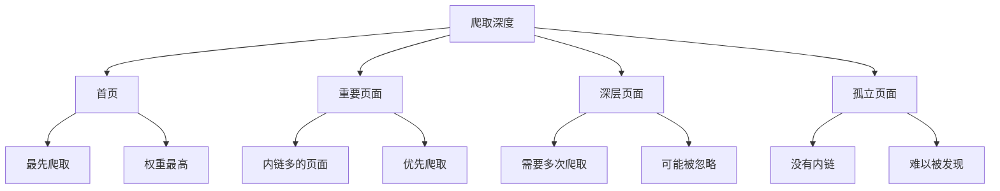

#### 爬取深度优化策略
- **首页优化**：确保首页内容丰富、链接完整
- **内链建设**：建立良好的内链结构
- **导航优化**：提供清晰的网站导航
- **sitemap提交**：提交XML sitemap帮助发现深层页面

### 爬取预算分配
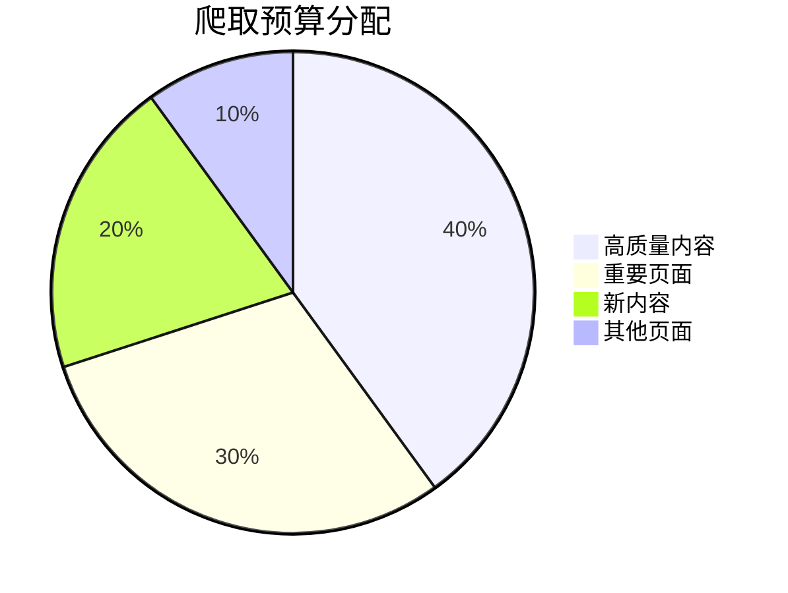

**爬取预算概念**：
- 每个网站都有固定的爬取资源分配
- 爬虫会根据网站质量调整爬取预算
- 高质量网站获得更多爬取资源
- 低质量网站爬取预算会被削减

## 🔧 影响爬虫行为的因素

### 网站技术因素
#### 技术因素分析
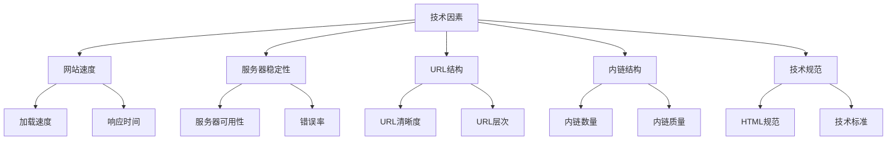

#### 技术优化建议
| 技术因素 | 优化方法 | 预期效果 | 实施难度 |
|---------|---------|---------|----------|
| **网站速度** | 优化服务器、使用CDN | 提升爬取效率 | 中等 |
| **服务器稳定性** | 选择可靠主机、监控服务 | 减少爬取中断 | 低 |
| **URL结构** | 使用清晰、简洁的URL | 便于爬虫理解 | 低 |
| **内链结构** | 建立良好的内链网络 | 帮助发现页面 | 中等 |
| **技术规范** | 遵循Web标准 | 提升兼容性 | 中等 |

### 内容因素
#### 内容质量影响
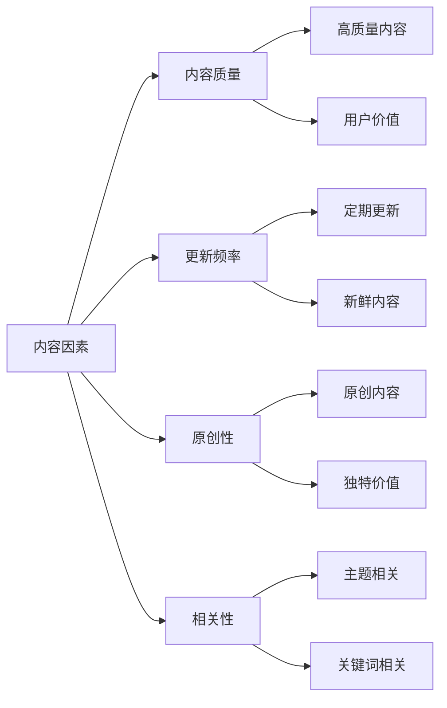

#### 内容优化策略
- **内容质量**：创建高质量、有价值的内容
- **更新频率**：定期更新网站内容
- **原创性**：确保内容100%原创
- **相关性**：内容与网站主题高度相关

### 外部因素
#### 外部因素分析
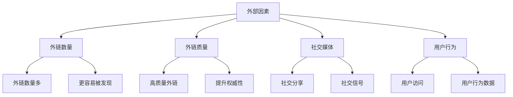

## 🛠️ 优化爬虫访问的策略

### 技术优化策略
#### robots.txt优化
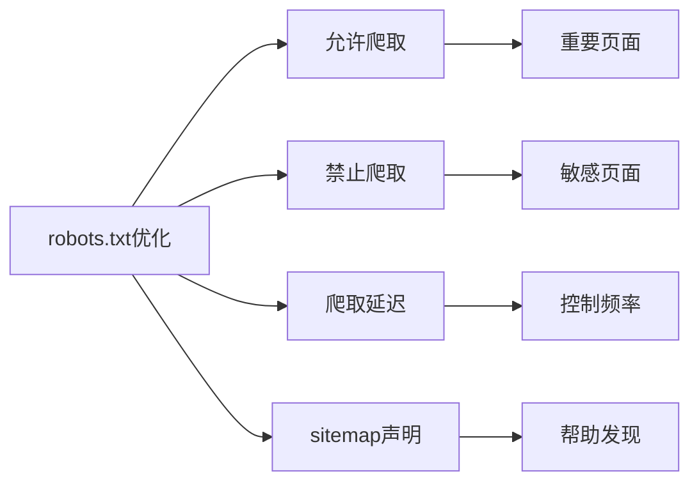

**robots.txt最佳实践**：
```
User-agent: *
Allow: /
Disallow: /admin/
Disallow: /private/
Crawl-delay: 1
Sitemap: https://example.com/sitemap.xml
```

#### sitemap.xml优化
- **完整性**：包含所有重要页面
- **更新频率**：定期更新sitemap
- **格式规范**：遵循XML sitemap标准
- **优先级设置**：设置页面优先级

### 内容优化策略
#### 内容结构优化
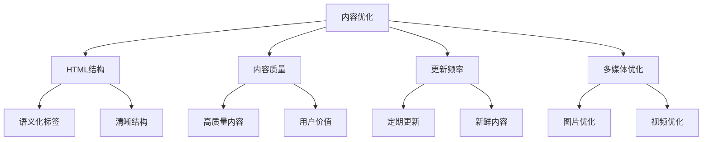

### 服务器优化策略
#### 服务器性能优化
| 优化方面 | 具体措施 | 预期效果 | 实施难度 |
|---------|---------|---------|----------|
| **服务器性能** | 升级硬件、优化配置 | 提升响应速度 | 中等 |
| **CDN使用** | 部署CDN加速 | 提升全球访问速度 | 低 |
| **缓存策略** | 启用服务器缓存 | 提升响应速度 | 中等 |
| **错误处理** | 优化错误页面 | 提升用户体验 | 低 |

## 🚨 常见爬虫问题及解决方案

### 问题诊断流程
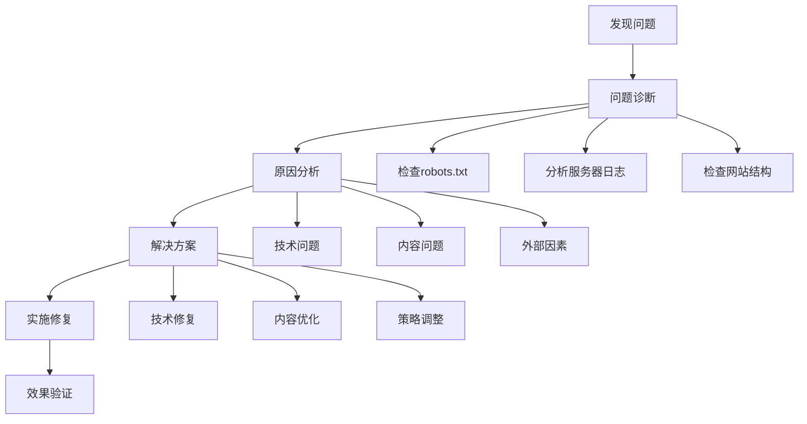

### 常见问题及解决方案
| 问题类型 | 常见原因 | 解决方案 | 预防措施 |
|---------|---------|---------|----------|
| **爬虫无法访问** | robots.txt阻止 | 检查并修改robots.txt | 定期检查配置 |
| **爬取频率过低** | 内容质量低 | 提升内容质量 | 建立内容质量标准 |
| **深层页面未爬取** | 内链结构差 | 优化内链结构 | 建立清晰导航 |
| **重复内容问题** | URL结构混乱 | 使用canonical标签 | 避免重复内容 |

## 📊 监控爬虫活动

### 监控工具选择
#### 官方工具
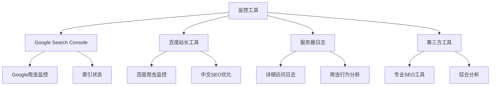

#### 监控指标
| 指标 | 定义 | 重要性 | 监控频率 |
|------|------|--------|----------|
| **爬取频率** | 爬虫访问频率 | 高 | 每周 |
| **爬取页面数** | 每次爬取的页面数量 | 中 | 每周 |
| **爬取成功率** | 成功爬取的页面比例 | 高 | 每日 |
| **爬取深度** | 爬虫到达的页面深度 | 中 | 每月 |

### 优化建议
#### 持续优化策略
- **定期监控**：建立定期监控机制
- **问题识别**：及时发现爬取问题
- **策略调整**：根据数据调整优化策略
- **持续改进**：持续优化网站结构和内容

## 🎯 费曼学习法应用

### 用简单语言解释爬虫机制
**向朋友解释**：
"搜索引擎爬虫就像是图书馆的图书管理员，每天在互联网上寻找新书（网页），把书的内容记录下来，然后整理到图书馆的目录中，这样用户就能通过目录找到想要的书了。"

### 核心概念简化
1. **爬虫 = 自动化的网页收集器**
2. **发现 = 通过链接找到新网页**
3. **抓取 = 下载网页内容**
4. **索引 = 把内容整理到数据库中**

## 🔗 相关链接

- [[搜索引擎索引建立]] - 了解爬虫抓取后的索引过程
- [[搜索引擎排名算法]] - 了解爬虫数据如何影响排名
- [[网站架构优化]] - 学习如何优化网站结构让爬虫更好地抓取
- [[页面技术优化]] - 了解页面技术对爬虫的影响

---

**下一步学习**：了解 [[搜索引擎索引建立]]，理解爬虫抓取后的数据处理过程
