# 搜索引擎索引建立

> **核心理念**：理解搜索引擎如何建立和管理索引，优化网站让搜索引擎更好地索引和检索你的内容

## 🗂️ 索引基本概念

### 什么是搜索引擎索引
**搜索引擎索引** = 网页内容数据库 + 关键词映射 + 快速检索系统

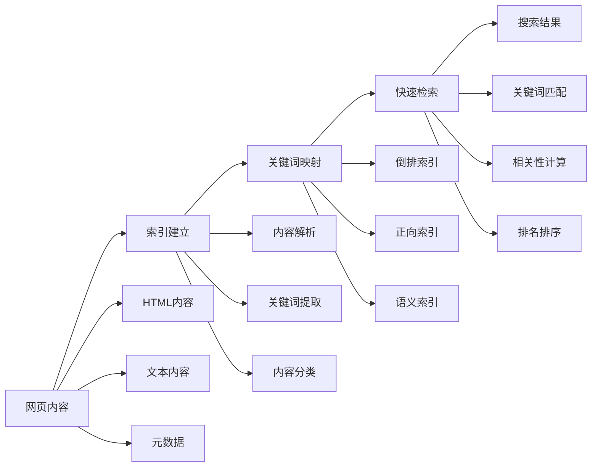

**简单理解**：搜索引擎索引就像是图书馆的目录系统，把每本书（网页）的内容整理成目录（索引），这样用户搜索时就能快速找到相关的书。

### 索引的作用
| 作用 | 具体功能 | SEO价值 | 优化重点 |
|------|---------|---------|----------|
| **快速检索** | 通过索引快速找到相关内容 | 提升搜索效率 | 关键词优化 |
| **相关性排序** | 根据索引信息对搜索结果排序 | 影响排名位置 | 内容相关性 |
| **内容理解** | 帮助搜索引擎理解网页内容 | 提升理解准确性 | 语义化标签 |
| **质量评估** | 评估网页质量和权威性 | 影响排名权重 | 内容质量 |

## 🔄 索引建立过程

### 索引建立流程图
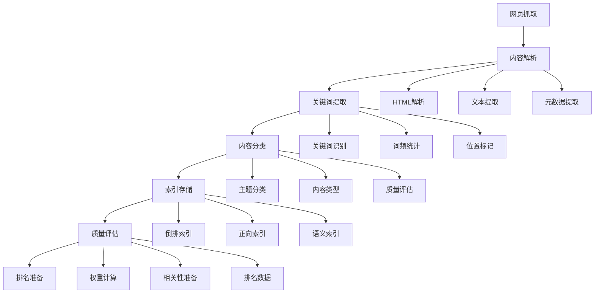

### 1. 内容抓取阶段
#### HTML解析技术
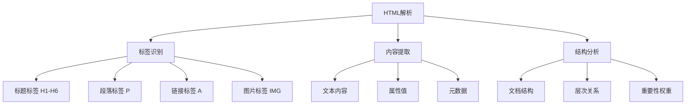

#### 抓取优化要点
| 抓取方面 | 优化要点 | 最佳实践 | SEO价值 |
|---------|---------|---------|---------|
| **HTML结构** | 语义化标签 | H1-H6、article、section | 高 |
| **内容提取** | 文本质量 | 清晰、有价值的内容 | 高 |
| **元数据** | 完整信息 | title、description、keywords | 中 |
| **链接结构** | 合理链接 | 相关链接、锚文本优化 | 中 |

### 2. 内容分析阶段
#### 关键词提取技术
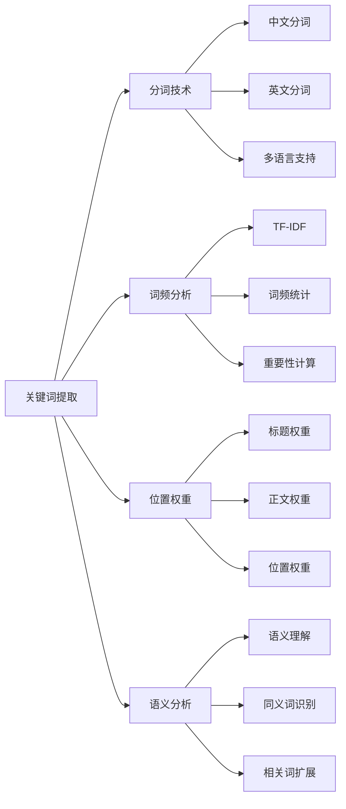

#### 分析策略
| 分析类型 | 分析方法 | 优势 | 适用场景 |
|---------|---------|------|----------|
| **关键词识别** | 统计方法、机器学习 | 准确度高 | 基础关键词提取 |
| **语义分析** | 神经网络、深度学习 | 理解深入 | 复杂语义理解 |
| **语言识别** | 规则方法、词典匹配 | 可控性强 | 多语言网站 |
| **内容分类** | 混合方法 | 综合优势 | 实际应用 |

### 3. 数据存储阶段
#### 索引存储结构
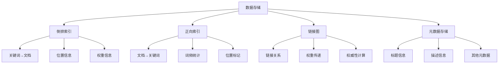

### 4. 质量评估阶段
#### 质量评估维度
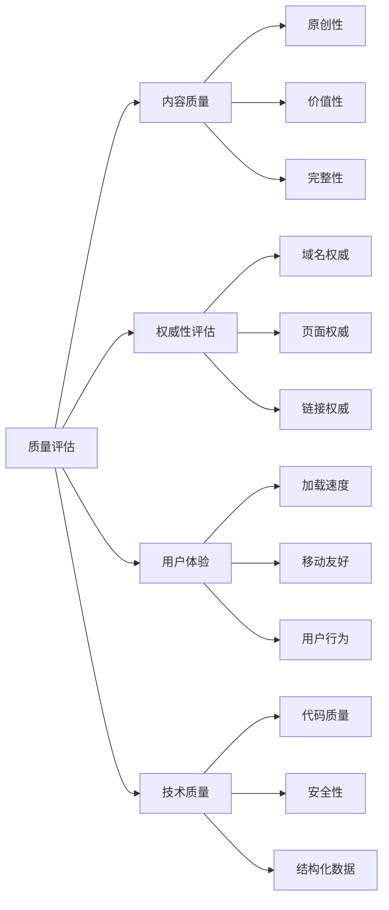

## 📊 索引类型详解

### 倒排索引（Inverted Index）
#### 什么是倒排索引
**倒排索引** = 关键词 → 文档列表的映射关系

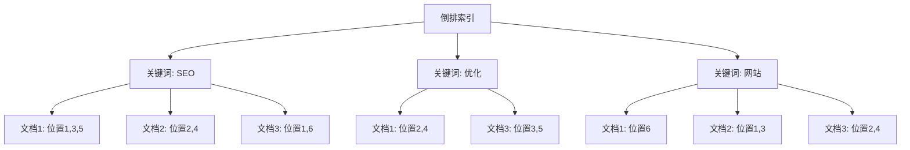

#### 倒排索引优势
| 优势 | 说明 | 效果 |
|------|------|------|
| **快速检索** | 直接通过关键词找到相关文档 | 毫秒级响应 |
| **空间效率** | 只存储关键词和位置信息 | 节省存储空间 |
| **扩展性好** | 易于添加新文档和关键词 | 支持大规模扩展 |

### 正向索引（Forward Index）
#### 什么是正向索引
**正向索引** = 文档 → 关键词列表的映射关系

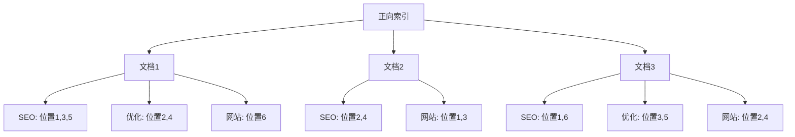

### 链接图（Link Graph）
#### 链接关系网络
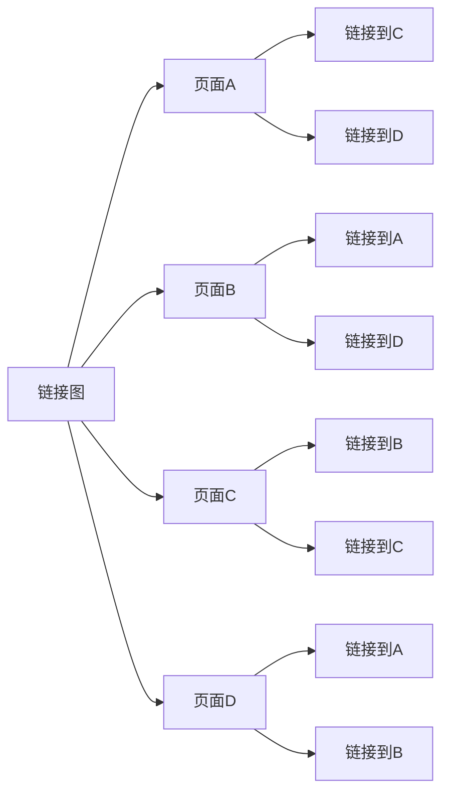

#### 链接图应用
| 应用场景 | 具体功能 | SEO价值 | 优化重点 |
|---------|---------|---------|----------|
| **PageRank算法** | 计算页面权威性 | 影响排名权重 | 高质量外链 |
| **权威性评估** | 评估网站权威性 | 提升整体排名 | 域名权威建设 |
| **相关性分析** | 分析页面相关性 | 提升内容质量 | 主题相关性 |
| **权重传递** | 传递链接权重 | 提升页面权重 | 内链结构优化 |

## 🔧 索引优化策略

### 内容优化策略
#### 内容质量优化
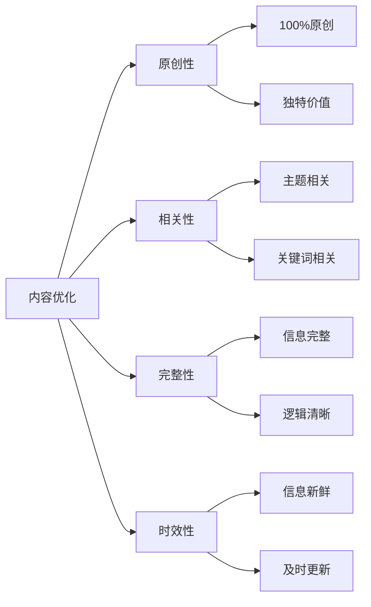

#### 内容优化要点
| 优化方面 | 优化方法 | 预期效果 | 实施难度 |
|---------|---------|---------|----------|
| **关键词优化** | 合理使用目标关键词 | 提升检索准确性 | 中等 |
| **内容结构** | 语义化HTML标签 | 提升理解准确性 | 低 |
| **内容质量** | 高质量、原创内容 | 提升排名权重 | 中等 |
| **内容更新** | 定期更新和扩展 | 保持索引新鲜度 | 中等 |

### 技术优化策略
#### 技术SEO优化
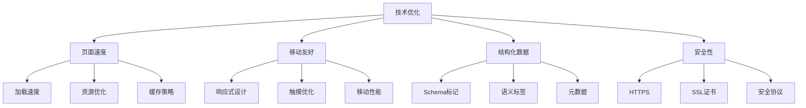

#### 技术优化要点
| 技术方面 | 优化要点 | 最佳实践 | SEO价值 |
|---------|---------|---------|---------|
| **页面速度** | 快速加载、优化资源 | Core Web Vitals优化 | 极高 |
| **移动友好** | 响应式设计、触摸优化 | 移动优先设计 | 极高 |
| **结构化数据** | Schema标记、语义标签 | 丰富摘要、知识图谱 | 高 |
| **安全性** | HTTPS、SSL证书 | 安全连接、用户信任 | 高 |

### 链接优化策略
#### 链接建设策略
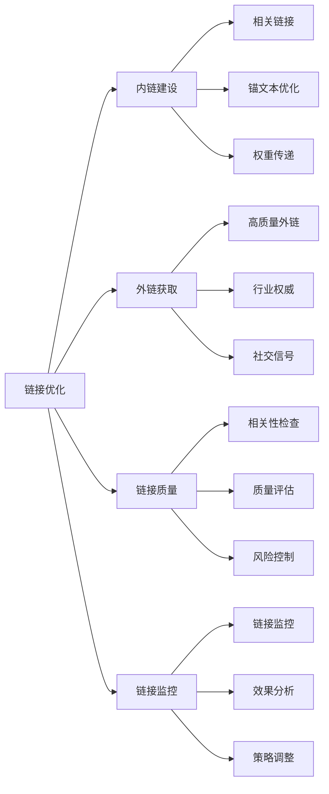

#### 链接优化要点
| 链接类型 | 优化要点 | 最佳实践 | SEO价值 |
|---------|---------|---------|---------|
| **内链建设** | 相关链接、锚文本 | 主题相关性、权重传递 | 高 |
| **外链获取** | 高质量、权威性 | 行业权威、相关性 | 极高 |
| **链接质量** | 相关性、权威性 | 避免垃圾链接 | 高 |
| **链接监控** | 持续监控、及时调整 | 定期检查、策略优化 | 中 |

## 🔄 索引更新机制

### 更新机制类型
#### 更新策略对比
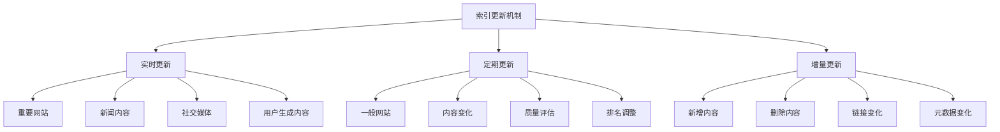

#### 更新策略分析
| 更新类型 | 更新频率 | 适用场景 | 优势 | 劣势 |
|---------|---------|---------|------|------|
| **实时更新** | 秒级 | 重要网站、新闻 | 及时性强 | 资源消耗大 |
| **定期更新** | 小时/天级 | 一般网站 | 资源消耗适中 | 时效性一般 |
| **增量更新** | 按需 | 内容变化 | 效率高 | 复杂度高 |

### 更新触发条件
#### 触发机制
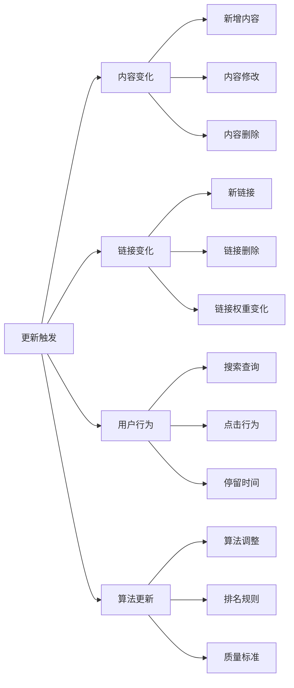

### 更新优先级
#### 优先级策略
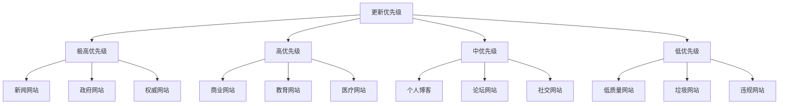

#### 优先级影响因素
| 影响因素 | 权重 | 说明 | 优化建议 |
|---------|------|------|----------|
| **网站权威性** | 极高 | 域名权威、页面权威 | 提升域名权威 |
| **内容质量** | 高 | 原创性、价值性 | 提升内容质量 |
| **更新频率** | 高 | 内容更新频率 | 定期更新内容 |
| **用户参与度** | 中 | 点击率、停留时间 | 提升用户体验 |
| **技术质量** | 中 | 页面速度、移动友好 | 优化技术实现 |

## 📈 影响索引的因素

### 正面影响因素
#### 积极因素分析
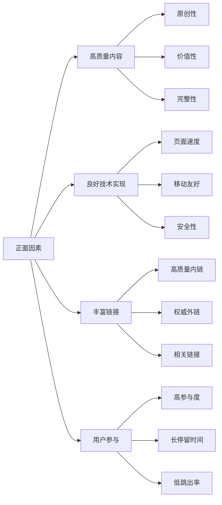

#### 正面因素影响
| 因素类型 | 影响程度 | 具体表现 | 优化建议 |
|---------|---------|---------|----------|
| **高质量内容** | 极高 | 原创、有价值、完整 | 提升内容质量 |
| **良好技术实现** | 高 | 快速、安全、友好 | 优化技术实现 |
| **丰富链接** | 高 | 高质量、相关链接 | 建设优质链接 |
| **用户参与** | 中 | 高参与度、长停留 | 提升用户体验 |

### 负面影响因素
#### 消极因素分析
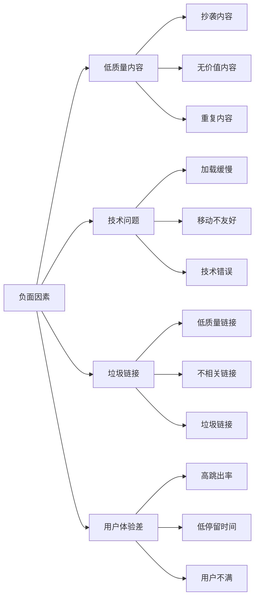

#### 负面因素影响
| 因素类型 | 影响程度 | 具体表现 | 规避建议 |
|---------|---------|---------|----------|
| **低质量内容** | 极高 | 抄袭、无价值、重复 | 避免低质量内容 |
| **技术问题** | 高 | 加载慢、不友好、错误 | 解决技术问题 |
| **垃圾链接** | 高 | 低质量、不相关、垃圾 | 避免垃圾链接 |
| **用户体验差** | 中 | 高跳出、低停留、不满 | 提升用户体验 |

## 📊 索引监控和分析

### 监控工具体系
#### 工具分类
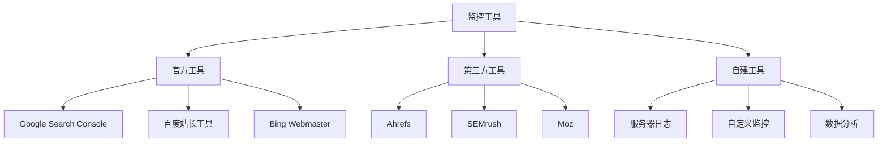

#### 工具使用建议
| 工具类型 | 工具名称 | 监控内容 | 使用频率 |
|---------|---------|---------|----------|
| **官方工具** | Google Search Console | 索引状态、搜索查询 | 每日 |
| **官方工具** | 百度站长工具 | 索引状态、搜索查询 | 每日 |
| **第三方工具** | Ahrefs | 关键词排名、外链 | 每周 |
| **自建工具** | 服务器日志 | 爬虫访问、技术问题 | 每日 |

### 关键指标监控
#### 核心指标
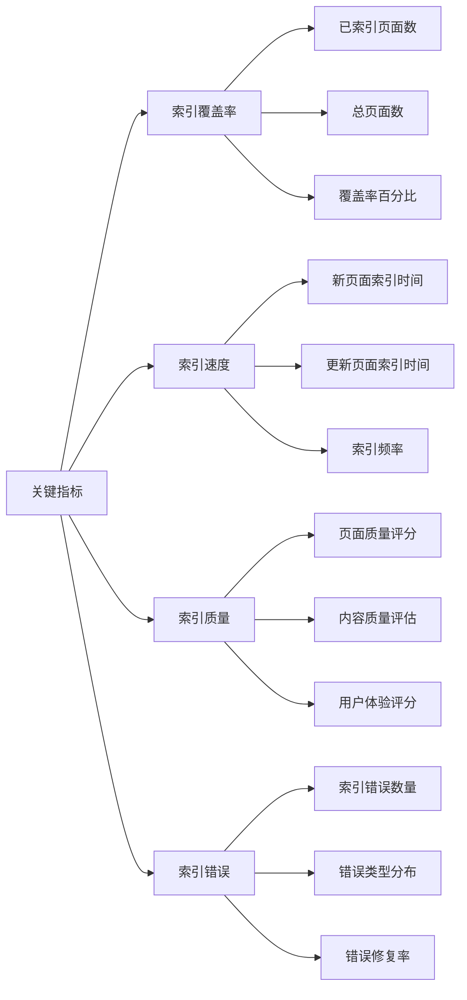

#### 指标分析
| 指标类型 | 关键指标 | 目标值 | 优化方法 |
|---------|---------|--------|----------|
| **索引覆盖率** | 已索引页面/总页面 | >90% | 优化robots.txt、sitemap |
| **索引速度** | 新页面索引时间 | <7天 | 提升内容质量、增加外链 |
| **索引质量** | 页面质量评分 | >80分 | 提升内容质量、用户体验 |
| **索引错误** | 错误页面数量 | <5% | 修复技术问题、内容问题 |

### 优化建议
#### 综合优化策略
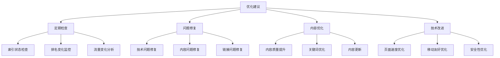

## 🎯 费曼学习法应用

### 用简单语言解释索引建立
**向朋友解释**：
"搜索引擎索引就像是图书馆的目录系统，爬虫把网页内容收集回来后，搜索引擎会分析每页写了什么，提取关键词，然后建立目录，这样用户搜索时就能快速找到相关页面。"

### 核心概念简化
1. **索引 = 网页内容的目录**
2. **倒排索引 = 关键词指向页面**
3. **正向索引 = 页面包含的关键词**
4. **优化 = 让搜索引擎更好地理解你的内容**

## 🔗 相关链接

- [[搜索引擎爬虫机制]] - 了解爬虫如何抓取网页
- [[搜索引擎排名算法]] - 了解索引如何影响排名
- [[网站架构优化]] - 学习如何优化网站结构
- [[页面技术优化]] - 了解页面技术对索引的影响

---

**下一步学习**：了解 [[搜索引擎排名算法]]，理解索引数据如何影响搜索结果排名
