# 搜索引擎算法更新历史时间线

> **核心理念**：了解搜索引擎算法演进历程，把握SEO发展趋势，为策略制定提供历史参考

## 🔍 Google算法更新历史

### 早期算法时代（1998-2009）
#### 算法发展时间线
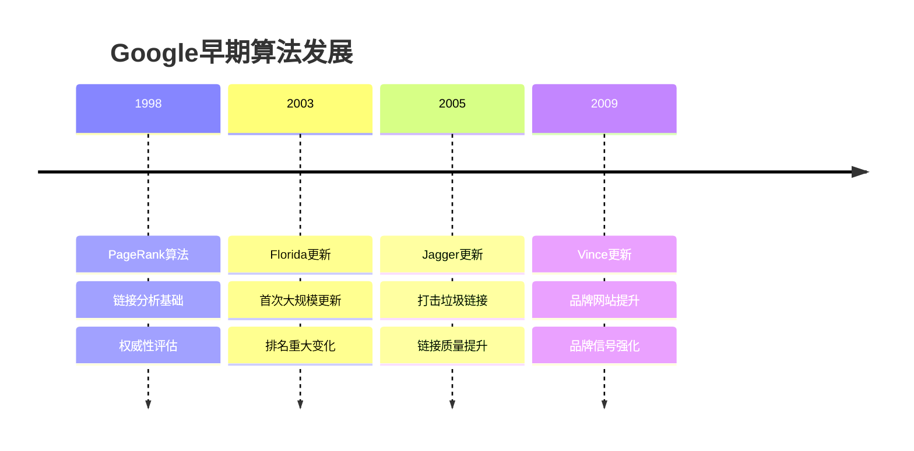

#### 早期算法特点
| 算法名称 | 发布时间 | 主要功能 | 影响程度 | SEO重点 |
|---------|---------|---------|---------|---------|
| **PageRank** | 1998年 | 链接权威性评估 | 革命性 | 外链建设 |
| **Florida** | 2003年 | 首次大规模更新 | 重大 | 关键词优化 |
| **Jagger** | 2005年 | 垃圾链接清理 | 重大 | 链接质量 |
| **Vince** | 2009年 | 品牌信号强化 | 中等 | 品牌建设 |

#### 早期SEO特点
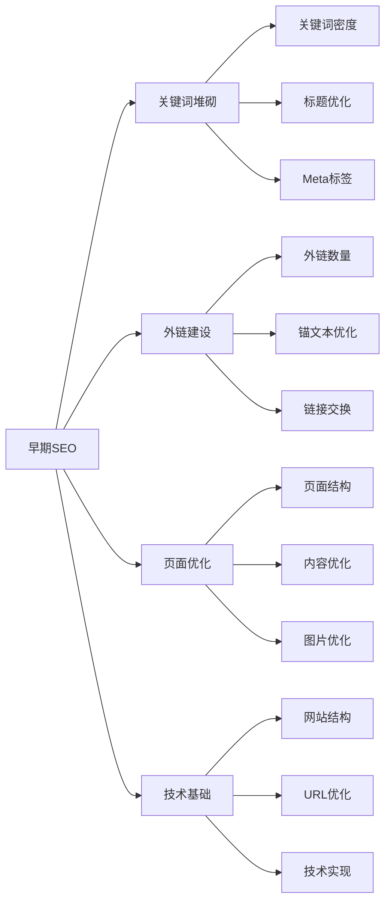

### 内容质量算法时代（2010-2012）
#### 内容质量算法时间线
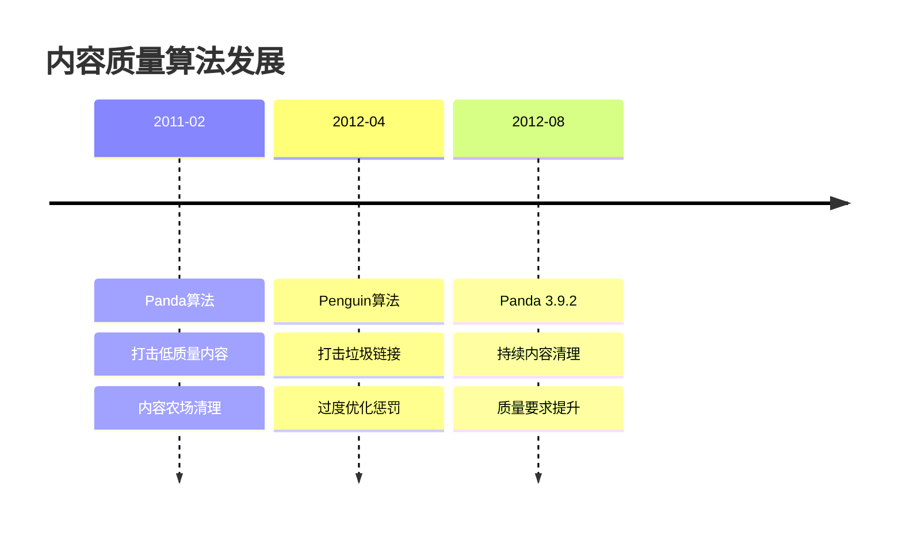

#### 内容质量算法特点
| 算法名称 | 发布时间 | 主要功能 | 影响程度 | SEO重点 |
|---------|---------|---------|---------|---------|
| **Panda** | 2011年2月 | 内容质量评估 | 革命性 | 内容质量 |
| **Penguin** | 2012年4月 | 垃圾链接清理 | 革命性 | 链接质量 |
| **Panda 3.9.2** | 2012年8月 | 持续内容清理 | 重大 | 内容优化 |

#### 内容质量算法影响
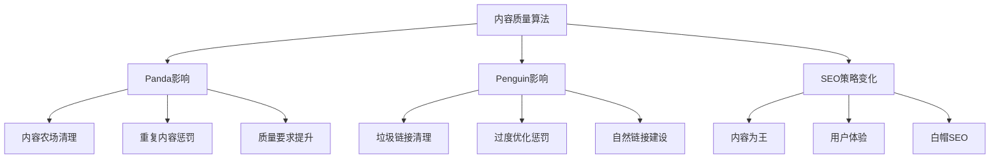

#### SEO策略转变
| 策略方面 | 传统做法 | 新要求 | 应对策略 |
|---------|---------|--------|----------|
| **内容策略** | 关键词堆砌 | 高质量原创 | 内容质量提升 |
| **链接策略** | 数量优先 | 质量优先 | 自然链接建设 |
| **优化策略** | 过度优化 | 自然优化 | 白帽SEO实践 |
| **用户体验** | 次要考虑 | 核心指标 | 用户体验优化 |

### 语义搜索时代（2013-2015）
#### 语义搜索算法时间线


#### 语义搜索算法特点
| 算法名称 | 发布时间 | 主要功能 | 影响程度 | SEO重点 |
|---------|---------|---------|---------|---------|
| **Hummingbird** | 2013年8月 | 语义搜索理解 | 革命性 | 语义化内容 |
| **Pigeon** | 2014年5月 | 本地搜索优化 | 重大 | 本地SEO |
| **Mobilegeddon** | 2015年4月 | 移动友好性 | 重大 | 移动优化 |

#### 语义搜索影响
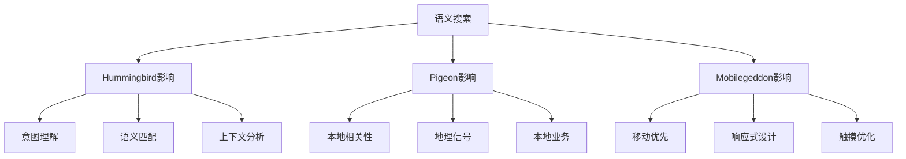

#### SEO策略升级
| 策略方面 | 传统做法 | 新要求 | 应对策略 |
|---------|---------|--------|----------|
| **内容策略** | 关键词匹配 | 语义理解 | 语义化内容 |
| **本地策略** | 基础本地化 | 深度本地化 | 本地SEO优化 |
| **移动策略** | 桌面优先 | 移动优先 | 响应式设计 |
| **用户体验** | 功能导向 | 体验导向 | 用户体验优化 |

### 机器学习时代（2015-2018）
#### 机器学习算法时间线
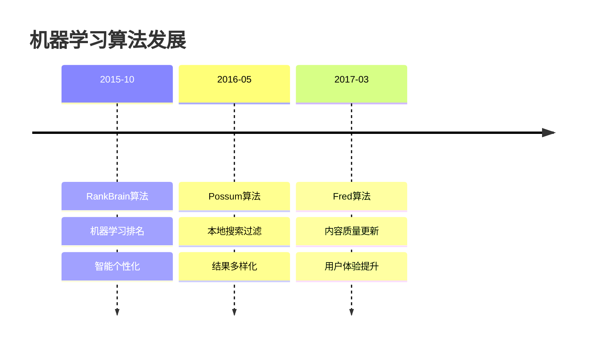

#### 机器学习算法特点
| 算法名称 | 发布时间 | 主要功能 | 影响程度 | SEO重点 |
|---------|---------|---------|---------|---------|
| **RankBrain** | 2015年10月 | 机器学习排名 | 革命性 | 智能优化 |
| **Possum** | 2016年5月 | 本地搜索过滤 | 重大 | 本地SEO |
| **Fred** | 2017年3月 | 内容质量更新 | 重大 | 内容价值 |

#### 机器学习影响
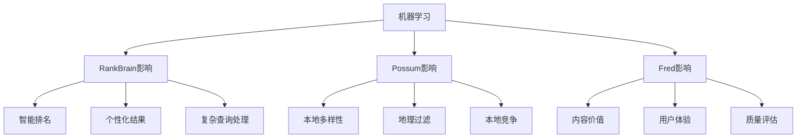

#### SEO策略智能化
| 策略方面 | 传统做法 | 新要求 | 应对策略 |
|---------|---------|--------|----------|
| **排名策略** | 规则优化 | 智能优化 | 机器学习适应 |
| **内容策略** | 基础质量 | 价值导向 | 内容价值提升 |
| **本地策略** | 简单本地化 | 智能本地化 | 本地竞争优化 |
| **用户体验** | 基础体验 | 深度体验 | 用户体验深化 |

### 用户体验时代（2018-2020）
#### 用户体验算法时间线
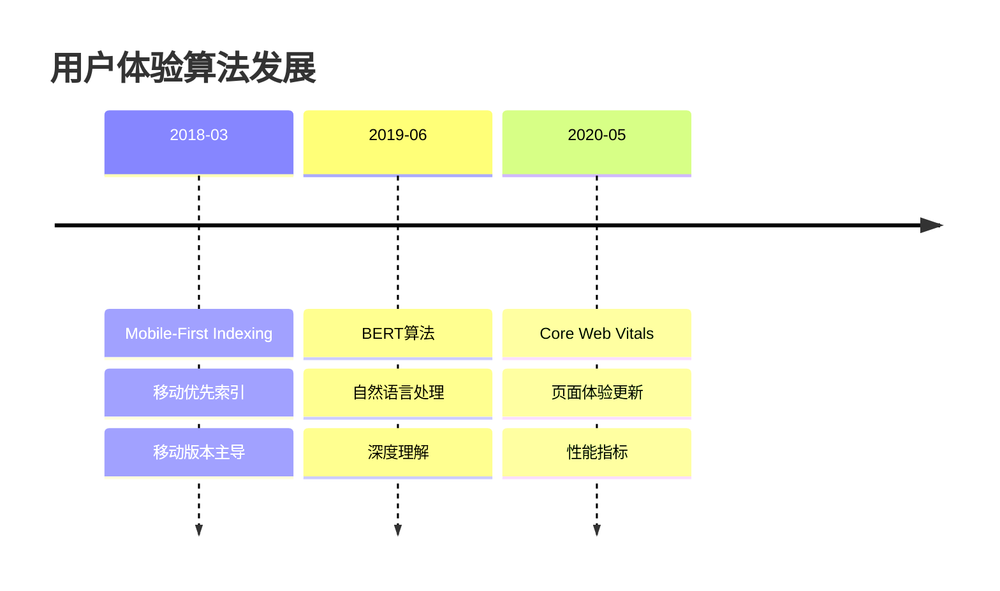

#### 用户体验算法特点
| 算法名称 | 发布时间 | 主要功能 | 影响程度 | SEO重点 |
|---------|---------|---------|---------|---------|
| **Mobile-First** | 2018年3月 | 移动优先索引 | 革命性 | 移动优化 |
| **BERT** | 2019年6月 | 自然语言处理 | 革命性 | 内容理解 |
| **Core Web Vitals** | 2020年5月 | 页面体验 | 重大 | 性能优化 |

#### 用户体验影响
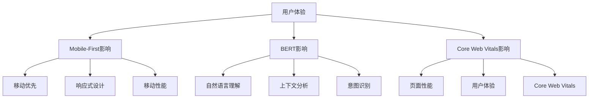

#### SEO策略用户体验化
| 策略方面 | 传统做法 | 新要求 | 应对策略 |
|---------|---------|--------|----------|
| **移动策略** | 桌面为主 | 移动优先 | 移动优先设计 |
| **内容策略** | 关键词导向 | 自然语言 | 自然语言内容 |
| **性能策略** | 基础性能 | 体验性能 | Core Web Vitals优化 |
| **用户体验** | 功能完整 | 体验优秀 | 用户体验优化 |

### 最新发展时代（2021-2024）
#### 最新算法时间线
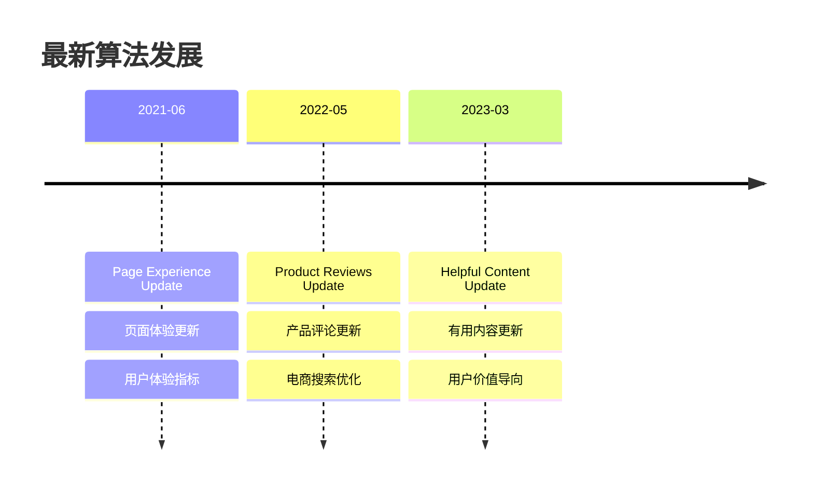

#### 最新算法特点
| 算法名称 | 发布时间 | 主要功能 | 影响程度 | SEO重点 |
|---------|---------|---------|---------|---------|
| **Page Experience** | 2021年6月 | 页面体验 | 重大 | 用户体验 |
| **Product Reviews** | 2022年5月 | 产品评论 | 中等 | 电商SEO |
| **Helpful Content** | 2023年3月 | 有用内容 | 重大 | 内容价值 |

#### 最新算法影响
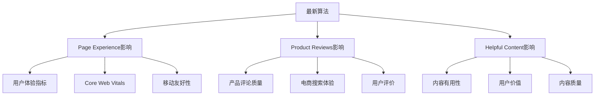

#### SEO策略最新化
| 策略方面 | 传统做法 | 新要求 | 应对策略 |
|---------|---------|--------|----------|
| **用户体验** | 基础体验 | 深度体验 | 全面用户体验优化 |
| **内容策略** | SEO导向 | 用户价值 | 用户价值导向内容 |
| **电商策略** | 基础优化 | 评论优化 | 产品评论优化 |
| **价值策略** | 排名导向 | 价值导向 | 用户价值优先 |

## 🔍 百度算法更新历史

### 早期算法时代（2000-2010）
#### 百度早期算法时间线
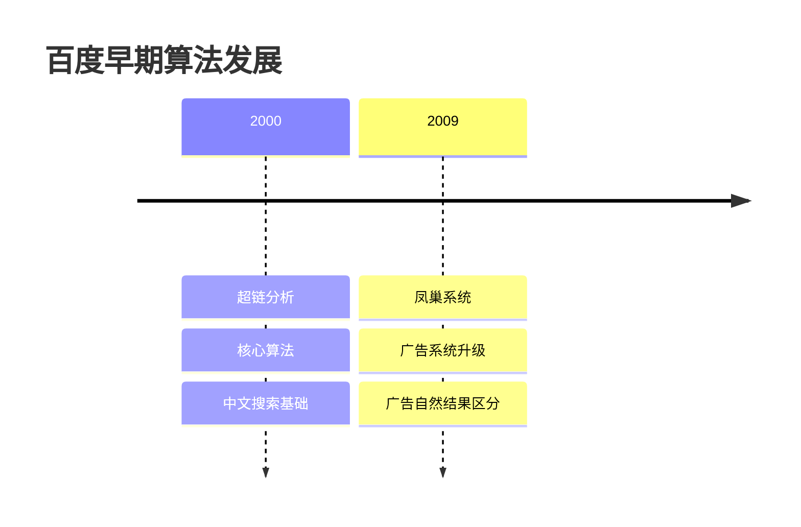

#### 百度早期算法特点
| 算法名称 | 发布时间 | 主要功能 | 影响程度 | SEO重点 |
|---------|---------|---------|---------|---------|
| **超链分析** | 2000年 | 链接分析基础 | 革命性 | 外链建设 |
| **凤巢系统** | 2009年 | 广告系统 | 重大 | 广告优化 |

### 内容质量算法时代（2011-2015）
#### 百度内容质量算法时间线
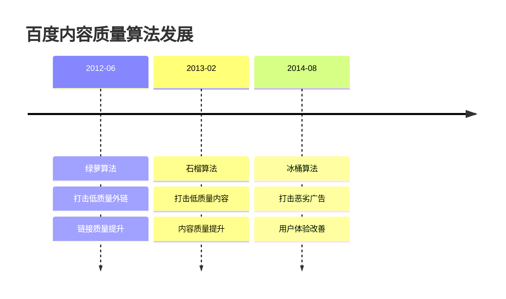

#### 百度内容质量算法特点
| 算法名称 | 发布时间 | 主要功能 | 影响程度 | SEO重点 |
|---------|---------|---------|---------|---------|
| **绿萝算法** | 2012年6月 | 外链质量 | 重大 | 外链质量 |
| **石榴算法** | 2013年2月 | 内容质量 | 重大 | 内容质量 |
| **冰桶算法** | 2014年8月 | 广告质量 | 中等 | 广告优化 |

#### 百度算法影响
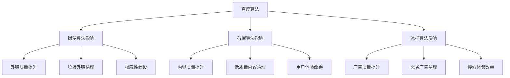

### 移动搜索时代（2015-2018）
#### 百度移动搜索时间线
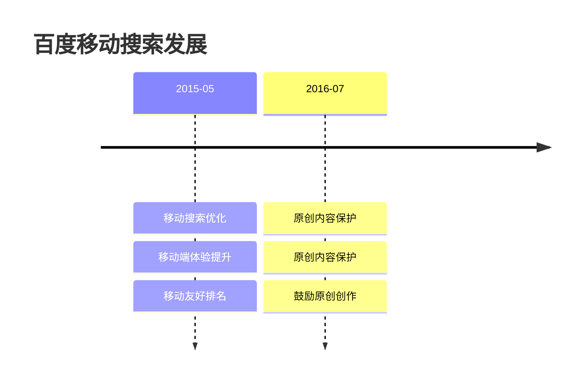

#### 百度移动搜索特点
| 算法名称 | 发布时间 | 主要功能 | 影响程度 | SEO重点 |
|---------|---------|---------|---------|---------|
| **移动搜索优化** | 2015年5月 | 移动体验 | 重大 | 移动优化 |
| **原创内容保护** | 2016年7月 | 原创保护 | 重大 | 原创内容 |

### 人工智能时代（2018-2024）
#### 百度AI算法时间线
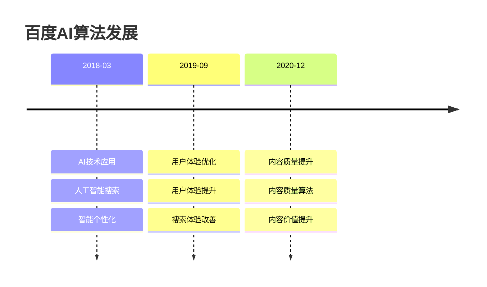

#### 百度AI算法特点
| 算法名称 | 发布时间 | 主要功能 | 影响程度 | SEO重点 |
|---------|---------|---------|---------|---------|
| **AI技术应用** | 2018年3月 | 人工智能 | 重大 | 智能优化 |
| **用户体验优化** | 2019年9月 | 用户体验 | 重大 | 用户体验 |
| **内容质量提升** | 2020年12月 | 内容质量 | 重大 | 内容价值 |

#### 百度AI算法影响
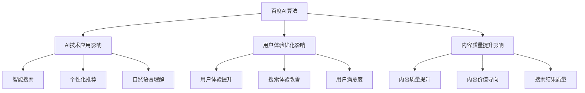

## 🛡️ 算法更新应对策略

### 监控和预警体系
#### 监控工具架构
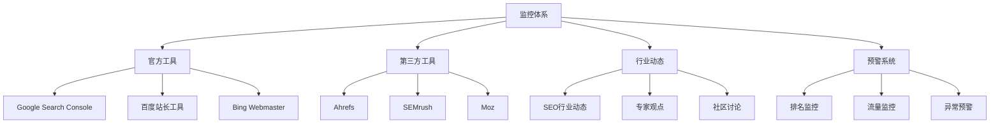

#### 预警信号识别
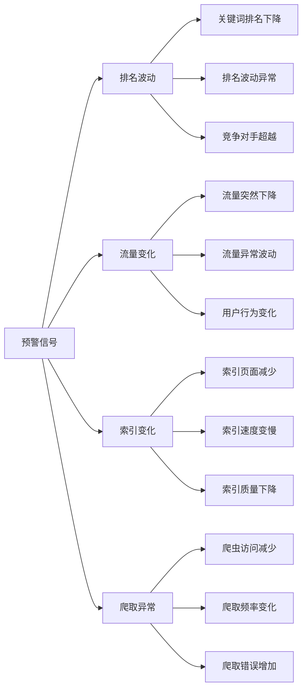

#### 监控要点
| 监控方面 | 监控工具 | 监控频率 | 重要性 |
|---------|---------|---------|--------|
| **排名监控** | Search Console、第三方工具 | 每日 | 极高 |
| **流量监控** | Analytics、第三方工具 | 每日 | 极高 |
| **索引监控** | Search Console、站长工具 | 每周 | 高 |
| **行业动态** | 行业网站、专家博客 | 每日 | 高 |

### 应对策略体系
#### 短期应对策略
```mermaid
flowchart TD
    A[算法更新影响] --> B[问题诊断]
    B --> C[紧急修复]
    C --> D[内容调整]
    D --> E[链接清理]
    E --> F[效果验证]
    
    B --> B1[排名下降分析]
    B --> B2[流量变化分析]
    B --> B3[用户行为分析]
    
    C --> C1[技术问题修复]
    C --> C2[页面速度优化]
    C --> C3[移动友好性修复]
    
    D --> D1[内容质量提升]
    D --> D2[重复内容处理]
    D --> D3[关键词优化调整]
    
    E --> E1[低质量链接清理]
    E --> E2[垃圾链接移除]
    E --> E3[自然链接建设]
    
    F --> F1[排名恢复监控]
    F --> F2[流量恢复分析]
    F --> F3[策略调整优化]
```

#### 长期应对策略
```mermaid
graph LR
    A[长期策略] --> B[白帽SEO]
    A --> C[用户体验]
    A --> D[内容质量]
    A --> E[技术优化]
    
    B --> B1[合规操作]
    B --> B2[自然优化]
    B --> B3[可持续发展]
    
    C --> C1[持续优化]
    C --> C2[用户反馈]
    C --> C3[体验提升]
    
    D --> D1[质量提升]
    D --> D2[价值创造]
    D --> D3[原创保护]
    
    E --> E1[技术改进]
    E --> E2[性能优化]
    E --> E3[安全提升]
```

#### 应对策略对比
| 策略类型 | 时间周期 | 主要措施 | 预期效果 |
|---------|---------|---------|---------|
| **短期应对** | 1-4周 | 问题诊断、紧急修复 | 快速恢复 |
| **中期调整** | 1-3个月 | 内容优化、链接调整 | 稳定提升 |
| **长期策略** | 3-12个月 | 全面优化、持续改进 | 持续增长 |

### 预防措施体系
#### 合规操作框架
```mermaid
graph TD
    A[合规操作] --> B[遵循指南]
    A --> C[质量优先]
    A --> D[用户导向]
    A --> E[持续优化]
    
    B --> B1[搜索引擎指南]
    B --> B2[白帽SEO实践]
    B --> B3[合规检查]
    
    C --> C1[内容质量标准]
    C --> C2[服务质量提升]
    C --> C3[价值创造]
    
    D --> D1[用户需求分析]
    D --> D2[用户体验优化]
    D --> D3[用户反馈收集]
    
    E --> E1[持续监控]
    E --> E2[数据分析]
    E --> E3[策略调整]
```

#### 风险控制措施
```mermaid
graph LR
    A[风险控制] --> B[多样化策略]
    A --> C[数据备份]
    A --> D[应急预案]
    A --> E[专业咨询]
    
    B --> B1[多渠道SEO]
    B --> B2[多样化内容]
    B --> B3[分散风险]
    
    C --> C1[数据备份]
    C --> C2[版本控制]
    C --> C3[恢复计划]
    
    D --> D1[应急预案]
    D --> D2[快速响应]
    D --> D3[危机管理]
    
    E --> E1[专业咨询]
    E --> E2[行业专家]
    E --> E3[技术指导]
```

#### 预防要点
| 预防方面 | 具体措施 | 实施频率 | 重要性 |
|---------|---------|---------|--------|
| **合规操作** | 遵守搜索引擎指南 | 持续 | 极高 |
| **质量优先** | 提升内容和服务质量 | 持续 | 极高 |
| **用户导向** | 以用户需求为导向 | 持续 | 高 |
| **风险控制** | 多样化策略、应急预案 | 定期 | 高 |

## 🚀 未来趋势预测

### 技术发展趋势
#### 技术趋势分析
```mermaid
graph TD
    A[技术趋势] --> B[人工智能]
    A --> C[语音搜索]
    A --> D[视觉搜索]
    A --> E[实时搜索]
    
    B --> B1[深度学习]
    B --> B2[自然语言处理]
    B --> B3[智能推荐]
    
    C --> C1[语音识别]
    C --> C2[智能助手]
    C --> C3[对话搜索]
    
    D --> D1[图像识别]
    D --> D2[视频搜索]
    D --> D3[AR/VR搜索]
    
    E --> E1[实时内容]
    E --> E2[动态结果]
    E --> E3[即时更新]
```

#### 技术趋势预测
| 技术领域 | 发展程度 | 预期影响 | SEO准备 |
|---------|---------|---------|---------|
| **人工智能** | 快速发展 | 极高 | AI技术学习 |
| **语音搜索** | 快速发展 | 高 | 语音优化 |
| **视觉搜索** | 发展中 | 中 | 视觉内容优化 |
| **实时搜索** | 发展中 | 中 | 实时内容策略 |

### 优化发展趋势
#### 优化趋势分析
```mermaid
graph LR
    A[优化趋势] --> B[用户体验]
    A --> C[内容质量]
    A --> D[技术标准]
    A --> E[个性化]
    
    B --> B1[Core Web Vitals]
    B --> B2[页面体验]
    B --> B3[用户满意度]
    
    C --> C1[原创性要求]
    C --> C2[价值导向]
    C --> C3[用户有用性]
    
    D --> D1[技术规范]
    D --> D2[性能要求]
    D --> D3[安全标准]
    
    E --> E1[个性化结果]
    E --> E2[用户画像]
    E --> E3[定制化体验]
```

#### 优化趋势预测
| 优化方面 | 发展趋势 | 影响程度 | 应对策略 |
|---------|---------|---------|----------|
| **用户体验** | 持续重视 | 极高 | 全面用户体验优化 |
| **内容质量** | 要求提升 | 极高 | 内容价值导向 |
| **技术标准** | 更加严格 | 高 | 技术标准遵循 |
| **个性化** | 快速发展 | 中 | 个性化策略 |

### 应对建议体系
#### 综合应对策略
```mermaid
graph TD
    A[应对建议] --> B[技术准备]
    A --> C[内容策略]
    A --> D[用户体验]
    A --> E[数据驱动]
    
    B --> B1[新技术学习]
    B --> B2[技术升级]
    B --> B3[系统优化]
    
    C --> C1[内容智能化]
    C --> C2[多媒体内容]
    C --> C3[实时内容]
    
    D --> D1[体验持续优化]
    D --> D2[个性化体验]
    D --> D3[交互优化]
    
    E --> E1[数据分析]
    E --> E2[决策支持]
    E --> E3[效果评估]
```

#### 应对优先级
| 应对方面 | 优先级 | 实施难度 | 预期效果 |
|---------|--------|---------|---------|
| **技术准备** | 极高 | 中等 | 长期竞争力 |
| **内容策略** | 高 | 中等 | 内容优势 |
| **用户体验** | 极高 | 中等 | 用户满意度 |
| **数据驱动** | 高 | 低 | 决策准确性 |

## 🎯 费曼学习法应用

### 用简单语言解释算法更新历史
**向朋友解释**：
"搜索引擎算法更新历史就像是搜索引擎的成长历程，从最初的简单关键词匹配，到现在的AI智能理解，每一次更新都是为了更好地理解用户需求，提供更准确的搜索结果。"

### 核心概念简化
1. **算法更新 = 搜索引擎的进化**
2. **历史时间线 = 进化过程**
3. **应对策略 = 适应进化的方法**
4. **未来趋势 = 进化的方向**

## 🔗 相关链接

- [[搜索引擎排名算法]] - 了解算法如何影响排名
- [[搜索引擎发展趋势]] - 掌握搜索引擎发展方向
- [[SEO核心目标]] - 理解SEO的最终目标
- [[算法更新应对策略]] - 学习应对算法更新的方法

---

**下一步学习**：了解 [[SEO发展历程]]，掌握SEO的历史演进和未来趋势
