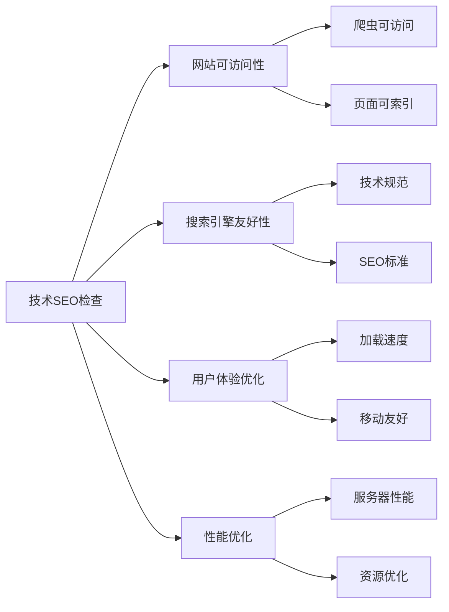
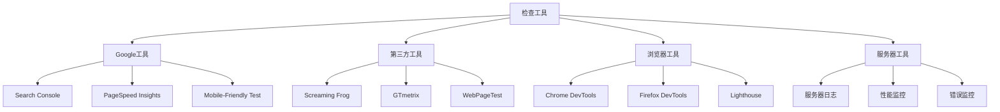
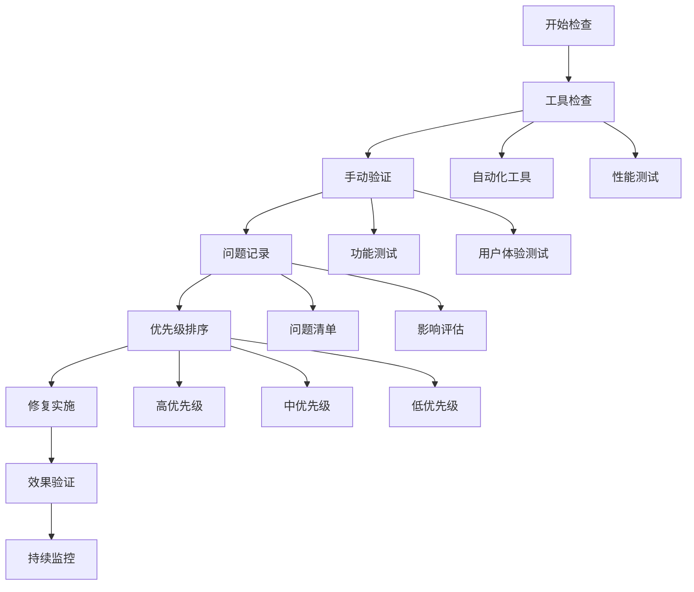
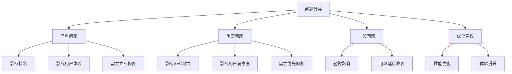
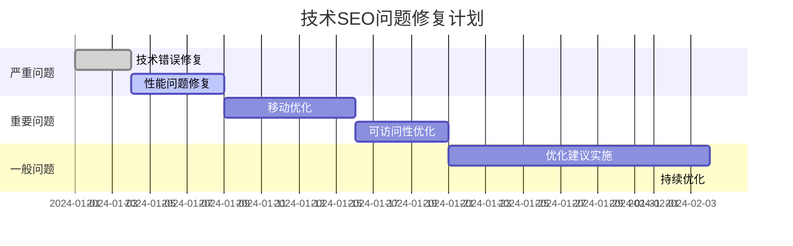

# 技术SEO检查清单

> **使用说明**：系统化的技术SEO检查清单，确保网站技术基础完善，为SEO成功奠定基础

## 🎯 技术SEO检查概述

### 检查目的
**技术SEO检查** = 确保网站技术基础 + 提升搜索引擎友好性 + 优化用户体验

## 📋 完整检查清单

### 1. 网站架构检查
#### URL结构检查
- [ ] **URL格式**：使用清晰、简洁的URL格式
- [ ] **URL层次**：URL反映网站内容层次
- [ ] **URL长度**：URL长度适中（< 100字符）
- [ ] **URL参数**：避免过多URL参数
- [ ] **URL重定向**：正确设置301重定向
- [ ] **URL规范化**：使用canonical标签

#### 导航结构检查
- [ ] **主导航**：主导航清晰、易用
- [ ] **面包屑导航**：提供面包屑导航
- [ ] **内链结构**：内链结构合理
- [ ] **页面深度**：重要页面深度不超过3层
- [ ] **404页面**：设置友好的404错误页面
- [ ] **网站地图**：提供HTML网站地图

### 2. 页面技术检查
#### HTML结构检查
- [ ] **HTML5标准**：使用HTML5标准
- [ ] **语义化标签**：正确使用语义化标签
- [ ] **H1标签**：每个页面只有一个H1标签
- [ ] **标题层次**：H1-H6标签层次清晰
- [ ] **代码验证**：HTML代码通过W3C验证
- [ ] **字符编码**：正确设置字符编码（UTF-8）

#### Meta标签检查
- [ ] **Title标签**：每个页面都有唯一的Title
- [ ] **Meta Description**：每个页面都有描述
- [ ] **Meta Keywords**：可选，避免堆砌
- [ ] **Meta Robots**：正确设置robots指令
- [ ] **Canonical标签**：设置规范URL
- [ ] **Open Graph**：设置社交媒体标签

### 3. 移动优化检查
#### 移动友好性检查
- [ ] **响应式设计**：网站适配所有设备
- [ ] **Viewport设置**：正确设置viewport标签
- [ ] **触摸友好**：触摸目标大小合适（≥ 44px）
- [ ] **移动导航**：移动端导航清晰易用
- [ ] **移动速度**：移动端加载速度 < 3秒
- [ ] **移动测试**：通过Google移动友好性测试

#### 移动性能检查
- [ ] **移动LCP**：移动端LCP < 2.5秒
- [ ] **移动FID**：移动端FID < 100ms
- [ ] **移动CLS**：移动端CLS < 0.1
- [ ] **移动资源**：移动端资源优化
- [ ] **移动缓存**：移动端缓存策略
- [ ] **移动CDN**：移动端CDN配置

### 4. 页面速度检查
#### 性能指标检查
- [ ] **页面加载时间**：< 3秒
- [ ] **首字节时间**：< 600ms
- [ ] **LCP指标**：< 2.5秒
- [ ] **FID指标**：< 100ms
- [ ] **CLS指标**：< 0.1
- [ ] **TTI指标**：< 3.8秒

#### 资源优化检查
- [ ] **图片优化**：图片压缩、格式优化
- [ ] **CSS优化**：CSS压缩、合并
- [ ] **JavaScript优化**：JS压缩、合并
- [ ] **字体优化**：字体加载优化
- [ ] **资源压缩**：启用Gzip压缩
- [ ] **缓存策略**：设置合适的缓存策略

### 5. 安全性检查
#### 安全配置检查
- [ ] **HTTPS**：网站使用HTTPS
- [ ] **SSL证书**：SSL证书有效
- [ ] **安全头**：设置HTTP安全头
- [ ] **数据加密**：用户数据加密
- [ ] **漏洞扫描**：定期安全漏洞扫描
- [ ] **备份策略**：数据备份策略

#### 隐私保护检查
- [ ] **隐私政策**：提供隐私政策
- [ ] **Cookie政策**：Cookie使用说明
- [ ] **数据保护**：用户数据保护措施
- [ ] **GDPR合规**：符合GDPR要求
- [ ] **用户权利**：保障用户数据权利
- [ ] **数据删除**：提供数据删除功能

### 6. 可访问性检查
#### 无障碍访问检查
- [ ] **语义化HTML**：使用语义化HTML标签
- [ ] **ARIA标签**：使用ARIA标签增强可访问性
- [ ] **键盘导航**：支持键盘导航
- [ ] **屏幕阅读器**：兼容屏幕阅读器
- [ ] **颜色对比度**：文字与背景对比度足够
- [ ] **字体大小**：字体大小合适

#### 内容可访问性检查
- [ ] **图片Alt属性**：所有图片都有Alt属性
- [ ] **视频字幕**：视频提供字幕
- [ ] **音频描述**：音频提供文字描述
- [ ] **替代方案**：提供多媒体内容的替代方案
- [ ] **语言标识**：正确标识页面语言
- [ ] **焦点管理**：合理管理焦点

## 🔍 检查工具和方法

### 自动化检查工具
#### 技术SEO工具

#### 工具使用建议
| 工具类型 | 工具名称 | 检查内容 | 使用频率 |
|---------|---------|---------|----------|
| **官方工具** | Google Search Console | 索引状态、技术问题 | 每日 |
| **性能工具** | PageSpeed Insights | 页面性能、Core Web Vitals | 每周 |
| **技术工具** | Screaming Frog | 技术SEO、网站结构 | 每月 |
| **移动工具** | Mobile-Friendly Test | 移动友好性 | 每周 |

### 手动检查方法
#### 检查流程

## 📊 检查结果分析

### 问题分类
#### 问题严重程度

#### 问题优先级矩阵
| 问题类型 | 影响程度 | 修复难度 | 优先级 | 修复时间 |
|---------|---------|---------|--------|----------|
| **技术错误** | 高 | 低 | 极高 | 立即 |
| **性能问题** | 高 | 中 | 高 | 1周内 |
| **移动问题** | 中 | 中 | 高 | 2周内 |
| **可访问性问题** | 中 | 低 | 中 | 1个月内 |
| **优化建议** | 低 | 低 | 低 | 长期规划 |

### 修复计划
#### 修复优先级

## 🎯 检查最佳实践

### 检查频率
#### 定期检查计划
| 检查类型 | 检查频率 | 检查内容 | 负责人 |
|---------|---------|---------|--------|
| **日常检查** | 每日 | 基本功能、性能监控 | 技术团队 |
| **周度检查** | 每周 | 性能指标、移动友好性 | SEO团队 |
| **月度检查** | 每月 | 全面技术SEO检查 | 技术+SEO团队 |
| **季度检查** | 每季度 | 深度技术审计 | 外部专家 |

### 检查流程
#### 标准化流程
1. **准备阶段**：准备检查工具、确定检查范围
2. **执行阶段**：按清单逐项检查
3. **记录阶段**：记录发现的问题
4. **分析阶段**：分析问题影响和优先级
5. **修复阶段**：按优先级修复问题
6. **验证阶段**：验证修复效果
7. **监控阶段**：持续监控和优化

## 🎯 费曼学习法应用

### 用简单语言解释技术SEO检查
**向朋友解释**：
"技术SEO检查就像是给网站做体检，检查网站的技术基础是否健康，搜索引擎是否能正常访问和理解你的网站，用户是否能正常使用你的网站。"

### 核心概念简化
1. **技术SEO检查 = 网站技术体检**
2. **检查清单 = 体检项目列表**
3. **问题修复 = 治疗疾病**
4. **持续监控 = 定期体检**

## 🔗 相关链接

- [[网站架构优化]] - 了解网站架构优化方法
- [[页面技术优化]] - 学习页面技术优化技巧
- [[移动端优化]] - 了解移动端优化要点
- [[网站速度优化]] - 学习网站速度优化方法

---

**下一步学习**：学习 [[技术问题诊断决策树]]，掌握技术问题的诊断方法
