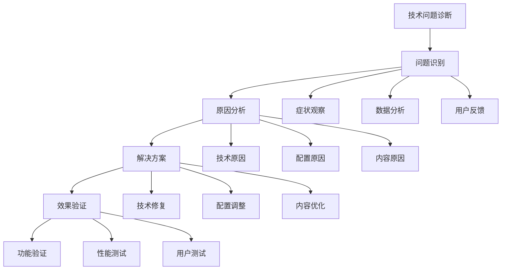
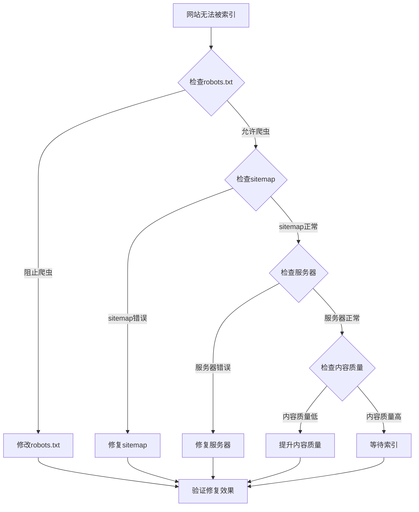
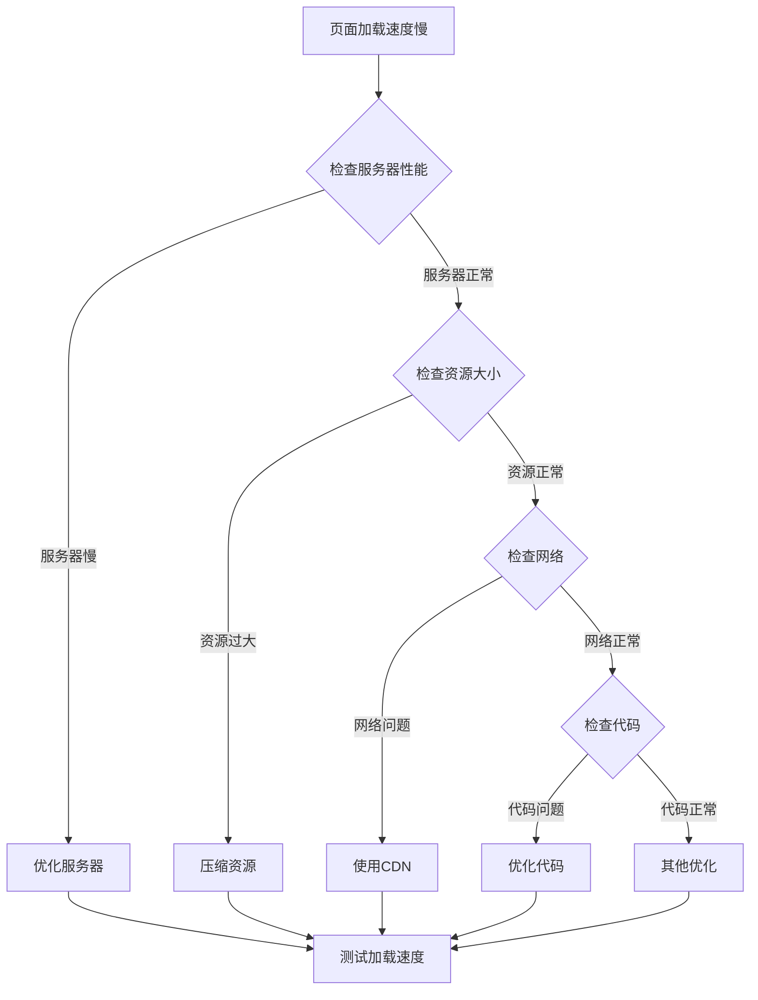
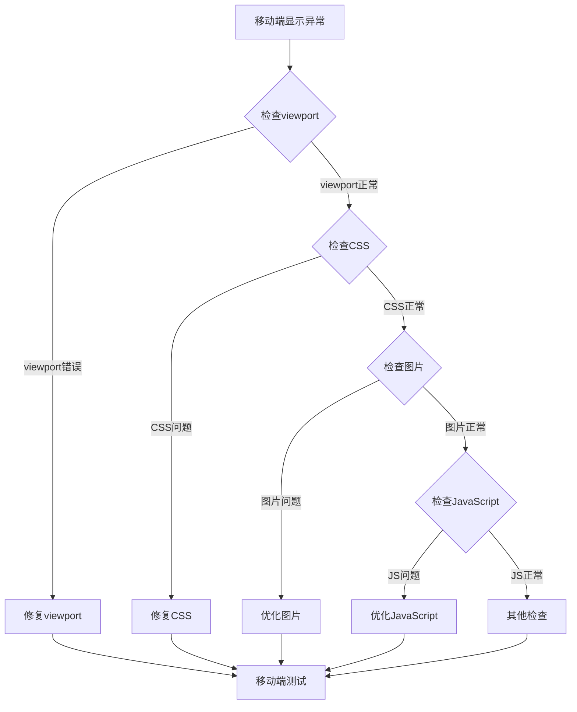
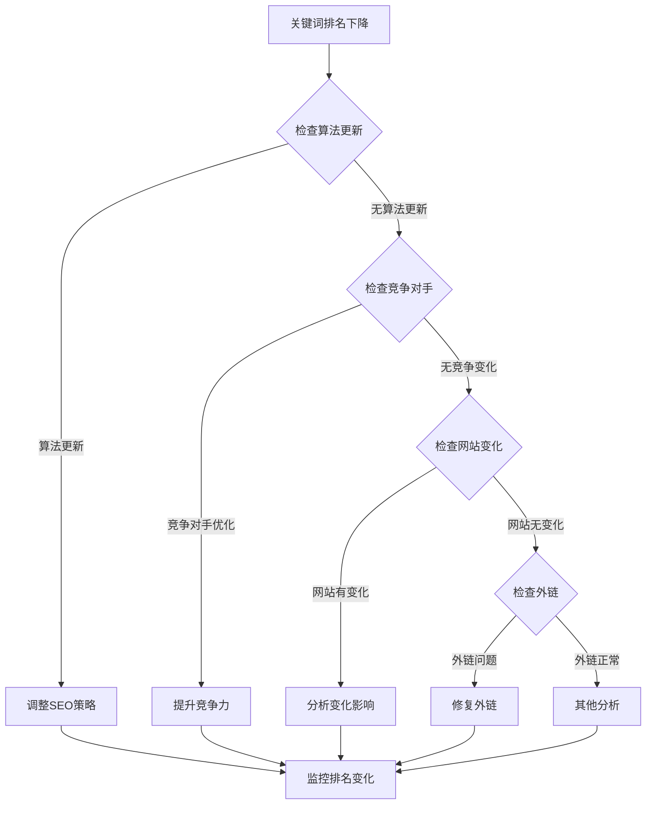
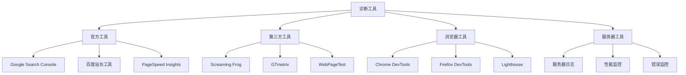
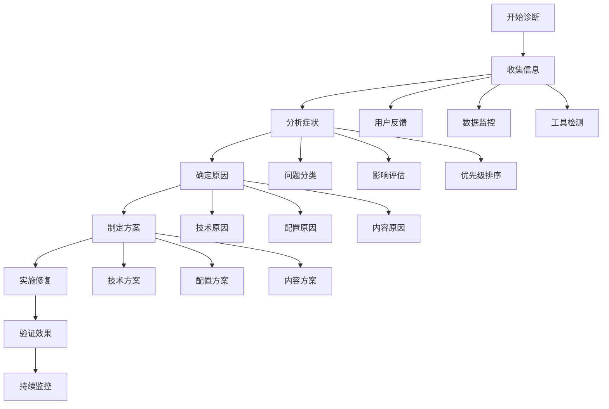
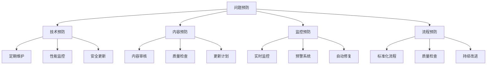

# 技术问题诊断决策树

> **核心理念**：系统化的技术问题诊断方法，快速定位和解决SEO技术问题

## 🎯 诊断决策树概述

### 什么是诊断决策树
**技术问题诊断决策树** = 问题识别 + 原因分析 + 解决方案 + 效果验证

**简单理解**：诊断决策树就像是医生的诊断流程，通过观察症状、分析原因、制定治疗方案、验证治疗效果来解决问题。

## 🔍 主要问题诊断树

### 1. 网站无法被搜索引擎索引
#### 诊断决策树

#### 解决方案
| 问题原因 | 解决方案 | 实施步骤 | 预期效果 |
|---------|---------|---------|----------|
| **robots.txt阻止** | 修改robots.txt文件 | 1.检查文件内容 2.修改配置 3.验证效果 | 立即生效 |
| **sitemap错误** | 修复sitemap文件 | 1.检查sitemap格式 2.修复错误 3.重新提交 | 1-2天生效 |
| **服务器问题** | 修复服务器配置 | 1.检查服务器状态 2.修复配置 3.重启服务 | 立即生效 |
| **内容质量问题** | 提升内容质量 | 1.分析内容问题 2.优化内容 3.重新提交 | 1-2周生效 |

### 2. 页面加载速度慢
#### 诊断决策树

#### 性能优化方案
| 问题原因 | 优化方法 | 预期效果 | 实施难度 |
|---------|---------|---------|----------|
| **服务器性能** | 升级服务器、优化配置 | 提升30-50% | 中等 |
| **资源过大** | 压缩图片、CSS、JS | 减少50-80% | 低 |
| **网络问题** | 使用CDN加速 | 提升40-60% | 低 |
| **代码问题** | 优化HTML、CSS、JS | 提升20-30% | 中等 |

### 3. 移动端显示异常
#### 诊断决策树

#### 移动端优化方案
| 问题类型 | 优化方法 | 预期效果 | 实施难度 |
|---------|---------|---------|----------|
| **viewport问题** | 正确设置viewport标签 | 立即修复 | 低 |
| **CSS问题** | 修复响应式CSS | 适配所有设备 | 中等 |
| **图片问题** | 优化移动端图片 | 提升加载速度 | 低 |
| **JavaScript问题** | 优化移动端JS | 提升交互体验 | 中等 |

### 4. 关键词排名下降
#### 诊断决策树

#### 排名恢复方案
| 问题原因 | 恢复策略 | 实施步骤 | 预期时间 |
|---------|---------|---------|----------|
| **算法更新** | 调整SEO策略 | 1.分析算法变化 2.调整策略 3.实施优化 | 1-3个月 |
| **竞争对手优化** | 提升竞争力 | 1.分析竞争对手 2.制定策略 3.实施优化 | 2-6个月 |
| **网站变化** | 修复负面影响 | 1.识别问题 2.修复问题 3.恢复优化 | 1-2个月 |
| **外链问题** | 修复外链质量 | 1.清理垃圾外链 2.建设高质量外链 | 3-6个月 |

## 🛠️ 诊断工具和方法

### 诊断工具选择
#### 工具分类

#### 工具使用场景
| 问题类型 | 推荐工具 | 使用场景 | 优势 |
|---------|---------|---------|------|
| **索引问题** | Google Search Console | 检查索引状态 | 官方数据、权威 |
| **性能问题** | PageSpeed Insights | 性能分析 | 免费、详细 |
| **技术问题** | Screaming Frog | 技术SEO审计 | 全面、专业 |
| **移动问题** | Mobile-Friendly Test | 移动友好性测试 | 官方、准确 |

### 诊断方法
#### 系统化诊断流程

## 📊 常见问题解决方案

### 技术问题解决方案
#### 服务器问题
| 问题类型 | 症状 | 原因 | 解决方案 |
|---------|------|------|----------|
| **服务器宕机** | 网站无法访问 | 服务器故障 | 重启服务器、检查硬件 |
| **响应慢** | 页面加载慢 | 服务器性能不足 | 升级服务器、优化配置 |
| **错误率高** | 大量5xx错误 | 服务器配置错误 | 检查配置、修复错误 |
| **安全漏洞** | 安全警告 | 安全配置不当 | 更新安全配置、修复漏洞 |

#### 网站结构问题
| 问题类型 | 症状 | 原因 | 解决方案 |
|---------|------|------|----------|
| **URL结构混乱** | 重复URL、参数过多 | URL设计不当 | 重构URL结构、设置重定向 |
| **导航不清晰** | 用户找不到内容 | 导航设计问题 | 优化导航结构、添加面包屑 |
| **内链结构差** | 页面权重分配不均 | 内链建设不当 | 优化内链结构、权重分配 |
| **404错误多** | 大量404页面 | 链接失效 | 修复链接、设置重定向 |

### 内容问题解决方案
#### 内容质量问题
| 问题类型 | 症状 | 原因 | 解决方案 |
|---------|------|------|----------|
| **重复内容** | 多个页面内容相似 | 内容重复 | 合并页面、使用canonical |
| **内容质量低** | 排名下降、用户跳出 | 内容价值低 | 提升内容质量、增加价值 |
| **关键词堆砌** | 可能被算法惩罚 | 过度优化 | 自然使用关键词、提升可读性 |
| **内容过时** | 排名下降、用户流失 | 内容未更新 | 定期更新内容、保持新鲜度 |

## 🎯 问题预防策略

### 预防措施
#### 技术预防

#### 预防策略
- **定期维护**：定期检查和维护网站
- **性能监控**：实时监控网站性能
- **安全更新**：及时更新安全补丁
- **内容审核**：定期审核内容质量
- **流程标准化**：建立标准化的工作流程

## 🎯 费曼学习法应用

### 用简单语言解释技术问题诊断
**向朋友解释**：
"技术问题诊断就像是医生看病，先观察症状（网站问题），然后分析原因（技术问题），最后制定治疗方案（修复方案），并验证治疗效果（测试修复结果）。"

### 核心概念简化
1. **诊断 = 找出问题原因**
2. **决策树 = 系统化的诊断流程**
3. **解决方案 = 修复问题的方法**
4. **验证 = 确认问题已解决**

## 🔗 相关链接

- [[技术SEO检查清单]] - 了解技术SEO检查项目
- [[网站架构优化]] - 学习网站架构优化方法
- [[页面技术优化]] - 了解页面技术优化技巧
- [[网站速度优化]] - 学习网站速度优化方法

---

**下一步学习**：学习 [[网站架构优化]]，掌握网站架构的优化方法
