# 网站速度优化

> **核心理念**：网站速度是SEO和用户体验的关键因素，直接影响排名和转化率

## 🚀 网站速度概述

### 为什么网站速度重要
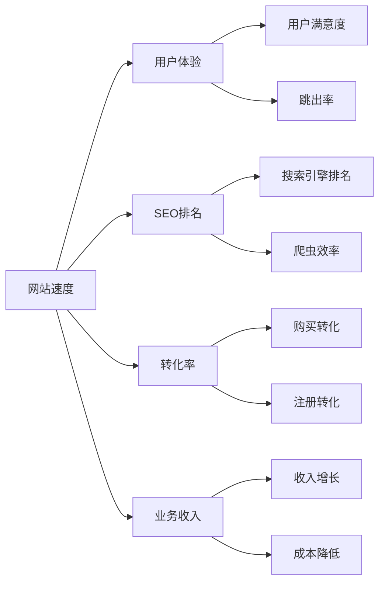

**速度影响数据**：
- **加载时间每增加1秒**：转化率下降7%
- **移动端加载时间超过3秒**：53%用户会离开
- **页面速度是Google排名因素**：直接影响SEO效果

### 速度优化目标
| 指标 | 目标值 | 重要性 | 影响 |
|------|--------|--------|------|
| **LCP（最大内容绘制）** | < 2.5秒 | 极高 | 用户感知的加载速度 |
| **FID（首次输入延迟）** | < 100ms | 极高 | 页面交互响应速度 |
| **CLS（累积布局偏移）** | < 0.1 | 极高 | 页面稳定性 |
| **TTFB（首字节时间）** | < 600ms | 高 | 服务器响应速度 |
| **FCP（首次内容绘制）** | < 1.8秒 | 高 | 内容可见时间 |

## 📊 Core Web Vitals详解

### LCP（Largest Contentful Paint）
#### 什么是LCP
**LCP = 最大内容绘制时间**

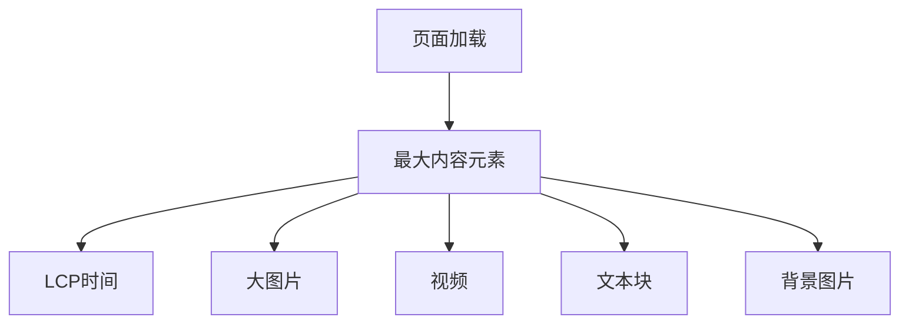

#### LCP优化策略
| 优化方法 | 具体措施 | 预期效果 | 实施难度 |
|---------|---------|---------|----------|
| **图片优化** | 压缩图片、使用WebP格式 | 减少50-80%图片大小 | 中等 |
| **CDN使用** | 部署CDN加速静态资源 | 提升30-50%加载速度 | 低 |
| **服务器优化** | 优化服务器配置 | 提升20-30%响应速度 | 中等 |
| **资源优先级** | 优先加载关键资源 | 提升用户体验 | 中等 |

### FID（First Input Delay）
#### 什么是FID
**FID = 首次输入延迟**

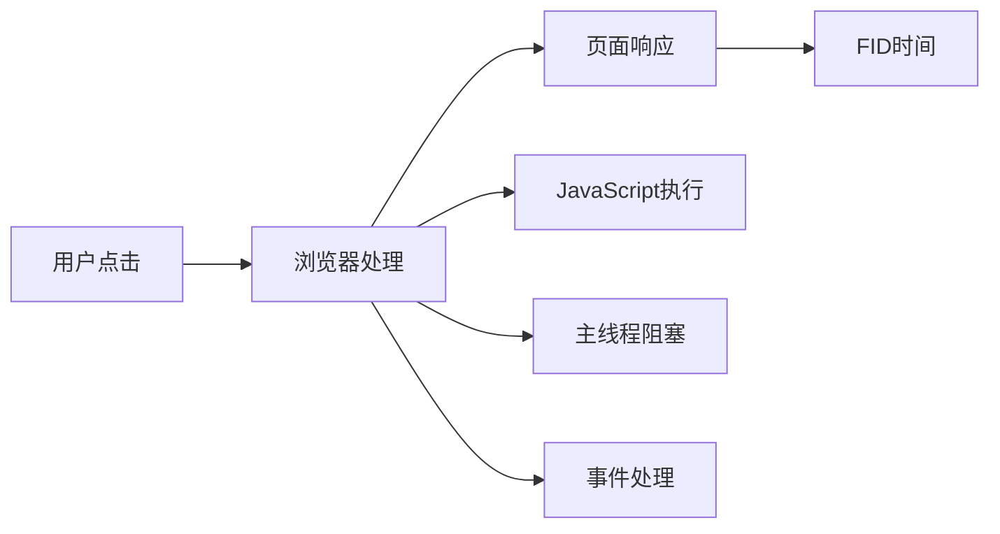

#### FID优化策略
| 优化方法 | 具体措施 | 预期效果 | 实施难度 |
|---------|---------|---------|----------|
| **JavaScript优化** | 代码分割、延迟加载 | 减少主线程阻塞 | 中等 |
| **第三方脚本** | 异步加载、延迟执行 | 提升交互响应 | 低 |
| **事件处理** | 优化事件监听器 | 提升响应速度 | 中等 |
| **内存管理** | 避免内存泄漏 | 提升长期性能 | 高 |

### CLS（Cumulative Layout Shift）
#### 什么是CLS
**CLS = 累积布局偏移**

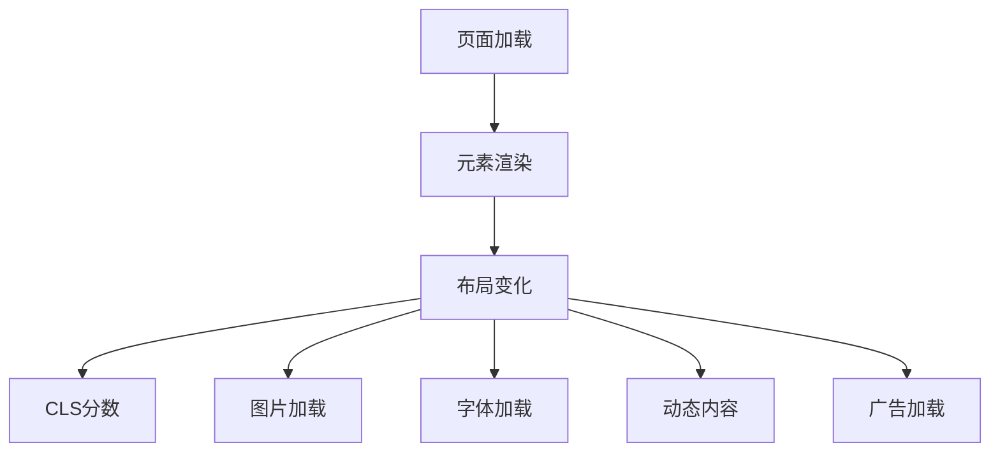

#### CLS优化策略
| 优化方法 | 具体措施 | 预期效果 | 实施难度 |
|---------|---------|---------|----------|
| **图片尺寸** | 设置明确的宽高 | 避免布局偏移 | 低 |
| **字体优化** | 使用font-display | 减少文字跳动 | 中等 |
| **动态内容** | 预留空间 | 避免内容跳动 | 中等 |
| **广告优化** | 固定广告位 | 减少布局影响 | 低 |

## 🔧 技术优化方法

### 服务器端优化
#### 服务器配置优化
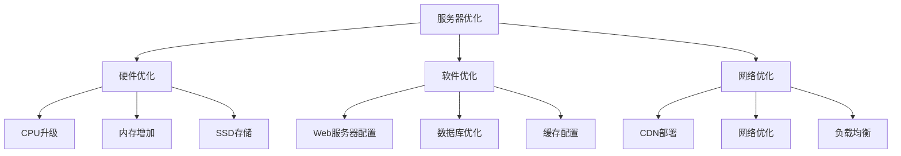

#### 服务器优化清单
- [ ] **Web服务器配置**：优化Apache/Nginx配置
- [ ] **数据库优化**：优化数据库查询和索引
- [ ] **缓存配置**：启用服务器端缓存
- [ ] **压缩启用**：启用Gzip/Brotli压缩
- [ ] **HTTP/2**：升级到HTTP/2协议

### 前端优化
#### 资源优化
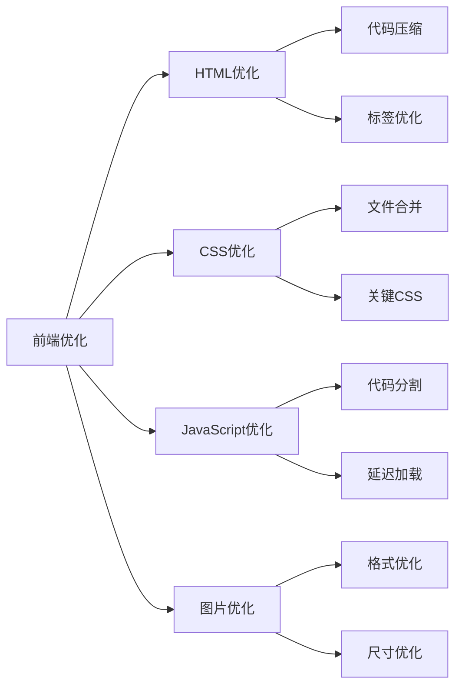

#### 前端优化策略
| 资源类型 | 优化方法 | 工具推荐 | 预期效果 |
|---------|---------|---------|----------|
| **HTML** | 代码压缩、标签优化 | HTMLMinifier | 减少20-30%文件大小 |
| **CSS** | 文件合并、关键CSS | PurgeCSS、Critical | 减少40-60%文件大小 |
| **JavaScript** | 代码分割、Tree Shaking | Webpack、Rollup | 减少30-50%文件大小 |
| **图片** | 格式优化、压缩 | ImageOptim、TinyPNG | 减少50-80%文件大小 |

### 缓存策略
#### 缓存层次
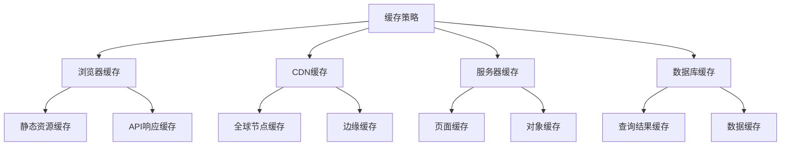

#### 缓存配置
| 缓存类型 | 缓存时间 | 适用资源 | 配置方法 |
|---------|---------|---------|----------|
| **静态资源** | 1年 | CSS、JS、图片 | Cache-Control: max-age=31536000 |
| **HTML页面** | 1小时 | 动态页面 | Cache-Control: max-age=3600 |
| **API响应** | 5分钟 | API数据 | Cache-Control: max-age=300 |
| **图片资源** | 6个月 | 图片文件 | Cache-Control: max-age=15552000 |

## 🖼️ 图片优化

### 图片格式选择
#### 现代图片格式
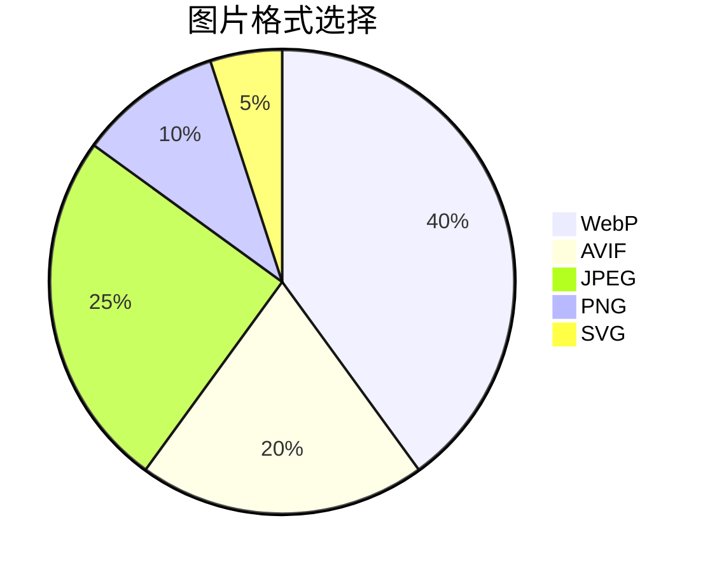

| 格式 | 优势 | 劣势 | 适用场景 | 浏览器支持 |
|------|------|------|----------|-----------|
| **WebP** | 压缩率高、质量好 | 兼容性一般 | 照片、复杂图像 | 95%+ |
| **AVIF** | 压缩率最高 | 兼容性差 | 高质量图片 | 85%+ |
| **JPEG** | 兼容性好 | 压缩率一般 | 照片、复杂图像 | 100% |
| **PNG** | 支持透明 | 文件较大 | 图标、简单图像 | 100% |
| **SVG** | 矢量、可缩放 | 不适合照片 | 图标、简单图形 | 100% |

### 图片优化策略
#### 响应式图片
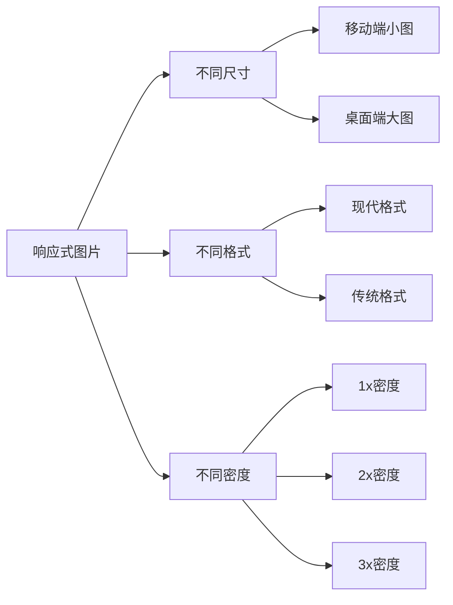

#### 图片优化清单
- [ ] **格式选择**：使用WebP等现代格式
- [ ] **尺寸优化**：提供不同尺寸的图片
- [ ] **压缩优化**：使用工具压缩图片
- [ ] **懒加载**：实现图片懒加载
- [ ] **尺寸设置**：设置明确的宽高属性

## 📱 移动端优化

### 移动端性能特点
#### 移动端挑战
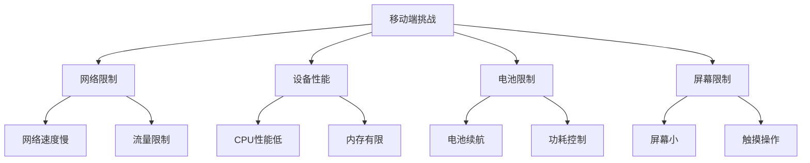

### 移动端优化策略
#### 性能优化
| 优化方面 | 具体措施 | 预期效果 | 实施难度 |
|---------|---------|---------|----------|
| **网络优化** | 减少HTTP请求、压缩资源 | 提升30-50%加载速度 | 中等 |
| **渲染优化** | 关键CSS内联、延迟加载 | 提升用户体验 | 中等 |
| **交互优化** | 优化触摸事件、减少重绘 | 提升交互响应 | 高 |
| **电池优化** | 减少CPU使用、优化动画 | 延长电池续航 | 中等 |

#### 移动端最佳实践
- [ ] **关键CSS内联**：内联首屏关键CSS
- [ ] **图片优化**：使用适合移动端的图片尺寸
- [ ] **JavaScript优化**：延迟加载非关键JavaScript
- [ ] **触摸优化**：优化触摸交互体验
- [ ] **网络优化**：减少网络请求数量

## 🛠️ 优化工具和方法

### 性能测试工具
#### 测试工具对比
| 工具 | 功能 | 优势 | 适用场景 |
|------|------|------|----------|
| **PageSpeed Insights** | Google官方工具 | 权威、免费 | 日常测试 |
| **GTmetrix** | 综合性能测试 | 功能全面、报告详细 | 深度分析 |
| **WebPageTest** | 详细性能分析 | 测试选项丰富 | 专业分析 |
| **Lighthouse** | Chrome开发者工具 | 集成度高、实时测试 | 开发调试 |

#### 测试流程
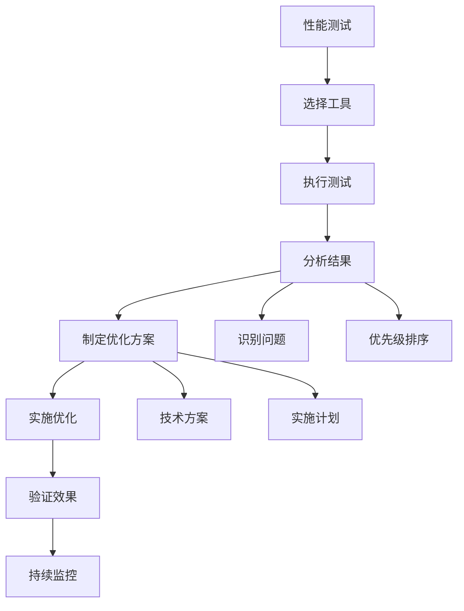

### 优化实施流程
#### 优化优先级
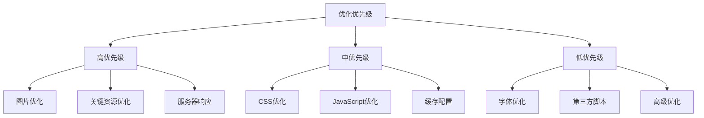

#### 实施步骤
1. **性能测试**：使用工具测试当前性能
2. **问题识别**：识别影响性能的关键问题
3. **优先级排序**：按影响程度排序优化项目
4. **实施优化**：按优先级实施优化措施
5. **效果验证**：测试优化后的性能提升
6. **持续监控**：建立持续监控机制

## 📈 性能监控

### 监控指标
#### 关键指标
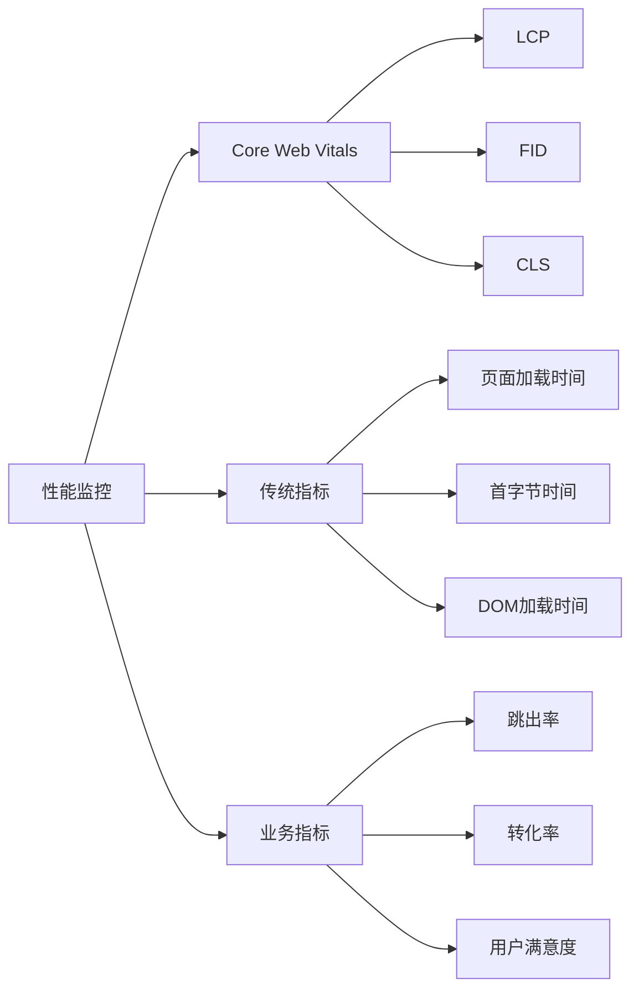

#### 监控工具
| 工具类型 | 工具名称 | 监控范围 | 优势 |
|---------|---------|---------|------|
| **实时监控** | Google Analytics | 真实用户数据 | 免费、权威 |
| **性能监控** | New Relic | 服务器性能 | 专业、详细 |
| **用户体验** | Hotjar | 用户行为 | 可视化、直观 |
| **综合监控** | Pingdom | 网站可用性 | 全面、稳定 |

### 持续优化
#### 优化循环
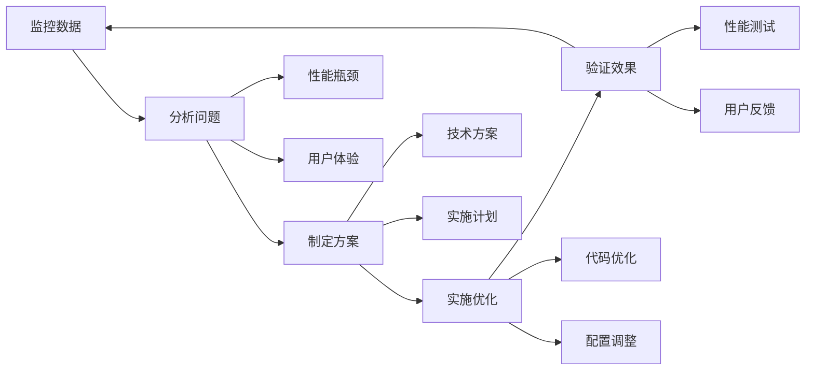

## 🎯 费曼学习法应用

### 用简单语言解释网站速度优化
**向朋友解释**：
"网站速度优化就像是给网站减肥，通过压缩图片、优化代码、使用CDN等方法，让网站加载更快，用户体验更好，搜索引擎也更喜欢。"

### 核心概念简化
1. **网站速度 = 用户体验 + SEO排名**
2. **优化方法 = 压缩 + 缓存 + CDN**
3. **监控指标 = LCP + FID + CLS**
4. **优化目标 = 快速 + 稳定 + 流畅**

## 🔗 相关链接

- [[网站架构优化]] - 了解网站架构对速度的影响
- [[页面技术优化]] - 学习页面技术优化方法
- [[移动端优化]] - 了解移动端速度优化
- [[用户体验指标]] - 理解速度与用户体验的关系

---

**下一步学习**：学习 [[页面技术优化]]，掌握页面级别的技术优化方法
