# 关键词研究策略

> **核心理念**：关键词研究是SEO的基础，通过理解用户搜索意图，找到最合适的关键词来优化内容

## 🎯 关键词研究概述

### 什么是关键词研究
**关键词研究** = 分析用户搜索行为 + 找到合适关键词 + 优化网站内容

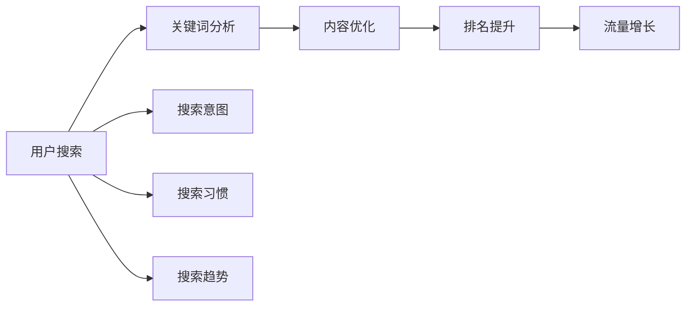

**简单理解**：关键词研究就是找到用户真正在搜索什么，然后用这些词来优化你的内容。

## 📊 关键词类型分析

### 按搜索量分类
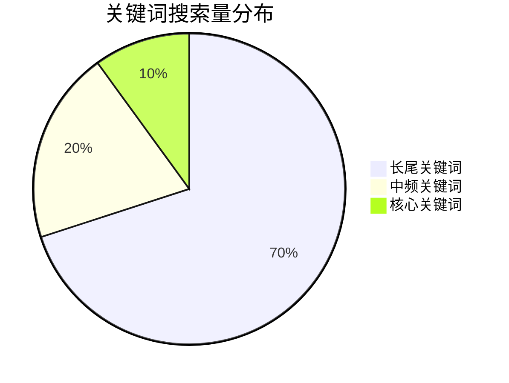

| 类型 | 特点 | 示例 | 适用场景 | 优化策略 |
|------|------|------|----------|----------|
| **核心关键词** | 搜索量大，竞争激烈 | "SEO"、"营销" | 大品牌网站 | 品牌建设 |
| **中频关键词** | 搜索量中等，竞争适中 | "SEO工具"、"网站优化" | 大多数网站 | 主要目标 |
| **长尾关键词** | 搜索量小，转化率高 | "如何学习SEO优化技巧" | 中小企业 | 精准流量 |

### 按搜索意图分类
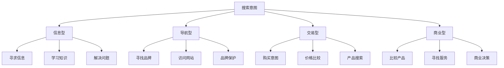

#### 搜索意图详解
| 意图类型 | 特点 | 常见形式 | 示例 | 内容策略 |
|---------|------|----------|------|----------|
| **信息型** | 用户寻求信息或知识 | 什么是、如何、为什么 | "什么是SEO" | 教育性内容 |
| **导航型** | 用户寻找特定网站 | 品牌名、网站名 | "百度"、"Google" | 品牌建设 |
| **交易型** | 用户有购买意图 | 购买、价格、优惠 | "SEO服务价格" | 产品页面 |
| **商业型** | 用户比较产品或服务 | 对比、评测、推荐 | "最佳SEO工具" | 比较内容 |

## 🛠️ 关键词研究工具

### 免费工具矩阵
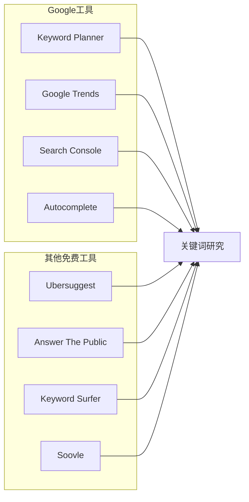

| 工具类型 | 工具名称 | 主要功能 | 使用场景 | 优势 |
|---------|---------|---------|---------|------|
| **Google工具** | Keyword Planner | 关键词规划 | 基础研究 | 官方数据 |
| **Google工具** | Google Trends | 趋势分析 | 趋势研究 | 免费权威 |
| **Google工具** | Search Console | 搜索查询 | 现有关键词 | 真实数据 |
| **第三方工具** | Ubersuggest | 关键词建议 | 扩展研究 | 功能全面 |
| **第三方工具** | Answer The Public | 问题式关键词 | 内容创意 | 独特视角 |

### 付费工具对比
| 工具 | 主要功能 | 价格 | 适用场景 | 优势 |
|------|----------|------|----------|------|
| **Ahrefs** | 关键词研究、外链分析 | $99-399/月 | 专业SEO | 数据全面 |
| **SEMrush** | 关键词研究、竞争分析 | $119-449/月 | 营销团队 | 功能丰富 |
| **Moz** | 关键词难度、技术SEO | $99-599/月 | SEO专家 | 专业性强 |
| **5118** | 中文关键词挖掘 | ¥99-999/月 | 中文SEO | 本土化好 |

## 🔍 关键词研究方法

### 基础研究方法
#### 1. 头脑风暴法
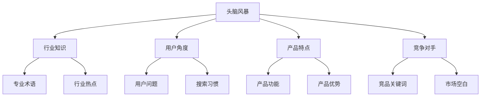

**实践步骤**：
1. **列出核心概念**：写下与业务相关的核心概念
2. **扩展相关词**：为每个概念扩展相关词汇
3. **用户视角思考**：从用户角度思考搜索词
4. **竞争对手分析**：分析竞争对手使用的关键词

#### 2. 搜索建议法
- **自动完成**：利用搜索引擎自动完成功能
- **相关搜索**：查看搜索结果页的相关搜索
- **问题建议**：分析"人们也问"部分
- **语音搜索**：考虑语音搜索的用词习惯

### 高级研究方法
#### 竞争对手分析
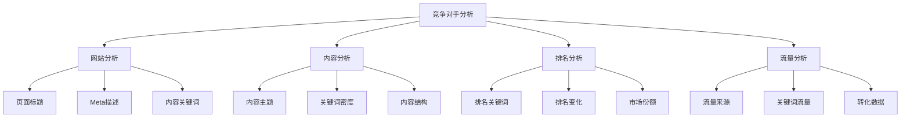

#### 用户行为分析
- **搜索日志**：分析网站搜索日志
- **用户反馈**：收集用户反馈和问题
- **客服数据**：分析客服常见问题
- **社交媒体**：分析社交媒体讨论话题

## 📈 关键词评估指标

### 搜索量指标
| 指标 | 定义 | 重要性 | 注意事项 |
|------|------|--------|----------|
| **月搜索量** | 关键词每月搜索次数 | 高 | 区分全球和本地 |
| **搜索趋势** | 搜索量变化趋势 | 中 | 关注季节性 |
| **竞争度** | 关键词竞争激烈程度 | 高 | 评估难度 |
| **商业价值** | 关键词的商业价值 | 极高 | 考虑转化率 |

### 关键词难度评估
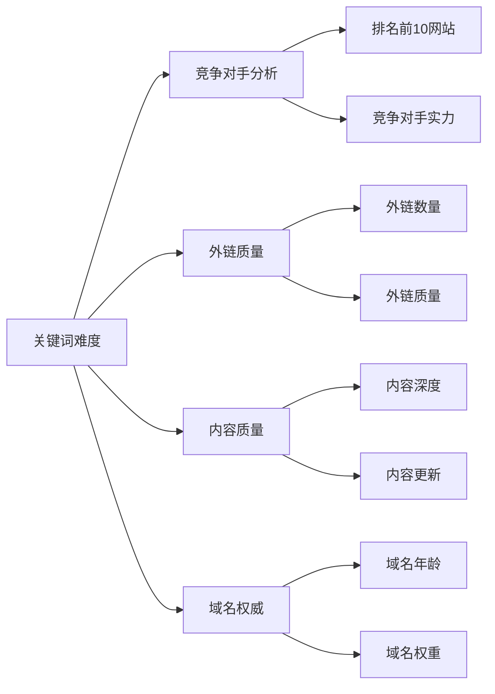

**难度评分标准**：
- **0-30分**：容易，适合新手
- **31-60分**：中等，需要一定资源
- **61-80分**：困难，需要大量资源
- **81-100分**：极难，需要专业团队

### 商业价值评估
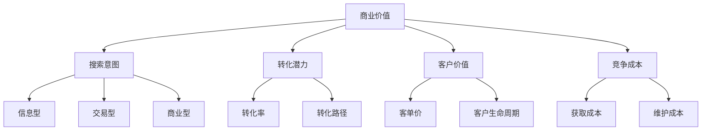

## 🎯 关键词选择策略

### 目标导向选择
#### 流量目标
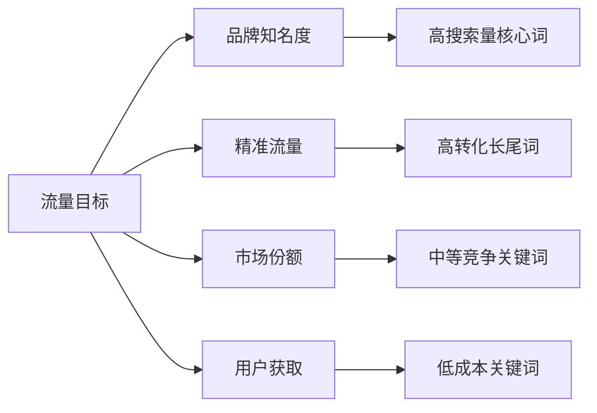

#### 业务目标
| 业务目标 | 关键词类型 | 策略重点 | 预期效果 |
|---------|-----------|----------|----------|
| **销售转化** | 交易型关键词 | 产品页面优化 | 直接销售 |
| **品牌建设** | 品牌相关关键词 | 品牌内容建设 | 品牌知名度 |
| **用户教育** | 信息型关键词 | 教育内容创作 | 用户信任 |
| **竞争防御** | 竞争对手关键词 | 竞争分析优化 | 市场份额 |

### 关键词组合策略
#### 核心+长尾组合
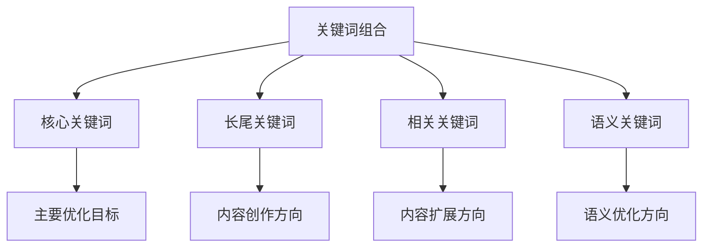

#### 关键词矩阵
| 页面类型 | 主关键词 | 次关键词 | 长尾关键词 | 相关关键词 |
|---------|---------|---------|-----------|-----------|
| **首页** | 品牌词 | 核心业务词 | 品牌+服务 | 行业相关词 |
| **产品页** | 产品词 | 产品功能词 | 产品+用途 | 产品相关词 |
| **内容页** | 主题词 | 细分主题词 | 问题式关键词 | 主题相关词 |

## 🔧 关键词优化策略

### 页面优化
#### 标题优化公式
```
[目标关键词] + [修饰词] + [品牌名]
示例：SEO优化技巧大全 - 提升网站排名指南
```

#### 内容优化要点
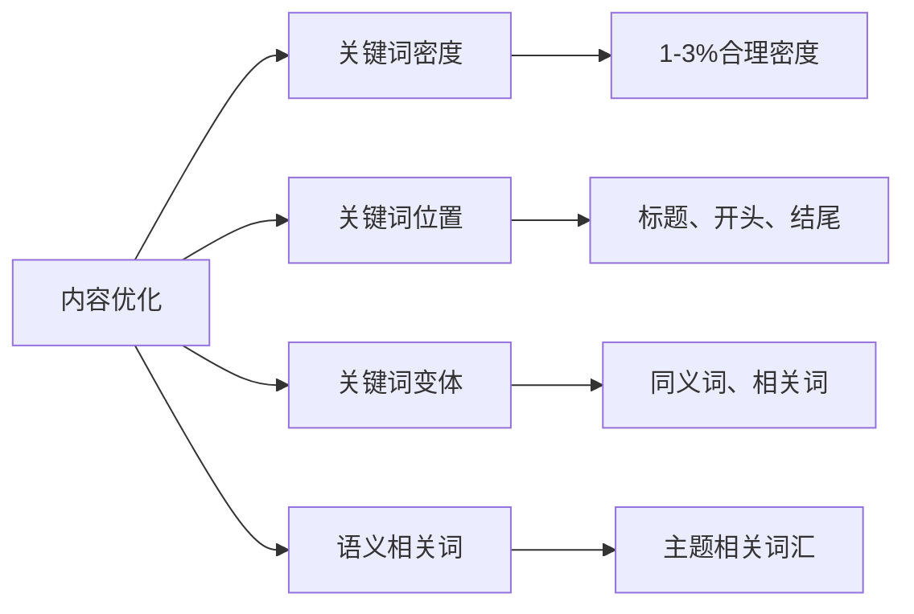

### 内容策略
#### 内容规划流程
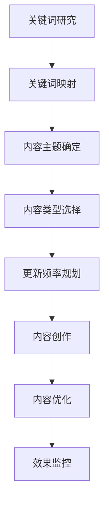

#### 内容创作要点
- **用户需求**：基于关键词满足用户需求
- **内容深度**：提供深度、有价值的内容
- **内容更新**：定期更新和扩展内容
- **内容推广**：通过多种渠道推广内容

## 📊 关键词监控和分析

### 排名监控
#### 监控工具选择
| 工具类型 | 工具名称 | 监控范围 | 更新频率 | 适用场景 |
|---------|---------|---------|---------|----------|
| **官方工具** | Google Search Console | Google排名 | 实时 | 日常监控 |
| **官方工具** | 百度站长工具 | 百度排名 | 每日 | 中文SEO |
| **第三方工具** | Ahrefs | 多搜索引擎 | 每日 | 专业监控 |
| **第三方工具** | SEMrush | 多搜索引擎 | 每日 | 竞争分析 |

#### 监控指标
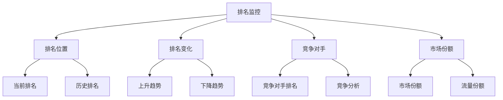

### 流量分析
#### 流量来源分析
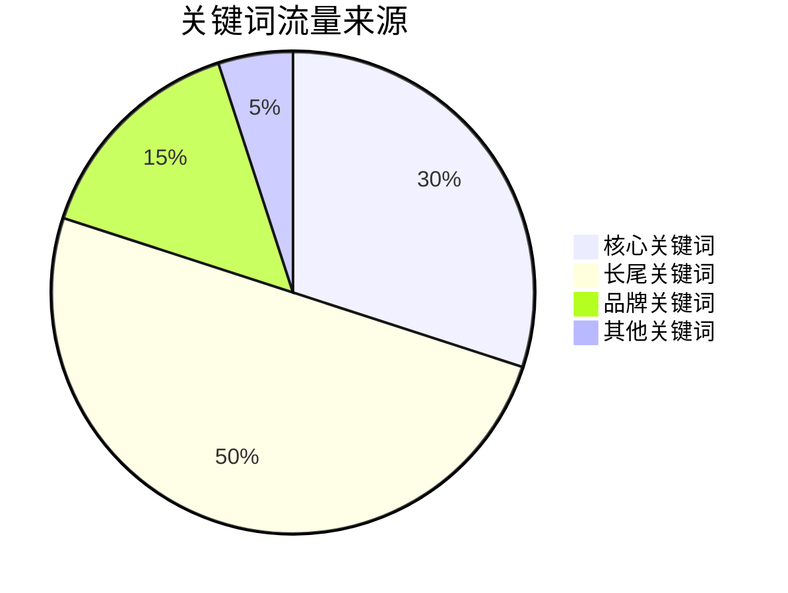

#### 效果评估指标
| 指标 | 定义 | 目标值 | 监控频率 |
|------|------|--------|----------|
| **点击率(CTR)** | 搜索结果中的点击比例 | > 3% | 每周 |
| **转化率** | 关键词带来的转化比例 | 行业平均以上 | 每月 |
| **用户行为** | 用户在页面上的行为数据 | 良好 | 每周 |
| **投资回报** | 关键词的ROI | > 300% | 每月 |

## 🎯 费曼学习法应用

### 用简单语言解释关键词研究
**向朋友解释**：
"关键词研究就像是做市场调研，你要了解用户真正在搜索什么，然后用这些词来写内容，这样用户就能找到你的网站了。"

### 核心概念简化
1. **关键词 = 用户搜索的词**
2. **研究 = 找到合适的词**
3. **优化 = 用这些词写内容**
4. **结果 = 用户找到你的网站**

## 🔗 相关链接

- [[网站架构优化]] - 了解网站技术SEO
- [[内容创作技巧]] - 学习内容创作方法
- [[用户体验指标]] - 理解用户体验与SEO关系
- [[Google Search Console使用指南]] - 学习工具使用

---

**下一步学习**：学习 [[内容创作技巧]]，掌握内容SEO的核心技能
