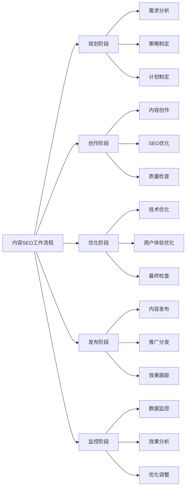
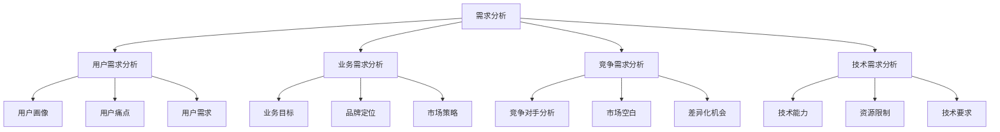
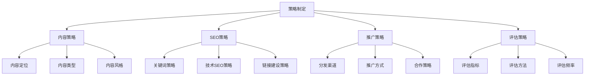
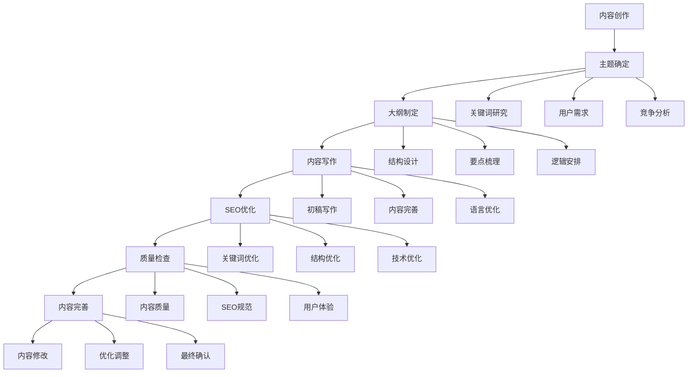
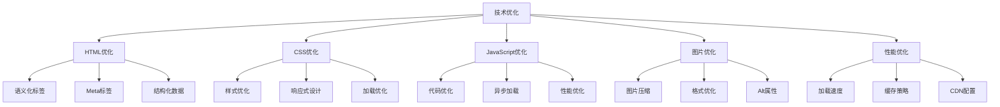
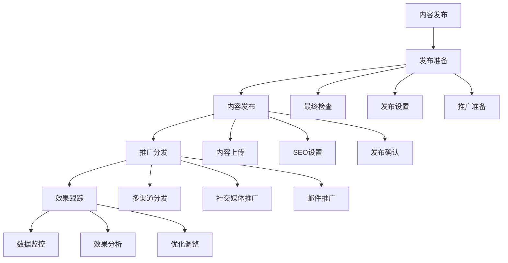
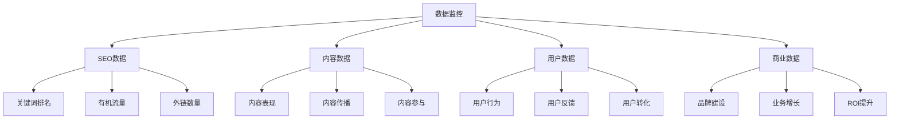
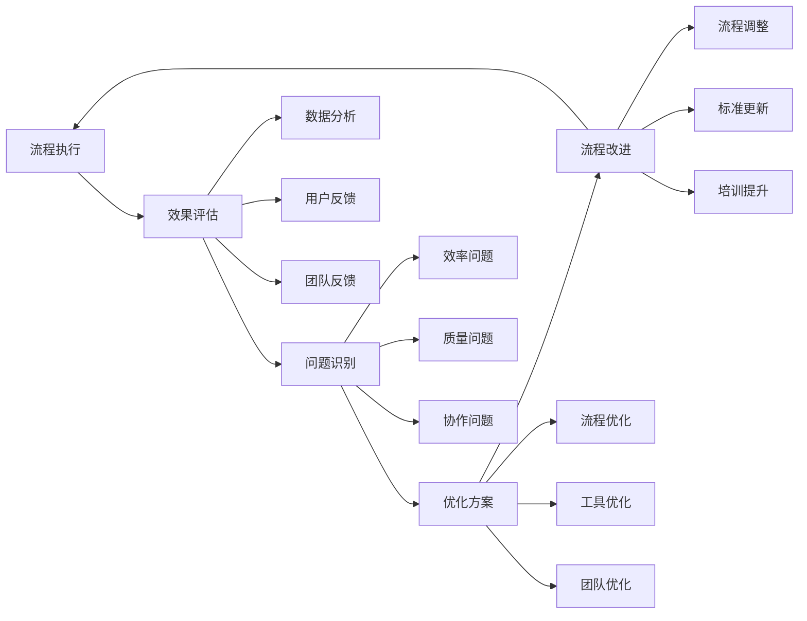
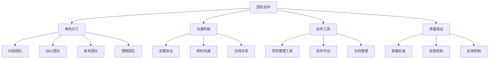

# 内容SEO工作流程

> **核心理念**：系统化的内容SEO工作流程，确保内容SEO工作的效率和质量

## 🎯 工作流程概述

### 什么是内容SEO工作流程
**内容SEO工作流程** = 系统化流程 + 标准化操作 + 质量控制 + 效果评估

**简单理解**：内容SEO工作流程就像是工厂的生产线，每个环节都有明确的任务和质量标准，确保最终产出高质量的内容。

## 📋 完整工作流程

### 第一阶段：规划阶段
#### 需求分析

#### 策略制定

#### 计划制定
| 计划类型 | 内容 | 时间安排 | 负责人 |
|---------|------|----------|--------|
| **内容计划** | 内容主题、类型、数量 | 月度计划 | 内容团队 |
| **SEO计划** | 关键词、技术优化 | 季度计划 | SEO团队 |
| **推广计划** | 分发渠道、推广方式 | 周度计划 | 营销团队 |
| **评估计划** | 评估指标、评估频率 | 月度计划 | 数据分析团队 |

### 第二阶段：创作阶段
#### 内容创作流程

#### 创作质量标准
| 质量维度 | 标准要求 | 检查方法 | 责任人 |
|---------|---------|---------|--------|
| **内容质量** | 原创、相关、实用 | 内容审核 | 内容编辑 |
| **SEO质量** | 关键词优化、结构清晰 | SEO检查 | SEO专员 |
| **用户体验** | 可读性、易用性 | 用户测试 | UX设计师 |
| **技术质量** | 代码规范、性能优化 | 技术检查 | 技术团队 |

### 第三阶段：优化阶段
#### 技术优化

#### 用户体验优化
| 优化方面 | 优化内容 | 优化方法 | 预期效果 |
|---------|---------|---------|----------|
| **可读性** | 字体、颜色、排版 | 设计优化 | 提升阅读体验 |
| **易用性** | 导航、交互、功能 | 交互优化 | 提升使用体验 |
| **移动友好** | 响应式、触摸优化 | 移动优化 | 提升移动体验 |
| **加载速度** | 页面加载、资源优化 | 性能优化 | 提升访问体验 |

### 第四阶段：发布阶段
#### 发布流程

#### 发布检查清单
- [ ] **内容检查**：内容质量、SEO优化、用户体验
- [ ] **技术检查**：页面加载、移动友好、技术规范
- [ ] **SEO检查**：关键词优化、Meta标签、结构化数据
- [ ] **推广准备**：推广素材、分发渠道、合作资源

### 第五阶段：监控阶段
#### 数据监控

#### 监控指标
| 指标类型 | 关键指标 | 监控频率 | 目标值 |
|---------|---------|---------|--------|
| **SEO指标** | 关键词排名、有机流量 | 每周 | 排名提升、流量增长 |
| **内容指标** | 内容质量、传播效果 | 每月 | 高质量、高传播 |
| **用户指标** | 用户参与、用户反馈 | 每周 | 参与提升、反馈积极 |
| **商业指标** | 品牌建设、业务增长 | 每月 | 品牌提升、业务增长 |

## 🔄 工作流程优化

### 流程优化方法
#### 持续改进

#### 优化策略
- **效率优化**：简化流程、自动化操作
- **质量优化**：提升标准、加强检查
- **协作优化**：改善沟通、加强配合
- **工具优化**：使用工具、提升效率

### 团队协作
#### 协作机制

## 🎯 费曼学习法应用

### 用简单语言解释内容SEO工作流程
**向朋友解释**：
"内容SEO工作流程就像是做菜的步骤，先要计划做什么菜（规划），然后准备食材和调料（创作），接着按照菜谱做菜（优化），最后上菜给客人（发布），还要看客人是否满意（监控）。"

### 核心概念简化
1. **规划 = 决定做什么**
2. **创作 = 做出内容**
3. **优化 = 让内容更好**
4. **发布 = 让用户看到**
5. **监控 = 看效果如何**

## 🔗 相关链接

- [[关键词研究策略]] - 学习关键词研究方法
- [[内容创作技巧]] - 了解内容创作方法
- [[内容优化方法]] - 学习内容优化技巧
- [[内容营销整合]] - 了解内容营销整合策略

---

**下一步学习**：开始学习 [[02-3-用户体验SEO]]，了解用户体验与SEO的关系
