# 内容优化方法

> **核心理念**：内容优化是SEO的核心，通过系统化的方法优化内容，提升搜索引擎排名和用户体验

## 📝 内容优化概述

### 什么是内容优化
**内容优化** = 内容质量提升 + 搜索引擎友好 + 用户体验优化

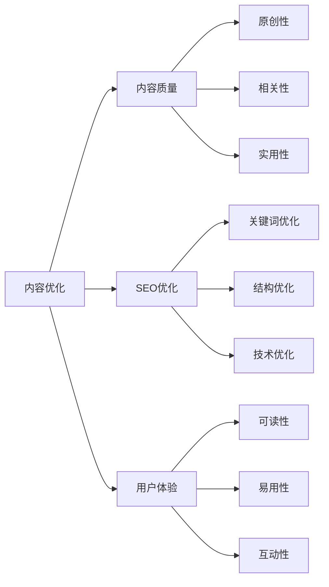

**简单理解**：内容优化就是让你的内容既能让搜索引擎理解，又能让用户喜欢，从而获得更好的排名和更多的流量。

## 🎯 内容质量优化

### 内容质量标准
#### 质量评估维度
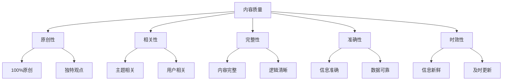

#### 质量评分标准
| 维度 | 评分标准 | 权重 | 优化方法 |
|------|---------|------|----------|
| **原创性** | 100%原创内容 | 25% | 独立创作、避免抄袭 |
| **相关性** | 与主题高度相关 | 20% | 关键词研究、主题聚焦 |
| **完整性** | 内容完整、逻辑清晰 | 20% | 结构化写作、逻辑梳理 |
| **准确性** | 信息准确、数据可靠 | 15% | 事实核查、数据验证 |
| **时效性** | 信息新鲜、及时更新 | 20% | 定期更新、趋势跟踪 |

### 内容深度优化
#### 深度层次分析
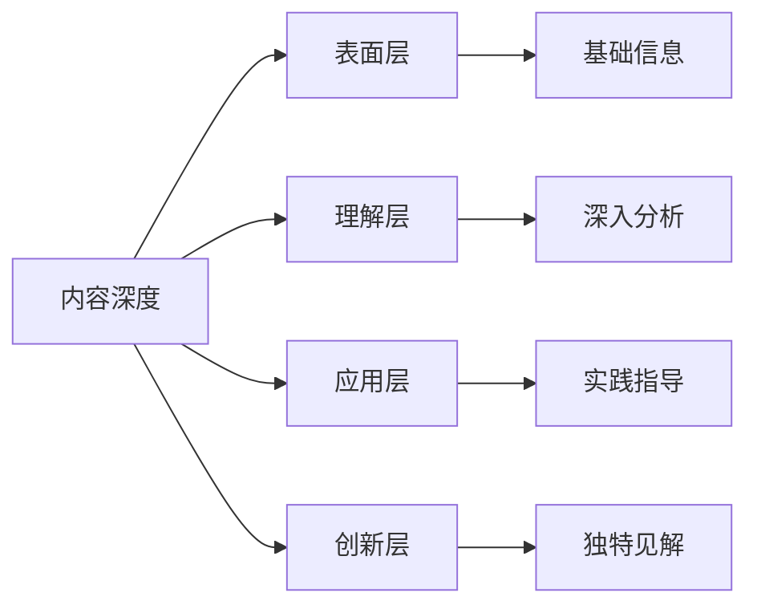

#### 深度优化策略
| 深度层次 | 内容特点 | 目标用户 | 优化重点 |
|---------|---------|---------|----------|
| **表面层** | 基础信息、概念解释 | 新手用户 | 清晰易懂、全面覆盖 |
| **理解层** | 深入分析、原理阐述 | 有经验用户 | 逻辑清晰、分析深入 |
| **应用层** | 实践指导、方法步骤 | 实践用户 | 可操作性、实用性 |
| **创新层** | 独特见解、前沿观点 | 专业用户 | 创新性、前瞻性 |

## 🔍 关键词优化方法

### 关键词自然使用
#### 关键词分布策略
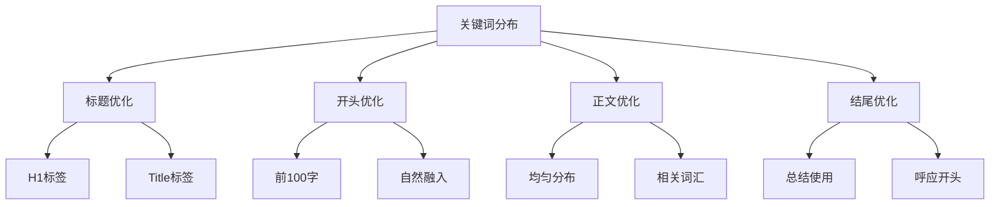

#### 关键词使用技巧
| 使用位置 | 重要性 | 使用技巧 | 注意事项 |
|---------|--------|----------|----------|
| **标题** | 极高 | 自然包含主关键词 | 避免堆砌 |
| **开头** | 高 | 前100字内出现 | 自然融入 |
| **小标题** | 高 | 在H2、H3中使用 | 相关性强 |
| **正文** | 中 | 均匀分布使用 | 保持自然 |
| **结尾** | 中 | 总结时使用 | 呼应开头 |

### 语义相关词优化
#### 相关词类型
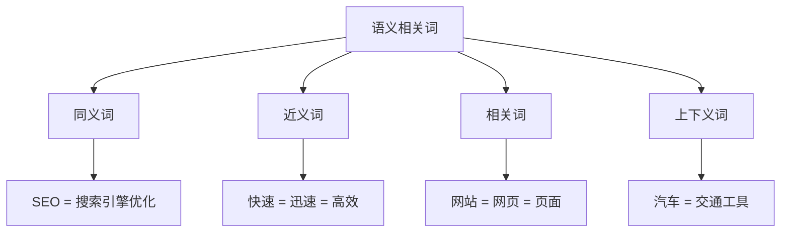

#### 相关词使用策略
- **同义词替换**：避免关键词重复，提升可读性
- **近义词扩展**：丰富表达方式，覆盖更多搜索
- **相关词补充**：提供更多相关信息，提升内容价值
- **上下义词使用**：从不同层次描述主题，提升权威性

## 📊 内容结构优化

### 文章结构优化
#### 标准文章结构
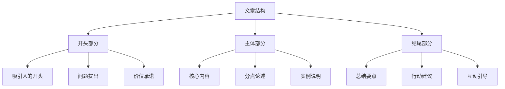

#### 结构优化要点
- **开头优化**：吸引注意力，提出问题，承诺价值
- **主体优化**：分点论述，逻辑清晰，实例丰富
- **结尾优化**：总结要点，提供行动建议，引导互动

### 标题层次优化
#### 标题结构
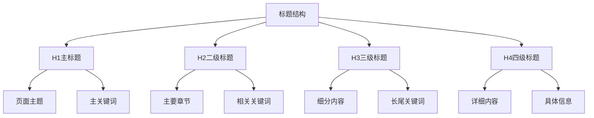

#### 标题优化规则
- **H1标签**：每个页面只有一个H1，包含主关键词
- **H2-H6标签**：建立清晰的层次结构
- **关键词使用**：在标题中自然使用关键词
- **长度控制**：标题长度适中，易于阅读

## 🎨 内容形式优化

### 多媒体内容优化
#### 内容形式选择
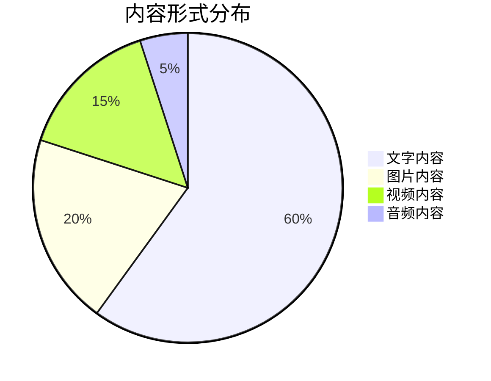

#### 多媒体优化策略
| 内容形式 | 优化重点 | SEO价值 | 优化方法 |
|---------|---------|---------|----------|
| **文字内容** | 关键词优化、结构清晰 | 高 | 自然使用关键词、清晰结构 |
| **图片内容** | Alt属性、文件名优化 | 中 | 描述性Alt文本、关键词文件名 |
| **视频内容** | 标题、描述、字幕优化 | 中 | 关键词标题、详细描述、字幕 |
| **音频内容** | 标题、描述、转录文本 | 低 | 关键词标题、文字转录 |

### 交互内容优化
#### 交互元素优化
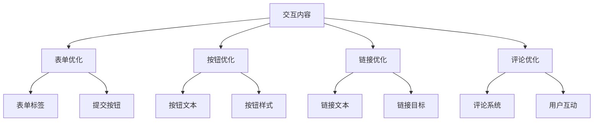

## 📈 内容更新优化

### 内容更新策略
#### 更新频率规划
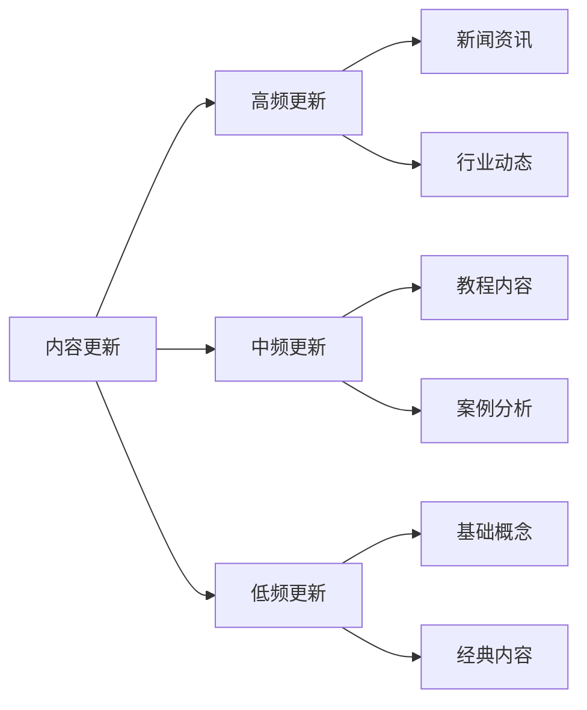

#### 更新策略
| 内容类型 | 更新频率 | 更新内容 | 优化重点 |
|---------|---------|---------|----------|
| **新闻资讯** | 每日 | 最新信息、热点事件 | 时效性、准确性 |
| **教程内容** | 每周 | 新方法、新技巧 | 实用性、完整性 |
| **案例分析** | 每月 | 新案例、新经验 | 真实性、启发性 |
| **基础概念** | 每季度 | 概念更新、新观点 | 准确性、权威性 |

### 内容扩展优化
#### 内容扩展方法
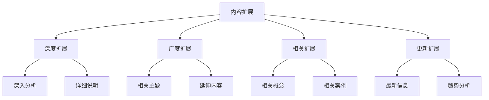

## 🔗 内链优化

### 内链建设策略
#### 内链类型
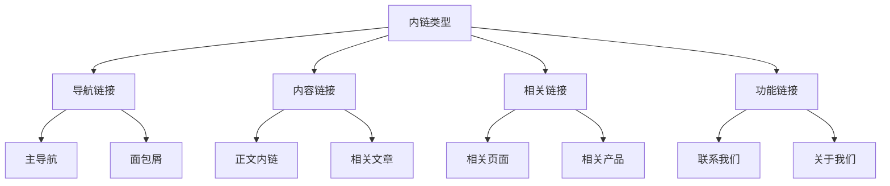

#### 内链优化要点
- **相关性**：链接到相关的内容页面
- **自然性**：内链应该看起来自然
- **用户价值**：为用户提供有价值的信息
- **权重传递**：合理分配页面权重

### 锚文本优化
#### 锚文本类型
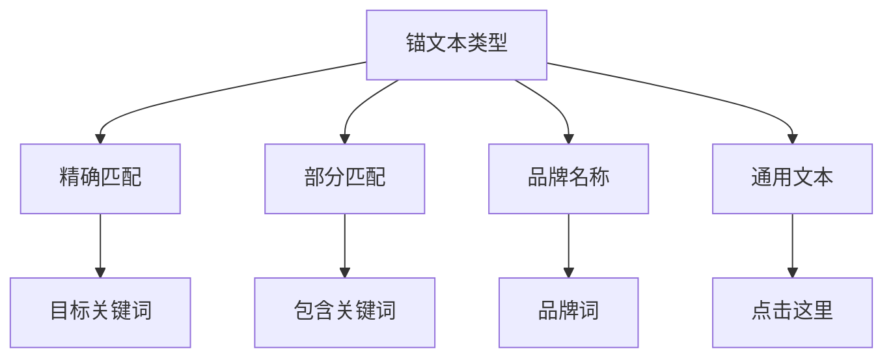

#### 锚文本优化策略
- **多样化**：使用多样化的锚文本
- **自然性**：确保锚文本看起来自然
- **相关性**：锚文本与目标页面相关
- **避免过度优化**：避免过度使用精确匹配

## 📊 内容效果评估

### 内容表现指标
#### 关键指标
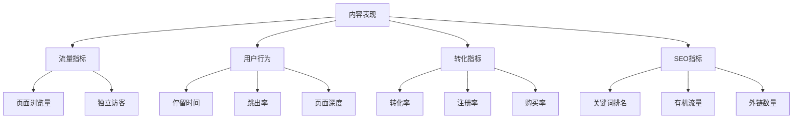

#### 指标分析
| 指标类型 | 关键指标 | 目标值 | 优化方法 |
|---------|---------|--------|----------|
| **流量指标** | 页面浏览量、独立访客 | 持续增长 | 内容推广、SEO优化 |
| **用户行为** | 停留时间、跳出率 | 停留>2分钟，跳出<40% | 内容质量、用户体验 |
| **转化指标** | 转化率、注册率 | 行业平均以上 | 转化路径优化 |
| **SEO指标** | 关键词排名、有机流量 | 排名提升、流量增长 | SEO优化、内容质量 |

### 内容优化循环
#### 持续优化流程
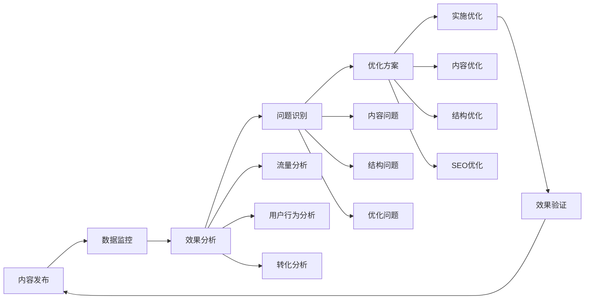

## 🎯 费曼学习法应用

### 用简单语言解释内容优化
**向朋友解释**：
"内容优化就像是写一篇好文章，你要让文章既能让读者（用户）看懂，又能让老师（搜索引擎）给高分，这样你的文章就能被更多人看到。"

### 核心概念简化
1. **内容优化 = 让内容更好**
2. **质量优化 = 内容要有价值**
3. **关键词优化 = 自然使用关键词**
4. **结构优化 = 内容要有条理**
5. **效果评估 = 看内容表现如何**

## 🔗 相关链接

- [[关键词研究策略]] - 学习关键词研究方法
- [[内容创作技巧]] - 了解内容创作方法
- [[内容营销整合]] - 学习内容营销整合
- [[内容SEO工作流程]] - 了解内容SEO工作流程

---

**下一步学习**：学习 [[内容营销整合]]，了解内容营销与SEO的整合策略
