# 内容创作技巧

> **核心理念**：高质量内容是SEO成功的基础，好的内容不仅要满足搜索引擎，更要满足用户需求

## 📝 内容创作概述

### 什么是高质量内容
**高质量内容** = 用户需求 + 搜索引擎友好 + 商业价值

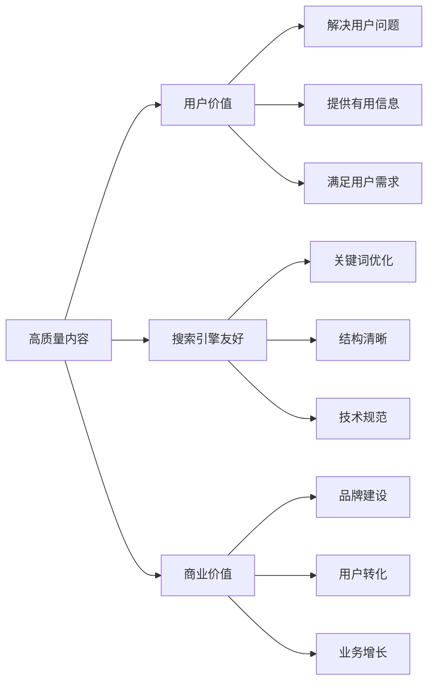

### 内容创作原则
| 原则 | 说明 | 重要性 | 实施方法 |
|------|------|--------|----------|
| **用户第一** | 以用户需求为中心 | 极高 | 深入理解用户需求 |
| **价值导向** | 提供真正有价值的内容 | 极高 | 解决实际问题 |
| **原创性** | 100%原创内容 | 高 | 独立创作，避免抄袭 |
| **专业性** | 体现专业知识和权威性 | 高 | 深入研究，专业表达 |
| **可读性** | 内容易于阅读和理解 | 高 | 清晰结构，简洁表达 |

## 🎯 内容规划策略

### 内容主题规划
#### 主题选择方法
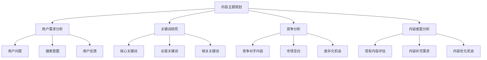

#### 主题规划矩阵
| 内容类型 | 目标用户 | 关键词类型 | 内容深度 | 更新频率 |
|---------|---------|-----------|---------|----------|
| **入门指南** | 新手用户 | 信息型关键词 | 基础全面 | 半年一次 |
| **深度教程** | 进阶用户 | 长尾关键词 | 深入详细 | 季度一次 |
| **案例分析** | 专业用户 | 品牌关键词 | 实战经验 | 月度一次 |
| **行业资讯** | 所有用户 | 热点关键词 | 及时准确 | 周度一次 |

### 内容日历规划
#### 内容发布计划
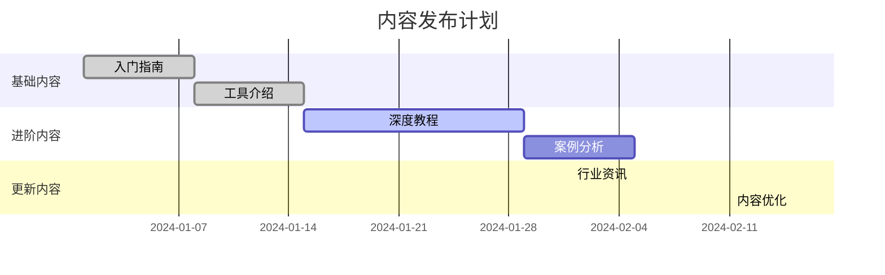

#### 内容类型分配
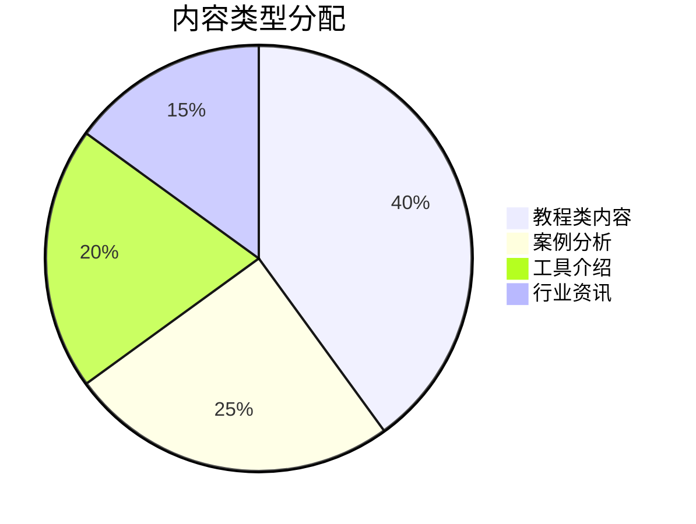

## ✍️ 内容创作技巧

### 标题创作技巧
#### 标题类型
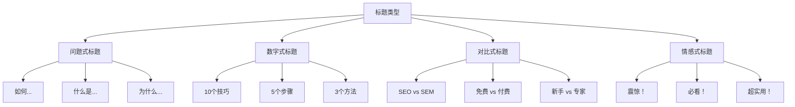

#### 标题优化公式
```
[数字] + [形容词] + [关键词] + [价值承诺]
示例：10个超实用的SEO优化技巧，让你的网站排名飙升
```

| 标题元素 | 作用 | 示例 | 效果 |
|---------|------|------|------|
| **数字** | 具体化、可量化 | "10个技巧" | 提升点击率30% |
| **形容词** | 增强吸引力 | "超实用" | 提升点击率20% |
| **关键词** | SEO优化 | "SEO优化" | 提升排名 |
| **价值承诺** | 明确收益 | "排名飙升" | 提升转化率 |

### 内容结构优化
#### 文章结构模板
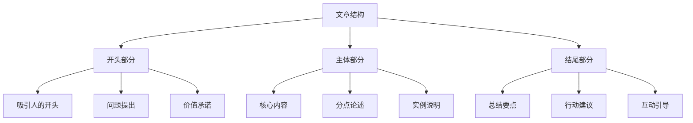

#### 内容结构最佳实践
- **开头**：吸引注意力，提出问题，承诺价值
- **主体**：分点论述，逻辑清晰，实例丰富
- **结尾**：总结要点，提供行动建议，引导互动

### 内容深度控制
#### 内容深度层次
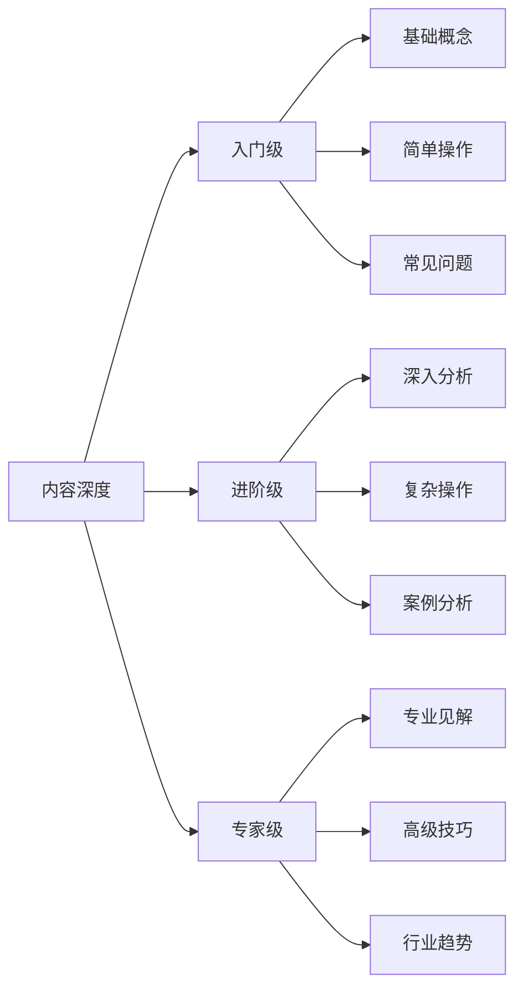

#### 深度控制策略
| 内容深度 | 目标用户 | 内容特点 | 字数范围 | 更新频率 |
|---------|---------|---------|---------|----------|
| **入门级** | 新手用户 | 基础全面、易于理解 | 1000-2000字 | 高频更新 |
| **进阶级** | 有经验用户 | 深入分析、实用技巧 | 2000-5000字 | 中频更新 |
| **专家级** | 专业用户 | 专业见解、前沿趋势 | 5000+字 | 低频更新 |

## 🔍 关键词优化技巧

### 关键词自然使用
#### 关键词密度控制
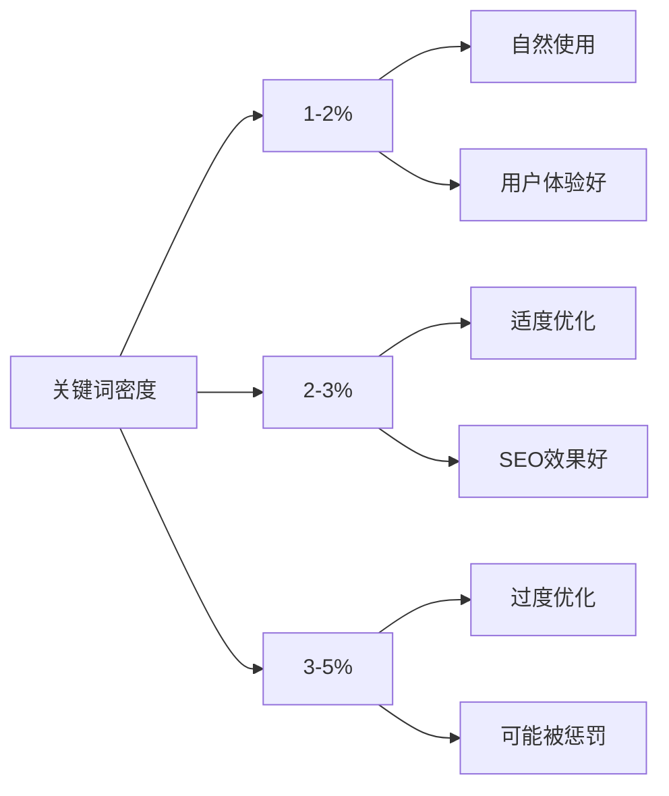

#### 关键词使用技巧
| 使用位置 | 重要性 | 使用技巧 | 注意事项 |
|---------|--------|----------|----------|
| **标题** | 极高 | 自然包含主关键词 | 避免堆砌 |
| **开头** | 高 | 前100字内出现 | 自然融入 |
| **小标题** | 高 | 在H2、H3中使用 | 相关性强 |
| **正文** | 中 | 均匀分布使用 | 保持自然 |
| **结尾** | 中 | 总结时使用 | 呼应开头 |

### 语义相关词使用
#### 相关词类型
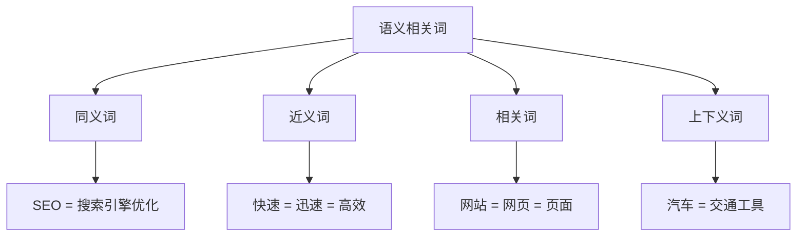

#### 相关词使用策略
- **同义词替换**：避免关键词重复，提升可读性
- **近义词扩展**：丰富表达方式，覆盖更多搜索
- **相关词补充**：提供更多相关信息，提升内容价值
- **上下义词使用**：从不同层次描述主题，提升权威性

## 📊 内容质量评估

### 内容质量指标
#### 质量评估维度
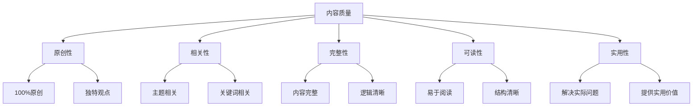

#### 质量评分标准
| 维度 | 评分标准 | 权重 | 评估方法 |
|------|---------|------|----------|
| **原创性** | 100%原创内容 | 25% | 原创性检测工具 |
| **相关性** | 与主题高度相关 | 20% | 关键词相关性分析 |
| **完整性** | 内容完整、逻辑清晰 | 20% | 内容结构分析 |
| **可读性** | 易于阅读和理解 | 15% | 可读性测试工具 |
| **实用性** | 解决实际问题 | 20% | 用户反馈分析 |

### 内容优化建议
#### 优化流程
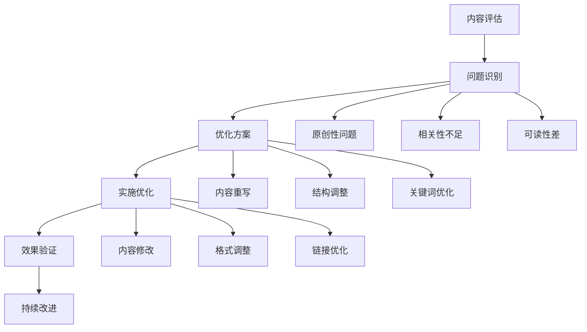

## 🎨 内容形式多样化

### 内容形式选择
#### 形式类型
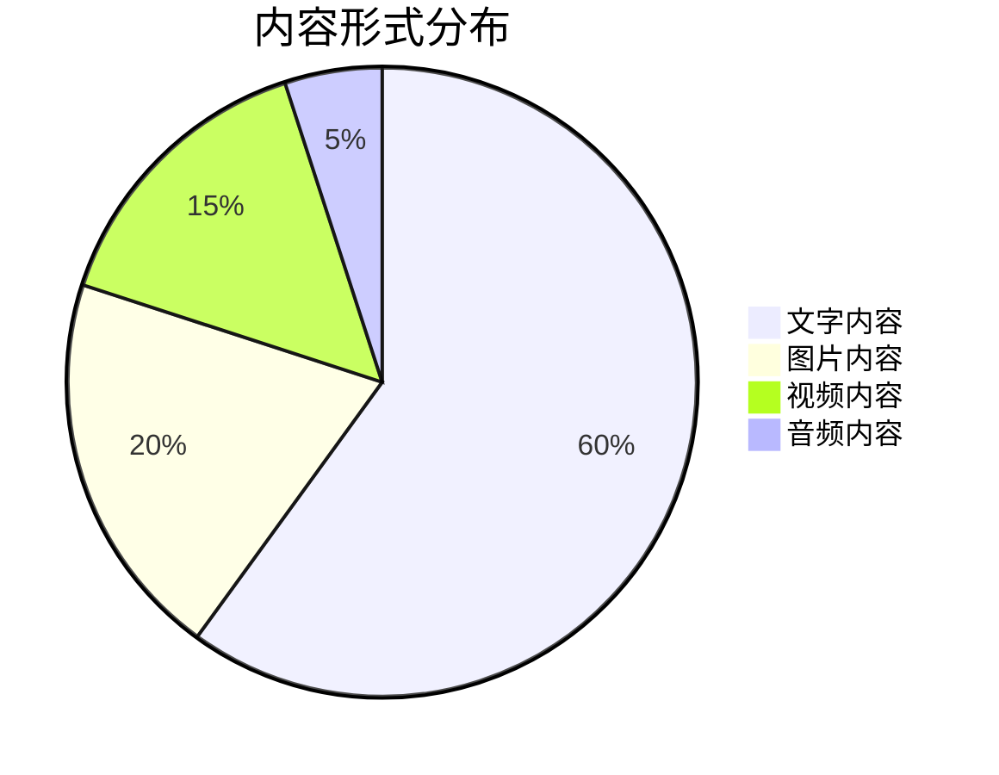

| 内容形式 | 优势 | 劣势 | 适用场景 | SEO效果 |
|---------|------|------|----------|---------|
| **文字内容** | 易于创作、SEO友好 | 视觉冲击力弱 | 教程、分析 | 高 |
| **图片内容** | 视觉冲击力强 | 不易被搜索引擎理解 | 教程、展示 | 中等 |
| **视频内容** | 内容丰富、用户喜欢 | 制作成本高 | 教程、演示 | 中等 |
| **音频内容** | 便于收听 | 不易被搜索引擎理解 | 访谈、播客 | 低 |

### 多媒体内容优化
#### 图片内容优化
- **Alt属性**：为图片添加描述性Alt文本
- **文件名**：使用描述性的文件名
- **图片质量**：平衡图片质量和文件大小
- **图片格式**：选择合适的图片格式

#### 视频内容优化
- **标题优化**：视频标题包含关键词
- **描述优化**：视频描述详细说明内容
- **字幕添加**：为视频添加字幕
- **缩略图**：选择吸引人的缩略图

## 📈 内容推广策略

### 内容分发渠道
#### 渠道选择
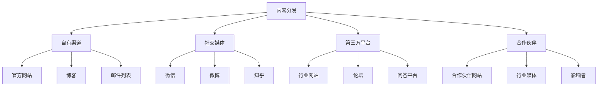

### 内容推广策略
#### 推广时机
| 推广阶段 | 推广策略 | 目标 | 预期效果 |
|---------|---------|------|----------|
| **发布初期** | 多渠道同步发布 | 快速传播 | 获得初始流量 |
| **发布中期** | 社交媒体推广 | 扩大影响 | 增加曝光度 |
| **发布后期** | 持续推广 | 长期价值 | 持续获得流量 |

## 🎯 费曼学习法应用

### 用简单语言解释内容创作
**向朋友解释**：
"内容创作就像是写一篇好文章，你要先了解读者想了解什么，然后用他们能理解的语言，提供真正有用的信息，同时让搜索引擎也能理解你的内容。"

### 核心概念简化
1. **内容创作 = 用户需求 + 搜索引擎友好**
2. **高质量内容 = 原创 + 有用 + 易读**
3. **关键词优化 = 自然使用 + 相关词汇**
4. **内容推广 = 多渠道 + 持续推广**

## 🔗 相关链接

- [[关键词研究策略]] - 学习关键词研究方法
- [[内容优化方法]] - 了解内容优化技巧
- [[用户体验指标]] - 理解内容与用户体验的关系
- [[网站架构优化]] - 了解内容在网站架构中的作用

---

**下一步学习**：学习 [[内容优化方法]]，掌握内容SEO的优化技巧
