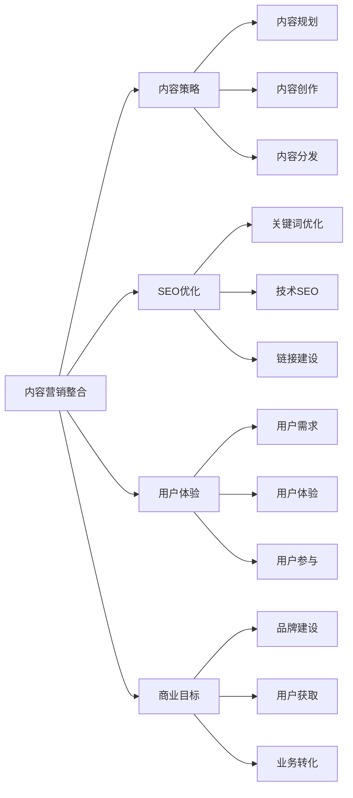
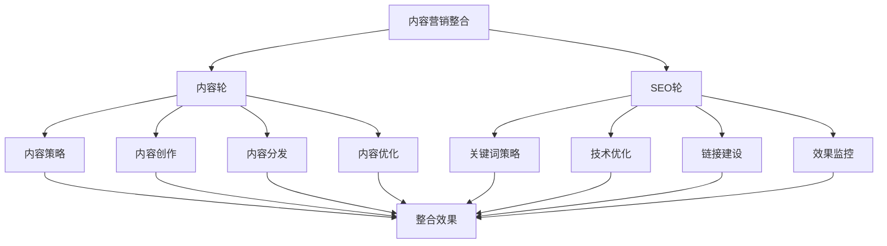
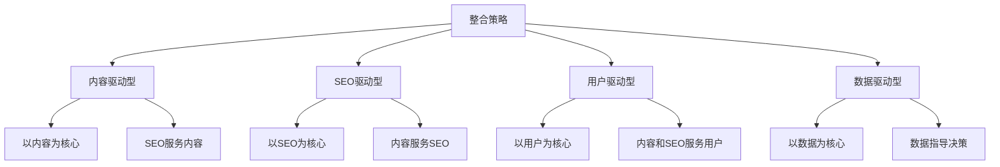
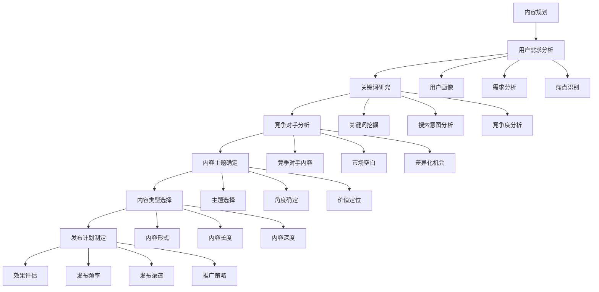
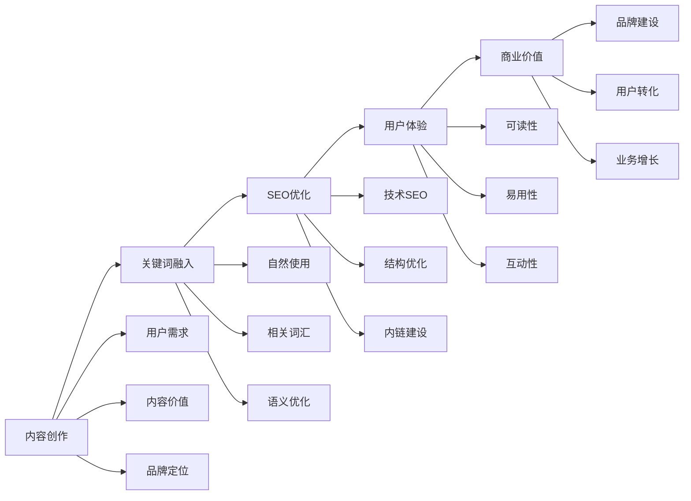
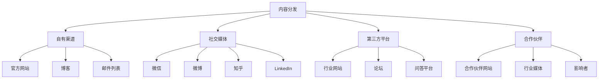
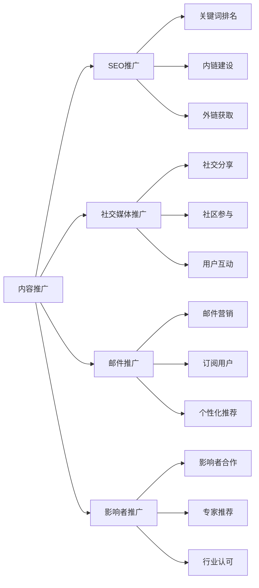
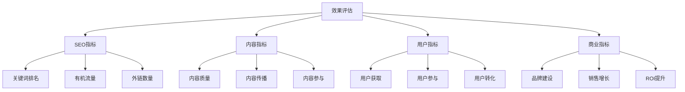
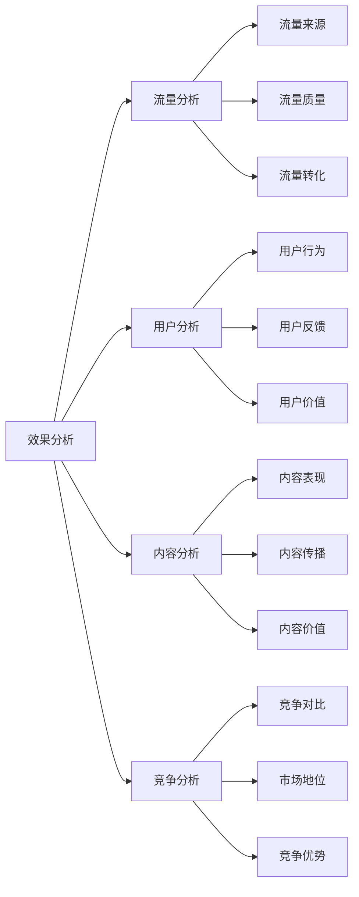
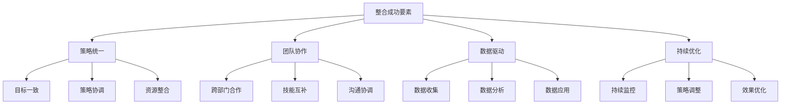

# 内容营销整合

> **核心理念**：内容营销与SEO是天然的结合，通过整合策略实现1+1>2的效果

## 🎯 内容营销整合概述

### 什么是内容营销整合
**内容营销整合** = 内容营销 + SEO优化 + 用户体验 + 商业目标

**简单理解**：内容营销整合就是把内容营销和SEO结合起来，用SEO的方法让好的内容被更多人发现，用内容营销的方法让SEO更有价值。

## 📊 整合策略框架

### 整合策略模型
#### 双轮驱动模型

#### 整合优势
| 整合方面 | 内容营销优势 | SEO优势 | 整合效果 |
|---------|-------------|---------|----------|
| **流量获取** | 品牌流量、社交流量 | 有机流量、精准流量 | 多渠道流量 |
| **用户获取** | 品牌认知、用户信任 | 搜索发现、精准用户 | 全面用户获取 |
| **内容价值** | 用户价值、品牌价值 | 搜索引擎价值 | 双重价值 |
| **长期效果** | 品牌建设、用户关系 | 排名稳定、流量持续 | 长期可持续 |

### 整合策略类型
#### 策略分类

## 📝 内容策略整合

### 内容规划整合
#### 内容规划流程

### 内容创作整合
#### 创作流程整合

## 🔄 内容分发整合

### 多渠道分发策略
#### 分发渠道矩阵

#### 分发策略
| 渠道类型 | 优势 | 劣势 | SEO价值 | 优化重点 |
|---------|------|------|---------|----------|
| **自有渠道** | 完全控制、品牌建设 | 流量有限 | 高 | 内容质量、SEO优化 |
| **社交媒体** | 传播速度快、用户参与 | 算法依赖 | 中 | 社交信号、品牌提及 |
| **第三方平台** | 流量大、权威性 | 控制有限 | 中 | 外链建设、品牌曝光 |
| **合作伙伴** | 信任度高、精准用户 | 资源有限 | 高 | 关系建设、内容合作 |

### 内容推广整合
#### 推广策略

## 📈 效果评估整合

### 整合效果指标
#### 综合评估体系

#### 关键指标
| 指标类型 | 关键指标 | 目标值 | 优化方法 |
|---------|---------|--------|----------|
| **SEO指标** | 关键词排名、有机流量 | 排名提升、流量增长 | SEO优化、内容质量 |
| **内容指标** | 内容质量、传播效果 | 高质量、高传播 | 内容优化、推广策略 |
| **用户指标** | 用户获取、参与度 | 用户增长、参与提升 | 用户体验、内容价值 |
| **商业指标** | 品牌建设、业务增长 | 品牌提升、业务增长 | 整合策略、持续优化 |

### 效果分析
#### 分析维度

## 🎯 整合最佳实践

### 成功要素
#### 整合成功要素

#### 实施建议
- **策略统一**：确保内容营销和SEO策略一致
- **团队协作**：建立跨部门协作机制
- **数据驱动**：基于数据做决策和优化
- **持续优化**：持续监控和优化整合效果

### 常见挑战
#### 挑战与解决方案
| 挑战类型 | 具体挑战 | 解决方案 | 预防措施 |
|---------|---------|---------|----------|
| **策略冲突** | 内容营销与SEO目标不一致 | 统一策略、协调目标 | 制定统一策略 |
| **资源分散** | 资源分配不合理 | 资源整合、优先级排序 | 统一资源管理 |
| **效果衡量** | 难以衡量整合效果 | 建立综合评估体系 | 制定评估标准 |
| **团队协作** | 跨部门协作困难 | 建立协作机制 | 定期沟通协调 |

## 🎯 费曼学习法应用

### 用简单语言解释内容营销整合
**向朋友解释**：
"内容营销整合就像是开一家餐厅，内容营销是做出好吃的菜，SEO是让顾客能找到你的餐厅，两者结合起来，既要有好菜，又要让顾客容易找到，这样才能生意兴隆。"

### 核心概念简化
1. **内容营销 = 做出好内容**
2. **SEO = 让内容被发现**
3. **整合 = 两者结合，效果更好**
4. **成功 = 好内容 + 被发现 + 用户喜欢**

## 🔗 相关链接

- [[关键词研究策略]] - 学习关键词研究方法
- [[内容创作技巧]] - 了解内容创作方法
- [[内容优化方法]] - 学习内容优化技巧
- [[内容SEO工作流程]] - 了解内容SEO工作流程

---

**下一步学习**：学习 [[内容SEO工作流程]]，掌握内容SEO的系统化工作方法
