# UX与SEO协同策略

> **核心理念**：用户体验(UX)和SEO是相互促进的关系，通过协同策略实现用户体验和SEO效果的双重提升

## 🎯 UX与SEO协同概述

### 什么是UX与SEO协同
**UX与SEO协同** = 用户体验优化 + SEO技术优化 + 数据驱动决策 + 持续改进

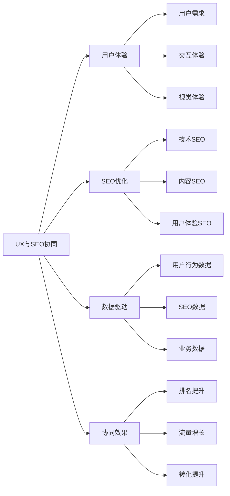

**简单理解**：UX与SEO协同就像是让网站既能让用户喜欢用，又能让搜索引擎喜欢推荐，两者结合起来效果会更好。

## 🔄 协同关系分析

### UX与SEO的关系
#### 相互促进关系
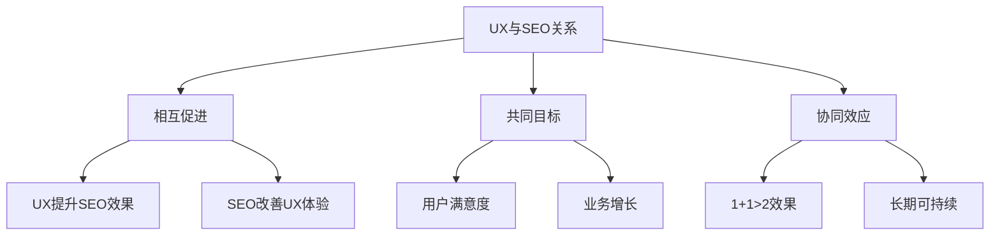

#### 关系特点
| 关系类型 | 特点 | 影响 | 优化策略 |
|---------|------|------|----------|
| **相互促进** | UX好→SEO好→更多用户→更好UX | 正向循环 | 同时优化两者 |
| **共同目标** | 都追求用户满意和业务增长 | 目标一致 | 统一优化目标 |
| **协同效应** | 协同优化效果大于单独优化 | 效果放大 | 制定协同策略 |

### 协同优势分析
#### 优势对比
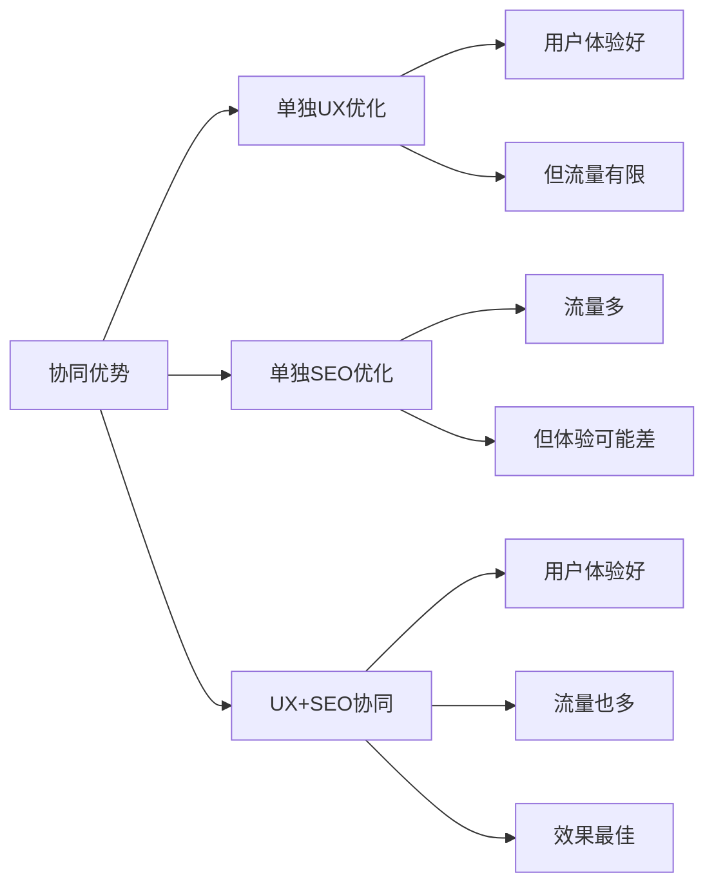

#### 协同价值
| 优化方式 | 用户体验 | SEO效果 | 业务价值 | 长期可持续性 |
|---------|---------|---------|----------|-------------|
| **单独UX优化** | 高 | 中 | 中 | 中 |
| **单独SEO优化** | 中 | 高 | 中 | 低 |
| **UX+SEO协同** | 高 | 高 | 高 | 高 |

## 🎨 协同策略框架

### 协同策略模型
#### 双轮驱动模型
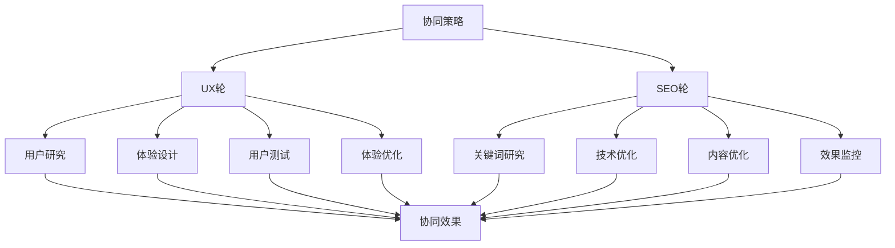

#### 协同策略类型
| 策略类型 | 特点 | 适用场景 | 实施难度 |
|---------|------|----------|----------|
| **UX驱动型** | 以用户体验为核心，SEO服务UX | 用户体验要求高 | 中等 |
| **SEO驱动型** | 以SEO为核心，UX服务SEO | SEO要求高 | 中等 |
| **平衡协同型** | UX和SEO并重，相互促进 | 综合要求高 | 高 |
| **数据驱动型** | 基于数据决策，动态调整 | 数据丰富 | 高 |

### 协同实施流程
#### 实施步骤
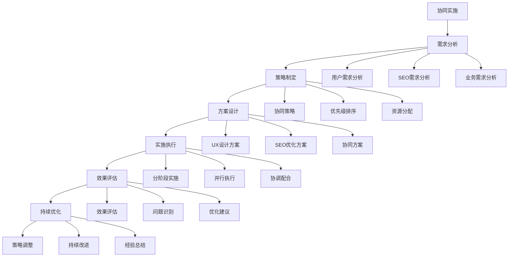

## 🎯 具体协同策略

### 用户研究与关键词研究协同
#### 协同方法
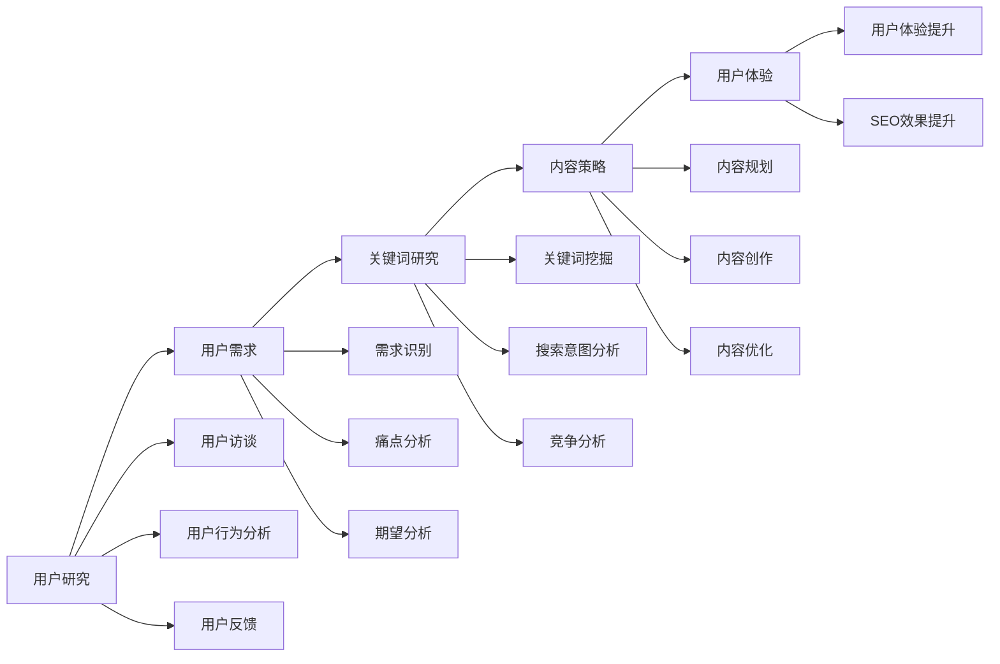

#### 协同策略
| 协同方面 | UX方法 | SEO方法 | 协同效果 |
|---------|--------|---------|----------|
| **需求分析** | 用户访谈、行为分析 | 关键词研究、搜索意图 | 更准确的需求理解 |
| **内容规划** | 用户旅程、内容策略 | 关键词规划、内容优化 | 更精准的内容定位 |
| **体验设计** | 用户测试、原型设计 | 技术SEO、页面优化 | 更好的用户体验 |
| **效果评估** | 用户满意度、行为分析 | 排名监控、流量分析 | 更全面的效果评估 |

### 信息架构与网站结构协同
#### 协同优化
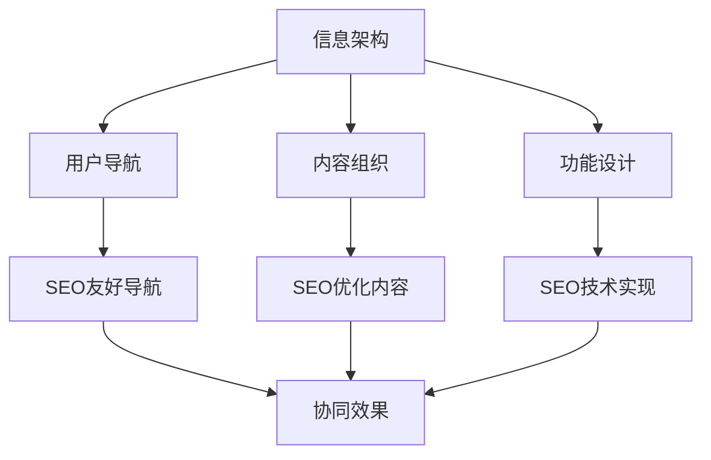

#### 协同要点
| 优化方面 | UX要求 | SEO要求 | 协同策略 |
|---------|--------|---------|----------|
| **导航设计** | 清晰、直观、易用 | 爬虫友好、关键词优化 | 语义化导航、关键词融入 |
| **内容组织** | 逻辑清晰、层次分明 | 主题相关、关键词分布 | 主题聚类、关键词自然分布 |
| **页面结构** | 用户友好、功能完整 | 技术规范、SEO优化 | 语义化HTML、SEO标签 |
| **链接结构** | 用户引导、功能完整 | 权重传递、爬虫友好 | 内链优化、用户体验兼顾 |

### 内容设计与SEO优化协同
#### 协同策略
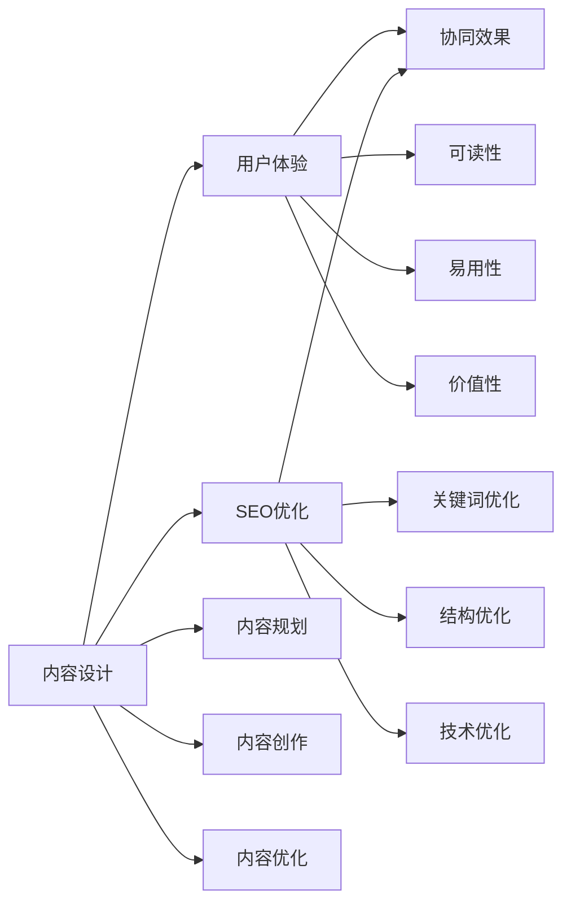

#### 内容协同策略
| 内容方面 | UX优化 | SEO优化 | 协同方法 |
|---------|--------|---------|----------|
| **内容质量** | 用户价值、可读性 | 原创性、相关性 | 高质量原创内容 |
| **内容结构** | 逻辑清晰、层次分明 | 标题优化、关键词分布 | 语义化结构、关键词自然融入 |
| **内容形式** | 多样化、互动性 | 多媒体优化、技术规范 | 丰富内容形式、SEO技术优化 |
| **内容更新** | 用户需求、时效性 | 新鲜度、相关性 | 定期更新、用户需求导向 |

## 📊 协同效果评估

### 评估指标体系
#### 综合评估体系
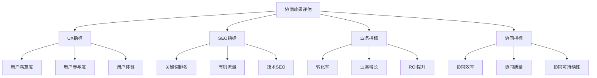

#### 关键指标
| 指标类型 | 关键指标 | 目标值 | 评估方法 |
|---------|---------|--------|----------|
| **UX指标** | 用户满意度、参与度、体验评分 | 满意度>90%、参与度提升 | 用户调研、行为分析 |
| **SEO指标** | 关键词排名、有机流量、技术SEO | 排名提升、流量增长 | 排名监控、流量分析 |
| **业务指标** | 转化率、业务增长、ROI | 转化率提升、业务增长 | 业务数据分析 |
| **协同指标** | 协同效率、质量、可持续性 | 效率提升、质量改善 | 综合评估分析 |

### 效果分析方法
#### 分析方法
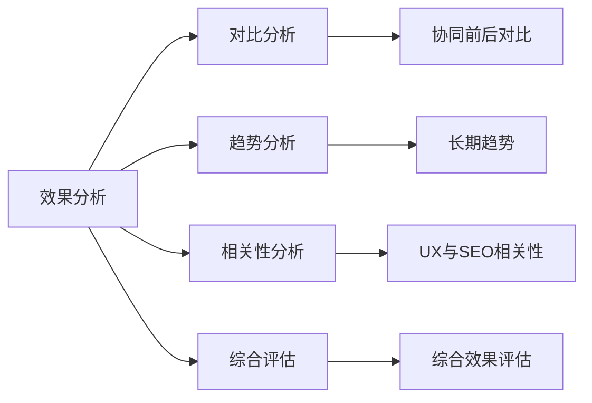

#### 分析维度
| 分析维度 | 分析内容 | 分析方法 | 预期结果 |
|---------|---------|---------|----------|
| **对比分析** | 协同前后效果对比 | 前后对比、A/B测试 | 量化协同效果 |
| **趋势分析** | 长期效果趋势 | 时间序列分析 | 识别长期趋势 |
| **相关性分析** | UX与SEO相关性 | 相关性分析、回归分析 | 理解协同机制 |
| **综合评估** | 整体协同效果 | 综合评分、专家评估 | 全面评估协同效果 |

## 🛠️ 协同实施工具

### 协同工具选择
#### 工具分类
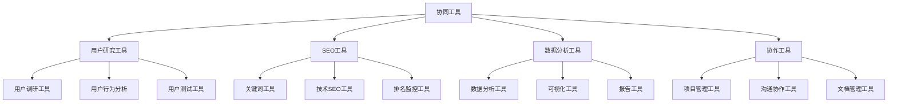

#### 工具推荐
| 工具类型 | 工具名称 | 主要功能 | 协同价值 |
|---------|---------|---------|----------|
| **用户研究** | Hotjar、UserTesting | 用户行为分析、用户测试 | 理解用户需求 |
| **SEO工具** | Google Search Console、Ahrefs | SEO分析、排名监控 | SEO效果评估 |
| **数据分析** | Google Analytics、Mixpanel | 数据分析、用户行为 | 综合效果分析 |
| **协作工具** | Slack、Trello、Notion | 团队协作、项目管理 | 提高协作效率 |

### 协同工作流程
#### 工作流程设计
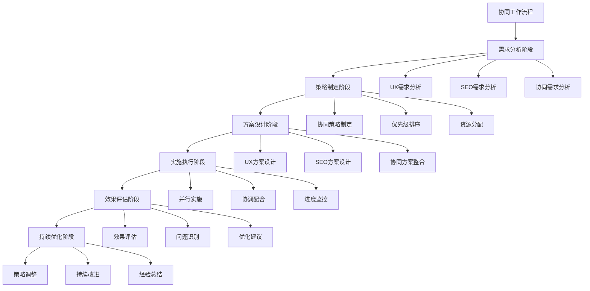

## 🎯 协同最佳实践

### 成功要素
#### 关键成功要素
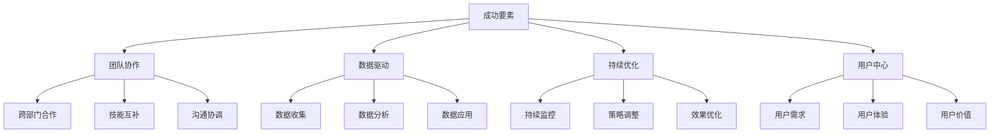

#### 实施建议
- **团队协作**：建立跨部门协作机制，确保UX和SEO团队密切配合
- **数据驱动**：基于数据做决策，用数据验证协同效果
- **持续优化**：建立持续优化机制，不断改进协同策略
- **用户中心**：始终以用户需求为中心，平衡UX和SEO需求

### 常见挑战
#### 挑战与解决方案
| 挑战类型 | 具体挑战 | 解决方案 | 预防措施 |
|---------|---------|---------|----------|
| **目标冲突** | UX和SEO目标不一致 | 统一目标、协调策略 | 制定统一目标 |
| **资源竞争** | 资源分配不合理 | 资源整合、优先级排序 | 统一资源管理 |
| **沟通障碍** | 跨部门沟通困难 | 建立沟通机制 | 定期沟通会议 |
| **效果衡量** | 难以衡量协同效果 | 建立评估体系 | 制定评估标准 |

## 🎯 费曼学习法应用

### 用简单语言解释UX与SEO协同
**向朋友解释**：
"UX与SEO协同就像是开一家餐厅，UX是让顾客觉得餐厅环境好、服务好、菜品好吃，SEO是让更多顾客知道这家餐厅。两者结合起来，既要有好的体验让顾客满意，又要让更多顾客能找到并愿意来。"

### 核心概念简化
1. **UX = 让用户觉得好用**
2. **SEO = 让搜索引擎推荐你**
3. **协同 = 两者结合，效果更好**
4. **成功 = 用户满意 + 搜索引擎推荐 + 业务增长**

## 🔗 相关链接

- [[用户体验指标]] - 了解用户体验的关键指标
- [[页面体验优化]] - 学习页面体验优化方法
- [[转化率优化]] - 了解转化率优化方法
- [[网站速度优化]] - 学习网站速度优化方法

---

**下一步学习**：开始学习 [[03-SEO工具应用]]，掌握SEO工具的使用方法
