# 转化率优化

> **核心理念**：转化率优化是SEO的最终目标，通过优化用户体验和转化路径，将SEO流量转化为业务价值

## 🎯 转化率优化概述

### 什么是转化率优化
**转化率优化** = 用户体验优化 + 转化路径优化 + 数据驱动决策 + 持续改进

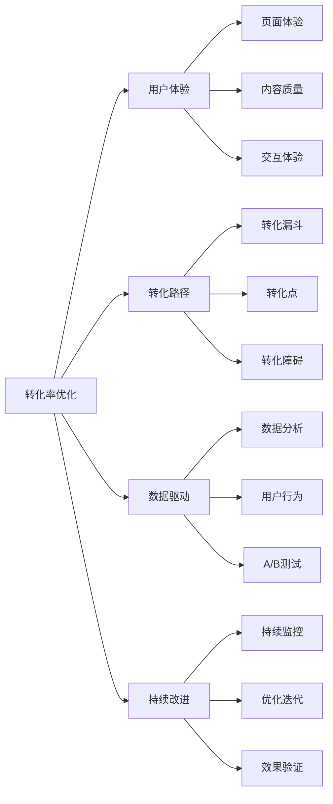

**简单理解**：转化率优化就是让更多访问你网站的用户完成你希望他们做的事情，比如购买产品、注册账号、下载资料等。

## 📊 转化率分析

### 转化率指标
#### 关键转化指标
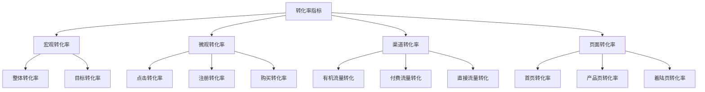

#### 转化率基准
| 转化类型 | 行业平均 | 优秀水平 | 优化目标 |
|---------|---------|---------|----------|
| **电商购买** | 2-3% | 5-10% | 提升50-100% |
| **B2B咨询** | 1-2% | 3-5% | 提升100-200% |
| **内容下载** | 5-10% | 15-25% | 提升50-100% |
| **邮件订阅** | 1-3% | 5-10% | 提升100-200% |

### 转化漏斗分析
#### 标准转化漏斗
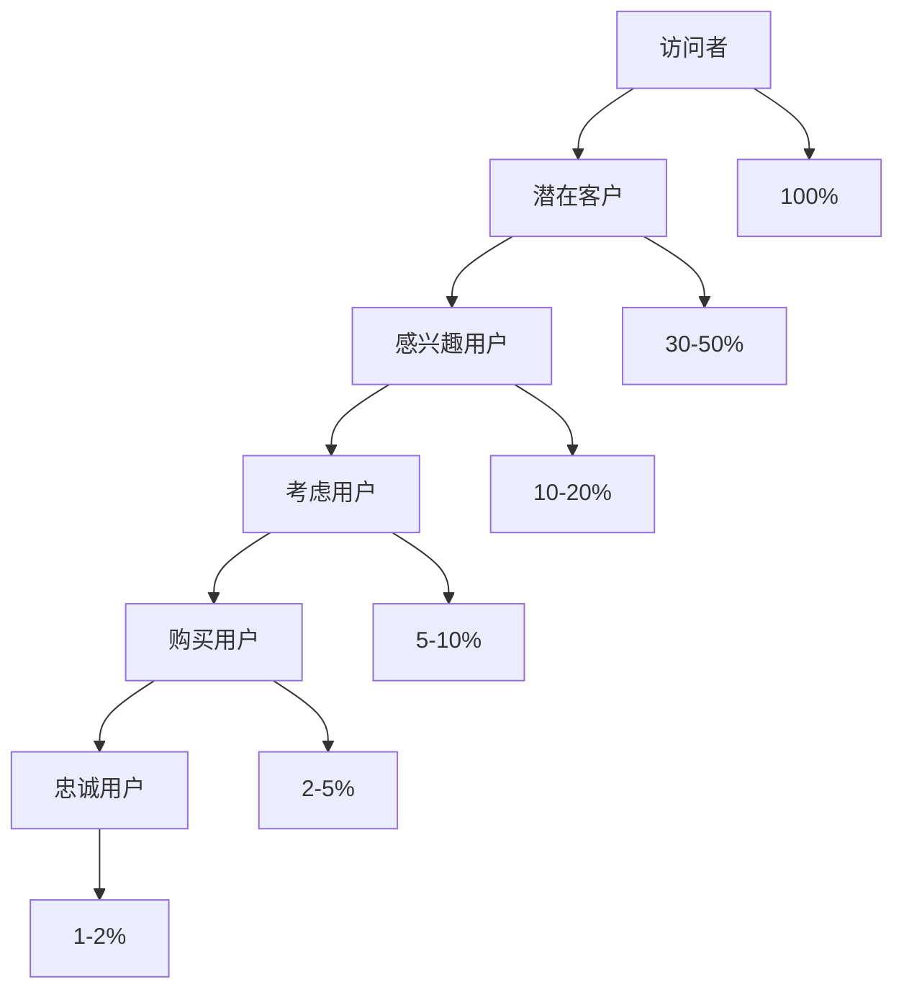

#### 漏斗优化策略
| 漏斗阶段 | 优化重点 | 优化方法 | 预期效果 |
|---------|---------|---------|----------|
| **访问者→潜在客户** | 内容质量、页面体验 | 提升内容价值、优化用户体验 | 提升20-30% |
| **潜在客户→感兴趣用户** | 个性化、相关性 | 个性化推荐、相关内容 | 提升30-50% |
| **感兴趣用户→考虑用户** | 信任建立、价值证明 | 社会证明、案例展示 | 提升40-60% |
| **考虑用户→购买用户** | 转化路径、购买体验 | 简化流程、优化体验 | 提升50-100% |

## 🎨 用户体验优化

### 页面体验优化
#### 体验优化要点
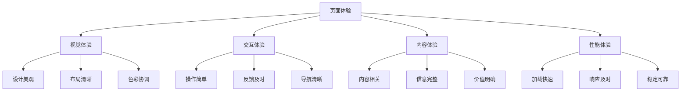

#### 体验优化策略
| 体验方面 | 优化要点 | 最佳实践 | 避免事项 |
|---------|---------|---------|----------|
| **视觉体验** | 美观、清晰、协调 | 使用品牌色彩、清晰布局 | 设计混乱、色彩过多 |
| **交互体验** | 简单、直观、流畅 | 操作简单、反馈及时 | 操作复杂、缺少反馈 |
| **内容体验** | 相关、完整、有价值 | 内容相关、信息完整 | 内容无关、信息缺失 |
| **性能体验** | 快速、稳定、可靠 | 加载快速、响应及时 | 加载慢、响应延迟 |

### 移动端体验优化
#### 移动端转化优化
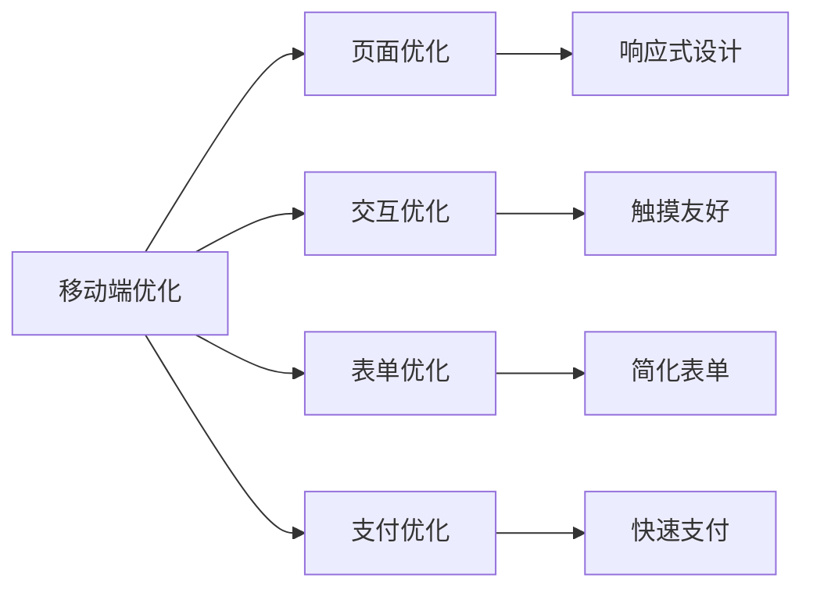

#### 移动端优化策略
| 优化方面 | 优化要点 | 最佳实践 | 预期效果 |
|---------|---------|---------|----------|
| **页面优化** | 响应式、加载快 | 移动优先设计、优化图片 | 提升30-50%转化率 |
| **交互优化** | 触摸友好、操作简单 | 大按钮、简单操作 | 提升20-30%转化率 |
| **表单优化** | 简化表单、减少步骤 | 最少字段、自动填充 | 提升40-60%转化率 |
| **支付优化** | 快速支付、多种方式 | 一键支付、多种支付方式 | 提升50-100%转化率 |

## 🔄 转化路径优化

### 转化路径设计
#### 路径类型
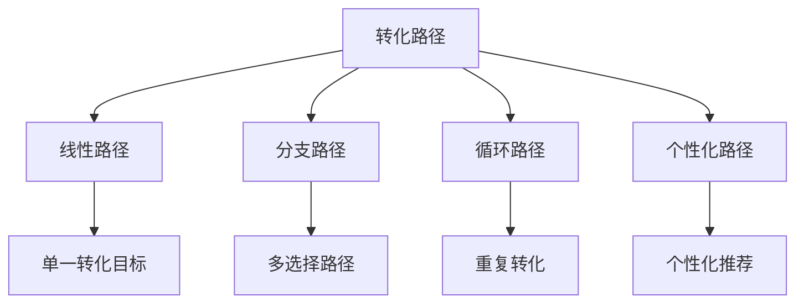

#### 路径优化原则
| 优化原则 | 说明 | 实施方法 | 预期效果 |
|---------|------|----------|----------|
| **简化原则** | 减少转化步骤 | 合并步骤、减少字段 | 提升20-30%转化率 |
| **清晰原则** | 明确转化目标 | 清晰的CTA、价值说明 | 提升30-50%转化率 |
| **信任原则** | 建立用户信任 | 社会证明、安全保障 | 提升40-60%转化率 |
| **个性化原则** | 个性化体验 | 个性化推荐、定制内容 | 提升50-100%转化率 |

### 转化点优化
#### 关键转化点
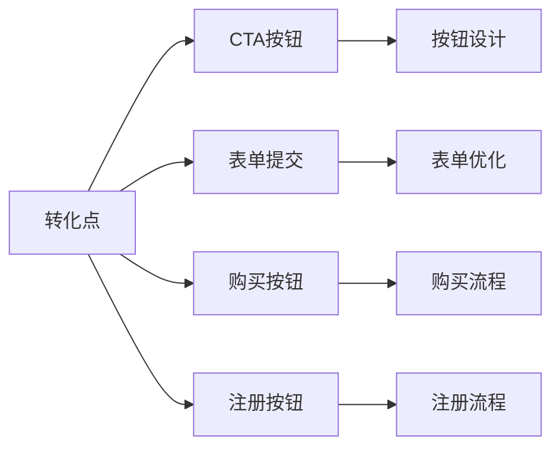

#### 转化点优化策略
| 转化点 | 优化要点 | 最佳实践 | 避免事项 |
|-------|---------|---------|----------|
| **CTA按钮** | 醒目、清晰、有吸引力 | 对比色、明确文案、合适位置 | 颜色不明显、文案模糊 |
| **表单提交** | 简单、快速、安全 | 最少字段、自动填充、安全提示 | 字段过多、流程复杂 |
| **购买按钮** | 信任、便捷、多种选择 | 安全标识、快速支付、多种方式 | 缺少信任信号、支付方式单一 |
| **注册按钮** | 价值明确、流程简单 | 价值说明、简化流程、社交登录 | 价值不明确、流程复杂 |

## 📈 数据驱动优化

### 数据分析方法
#### 分析维度
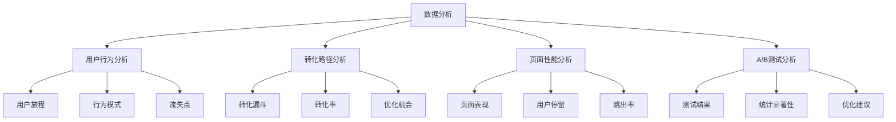

#### 关键指标分析
| 指标类型 | 关键指标 | 分析方法 | 优化方向 |
|---------|---------|---------|----------|
| **用户行为** | 页面浏览量、停留时间、跳出率 | 热力图、用户旅程分析 | 内容优化、体验提升 |
| **转化路径** | 转化率、流失率、完成率 | 漏斗分析、路径分析 | 流程优化、障碍消除 |
| **页面性能** | 加载速度、交互响应、错误率 | 性能监控、错误分析 | 性能优化、错误修复 |
| **A/B测试** | 转化率差异、统计显著性 | 假设检验、效果评估 | 方案优化、持续改进 |

### A/B测试方法
#### 测试流程
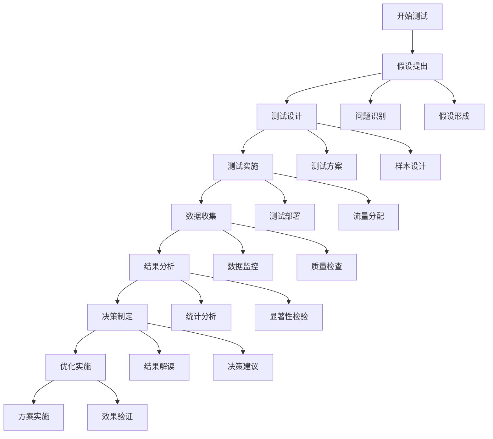

#### 测试最佳实践
| 测试方面 | 最佳实践 | 注意事项 | 预期效果 |
|---------|---------|---------|----------|
| **测试设计** | 单一变量、样本充足 | 避免多变量、确保样本量 | 结果可靠 |
| **测试实施** | 随机分配、时间充足 | 避免偏差、测试时间足够 | 结果准确 |
| **数据分析** | 统计显著、业务相关 | 关注统计显著性、业务价值 | 决策科学 |
| **结果应用** | 快速实施、持续监控 | 及时实施、持续优化 | 效果持续 |

## 🎯 转化率优化策略

### 优化策略框架
#### 策略类型
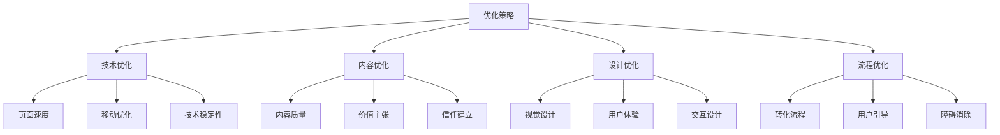

#### 优化优先级
| 优化类型 | 影响程度 | 实施难度 | 优先级 | 预期效果 |
|---------|---------|---------|--------|----------|
| **技术优化** | 高 | 中等 | 高 | 提升20-30% |
| **内容优化** | 极高 | 中等 | 极高 | 提升30-50% |
| **设计优化** | 中 | 低 | 中 | 提升15-25% |
| **流程优化** | 高 | 低 | 高 | 提升25-40% |

### 行业特定优化
#### 不同行业优化重点
| 行业类型 | 优化重点 | 关键转化点 | 优化策略 |
|---------|---------|-----------|----------|
| **电商** | 产品展示、购买流程 | 购买按钮、购物车 | 产品图片、简化购买流程 |
| **B2B** | 信任建立、价值证明 | 咨询表单、案例展示 | 社会证明、详细案例 |
| **内容** | 内容质量、用户参与 | 订阅按钮、分享按钮 | 高质量内容、社交分享 |
| **服务** | 服务展示、预约流程 | 预约按钮、联系方式 | 服务介绍、简化预约 |

## 📊 转化率监控

### 监控体系
#### 监控维度
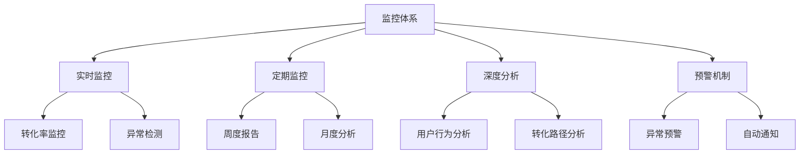

#### 监控指标
| 监控类型 | 关键指标 | 监控频率 | 预警阈值 |
|---------|---------|---------|----------|
| **实时监控** | 转化率、流量、错误率 | 实时 | 转化率下降20% |
| **定期监控** | 用户行为、转化路径 | 每日 | 异常行为模式 |
| **深度分析** | 用户旅程、流失分析 | 每周 | 流失率上升30% |
| **预警机制** | 异常检测、自动通知 | 实时 | 系统异常、性能下降 |

### 优化循环
#### 持续优化流程
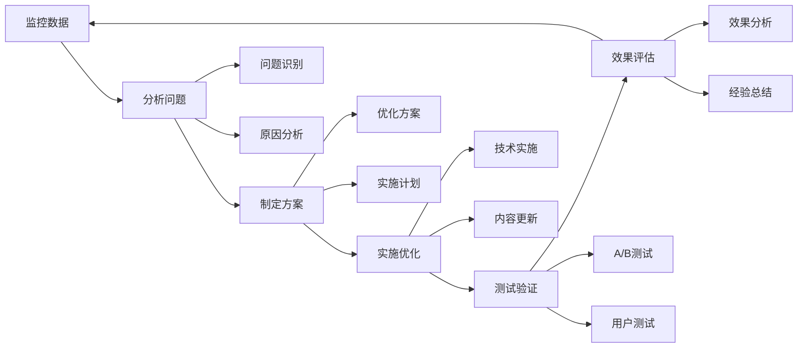

## 🎯 费曼学习法应用

### 用简单语言解释转化率优化
**向朋友解释**：
"转化率优化就像是让更多进店的顾客买东西，你要让店铺看起来吸引人，商品展示得好，服务态度好，结账流程简单，这样顾客就更容易购买。"

### 核心概念简化
1. **转化率 = 完成目标的用户比例**
2. **转化路径 = 用户从访问到转化的过程**
3. **转化点 = 用户做决定的关键时刻**
4. **优化 = 让更多用户完成转化**

## 🔗 相关链接

- [[用户体验指标]] - 了解用户体验的关键指标
- [[页面体验优化]] - 学习页面体验优化方法
- [[UX与SEO协同策略]] - 了解UX与SEO的协同策略
- [[网站速度优化]] - 学习网站速度优化方法

---

**下一步学习**：学习 [[UX与SEO协同策略]]，了解用户体验与SEO的协同优化方法
