# 页面体验优化

> **核心理念**：页面体验是SEO的重要排名因素，优化页面体验既能提升用户体验，又能改善SEO效果

## 🎯 页面体验概述

### 什么是页面体验
**页面体验** = 用户感知 + 技术性能 + 交互体验 + 视觉体验

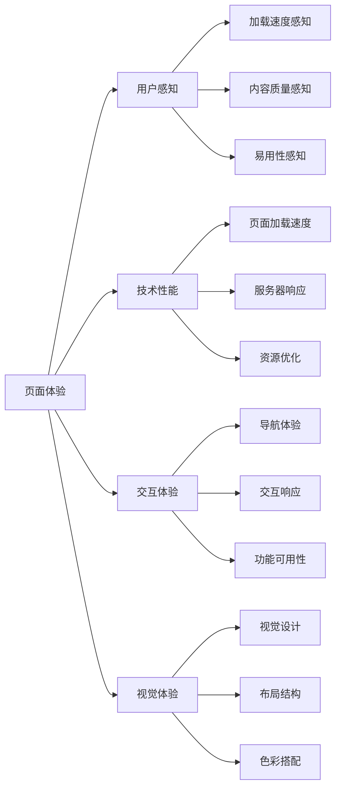

**简单理解**：页面体验就是用户在使用你的网站时的感受，包括页面加载快不快、内容好不好、用起来方不方便、看起来舒不舒服。

## 📊 Core Web Vitals详解

### LCP（Largest Contentful Paint）
#### 什么是LCP
**LCP = 最大内容绘制时间**

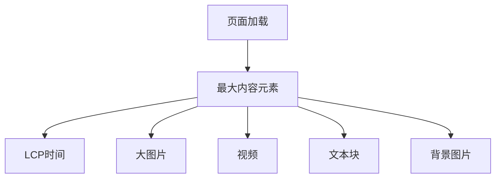

#### LCP优化策略
| 优化方法 | 具体措施 | 预期效果 | 实施难度 |
|---------|---------|---------|----------|
| **图片优化** | 压缩图片、使用WebP格式 | 减少50-80%图片大小 | 中等 |
| **CDN使用** | 部署CDN加速静态资源 | 提升30-50%加载速度 | 低 |
| **服务器优化** | 优化服务器配置 | 提升20-30%响应速度 | 中等 |
| **资源优先级** | 优先加载关键资源 | 提升用户体验 | 中等 |

### FID（First Input Delay）
#### 什么是FID
**FID = 首次输入延迟**

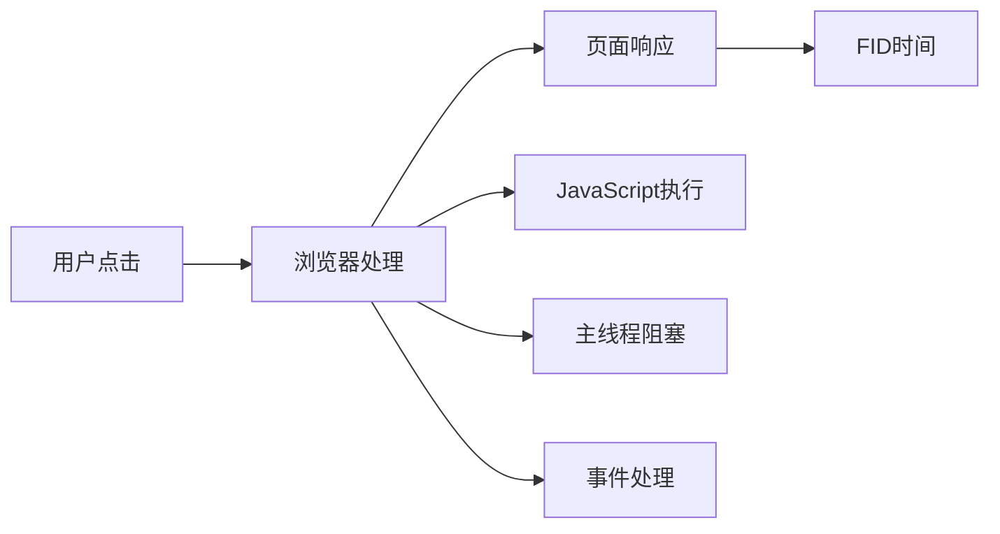

#### FID优化策略
| 优化方法 | 具体措施 | 预期效果 | 实施难度 |
|---------|---------|---------|----------|
| **JavaScript优化** | 代码分割、延迟加载 | 减少主线程阻塞 | 中等 |
| **第三方脚本** | 异步加载、延迟执行 | 提升交互响应 | 低 |
| **事件处理** | 优化事件监听器 | 提升响应速度 | 中等 |
| **内存管理** | 避免内存泄漏 | 提升长期性能 | 高 |

### CLS（Cumulative Layout Shift）
#### 什么是CLS
**CLS = 累积布局偏移**

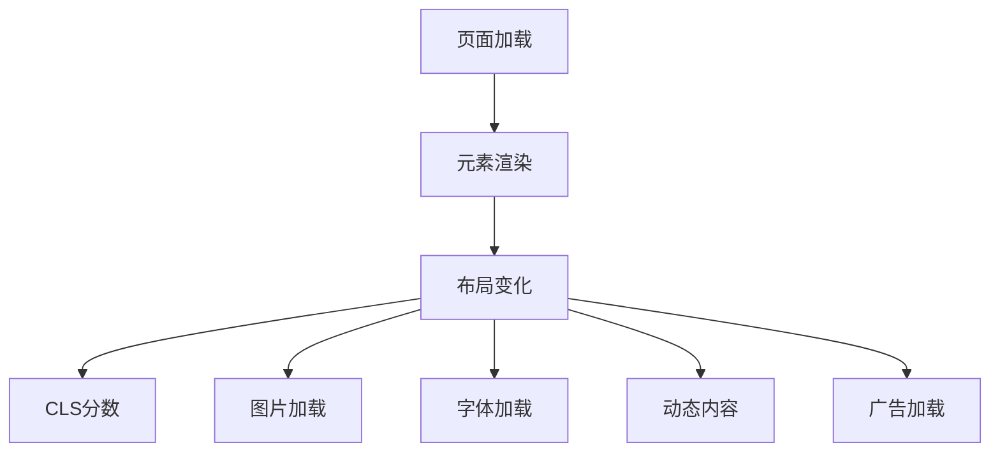

#### CLS优化策略
| 优化方法 | 具体措施 | 预期效果 | 实施难度 |
|---------|---------|---------|----------|
| **图片尺寸** | 设置明确的宽高 | 避免布局偏移 | 低 |
| **字体优化** | 使用font-display | 减少文字跳动 | 中等 |
| **动态内容** | 预留空间 | 避免内容跳动 | 中等 |
| **广告优化** | 固定广告位 | 减少布局影响 | 低 |

## 🎨 视觉体验优化

### 视觉设计优化
#### 设计原则
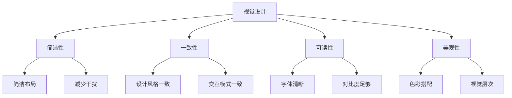

#### 设计优化要点
| 设计方面 | 优化要点 | 最佳实践 | 避免事项 |
|---------|---------|---------|----------|
| **布局设计** | 简洁、清晰、层次分明 | 使用网格系统、留白合理 | 布局混乱、元素拥挤 |
| **色彩搭配** | 协调、对比、品牌一致 | 使用品牌色彩、对比度足够 | 色彩过多、对比度不足 |
| **字体设计** | 清晰、易读、层次分明 | 选择合适的字体、大小适中 | 字体过小、层次不清 |
| **图片使用** | 高质量、相关、优化 | 使用高质量图片、Alt属性 | 图片模糊、加载慢 |

### 移动端视觉优化
#### 移动端设计要点
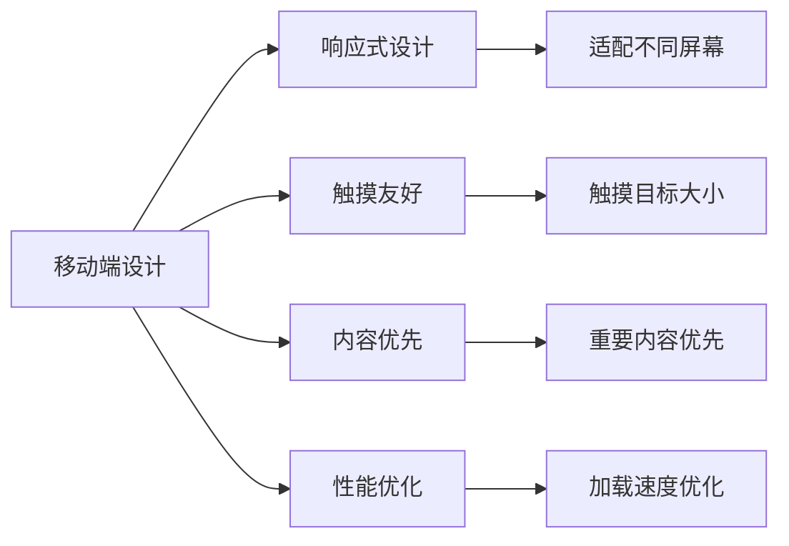

#### 移动端优化策略
| 优化方面 | 优化要点 | 最佳实践 | 注意事项 |
|---------|---------|---------|----------|
| **响应式设计** | 适配所有设备 | 使用媒体查询、弹性布局 | 避免固定宽度 |
| **触摸优化** | 触摸目标≥44px | 按钮大小合适、间距足够 | 触摸目标过小 |
| **内容优先** | 重要内容优先显示 | 关键信息突出、次要信息隐藏 | 内容层次不清 |
| **性能优化** | 快速加载、流畅交互 | 优化图片、减少HTTP请求 | 加载速度慢 |

## 🔧 交互体验优化

### 导航体验优化
#### 导航设计原则
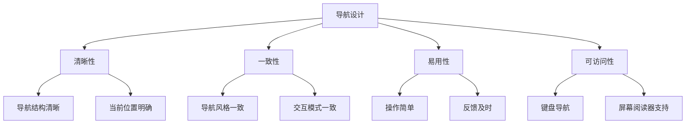

#### 导航优化策略
| 导航类型 | 优化要点 | 最佳实践 | 常见问题 |
|---------|---------|---------|----------|
| **主导航** | 清晰、简洁、易用 | 不超过7个主要项目 | 导航项目过多 |
| **面包屑导航** | 显示当前位置、提供返回路径 | 清晰的层次结构 | 缺少面包屑 |
| **侧边导航** | 结构清晰、易于浏览 | 折叠/展开功能 | 导航过深 |
| **底部导航** | 重要链接、联系方式 | 关键信息链接 | 信息过少 |

### 交互响应优化
#### 交互优化要点
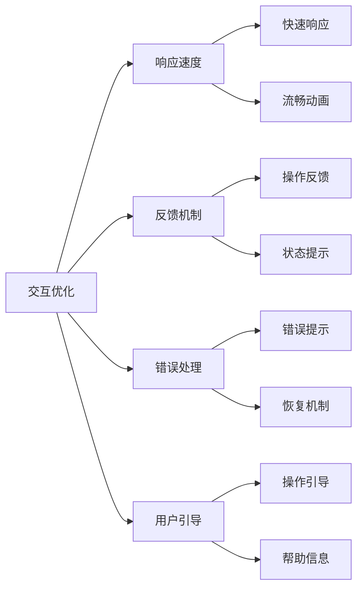

#### 交互优化策略
| 交互方面 | 优化要点 | 最佳实践 | 避免事项 |
|---------|---------|---------|----------|
| **响应速度** | 快速响应、流畅交互 | 优化JavaScript、使用缓存 | 响应延迟、卡顿 |
| **反馈机制** | 及时反馈、状态提示 | 加载提示、操作确认 | 缺少反馈、状态不明 |
| **错误处理** | 友好提示、恢复机制 | 清晰的错误信息、撤销功能 | 错误信息不明确 |
| **用户引导** | 操作引导、帮助信息 | 新手引导、帮助文档 | 缺少引导、操作复杂 |

## 📱 移动端体验优化

### 移动端性能优化
#### 性能优化要点
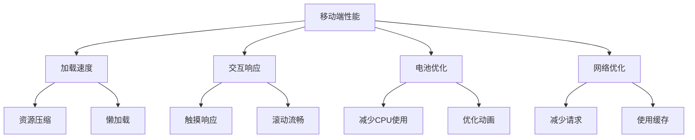

#### 移动端优化策略
| 优化方面 | 优化方法 | 预期效果 | 实施难度 |
|---------|---------|---------|----------|
| **加载速度** | 资源压缩、懒加载 | 提升30-50%加载速度 | 中等 |
| **交互响应** | 优化触摸事件、减少重绘 | 提升交互流畅度 | 中等 |
| **电池优化** | 减少CPU使用、优化动画 | 延长电池续航 | 中等 |
| **网络优化** | 减少HTTP请求、使用缓存 | 减少数据使用 | 低 |

### 移动端用户体验
#### 用户体验要点
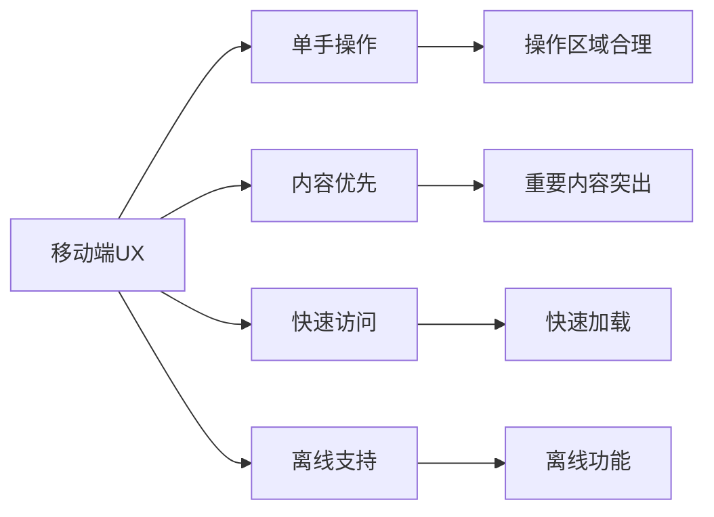

## 🛠️ 页面体验优化工具

### 测试工具
#### 性能测试工具
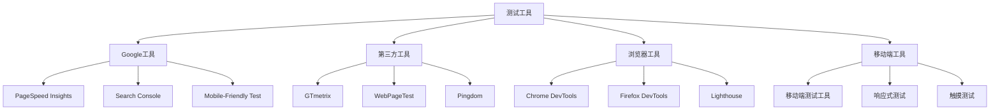

#### 工具使用建议
| 工具类型 | 工具名称 | 测试内容 | 使用频率 |
|---------|---------|---------|----------|
| **性能测试** | PageSpeed Insights | Core Web Vitals、性能指标 | 每周 |
| **移动测试** | Mobile-Friendly Test | 移动友好性 | 每周 |
| **综合测试** | Lighthouse | 性能、可访问性、SEO | 每月 |
| **实时测试** | Chrome DevTools | 实时性能分析 | 开发时 |

### 监控工具
#### 持续监控
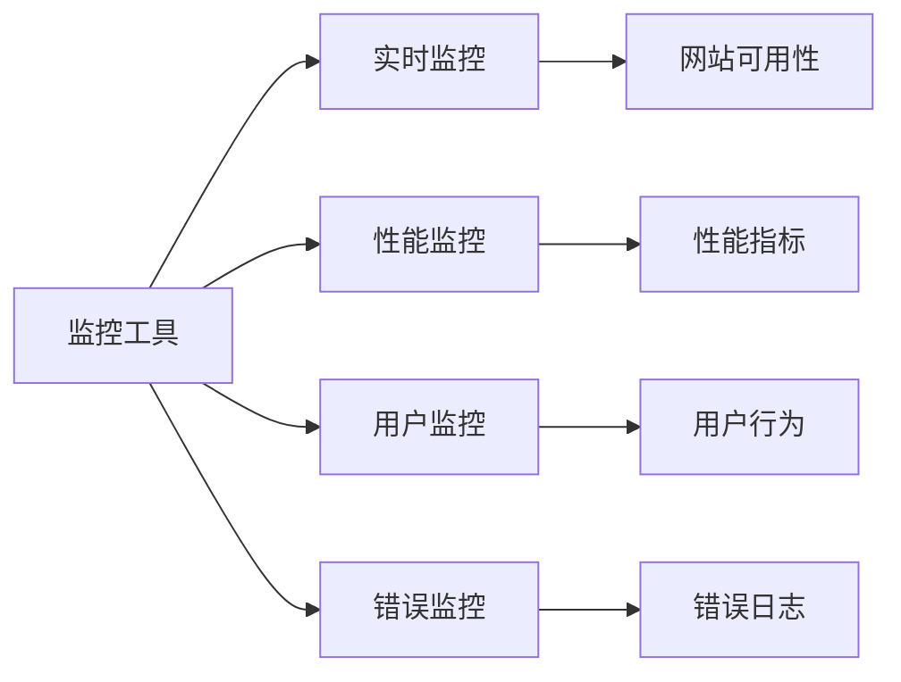

## 📈 页面体验优化效果

### 优化效果评估
#### 效果指标
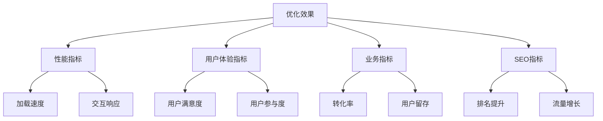

#### 效果评估
| 指标类型 | 关键指标 | 目标值 | 优化效果 |
|---------|---------|--------|----------|
| **性能指标** | LCP、FID、CLS | LCP<2.5s、FID<100ms、CLS<0.1 | 显著提升 |
| **用户体验** | 用户满意度、参与度 | 满意度>90%、参与度提升 | 明显改善 |
| **业务指标** | 转化率、用户留存 | 转化率提升20%+ | 业务增长 |
| **SEO指标** | 排名、流量 | 排名提升、流量增长 | SEO效果提升 |

## 🎯 费曼学习法应用

### 用简单语言解释页面体验优化
**向朋友解释**：
"页面体验优化就像是装修房子，要让房子既好看又实用，客人来了觉得舒服，住起来方便，这样客人就愿意经常来，也愿意推荐给朋友。"

### 核心概念简化
1. **页面体验 = 用户使用网站的感受**
2. **Core Web Vitals = 网站性能的三个关键指标**
3. **视觉体验 = 网站看起来怎么样**
4. **交互体验 = 网站用起来怎么样**
5. **移动端体验 = 手机上看网站怎么样**

## 🔗 相关链接

- [[用户体验指标]] - 了解用户体验的关键指标
- [[转化率优化]] - 学习转化率优化方法
- [[UX与SEO协同策略]] - 了解UX与SEO的协同策略
- [[网站速度优化]] - 学习网站速度优化方法

---

**下一步学习**：学习 [[转化率优化]]，了解如何通过优化用户体验提升转化率
