# Google Search Console使用指南

> **核心理念**：掌握Google Search Console的核心功能，建立系统化的SEO监控体系，实现数据驱动的SEO优化

## 🔍 Google Search Console概述

### 什么是Google Search Console
**Google Search Console** = 免费SEO工具 + 网站性能监控 + 搜索引擎沟通桥梁

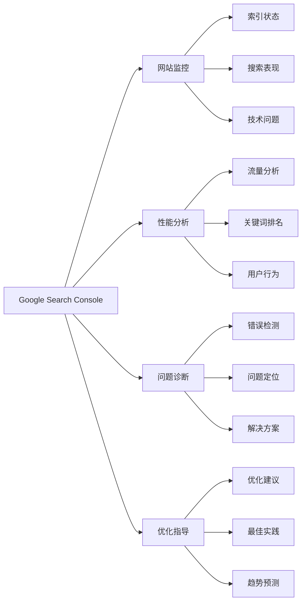

**简单理解**：Google Search Console就像是网站的体检报告，告诉你网站在Google搜索中的健康状况，哪里有问题，需要怎么改进。

### 核心价值
| 价值方面 | 具体功能 | SEO重要性 | 使用频率 |
|---------|---------|---------|---------|
| **索引监控** | 页面索引状态、覆盖率 | 极高 | 每日 |
| **性能分析** | 搜索表现、流量分析 | 极高 | 每日 |
| **问题诊断** | 技术错误、索引问题 | 高 | 每周 |
| **优化指导** | 改进建议、最佳实践 | 高 | 每月 |

## ⚙️ 账户设置和验证

### 账户创建流程
#### 注册步骤
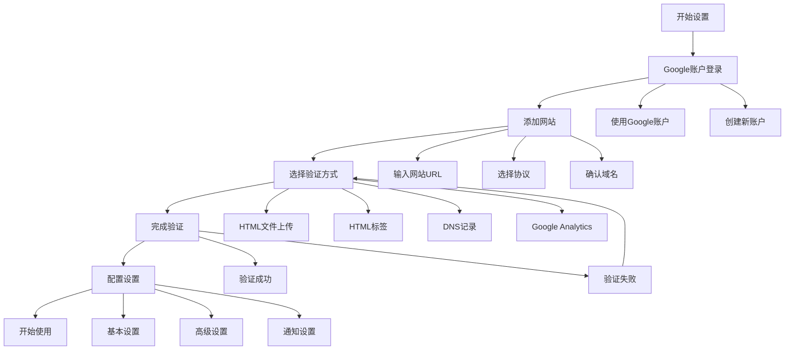

#### 验证方法对比
| 验证方法 | 难度 | 适用场景 | 优势 | 劣势 |
|---------|------|---------|------|------|
| **HTML文件上传** | 低 | 有FTP权限 | 简单快速 | 需要服务器权限 |
| **HTML标签** | 低 | 可修改首页 | 简单快速 | 需要修改代码 |
| **DNS记录** | 中 | 有DNS权限 | 无需修改网站 | 需要DNS权限 |
| **Google Analytics** | 低 | 已安装GA | 无需额外操作 | 需要GA账户 |
| **Google Tag Manager** | 低 | 已安装GTM | 无需额外操作 | 需要GTM账户 |

### 网站配置优化
#### 基本配置
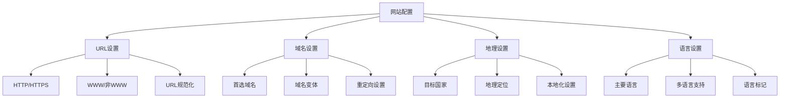

#### 高级配置
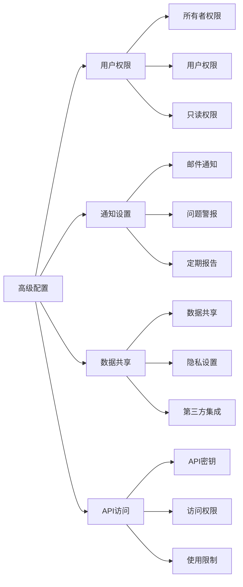

#### 配置最佳实践
| 配置方面 | 最佳实践 | 注意事项 | SEO影响 |
|---------|---------|---------|---------|
| **URL设置** | 统一使用HTTPS | 避免混合内容 | 高 |
| **域名设置** | 设置首选域名 | 避免重复内容 | 高 |
| **地理设置** | 设置目标国家 | 影响本地搜索 | 中 |
| **语言设置** | 设置主要语言 | 影响语言识别 | 中 |

## 📊 核心功能使用

### 性能报告分析
#### 搜索查询分析
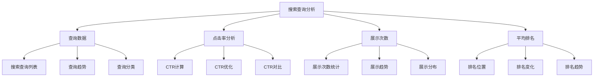

#### 页面性能分析
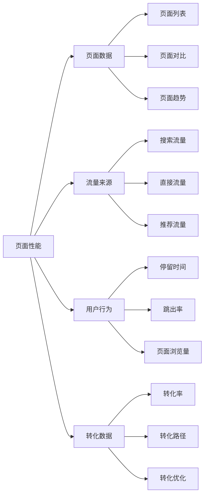

#### 性能指标解读
| 指标类型 | 指标名称 | 计算公式 | 优化目标 | SEO价值 |
|---------|---------|---------|---------|---------|
| **流量指标** | 点击次数 | 实际点击数 | 提升点击量 | 极高 |
| **展示指标** | 展示次数 | 搜索结果展示数 | 提升展示量 | 高 |
| **排名指标** | 平均排名 | 总排名位置/查询数 | 提升排名 | 极高 |
| **转化指标** | 点击率 | 点击次数/展示次数 | 提升CTR | 高 |

### 索引报告分析
#### 覆盖范围分析
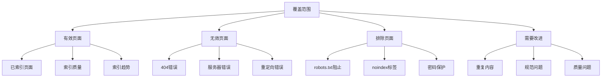

#### 索引问题诊断
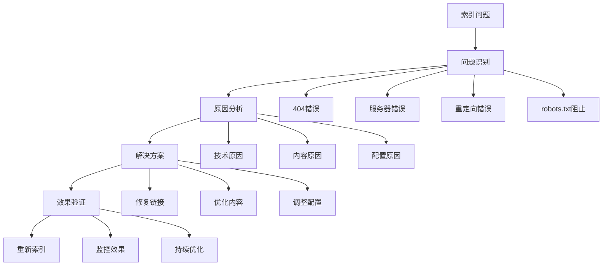

#### 索引优化策略
| 问题类型 | 常见原因 | 解决方案 | 优先级 | 预期效果 |
|---------|---------|---------|--------|---------|
| **404错误** | 链接失效、页面删除 | 修复链接、重定向 | 高 | 快速恢复 |
| **服务器错误** | 服务器问题、超时 | 修复服务器、优化性能 | 极高 | 立即恢复 |
| **重定向错误** | 重定向链过长、循环 | 优化重定向链 | 中 | 改善体验 |
| **robots.txt阻止** | 配置错误、过度限制 | 修正robots.txt | 高 | 恢复索引 |

### 增强功能使用
#### 结构化数据监控
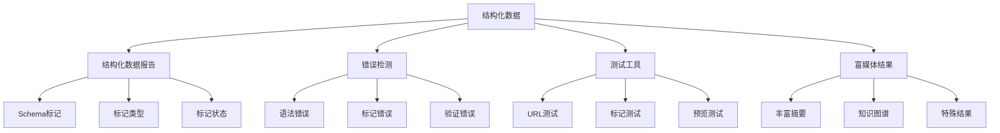

#### 移动可用性检查
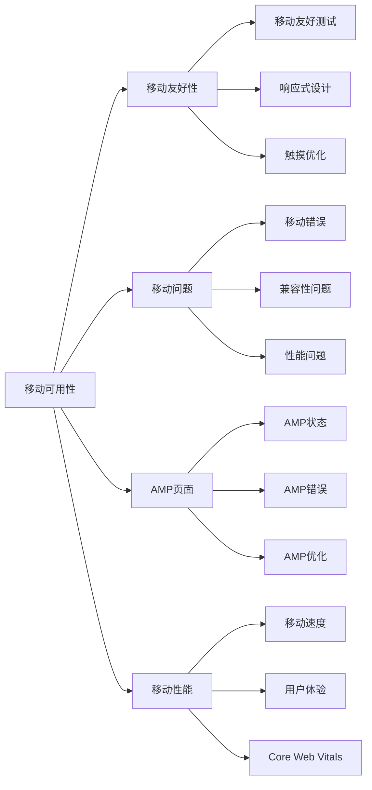

#### 增强功能优化
| 功能类型 | 优化重点 | 实施方法 | SEO价值 |
|---------|---------|---------|---------|
| **结构化数据** | Schema标记、丰富摘要 | 添加结构化标记 | 高 |
| **移动可用性** | 响应式设计、触摸优化 | 移动优先设计 | 极高 |
| **AMP页面** | AMP优化、错误修复 | 实施AMP技术 | 中 |
| **富媒体结果** | 图像优化、视频标记 | 多媒体内容优化 | 中 |

## 🔧 技术SEO监控

### 网站健康检查
#### Core Web Vitals监控
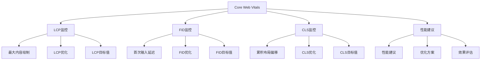

#### 安全问题监控
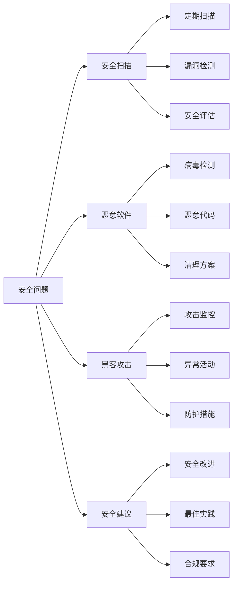

#### 技术SEO指标
| 指标类型 | 指标名称 | 目标值 | 优化方法 | SEO影响 |
|---------|---------|--------|---------|---------|
| **性能指标** | LCP | <2.5秒 | 优化资源加载 | 极高 |
| **交互指标** | FID | <100毫秒 | 优化JavaScript | 极高 |
| **视觉指标** | CLS | <0.1 | 稳定布局 | 极高 |
| **安全指标** | HTTPS | 100% | SSL证书配置 | 高 |

### 链接分析报告
#### 外部链接分析
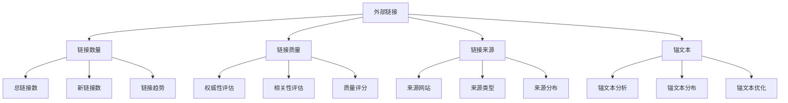

#### 内部链接分析
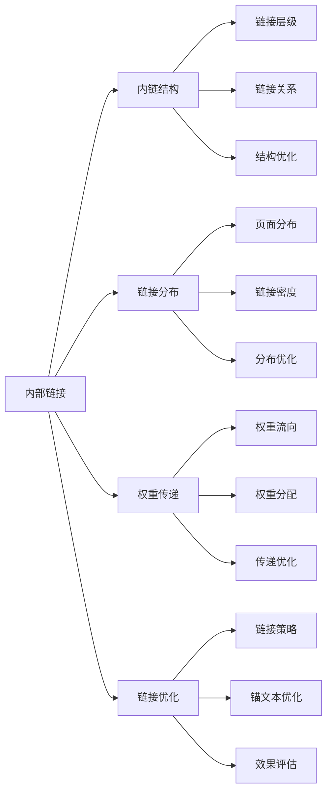

#### 链接优化策略
| 链接类型 | 优化重点 | 实施方法 | 预期效果 |
|---------|---------|---------|---------|
| **外部链接** | 质量提升、相关性 | 建设高质量外链 | 高 |
| **内部链接** | 结构优化、权重传递 | 优化内链结构 | 中 |
| **锚文本** | 自然性、相关性 | 优化锚文本 | 中 |
| **链接监控** | 持续监控、及时调整 | 建立监控体系 | 高 |

## 📈 数据分析和报告

### 数据解读体系
#### 关键指标分析
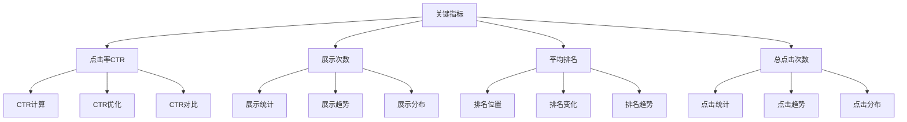

#### 趋势分析方法
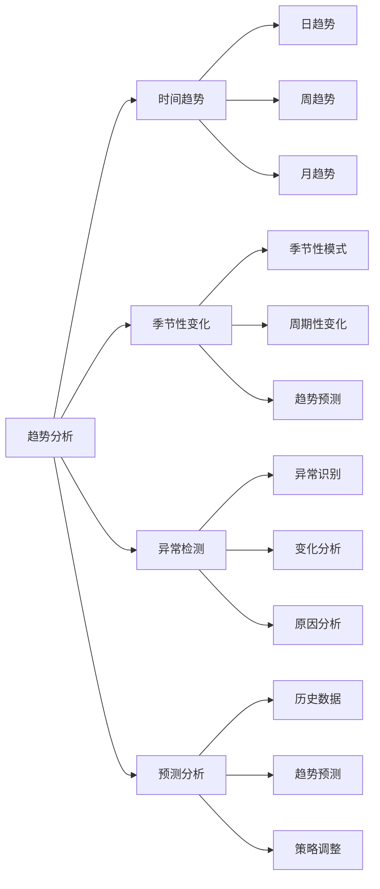

#### 指标解读指南
| 指标类型 | 指标名称 | 计算公式 | 优化目标 | 分析重点 |
|---------|---------|---------|---------|---------|
| **流量指标** | 点击次数 | 实际点击数 | 提升点击量 | 流量来源、用户行为 |
| **展示指标** | 展示次数 | 搜索结果展示数 | 提升展示量 | 关键词覆盖、搜索可见性 |
| **排名指标** | 平均排名 | 总排名位置/查询数 | 提升排名 | 关键词竞争、内容质量 |
| **转化指标** | 点击率 | 点击次数/展示次数 | 提升CTR | 标题优化、描述优化 |

### 报告生成体系
#### 自定义报告创建
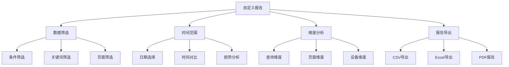

#### 定期报告体系
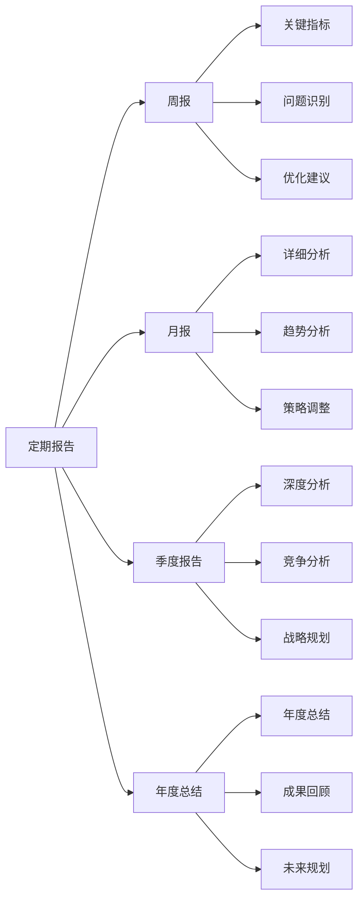

#### 报告最佳实践
| 报告类型 | 报告频率 | 主要内容 | 目标受众 | 价值 |
|---------|---------|---------|---------|------|
| **周报** | 每周 | 关键指标、问题识别 | 执行团队 | 及时调整 |
| **月报** | 每月 | 详细分析、趋势分析 | 管理层 | 策略优化 |
| **季度报告** | 每季度 | 深度分析、竞争分析 | 决策层 | 战略规划 |
| **年度总结** | 每年 | 年度总结、未来规划 | 所有层级 | 长期规划 |

## 🔧 问题诊断和解决

### 常见问题诊断
#### 索引问题诊断
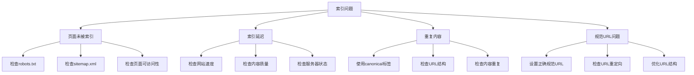

#### 性能问题诊断
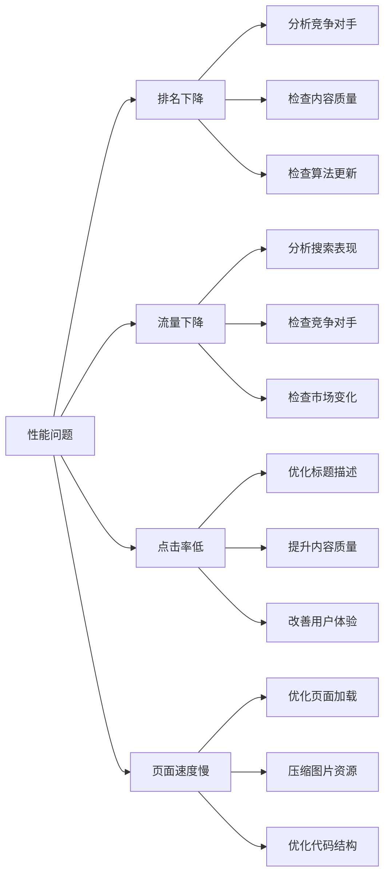

### 解决方案体系
#### 技术修复
```mermaid
graph TD
    A[技术修复] --> B[robots.txt优化]
    A --> C[sitemap更新]
    A --> D[页面优化]
    A --> E[链接修复]
    
    B --> B1[检查robots.txt配置]
    B --> B2[优化爬虫指令]
    B --> B3[测试robots.txt效果]
    
    C --> C1[更新sitemap内容]
    C --> C2[提交sitemap到GSC]
    C --> C3[监控sitemap状态]
    
    D --> D1[优化页面技术]
    D --> D2[改善页面内容]
    D --> D3[提升页面性能]
    
    E --> E1[修复损坏链接]
    E --> E2[优化链接结构]
    E --> E3[改善链接质量]
```

#### 内容优化
```mermaid
graph LR
    A[内容优化] --> B[标题优化]
    A --> C[内容改进]
    A --> D[关键词优化]
    A --> E[用户体验]
    
    B --> B1[优化页面标题]
    B --> B2[优化Meta描述]
    B --> B3[提升标题吸引力]
    
    C --> C1[改进内容质量]
    C --> C2[提升内容原创性]
    C --> C3[改善内容可读性]
    
    D --> D1[优化关键词使用]
    D --> D2[提升关键词相关性]
    D --> D3[改善关键词分布]
    
    E --> E1[改善用户体验]
    E --> E2[优化页面布局]
    E --> E3[提升交互体验]
```

### 问题解决最佳实践
| 问题类型 | 诊断方法 | 解决策略 | 预防措施 | 监控指标 |
|---------|---------|---------|---------|---------|
| **索引问题** | 检查索引报告 | 技术优化、内容优化 | 定期检查、及时更新 | 索引覆盖率 |
| **性能问题** | 分析性能数据 | 内容优化、技术优化 | 持续优化、质量提升 | 平均排名、流量 |
| **技术问题** | 技术审计 | 系统优化、性能提升 | 定期维护、预防性检查 | 技术指标 |
| **内容问题** | 内容分析 | 质量提升、用户体验 | 持续改进、用户反馈 | 用户参与度 |

## 🚀 高级功能使用

### API集成体系
#### Search Console API
```mermaid
graph TD
    A[Search Console API] --> B[数据获取]
    A --> C[自动化报告]
    A --> D[第三方集成]
    A --> E[自定义分析]
    
    B --> B1[查询数据API]
    B --> B2[站点地图API]
    B --> B3[URL检查API]
    
    C --> C1[定期报告生成]
    C --> C2[数据自动更新]
    C --> C3[报告自动发送]
    
    D --> D1[Google Analytics集成]
    D --> D2[第三方工具集成]
    D --> D3[自定义工具开发]
    
    E --> E1[自定义指标计算]
    E --> E2[高级数据分析]
    E --> E3[预测分析]
```

#### 数据导出功能
```mermaid
graph LR
    A[数据导出] --> B[CSV导出]
    A --> C[JSON格式]
    A --> D[批量处理]
    A --> E[数据同步]
    
    B --> B1[表格数据导出]
    B --> B2[图表数据导出]
    B --> B3[报告数据导出]
    
    C --> C1[API数据格式]
    C --> C2[结构化数据]
    C --> C3[实时数据获取]
    
    D --> D1[大量数据处理]
    D --> D2[自动化处理]
    D --> D3[定时处理]
    
    E --> E1[多系统同步]
    E --> E2[实时同步]
    E --> E3[增量同步]
```

### 团队协作体系
#### 权限管理
```mermaid
graph TD
    A[权限管理] --> B[用户角色]
    A --> C[权限控制]
    A --> D[团队协作]
    A --> E[审计日志]
    
    B --> B1[所有者角色]
    B --> B2[管理员角色]
    B --> B3[编辑者角色]
    B --> B4[查看者角色]
    
    C --> C1[功能权限控制]
    C --> C2[数据权限控制]
    C --> C3[时间权限控制]
    
    D --> D1[任务分配]
    D --> D2[进度跟踪]
    D --> D3[沟通协作]
    
    E --> E1[操作记录]
    E --> E2[变更追踪]
    E --> E3[安全审计]
```

#### 通知设置
```mermaid
graph LR
    A[通知设置] --> B[邮件通知]
    A --> C[问题警报]
    A --> D[定期报告]
    A --> E[自定义通知]
    
    B --> B1[通知偏好设置]
    B --> B2[通知频率控制]
    B --> B3[通知内容定制]
    
    C --> C1[问题类型设置]
    C --> C2[警报阈值设置]
    C --> C3[警报接收人设置]
    
    D --> D1[报告频率设置]
    D --> D2[报告内容设置]
    D --> D3[报告接收人设置]
    
    E --> E1[自定义规则创建]
    E --> E2[条件设置]
    E --> E3[动作设置]
```

## 💡 最佳实践

### 日常使用体系
#### 定期检查
```mermaid
graph TD
    A[定期检查体系] --> B[每日检查]
    A --> C[每周分析]
    A --> D[每月报告]
    A --> E[季度评估]
    
    B --> B1[关键指标检查]
    B --> B2[异常数据识别]
    B --> B3[问题快速响应]
    
    C --> C1[性能数据分析]
    C --> C2[趋势变化分析]
    C --> C3[优化机会识别]
    
    D --> D1[详细报告生成]
    D --> D2[深度数据分析]
    D --> D3[策略调整建议]
    
    E --> E1[整体表现评估]
    E --> E2[目标达成情况]
    E --> E3[下季度规划]
```

#### 问题响应
```mermaid
graph LR
    A[问题响应体系] --> B[快速响应]
    A --> C[优先级排序]
    A --> D[解决方案]
    A --> E[效果跟踪]
    
    B --> B1[问题识别]
    B --> B2[影响评估]
    B --> B3[紧急处理]
    
    C --> C1[问题分类]
    C --> C2[优先级评估]
    C --> C3[资源分配]
    
    D --> D1[解决方案制定]
    D --> D2[实施计划]
    D --> D3[风险控制]
    
    E --> E1[效果监控]
    E --> E2[结果评估]
    E --> E3[经验总结]
```

### 数据分析体系
#### 数据解读
```mermaid
graph TD
    A[数据解读体系] --> B[指标理解]
    A --> C[趋势分析]
    A --> D[异常识别]
    A --> E[洞察提取]
    
    B --> B1[指标定义]
    B --> B2[计算方法]
    B --> B3[影响因素]
    
    C --> C1[时间趋势]
    C --> C2[季节性趋势]
    C --> C3[周期性趋势]
    
    D --> D1[异常检测]
    D --> D2[原因分析]
    D --> D3[影响评估]
    
    E --> E1[模式识别]
    E --> E2[价值发现]
    E --> E3[机会识别]
```

#### 决策支持
```mermaid
graph LR
    A[决策支持体系] --> B[数据驱动]
    A --> C[A/B测试]
    A --> D[优化建议]
    A --> E[效果评估]
    
    B --> B1[数据收集]
    B --> B2[数据分析]
    B --> B3[决策制定]
    
    C --> C1[假设验证]
    C --> C2[测试设计]
    C --> C3[结果分析]
    
    D --> D1[问题识别]
    D --> D2[方案制定]
    D --> D3[实施指导]
    
    E --> E1[效果监控]
    E --> E2[结果评估]
    E --> E3[持续改进]
```

### 最佳实践总结
| 实践领域 | 关键要点 | 实施方法 | 预期效果 | 注意事项 |
|---------|---------|---------|---------|---------|
| **定期检查** | 建立检查体系 | 制定检查清单 | 及时发现问题 | 避免过度检查 |
| **问题响应** | 快速响应机制 | 建立响应流程 | 减少问题影响 | 优先级合理 |
| **数据分析** | 深度数据解读 | 多维度分析 | 发现优化机会 | 数据准确性 |
| **决策支持** | 数据驱动决策 | 建立决策流程 | 提升决策质量 | 数据可靠性 |

## ⚠️ 常见错误和避免方法

### 设置错误避免
#### 验证问题
```mermaid
graph TD
    A[验证问题] --> B[验证失败]
    A --> C[权限不足]
    A --> D[配置错误]
    A --> E[数据延迟]
    
    B --> B1[检查验证方法]
    B --> B2[确认网站所有权]
    B --> B3[重新验证]
    
    C --> C1[检查账户权限]
    C --> C2[确认管理员权限]
    C --> C3[联系网站所有者]
    
    D --> D1[检查网站配置]
    D --> D2[确认DNS设置]
    D --> D3[检查服务器配置]
    
    E --> E1[理解数据延迟]
    E --> E2[设置合理预期]
    E --> E3[定期检查更新]
```

#### 使用错误避免
```mermaid
graph LR
    A[使用错误避免] --> B[数据误解]
    A --> C[过度依赖]
    A --> D[忽略警告]
    A --> E[缺乏行动]
    
    B --> B1[正确理解数据]
    B --> B2[学习指标含义]
    B --> B3[咨询专业人士]
    
    C --> C1[多工具结合]
    C --> C2[数据交叉验证]
    C --> C3[综合分析]
    
    D --> D1[及时处理警告]
    D --> D2[设置提醒通知]
    D --> D3[定期检查状态]
    
    E --> E1[制定行动计划]
    E --> E2[跟踪执行效果]
    E --> E3[持续改进]
```

### 最佳实践建议
#### 工具使用
```mermaid
graph TD
    A[工具使用最佳实践] --> B[多工具结合]
    A --> C[数据验证]
    A --> D[定期更新]
    A --> E[持续学习]
    
    B --> B1[Google Analytics]
    B --> B2[第三方SEO工具]
    B --> B3[自定义工具]
    
    C --> C1[数据交叉验证]
    C --> C2[多源数据对比]
    C --> C3[数据准确性检查]
    
    D --> D1[工具功能更新]
    D --> D2[使用知识更新]
    D --> D3[最佳实践更新]
    
    E --> E1[新功能学习]
    E --> E2[技巧掌握]
    E --> E3[经验积累]
```

#### 工作流程
```mermaid
graph LR
    A[工作流程最佳实践] --> B[系统化方法]
    A --> C[文档记录]
    A --> D[团队协作]
    A --> E[持续改进]
    
    B --> B1[建立分析流程]
    B --> B2[标准化操作]
    B --> B3[质量控制]
    
    C --> C1[过程记录]
    C --> C2[结果记录]
    C --> C3[经验记录]
    
    D --> D1[团队协作]
    D --> D2[知识分享]
    D --> D3[责任分工]
    
    E --> E1[方法改进]
    E --> E2[流程优化]
    E --> E3[效果评估]
```

### 错误避免总结
| 错误类型 | 常见表现 | 避免方法 | 预防措施 | 纠正措施 |
|---------|---------|---------|---------|---------|
| **设置错误** | 验证失败、权限不足 | 正确配置、权限检查 | 定期检查、权限审核 | 重新配置、权限调整 |
| **使用错误** | 数据误解、过度依赖 | 正确理解、多工具结合 | 培训学习、经验积累 | 重新分析、工具调整 |
| **流程错误** | 缺乏系统、文档不全 | 建立流程、完善文档 | 标准化操作、定期检查 | 流程改进、文档完善 |
| **协作错误** | 沟通不畅、责任不清 | 明确分工、加强沟通 | 定期沟通、责任明确 | 改善沟通、重新分工 |

## 📋 总结

### 核心价值
```mermaid
graph TD
    A[Google Search Console核心价值] --> B[免费工具]
    A --> C[官方数据]
    A --> D[问题诊断]
    A --> E[持续优化]
    
    B --> B1[Google官方提供]
    B --> B2[功能完整]
    B --> B3[持续更新]
    
    C --> C1[搜索数据]
    C --> C2[索引数据]
    C --> C3[性能数据]
    
    D --> D1[技术问题]
    D --> D2[内容问题]
    D --> D3[用户体验问题]
    
    E --> E1[数据驱动]
    E --> E2[持续改进]
    E --> E3[效果提升]
```

### 使用建议
```mermaid
graph LR
    A[使用建议] --> B[定期使用]
    A --> C[深入分析]
    A --> D[及时响应]
    A --> E[持续学习]
    
    B --> B1[建立使用习惯]
    B --> B2[设置提醒]
    B --> B3[团队协作]
    
    C --> C1[多维度分析]
    C --> C2[趋势分析]
    C --> C3[对比分析]
    
    D --> D1[问题快速响应]
    D --> D2[优先级处理]
    D --> D3[效果跟踪]
    
    E --> E1[功能学习]
    E --> E2[技巧掌握]
    E --> E3[经验积累]
```

### 相关资源
| 资源类型 | 资源名称 | 访问方式 | 主要内容 | 价值 |
|---------|---------|---------|---------|------|
| **官方文档** | Google Search Console帮助 | 在线访问 | 功能说明、使用指南 | 权威准确 |
| **帮助中心** | Search Console帮助中心 | 在线访问 | 问题解答、故障排除 | 实用性强 |
| **社区论坛** | Search Console社区 | 在线访问 | 用户交流、经验分享 | 社区支持 |
| **培训资源** | Google Analytics Academy | 在线学习 | 系统培训、认证课程 | 专业提升 |

### 学习路径建议
1. **基础阶段**：了解GSC基本功能和界面
2. **应用阶段**：掌握数据分析和问题诊断
3. **进阶阶段**：学习API集成和高级功能
4. **专家阶段**：成为GSC使用专家，指导他人

### 持续改进
- **定期回顾**：定期回顾使用效果和改进空间
- **功能更新**：关注新功能发布和更新
- **最佳实践**：学习行业最佳实践和案例
- **知识分享**：与团队分享使用经验和技巧
