# 免费SEO工具集合

## 📋 概述

### 什么是免费SEO工具
免费SEO工具是指不需要付费即可使用的搜索引擎优化工具，包括官方工具、开源工具、免费版本的专业工具等。这些工具可以帮助SEO从业者进行网站分析、关键词研究、竞争对手分析、技术SEO检查等工作。

### 免费工具的价值
- **成本效益**：无需付费即可获得基础SEO功能
- **学习工具**：适合初学者学习和实践SEO
- **补充工具**：作为付费工具的有效补充
- **快速验证**：快速验证SEO想法和策略

### 工具分类
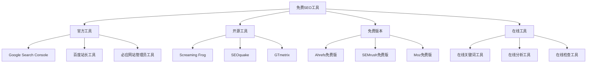

## 🔍 关键词研究工具

### Google相关工具
#### Google Keyword Planner
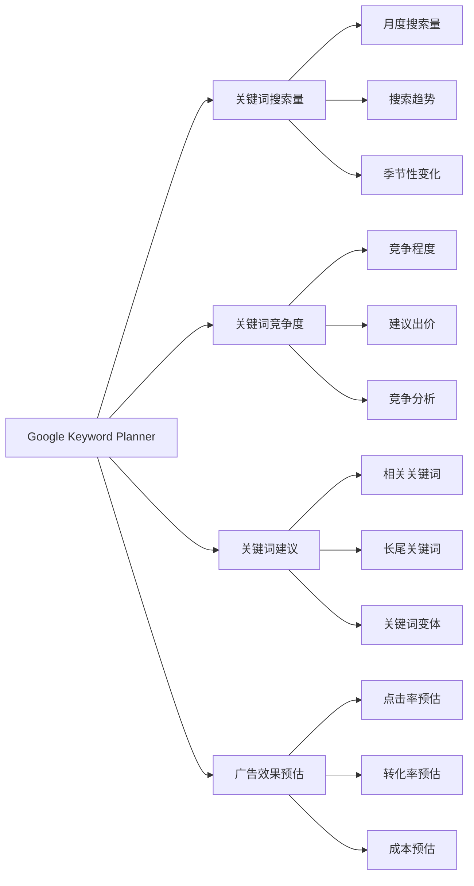

**使用场景**：
- 关键词搜索量研究
- 关键词竞争度分析
- 关键词建议获取
- 广告投放参考

**优势**：
- 数据权威准确
- 功能全面
- 免费使用
- 持续更新

**限制**：
- 需要Google Ads账户
- 数据范围有限
- 精确度有限

#### Google Trends
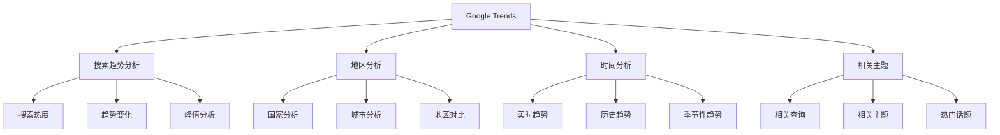

**使用场景**：
- 搜索趋势分析
- 季节性关键词研究
- 热点话题追踪
- 地区市场分析

**优势**：
- 实时数据
- 趋势分析
- 地区对比
- 完全免费

**限制**：
- 无具体搜索量
- 数据相对性
- 分析深度有限

### 其他免费关键词工具
#### Ubersuggest
| 功能 | 描述 | 免费限制 | 使用建议 |
|------|------|---------|---------|
| **关键词研究** | 关键词搜索量、难度、建议 | 每日3次搜索 | 重点关键词研究 |
| **竞争对手分析** | 竞争对手关键词分析 | 基础功能 | 初步竞争分析 |
| **内容建议** | 内容主题和标题建议 | 有限建议 | 内容灵感获取 |
| **SEO审计** | 基础SEO技术检查 | 基础报告 | 快速技术检查 |

#### Answer The Public
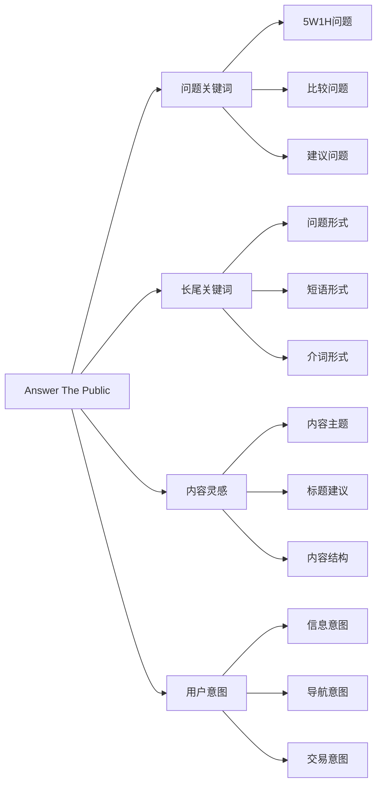

**使用场景**：
- 长尾关键词挖掘
- 内容主题研究
- 用户问题分析
- 内容策略制定

**优势**：
- 问题关键词丰富
- 用户意图分析
- 内容灵感获取
- 可视化展示

**限制**：
- 每日搜索限制
- 数据更新频率
- 地区覆盖有限

## 🔧 技术SEO工具

### 网站分析工具
#### Google PageSpeed Insights
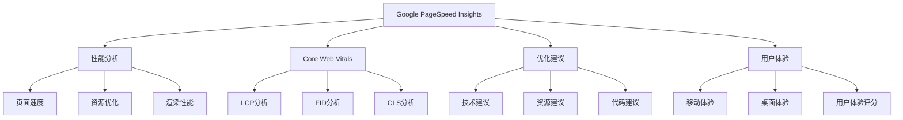

**使用场景**：
- 页面速度分析
- Core Web Vitals检查
- 性能优化建议
- 用户体验评估

**优势**：
- 权威性能指标
- 详细优化建议
- 移动和桌面分析
- 完全免费

**限制**：
- 单页面分析
- 建议可能重复
- 技术性较强

#### GTmetrix
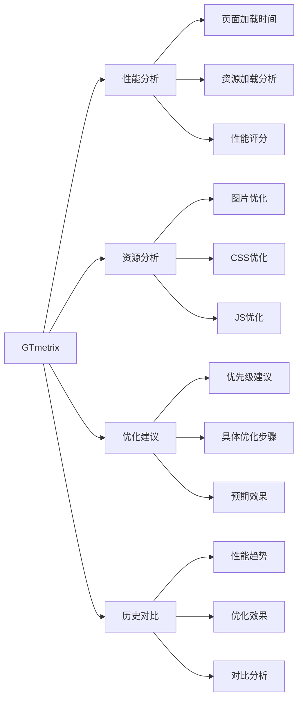

**使用场景**：
- 详细性能分析
- 资源优化检查
- 性能趋势监控
- 优化效果评估

**优势**：
- 详细分析报告
- 历史数据对比
- 优化建议具体
- 免费版本功能完整

**限制**：
- 免费版本有频率限制
- 需要注册账户
- 部分高级功能付费

### 网站审计工具
#### Screaming Frog SEO Spider
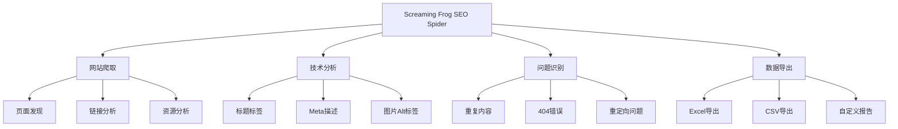

**使用场景**：
- 网站技术审计
- 内部链接分析
- 重复内容检查
- 技术问题识别

**优势**：
- 功能强大全面
- 数据详细准确
- 自定义分析
- 免费版本500页面

**限制**：
- 免费版本页面限制
- 需要下载安装
- 学习成本较高

#### SEOquake
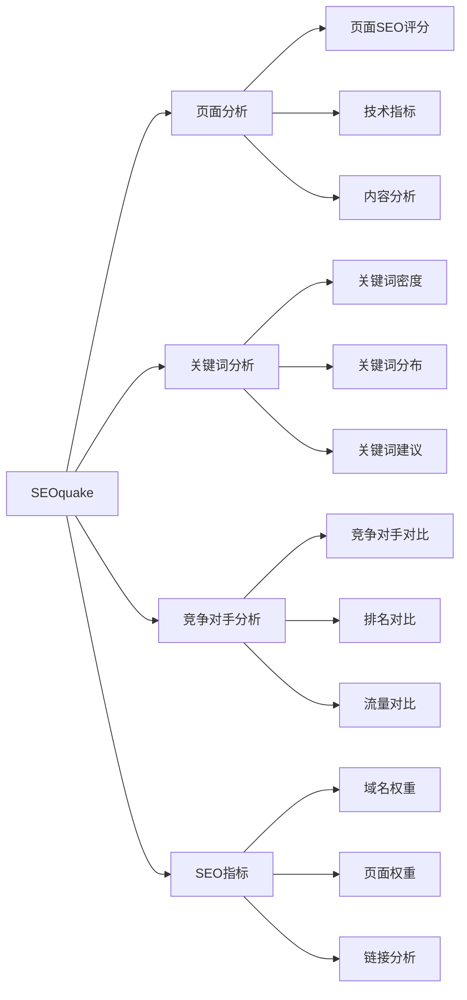

**使用场景**：
- 快速页面分析
- 竞争对手对比
- SEO指标检查
- 浏览器实时分析

**优势**：
- 浏览器插件
- 实时分析
- 使用简单
- 完全免费

**限制**：
- 功能相对基础
- 数据精度有限
- 依赖第三方数据

## 📊 竞争对手分析工具

### 免费竞争分析工具
#### SimilarWeb
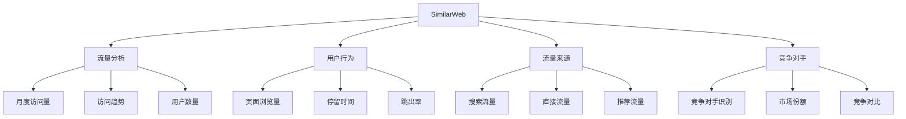

**使用场景**：
- 竞争对手流量分析
- 市场趋势研究
- 流量来源分析
- 用户行为分析

**优势**：
- 数据相对准确
- 功能全面
- 可视化展示
- 免费版本可用

**限制**：
- 免费版本功能有限
- 数据精度有限
- 更新频率不高

#### Alexa（已停止服务）
**替代工具**：
- SimilarWeb
- SEMrush免费版
- Ahrefs免费版
- Google Trends

### 社交媒体分析
#### Facebook Audience Insights
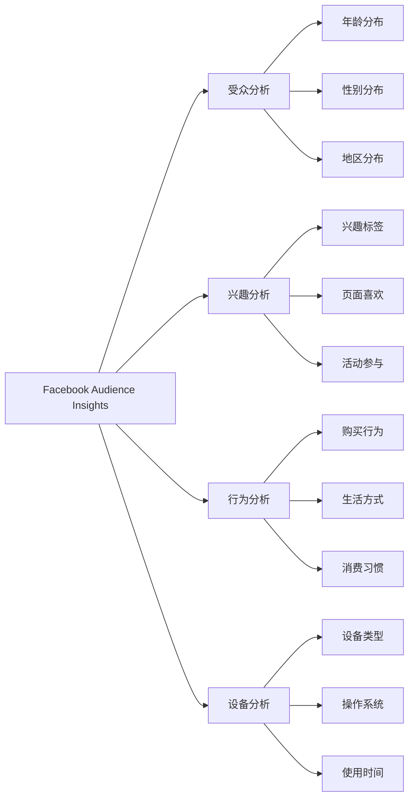

**使用场景**：
- 目标受众分析
- 内容策略制定
- 广告投放参考
- 市场研究

**优势**：
- 数据详细
- 免费使用
- 实时更新
- 多维度分析

**限制**：
- 仅限Facebook数据
- 需要Facebook账户
- 隐私政策限制

## 📈 内容分析工具

### 内容优化工具
#### Hemingway Editor
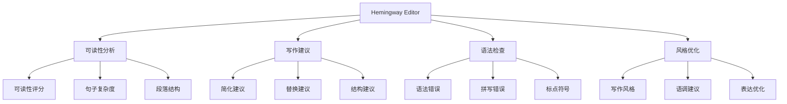

**使用场景**：
- 内容可读性优化
- 写作质量提升
- 语法错误检查
- 内容风格优化

**优势**：
- 实时分析
- 具体建议
- 使用简单
- 免费版本可用

**限制**：
- 免费版本功能有限
- 仅支持英文
- 需要网络连接

#### Grammarly
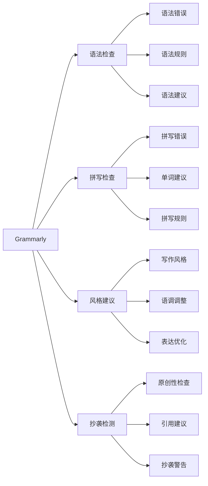

**使用场景**：
- 内容质量检查
- 语法错误修正
- 写作风格优化
- 原创性检查

**优势**：
- 功能全面
- 实时检查
- 多平台支持
- 免费版本可用

**限制**：
- 免费版本功能有限
- 需要网络连接
- 隐私考虑

### 内容灵感工具
#### BuzzSumo
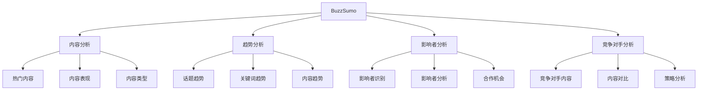

**使用场景**：
- 内容策略制定
- 热门话题发现
- 影响者营销
- 竞争对手分析

**优势**：
- 数据丰富
- 分析深入
- 趋势预测
- 免费版本可用

**限制**：
- 免费版本功能有限
- 需要注册
- 部分功能付费

## 🔗 链接分析工具

### 免费链接工具
#### Google Search Console
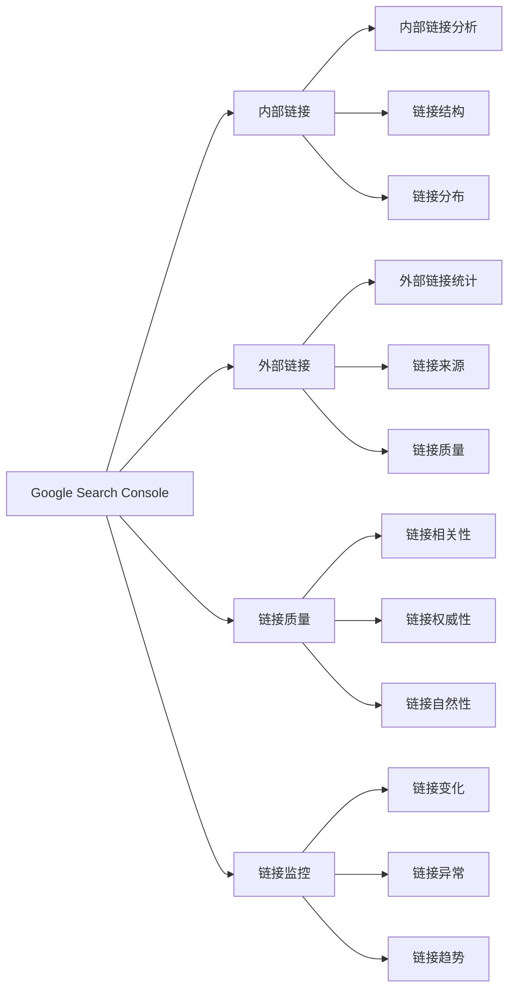

**使用场景**：
- 链接建设监控
- 链接质量分析
- 链接异常检测
- 链接策略制定

**优势**：
- 官方数据
- 免费使用
- 数据准确
- 持续更新

**限制**：
- 功能相对基础
- 数据范围有限
- 分析深度有限

#### OpenLinkProfiler
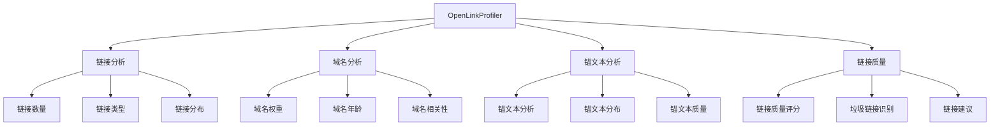

**使用场景**：
- 链接质量分析
- 垃圾链接识别
- 链接建设策略
- 竞争对手链接分析

**优势**：
- 免费使用
- 功能全面
- 分析深入
- 数据准确

**限制**：
- 数据更新频率
- 功能相对基础
- 需要注册

## 📱 移动端SEO工具

### 移动友好性测试
#### Google Mobile-Friendly Test
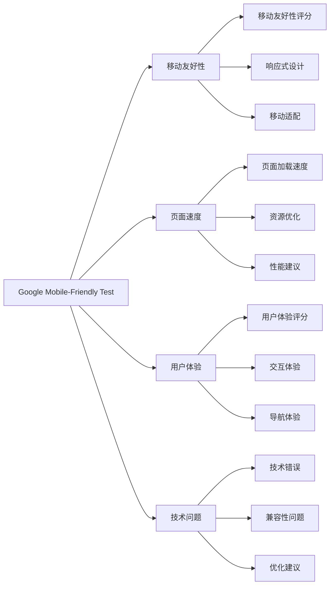

**使用场景**：
- 移动友好性检查
- 移动SEO优化
- 用户体验评估
- 技术问题诊断

**优势**：
- 官方工具
- 免费使用
- 分析准确
- 建议具体

**限制**：
- 单页面分析
- 功能相对基础
- 需要网络连接

#### PageSpeed Insights Mobile
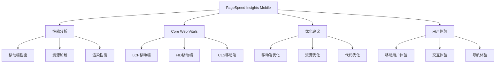

**使用场景**：
- 移动端性能优化
- Core Web Vitals检查
- 移动用户体验提升
- 移动SEO技术优化

**优势**：
- 权威指标
- 详细分析
- 优化建议
- 完全免费

**限制**：
- 技术性较强
- 需要技术实现
- 单页面分析

## 🎯 本地SEO工具

### 本地搜索优化
#### Google My Business
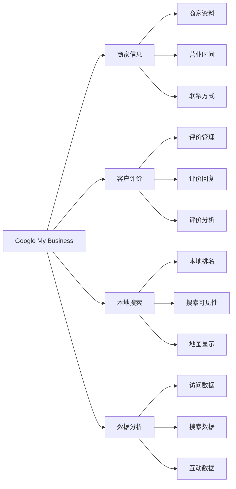

**使用场景**：
- 本地商家优化
- 客户评价管理
- 本地搜索排名
- 本地数据分析

**优势**：
- 官方工具
- 免费使用
- 功能全面
- 数据准确

**限制**：
- 仅限本地商家
- 需要验证
- 功能相对基础

#### Google Maps
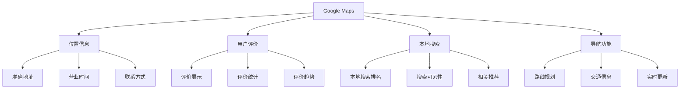

**使用场景**：
- 本地搜索优化
- 位置信息管理
- 用户评价监控
- 本地竞争分析

**优势**：
- 用户基数大
- 数据丰富
- 免费使用
- 实时更新

**限制**：
- 功能相对基础
- 需要商家账户
- 竞争激烈

## 📊 数据监控工具

### 免费监控工具
#### Google Analytics
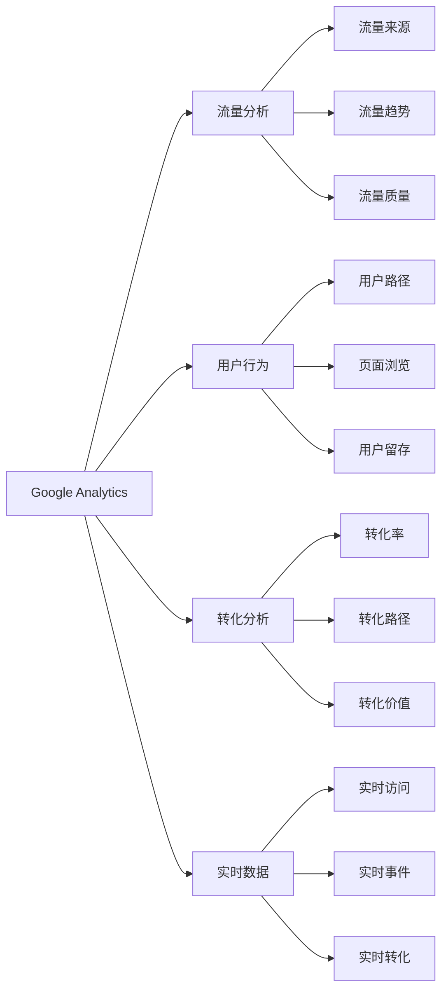

**使用场景**：
- 网站流量分析
- 用户行为分析
- 转化效果分析
- 实时数据监控

**优势**：
- 功能强大
- 数据准确
- 免费使用
- 持续更新

**限制**：
- 学习成本高
- 配置复杂
- 隐私政策限制

#### Google Search Console
```mermaid
graph TD
    A[Google Search Console] --> B[搜索表现]
    A --> C[索引状态]
    A --> D[技术问题]
    A --> E[用户体验]
    
    B --> B1[搜索查询]
    B --> B2[点击率]
    B --> B3[平均排名]
    
    C --> C1[索引覆盖率]
    C --> C2[索引问题]
    C --> C3[索引优化]
    
    D --> D1[技术错误]
    D --> D2[性能问题]
    D --> D3[安全问题]
    
    E --> E1[Core Web Vitals]
    E --> E2[移动友好性]
    E --> E3[页面体验]
```

**使用场景**：
- 搜索表现监控
- 技术问题诊断
- 索引状态检查
- 用户体验评估

**优势**：
- 官方数据
- 免费使用
- 功能全面
- 数据准确

**限制**：
- 数据延迟
- 功能相对基础
- 需要验证

## 🔧 工具组合策略

### 免费工具组合
#### 基础SEO工具包
```mermaid
graph TD
    A[基础SEO工具包] --> B[关键词研究]
    A --> C[技术分析]
    A --> D[内容优化]
    A --> E[数据监控]
    
    B --> B1[Google Keyword Planner]
    B --> B2[Google Trends]
    B --> B3[Ubersuggest]
    
    C --> C1[Google Search Console]
    C --> C2[PageSpeed Insights]
    C --> C3[Screaming Frog]
    
    D --> D1[Hemingway Editor]
    D --> D2[Grammarly]
    D --> D3[BuzzSumo]
    
    E --> E1[Google Analytics]
    E --> E2[Google Search Console]
    E --> E3[SimilarWeb]
```

#### 进阶SEO工具包
```mermaid
graph LR
    A[进阶SEO工具包] --> B[竞争分析]
    A --> C[链接分析]
    A --> D[本地SEO]
    A --> E[移动SEO]
    
    B --> B1[SimilarWeb]
    B --> B2[BuzzSumo]
    B --> B3[Google Trends]
    
    C --> C1[Google Search Console]
    C --> C2[OpenLinkProfiler]
    C --> C3[Majestic免费版]
    
    D --> D1[Google My Business]
    D --> D2[Google Maps]
    D --> D3[本地目录]
    
    E --> E1[Mobile-Friendly Test]
    E --> E2[PageSpeed Insights]
    E --> E3[移动端分析]
```

### 工具使用策略
#### 工具选择原则
| 选择标准 | 说明 | 优先级 | 建议 |
|---------|------|--------|------|
| **功能需求** | 根据SEO需求选择工具 | 高 | 明确功能需求 |
| **数据准确性** | 选择数据准确的工具 | 高 | 优先官方工具 |
| **使用成本** | 考虑工具使用成本 | 中 | 平衡功能和成本 |
| **学习成本** | 考虑工具学习难度 | 中 | 选择易用工具 |
| **更新频率** | 考虑工具更新频率 | 低 | 选择持续更新的工具 |

#### 工具组合建议
```mermaid
graph TD
    A[工具组合建议] --> B[初学者组合]
    A --> C[进阶者组合]
    A --> D[专业者组合]
    A --> E[企业级组合]
    
    B --> B1[Google Search Console]
    B --> B2[Google Analytics]
    B --> B3[PageSpeed Insights]
    
    C --> C1[基础工具 + 竞争分析]
    C --> C2[基础工具 + 内容分析]
    C --> C3[基础工具 + 链接分析]
    
    D --> D1[全面工具组合]
    D --> D2[专业分析工具]
    D --> D3[自动化工具]
    
    E --> E1[企业级工具]
    E --> E2[团队协作工具]
    E --> E3[定制化工具]
```

## 📋 总结

### 免费工具价值
```mermaid
graph TD
    A[免费工具价值] --> B[成本效益]
    A --> C[学习价值]
    A --> D[补充价值]
    A --> E[验证价值]
    
    B --> B1[零成本使用]
    B --> B2[功能完整]
    B --> B3[持续更新]
    
    C --> C1[学习SEO基础]
    C --> C2[实践SEO技能]
    C --> C3[理解SEO原理]
    
    D --> D1[补充付费工具]
    D --> D2[验证付费工具]
    D --> D3[替代部分功能]
    
    E --> E1[快速验证想法]
    E --> E2[测试SEO策略]
    E --> E3[验证优化效果]
```

### 使用建议
```mermaid
graph LR
    A[使用建议] --> B[工具选择]
    A --> C[工具组合]
    A --> D[数据验证]
    A --> E[持续学习]
    
    B --> B1[根据需求选择]
    B --> B2[优先官方工具]
    B --> B3[考虑工具限制]
    
    C --> C1[功能互补]
    C --> C2[数据交叉验证]
    C --> C3[避免重复功能]
    
    D --> D1[多工具对比]
    D --> D2[数据准确性检查]
    D --> D3[结果验证]
    
    E --> E1[关注工具更新]
    E --> E2[学习新功能]
    E --> E3[积累使用经验]
```

### 工具发展趋势
- **AI功能增强**：更多AI驱动的分析和建议
- **数据可视化**：更丰富的数据可视化功能
- **移动端优化**：更好的移动端使用体验
- **API功能扩展**：更强大的API接口功能
- **实时数据**：更实时的数据更新和分析
- **个性化定制**：更个性化的工具配置和报告

### 最佳实践
1. **工具选择**：根据具体需求选择合适的工具
2. **工具组合**：使用多个工具进行交叉验证
3. **数据解读**：正确理解和解读工具数据
4. **持续优化**：基于工具数据进行持续优化
5. **经验积累**：积累工具使用经验和技巧
