# 免费SEO工具对比表

## 📋 概述

### 对比目的
本文档旨在帮助SEO从业者了解各种免费SEO工具的功能特点、使用限制、适用场景等，以便根据具体需求选择最合适的工具组合。

### 对比维度
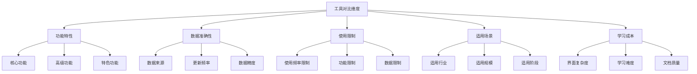

## 🔍 关键词研究工具对比

### 主要工具对比
| 工具名称 | 核心功能 | 数据准确性 | 免费限制 | 适用场景 | 学习成本 | 推荐指数 |
|---------|---------|-----------|---------|---------|---------|---------|
| **Google Keyword Planner** | 关键词搜索量、竞争度、建议 | ⭐⭐⭐⭐⭐ | 需要Google Ads账户 | 关键词研究、广告投放 | ⭐⭐ | ⭐⭐⭐⭐⭐ |
| **Google Trends** | 搜索趋势、地区分析 | ⭐⭐⭐⭐⭐ | 无限制 | 趋势分析、热点追踪 | ⭐ | ⭐⭐⭐⭐ |
| **Ubersuggest** | 关键词研究、竞争分析 | ⭐⭐⭐ | 每日3次搜索 | 关键词挖掘、竞争分析 | ⭐⭐ | ⭐⭐⭐ |
| **Answer The Public** | 问题关键词、内容灵感 | ⭐⭐⭐ | 每日3次搜索 | 长尾关键词、内容策略 | ⭐ | ⭐⭐⭐ |
| **Keyword Surfer** | 关键词搜索量、建议 | ⭐⭐⭐ | 每日10次搜索 | 快速关键词研究 | ⭐ | ⭐⭐⭐ |

### 详细功能对比
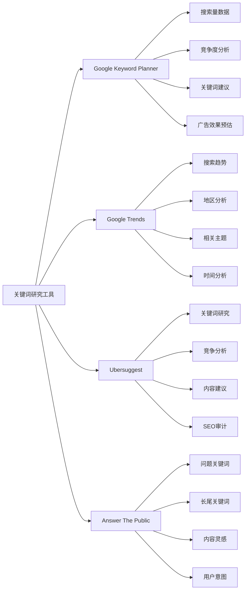

### 使用建议
| 工具类型 | 最佳使用场景 | 推荐组合 | 注意事项 |
|---------|-------------|---------|---------|
| **权威数据** | 关键词搜索量研究 | Google Keyword Planner + Google Trends | 需要Google Ads账户 |
| **趋势分析** | 热点话题追踪 | Google Trends + Answer The Public | 关注数据更新频率 |
| **竞争分析** | 竞争对手关键词分析 | Ubersuggest + Google Keyword Planner | 注意免费限制 |
| **内容策略** | 内容主题研究 | Answer The Public + Google Trends | 结合多个工具使用 |

## 🔧 技术SEO工具对比

### 主要工具对比
| 工具名称 | 核心功能 | 数据准确性 | 免费限制 | 适用场景 | 学习成本 | 推荐指数 |
|---------|---------|-----------|---------|---------|---------|---------|
| **Google Search Console** | 搜索表现、技术问题 | ⭐⭐⭐⭐⭐ | 无限制 | 技术SEO监控 | ⭐⭐ | ⭐⭐⭐⭐⭐ |
| **Google PageSpeed Insights** | 页面速度、Core Web Vitals | ⭐⭐⭐⭐⭐ | 无限制 | 性能优化 | ⭐⭐ | ⭐⭐⭐⭐⭐ |
| **GTmetrix** | 详细性能分析 | ⭐⭐⭐⭐ | 每日3次测试 | 性能深度分析 | ⭐⭐ | ⭐⭐⭐⭐ |
| **Screaming Frog SEO Spider** | 网站爬取、技术审计 | ⭐⭐⭐⭐ | 500页面限制 | 技术SEO审计 | ⭐⭐⭐ | ⭐⭐⭐⭐ |
| **SEOquake** | 页面SEO分析 | ⭐⭐⭐ | 无限制 | 快速SEO检查 | ⭐ | ⭐⭐⭐ |

### 详细功能对比
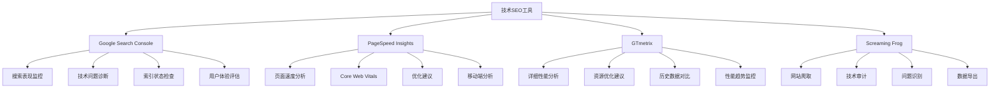

### 使用建议
| 工具类型 | 最佳使用场景 | 推荐组合 | 注意事项 |
|---------|-------------|---------|---------|
| **官方工具** | 技术SEO监控 | Google Search Console + PageSpeed Insights | 数据权威准确 |
| **性能分析** | 页面速度优化 | PageSpeed Insights + GTmetrix | 注意测试频率限制 |
| **技术审计** | 网站技术检查 | Screaming Frog + Google Search Console | 注意页面限制 |
| **快速检查** | 日常SEO检查 | SEOquake + Google Search Console | 功能相对基础 |

## 📊 竞争对手分析工具对比

### 主要工具对比
| 工具名称 | 核心功能 | 数据准确性 | 免费限制 | 适用场景 | 学习成本 | 推荐指数 |
|---------|---------|-----------|---------|---------|---------|---------|
| **SimilarWeb** | 流量分析、竞争分析 | ⭐⭐⭐⭐ | 功能限制 | 竞争对手分析 | ⭐⭐ | ⭐⭐⭐⭐ |
| **SEMrush免费版** | 关键词分析、竞争分析 | ⭐⭐⭐⭐ | 每日10次搜索 | 竞争分析 | ⭐⭐ | ⭐⭐⭐⭐ |
| **Ahrefs免费版** | 关键词分析、链接分析 | ⭐⭐⭐⭐ | 功能限制 | 竞争分析 | ⭐⭐ | ⭐⭐⭐ |
| **Google Trends** | 趋势分析、地区对比 | ⭐⭐⭐⭐⭐ | 无限制 | 趋势分析 | ⭐ | ⭐⭐⭐⭐ |
| **BuzzSumo免费版** | 内容分析、影响者分析 | ⭐⭐⭐ | 功能限制 | 内容竞争分析 | ⭐⭐ | ⭐⭐⭐ |

### 详细功能对比
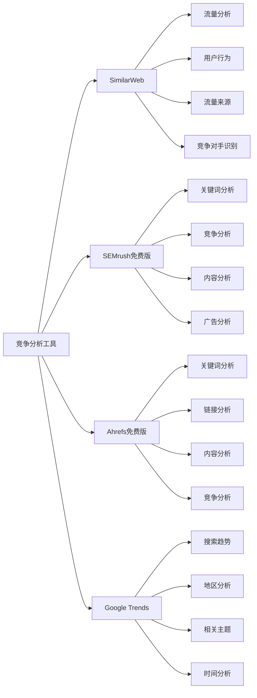

### 使用建议
| 工具类型 | 最佳使用场景 | 推荐组合 | 注意事项 |
|---------|-------------|---------|---------|
| **流量分析** | 竞争对手流量分析 | SimilarWeb + Google Trends | 注意数据精度 |
| **关键词竞争** | 关键词竞争分析 | SEMrush免费版 + Google Keyword Planner | 注意使用限制 |
| **链接竞争** | 链接竞争分析 | Ahrefs免费版 + Google Search Console | 功能相对有限 |
| **趋势分析** | 市场趋势分析 | Google Trends + BuzzSumo免费版 | 关注更新频率 |

## 📈 内容分析工具对比

### 主要工具对比
| 工具名称 | 核心功能 | 数据准确性 | 免费限制 | 适用场景 | 学习成本 | 推荐指数 |
|---------|---------|-----------|---------|---------|---------|---------|
| **Hemingway Editor** | 可读性分析、写作建议 | ⭐⭐⭐⭐ | 功能限制 | 内容优化 | ⭐ | ⭐⭐⭐⭐ |
| **Grammarly** | 语法检查、风格建议 | ⭐⭐⭐⭐ | 功能限制 | 内容质量检查 | ⭐ | ⭐⭐⭐⭐ |
| **BuzzSumo免费版** | 内容分析、趋势分析 | ⭐⭐⭐ | 功能限制 | 内容策略 | ⭐⭐ | ⭐⭐⭐ |
| **Google Trends** | 内容趋势、热点分析 | ⭐⭐⭐⭐⭐ | 无限制 | 内容趋势分析 | ⭐ | ⭐⭐⭐⭐ |
| **Answer The Public** | 内容灵感、问题分析 | ⭐⭐⭐ | 每日3次搜索 | 内容策略制定 | ⭐ | ⭐⭐⭐ |

### 详细功能对比
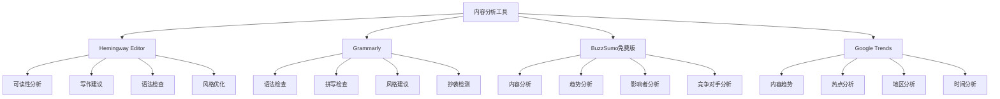

### 使用建议
| 工具类型 | 最佳使用场景 | 推荐组合 | 注意事项 |
|---------|-------------|---------|---------|
| **内容优化** | 内容质量提升 | Hemingway Editor + Grammarly | 注意功能限制 |
| **内容策略** | 内容策略制定 | BuzzSumo免费版 + Google Trends | 结合多个工具 |
| **趋势分析** | 内容趋势分析 | Google Trends + Answer The Public | 关注数据更新 |
| **内容灵感** | 内容创意获取 | Answer The Public + Google Trends | 注意使用限制 |

## 🔗 链接分析工具对比

### 主要工具对比
| 工具名称 | 核心功能 | 数据准确性 | 免费限制 | 适用场景 | 学习成本 | 推荐指数 |
|---------|---------|-----------|---------|---------|---------|---------|
| **Google Search Console** | 链接监控、质量分析 | ⭐⭐⭐⭐⭐ | 无限制 | 链接监控 | ⭐⭐ | ⭐⭐⭐⭐⭐ |
| **OpenLinkProfiler** | 链接分析、质量评估 | ⭐⭐⭐⭐ | 功能限制 | 链接质量分析 | ⭐⭐ | ⭐⭐⭐⭐ |
| **Majestic免费版** | 链接分析、域名分析 | ⭐⭐⭐⭐ | 功能限制 | 链接竞争分析 | ⭐⭐ | ⭐⭐⭐ |
| **Ahrefs免费版** | 链接分析、竞争分析 | ⭐⭐⭐⭐ | 功能限制 | 链接分析 | ⭐⭐ | ⭐⭐⭐ |
| **SEMrush免费版** | 链接分析、竞争分析 | ⭐⭐⭐⭐ | 功能限制 | 链接竞争分析 | ⭐⭐ | ⭐⭐⭐ |

### 详细功能对比
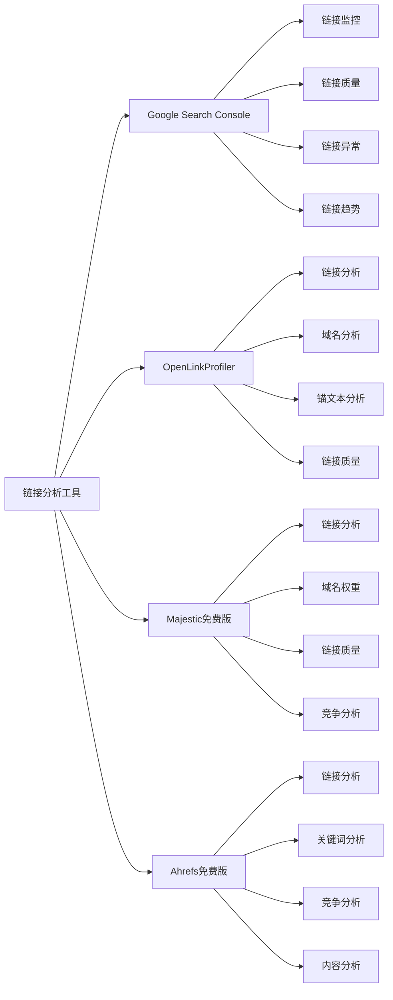

### 使用建议
| 工具类型 | 最佳使用场景 | 推荐组合 | 注意事项 |
|---------|-------------|---------|---------|
| **官方监控** | 链接建设监控 | Google Search Console + OpenLinkProfiler | 数据权威准确 |
| **质量分析** | 链接质量分析 | OpenLinkProfiler + Majestic免费版 | 注意功能限制 |
| **竞争分析** | 链接竞争分析 | Ahrefs免费版 + SEMrush免费版 | 结合多个工具 |
| **综合分析** | 全面链接分析 | Google Search Console + 多个免费工具 | 数据交叉验证 |

## 📱 移动端SEO工具对比

### 主要工具对比
| 工具名称 | 核心功能 | 数据准确性 | 免费限制 | 适用场景 | 学习成本 | 推荐指数 |
|---------|---------|-----------|---------|---------|---------|---------|
| **Google Mobile-Friendly Test** | 移动友好性测试 | ⭐⭐⭐⭐⭐ | 无限制 | 移动友好性检查 | ⭐ | ⭐⭐⭐⭐⭐ |
| **Google PageSpeed Insights** | 移动端性能分析 | ⭐⭐⭐⭐⭐ | 无限制 | 移动端性能优化 | ⭐⭐ | ⭐⭐⭐⭐⭐ |
| **GTmetrix** | 移动端性能分析 | ⭐⭐⭐⭐ | 每日3次测试 | 移动端性能分析 | ⭐⭐ | ⭐⭐⭐⭐ |
| **Google Search Console** | 移动端搜索表现 | ⭐⭐⭐⭐⭐ | 无限制 | 移动端SEO监控 | ⭐⭐ | ⭐⭐⭐⭐⭐ |
| **Screaming Frog** | 移动端技术检查 | ⭐⭐⭐⭐ | 500页面限制 | 移动端技术审计 | ⭐⭐⭐ | ⭐⭐⭐⭐ |

### 详细功能对比
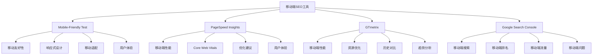

### 使用建议
| 工具类型 | 最佳使用场景 | 推荐组合 | 注意事项 |
|---------|-------------|---------|---------|
| **友好性检查** | 移动友好性测试 | Mobile-Friendly Test + PageSpeed Insights | 官方工具权威 |
| **性能优化** | 移动端性能优化 | PageSpeed Insights + GTmetrix | 注意测试频率 |
| **SEO监控** | 移动端SEO监控 | Google Search Console + Mobile-Friendly Test | 数据权威准确 |
| **技术审计** | 移动端技术审计 | Screaming Frog + Google Search Console | 注意页面限制 |

## 🎯 本地SEO工具对比

### 主要工具对比
| 工具名称 | 核心功能 | 数据准确性 | 免费限制 | 适用场景 | 学习成本 | 推荐指数 |
|---------|---------|-----------|---------|---------|---------|---------|
| **Google My Business** | 本地商家管理 | ⭐⭐⭐⭐⭐ | 无限制 | 本地商家优化 | ⭐⭐ | ⭐⭐⭐⭐⭐ |
| **Google Maps** | 本地搜索优化 | ⭐⭐⭐⭐⭐ | 无限制 | 本地搜索优化 | ⭐ | ⭐⭐⭐⭐⭐ |
| **Google Search Console** | 本地搜索表现 | ⭐⭐⭐⭐⭐ | 无限制 | 本地SEO监控 | ⭐⭐ | ⭐⭐⭐⭐⭐ |
| **Facebook Pages** | 本地社交媒体 | ⭐⭐⭐⭐ | 无限制 | 本地社交媒体 | ⭐ | ⭐⭐⭐⭐ |
| **Yelp** | 本地评价管理 | ⭐⭐⭐⭐ | 无限制 | 本地评价管理 | ⭐ | ⭐⭐⭐⭐ |

### 详细功能对比
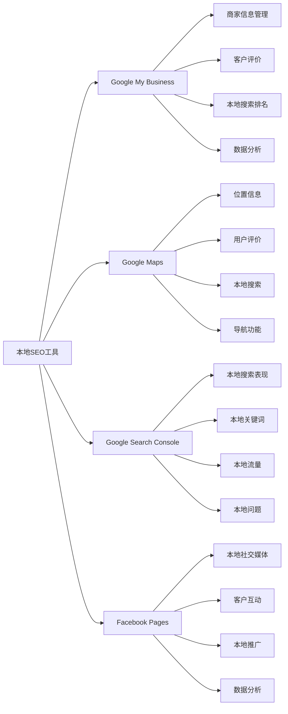

### 使用建议
| 工具类型 | 最佳使用场景 | 推荐组合 | 注意事项 |
|---------|-------------|---------|---------|
| **商家管理** | 本地商家优化 | Google My Business + Google Maps | 官方工具权威 |
| **搜索优化** | 本地搜索优化 | Google My Business + Google Search Console | 数据权威准确 |
| **社交媒体** | 本地社交媒体 | Facebook Pages + Google My Business | 多渠道整合 |
| **评价管理** | 本地评价管理 | Google My Business + Yelp | 多平台管理 |

## 📊 数据监控工具对比

### 主要工具对比
| 工具名称 | 核心功能 | 数据准确性 | 免费限制 | 适用场景 | 学习成本 | 推荐指数 |
|---------|---------|-----------|---------|---------|---------|---------|
| **Google Analytics** | 网站流量分析 | ⭐⭐⭐⭐⭐ | 无限制 | 流量分析 | ⭐⭐⭐ | ⭐⭐⭐⭐⭐ |
| **Google Search Console** | 搜索表现监控 | ⭐⭐⭐⭐⭐ | 无限制 | 搜索表现监控 | ⭐⭐ | ⭐⭐⭐⭐⭐ |
| **百度统计** | 网站流量分析 | ⭐⭐⭐⭐ | 无限制 | 中文网站分析 | ⭐⭐ | ⭐⭐⭐⭐ |
| **百度站长工具** | 搜索表现监控 | ⭐⭐⭐⭐ | 无限制 | 中文搜索监控 | ⭐⭐ | ⭐⭐⭐⭐ |
| **SimilarWeb** | 流量分析、竞争分析 | ⭐⭐⭐⭐ | 功能限制 | 竞争分析 | ⭐⭐ | ⭐⭐⭐⭐ |

### 详细功能对比
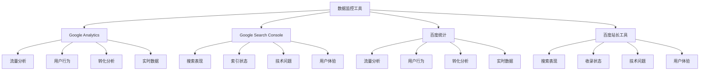

### 使用建议
| 工具类型 | 最佳使用场景 | 推荐组合 | 注意事项 |
|---------|-------------|---------|---------|
| **全球网站** | 全球网站分析 | Google Analytics + Google Search Console | 数据权威准确 |
| **中文网站** | 中文网站分析 | 百度统计 + 百度站长工具 | 适合中文市场 |
| **竞争分析** | 竞争对手分析 | SimilarWeb + Google Analytics | 注意数据精度 |
| **综合监控** | 全面数据监控 | 多个工具组合 | 数据交叉验证 |

## 🔧 工具组合策略对比

### 不同阶段工具组合
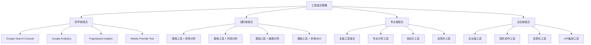

### 组合效果对比
| 组合类型 | 工具数量 | 功能覆盖 | 学习成本 | 适用对象 | 推荐指数 |
|---------|---------|---------|---------|---------|---------|
| **初学者组合** | 3-5个 | 基础功能 | ⭐⭐ | SEO初学者 | ⭐⭐⭐⭐ |
| **进阶者组合** | 5-8个 | 进阶功能 | ⭐⭐⭐ | SEO从业者 | ⭐⭐⭐⭐⭐ |
| **专业者组合** | 8-12个 | 专业功能 | ⭐⭐⭐⭐ | SEO专家 | ⭐⭐⭐⭐⭐ |
| **企业级组合** | 12+个 | 企业功能 | ⭐⭐⭐⭐⭐ | 企业团队 | ⭐⭐⭐⭐⭐ |

## 📋 总结

### 工具选择建议
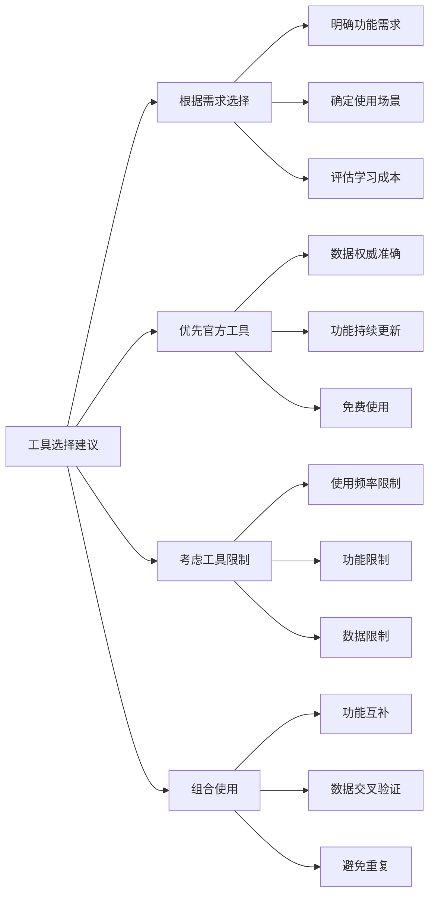

### 最佳实践
1. **工具选择**：根据具体需求选择合适的工具
2. **工具组合**：使用多个工具进行交叉验证
3. **数据解读**：正确理解和解读工具数据
4. **持续优化**：基于工具数据进行持续优化
5. **经验积累**：积累工具使用经验和技巧

### 发展趋势
- **AI功能增强**：更多AI驱动的分析和建议
- **数据可视化**：更丰富的数据可视化功能
- **移动端优化**：更好的移动端使用体验
- **API功能扩展**：更强大的API接口功能
- **实时数据**：更实时的数据更新和分析
- **个性化定制**：更个性化的工具配置和报告

### 注意事项
- **数据准确性**：注意工具数据的准确性和更新频率
- **使用限制**：了解免费工具的使用限制和功能限制
- **隐私保护**：注意工具使用中的隐私保护问题
- **成本控制**：合理控制工具使用成本，避免过度依赖付费工具
- **技能提升**：持续学习新工具和新功能，提升SEO技能
