# 百度站长工具使用指南

## 📋 概述

### 什么是百度站长工具
百度站长工具（Baidu Webmaster Tools）是百度官方提供的免费SEO工具，帮助网站管理员监控网站在百度搜索引擎中的表现，优化网站结构和内容，提升搜索排名。

### 核心价值
- **免费使用**：百度官方提供的免费SEO工具
- **官方数据**：获取百度搜索引擎的官方数据
- **问题诊断**：及时发现和解决SEO问题
- **持续优化**：支持网站持续优化和改进

### 主要功能
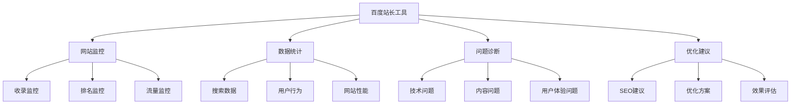

## 🔧 账户设置和网站验证

### 账户创建
#### 注册流程
1. **访问官网**：访问百度站长工具官网
2. **注册账户**：使用百度账户注册
3. **验证邮箱**：验证注册邮箱
4. **完善信息**：完善个人和网站信息

#### 账户类型
| 账户类型 | 权限范围 | 适用对象 | 功能特点 |
|---------|---------|---------|---------|
| **个人账户** | 个人网站管理 | 个人站长 | 基础功能 |
| **企业账户** | 企业网站管理 | 企业用户 | 高级功能 |
| **代理账户** | 多网站管理 | SEO代理 | 批量管理 |

### 网站验证
#### 验证方法
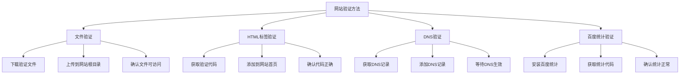

#### 验证步骤
1. **选择验证方法**：选择适合的验证方法
2. **获取验证信息**：获取验证文件或代码
3. **实施验证**：按照要求实施验证
4. **确认验证**：确认验证成功
5. **完成设置**：完成网站基本设置

### 网站配置
#### 基本信息
- **网站名称**：设置网站名称
- **网站描述**：设置网站描述
- **网站类型**：选择网站类型
- **语言设置**：设置网站语言

#### 高级设置
- **抓取频率**：设置抓取频率
- **抓取预算**：设置抓取预算
- **优先级设置**：设置页面优先级
- **特殊设置**：设置特殊功能

## 📊 核心功能使用

### 数据统计
#### 搜索数据
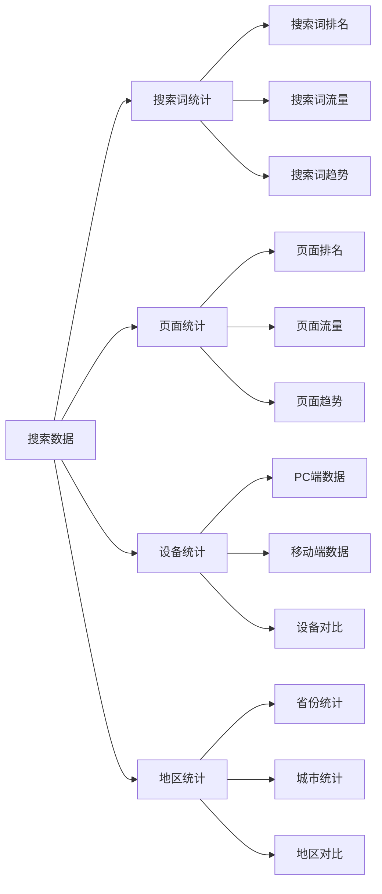

#### 用户行为数据
- **点击率**：搜索结果点击率
- **跳出率**：页面跳出率
- **停留时间**：用户停留时间
- **访问深度**：用户访问深度

#### 网站性能数据
- **页面速度**：页面加载速度
- **服务器响应**：服务器响应时间
- **可用性**：网站可用性
- **错误率**：页面错误率

### 收录监控
#### 收录状态
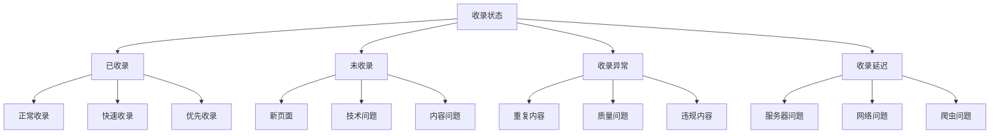

#### 收录分析
- **收录数量**：总收录页面数
- **收录趋势**：收录数量变化趋势
- **收录质量**：收录页面质量评估
- **收录速度**：新页面收录速度

#### 收录优化
- **提交sitemap**：提交网站地图
- **主动推送**：主动推送重要页面
- **链接建设**：建设高质量链接
- **内容优化**：优化页面内容

### 排名监控
#### 关键词排名
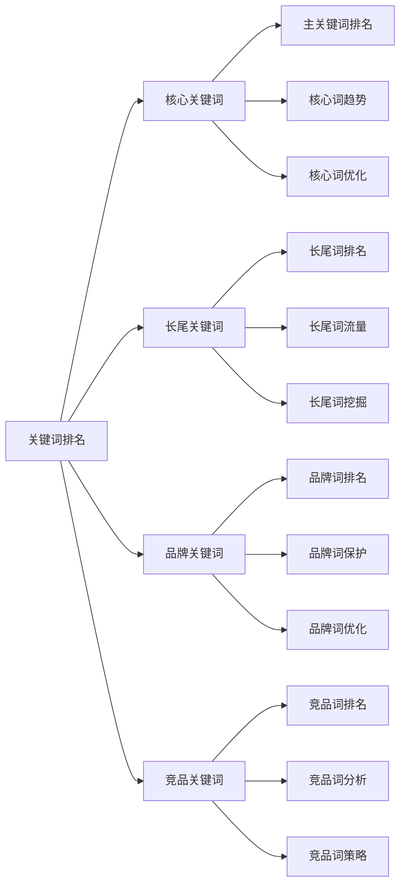

#### 排名分析
- **排名位置**：关键词排名位置
- **排名变化**：排名位置变化趋势
- **排名稳定性**：排名稳定性分析
- **排名影响因素**：影响排名的因素

#### 排名优化
- **内容优化**：优化页面内容质量
- **技术优化**：优化网站技术结构
- **链接优化**：优化内外链结构
- **用户体验优化**：优化用户体验

### 流量分析
#### 流量统计
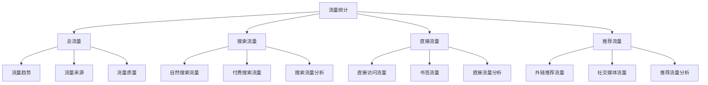

#### 流量分析
- **流量趋势**：流量变化趋势分析
- **流量来源**：流量来源渠道分析
- **流量质量**：流量质量评估
- **流量转化**：流量转化效果分析

#### 流量优化
- **SEO优化**：通过SEO提升流量
- **内容优化**：通过内容提升流量
- **用户体验优化**：通过体验提升流量
- **营销推广**：通过推广提升流量

## 🔍 问题诊断和解决

### 常见问题
#### 收录问题
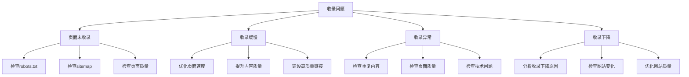

#### 排名问题
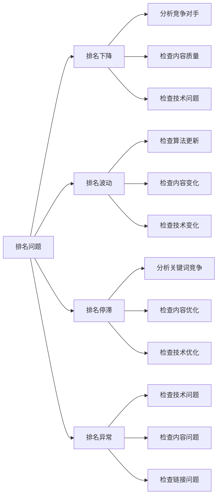

#### 流量问题
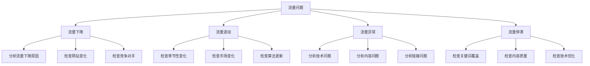

### 解决方案
#### 技术问题解决
- **服务器问题**：检查服务器状态和性能
- **页面问题**：检查页面加载和内容质量
- **链接问题**：检查内部链接和外部链接
- **移动问题**：检查移动友好性和响应式设计

#### 内容问题解决
- **内容质量**：提升内容质量和原创性
- **关键词优化**：优化关键词密度和相关性
- **内容更新**：定期更新内容保持新鲜度
- **内容结构**：优化内容结构和可读性

#### 链接问题解决
- **内部链接**：优化内部链接结构
- **外部链接**：建设高质量外部链接
- **锚文本**：优化锚文本相关性
- **链接质量**：提升链接质量和相关性

### 问题解决最佳实践
| 问题类型 | 诊断方法 | 解决策略 | 预防措施 | 监控指标 |
|---------|---------|---------|---------|---------|
| **收录问题** | 检查收录报告 | 技术优化、内容优化 | 定期检查、及时更新 | 收录覆盖率 |
| **排名问题** | 分析排名变化 | 内容优化、技术优化 | 持续优化、质量提升 | 平均排名 |
| **流量问题** | 分析流量数据 | 多渠道优化、用户体验 | 全面监控、及时调整 | 流量变化 |
| **技术问题** | 技术审计 | 系统优化、性能提升 | 定期维护、预防性检查 | 技术指标 |

## 🚀 高级功能使用

### 数据导出
#### 导出功能
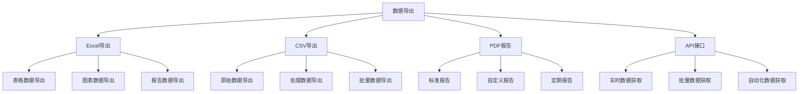

#### 导出设置
- **数据范围**：选择导出数据的时间范围
- **数据字段**：选择需要导出的数据字段
- **数据格式**：选择导出数据的格式
- **导出频率**：设置自动导出的频率

### 监控设置
#### 监控规则
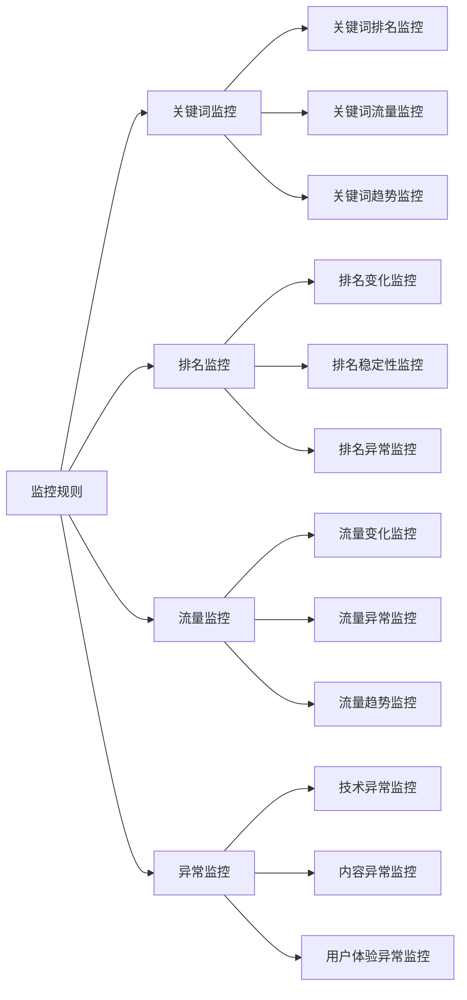

#### 通知设置
- **邮件通知**：设置邮件通知偏好
- **短信通知**：设置短信通知（付费功能）
- **微信通知**：设置微信通知
- **自定义通知**：创建自定义通知规则

### 团队协作
#### 权限管理
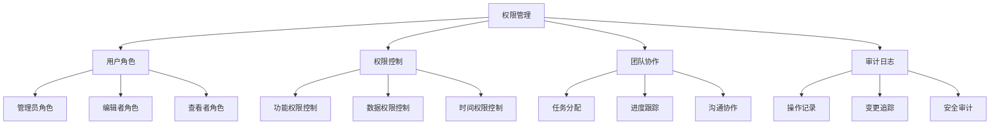

#### 协作功能
- **任务分配**：分配SEO任务给团队成员
- **进度跟踪**：跟踪任务完成进度
- **沟通协作**：团队内部沟通和协作
- **知识分享**：分享SEO经验和技巧

## 💡 最佳实践

### 日常使用
#### 定期检查
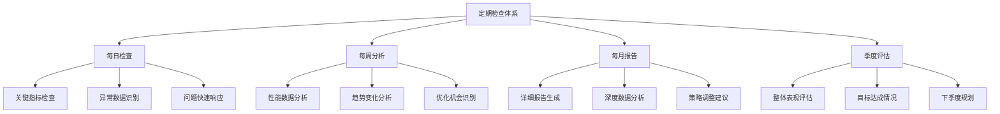

#### 问题响应
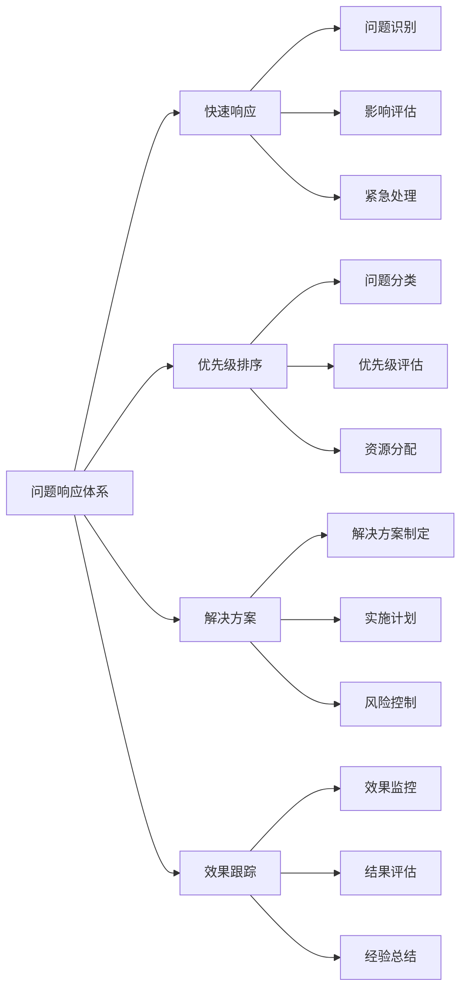

### 数据分析
#### 数据解读
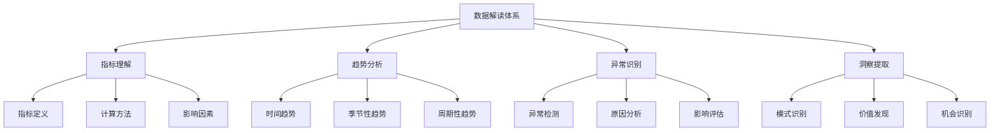

#### 决策支持
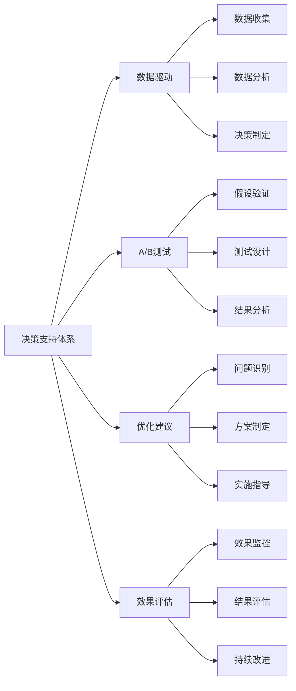

### 最佳实践总结
| 实践领域 | 关键要点 | 实施方法 | 预期效果 | 注意事项 |
|---------|---------|---------|---------|---------|
| **定期检查** | 建立检查体系 | 制定检查清单 | 及时发现问题 | 避免过度检查 |
| **问题响应** | 快速响应机制 | 建立响应流程 | 减少问题影响 | 优先级合理 |
| **数据分析** | 深度数据解读 | 多维度分析 | 发现优化机会 | 数据准确性 |
| **决策支持** | 数据驱动决策 | 建立决策流程 | 提升决策质量 | 数据可靠性 |

## ⚠️ 常见错误和避免方法

### 设置错误避免
#### 验证问题
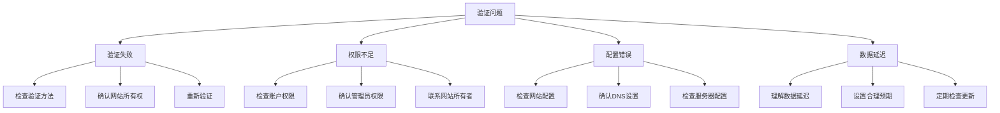

#### 使用错误避免
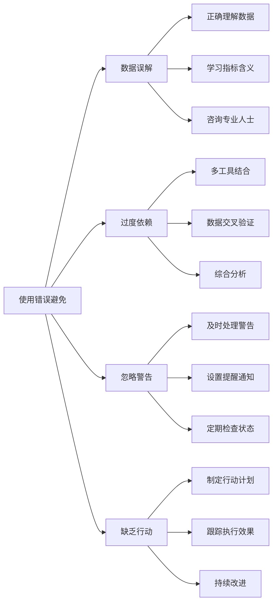

### 错误避免总结
| 错误类型 | 常见表现 | 避免方法 | 预防措施 | 纠正措施 |
|---------|---------|---------|---------|---------|
| **设置错误** | 验证失败、权限不足 | 正确配置、权限检查 | 定期检查、权限审核 | 重新配置、权限调整 |
| **使用错误** | 数据误解、过度依赖 | 正确理解、多工具结合 | 培训学习、经验积累 | 重新分析、工具调整 |
| **流程错误** | 缺乏系统、文档不全 | 建立流程、完善文档 | 标准化操作、定期检查 | 流程改进、文档完善 |
| **协作错误** | 沟通不畅、责任不清 | 明确分工、加强沟通 | 定期沟通、责任明确 | 改善沟通、重新分工 |

## 📋 总结

### 核心价值
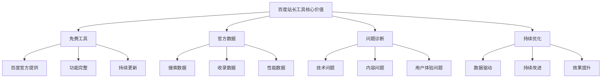

### 使用建议
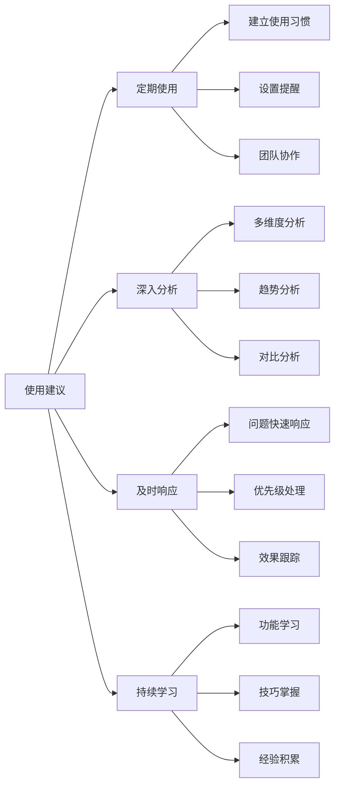

### 相关资源
| 资源类型 | 资源名称 | 访问方式 | 主要内容 | 价值 |
|---------|---------|---------|---------|------|
| **官方文档** | 百度站长工具帮助 | 在线访问 | 功能说明、使用指南 | 权威准确 |
| **帮助中心** | 站长工具帮助中心 | 在线访问 | 问题解答、故障排除 | 实用性强 |
| **社区论坛** | 百度站长社区 | 在线访问 | 用户交流、经验分享 | 社区支持 |
| **培训资源** | 百度学院 | 在线学习 | 系统培训、认证课程 | 专业提升 |

### 学习路径建议
1. **基础阶段**：了解百度站长工具基本功能和界面
2. **应用阶段**：掌握数据分析和问题诊断
3. **进阶阶段**：学习高级功能和团队协作
4. **专家阶段**：成为百度站长工具使用专家，指导他人

### 持续改进
- **定期回顾**：定期回顾使用效果和改进空间
- **功能更新**：关注新功能发布和更新
- **最佳实践**：学习行业最佳实践和案例
- **知识分享**：与团队分享使用经验和技巧

### 与其他工具结合
- **Google Search Console**：结合使用获取更全面的数据
- **百度统计**：结合使用分析用户行为
- **第三方SEO工具**：结合使用进行深度分析
- **自定义工具**：开发自定义工具进行特定分析

### 未来发展趋势
- **AI功能增强**：更多AI驱动的分析和建议
- **数据可视化**：更丰富的数据可视化功能
- **移动端优化**：更好的移动端使用体验
- **API功能扩展**：更强大的API接口功能
