# AI与SEO结合

## 📋 概述

### AI在SEO中的应用
人工智能（AI）技术在SEO领域的应用越来越广泛，从内容生成、关键词研究到用户体验优化，AI正在革命性地改变SEO的工作方式。

### 核心价值
- **效率提升**：大幅提升SEO工作效率
- **精准分析**：提供更精准的数据分析
- **个性化体验**：实现个性化用户体验
- **自动化优化**：实现SEO流程自动化

### AI与SEO结合领域
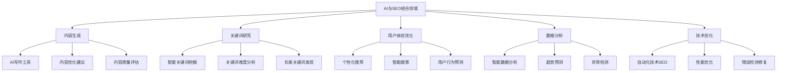

## 🤖 AI内容生成工具

### AI写作工具
#### 主流AI写作工具
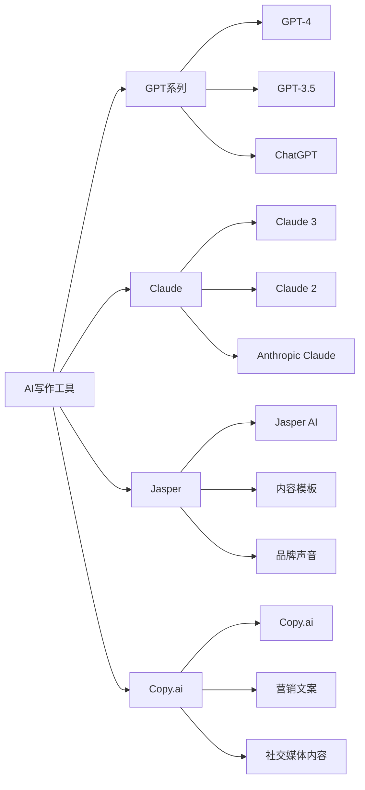

#### AI写作工具对比
| 工具名称 | 主要特点 | 适用场景 | 优势 | 限制 |
|---------|---------|---------|------|------|
| **GPT-4** | 强大的语言理解能力 | 长篇文章、技术内容 | 质量高、逻辑性强 | 成本较高 |
| **Claude 3** | 注重安全性和准确性 | 专业内容、分析报告 | 安全性高、准确性好 | 功能相对有限 |
| **Jasper** | 营销导向的内容生成 | 营销文案、广告内容 | 营销专业、模板丰富 | 创意性有限 |
| **Copy.ai** | 快速内容生成 | 社交媒体、简短内容 | 速度快、易使用 | 深度内容不足 |

### 内容生成策略
#### AI辅助内容创作流程
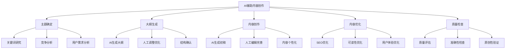

#### 内容生成最佳实践
- **人工监督**：AI生成内容需要人工监督和编辑
- **品牌一致性**：确保AI生成内容符合品牌调性
- **准确性验证**：验证AI生成内容的准确性
- **原创性保证**：确保内容的原创性和独特性

### 内容优化应用
#### AI内容优化工具
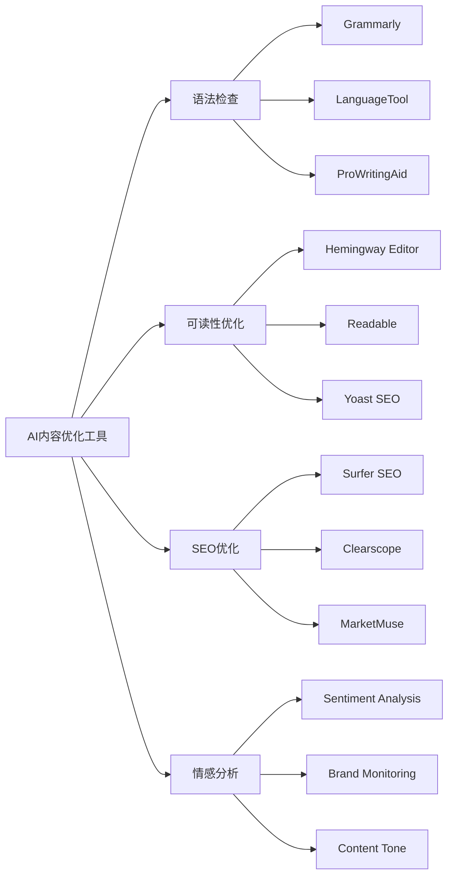

## 🔍 AI关键词研究

### 智能关键词挖掘
#### AI关键词研究工具
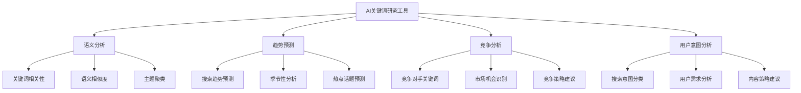

#### AI关键词研究优势
| 优势类型 | 具体表现 | 传统方法对比 | 实际应用 |
|---------|---------|-------------|---------|
| **效率提升** | 快速生成大量关键词建议 | 人工研究耗时 | 节省80%时间 |
| **深度分析** | 语义理解和关联分析 | 表面关键词匹配 | 发现隐藏机会 |
| **趋势预测** | 基于数据预测关键词趋势 | 历史数据分析 | 提前布局策略 |
| **个性化** | 基于行业和网站特点定制 | 通用关键词列表 | 更精准的策略 |

### 关键词策略优化
#### AI驱动的关键词策略
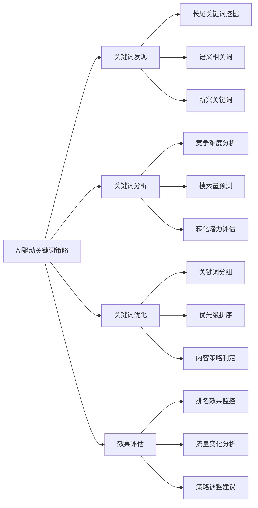

## 👥 AI用户体验优化

### 个性化推荐
#### AI推荐系统
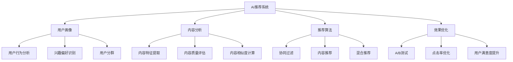

#### 个性化SEO策略
- **个性化内容**：基于用户兴趣提供个性化内容
- **个性化搜索**：优化个性化搜索结果
- **个性化导航**：提供个性化网站导航
- **个性化推荐**：推荐相关内容和产品

### 智能搜索
#### AI搜索技术
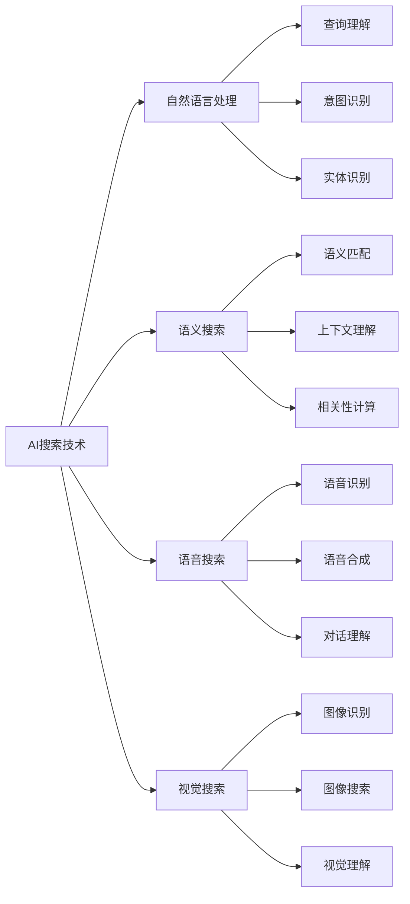

#### 智能搜索优化
- **语音搜索优化**：优化内容以适配语音搜索
- **语义搜索优化**：优化内容语义结构
- **视觉搜索优化**：优化图片和视觉内容
- **对话搜索优化**：优化内容以适配对话式搜索

## 📊 AI数据分析

### 智能数据分析
#### AI分析工具
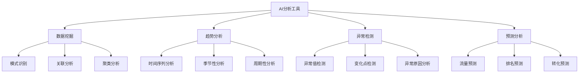

#### AI数据分析优势
| 分析类型 | AI优势 | 传统方法 | 实际效果 |
|---------|-------|---------|---------|
| **模式识别** | 发现隐藏模式 | 人工分析 | 发现更多机会 |
| **趋势预测** | 准确预测趋势 | 历史趋势分析 | 提前布局 |
| **异常检测** | 实时异常检测 | 定期检查 | 快速响应 |
| **预测分析** | 多维度预测 | 单一指标预测 | 更准确预测 |

### 数据驱动决策
#### AI辅助决策
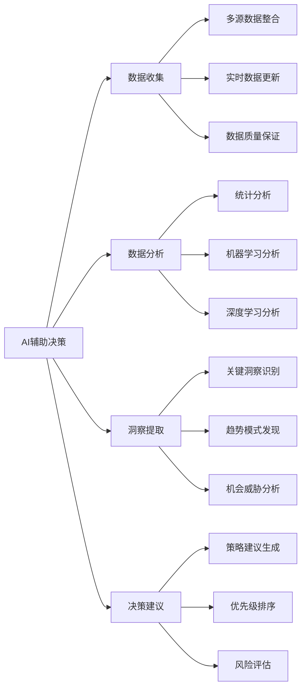

## 🔧 AI技术SEO

### 自动化技术SEO
#### AI技术SEO工具
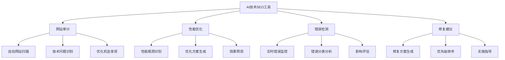

#### 自动化SEO流程
- **自动监控**：自动监控网站技术状态
- **自动检测**：自动检测SEO问题
- **自动修复**：自动修复简单问题
- **自动报告**：自动生成SEO报告

### 性能优化
#### AI性能优化
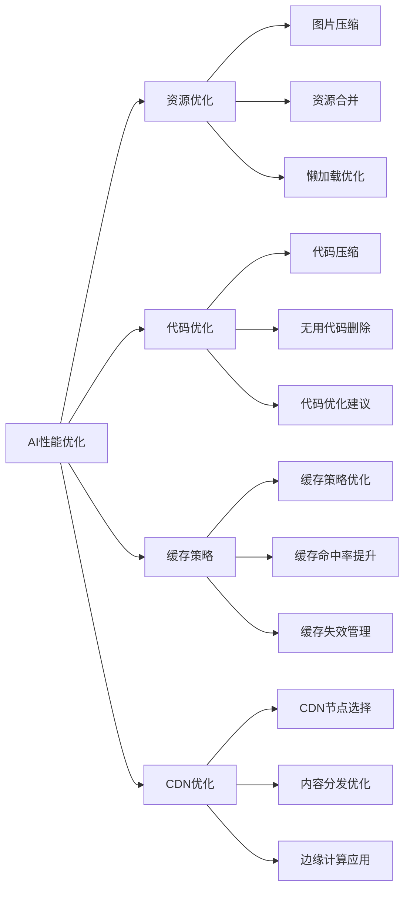

## 🚀 AI SEO工具推荐

### 综合AI SEO工具
#### 主流工具对比
| 工具名称 | 主要功能 | 适用场景 | 价格 | 推荐指数 |
|---------|---------|---------|------|---------|
| **Surfer SEO** | 内容优化、关键词研究 | 内容营销 | $89/月 | ⭐⭐⭐⭐⭐ |
| **Clearscope** | 内容优化、竞争分析 | 内容创作 | $170/月 | ⭐⭐⭐⭐ |
| **MarketMuse** | 内容策略、主题研究 | 内容规划 | $149/月 | ⭐⭐⭐⭐ |
| **Frase** | 内容研究、优化建议 | 内容创作 | $45/月 | ⭐⭐⭐ |
| **Copy.ai** | AI内容生成 | 内容创作 | $35/月 | ⭐⭐⭐ |

### 专业AI工具
#### 细分领域工具
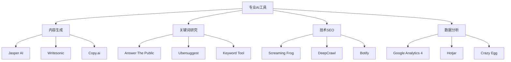

## 📋 AI SEO最佳实践

### 实施策略
#### AI SEO实施步骤
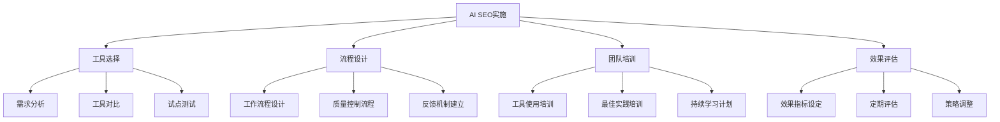

#### 实施建议
- **渐进式实施**：从简单任务开始，逐步扩展
- **人工监督**：AI工具需要人工监督和调整
- **质量控制**：建立质量控制机制
- **持续学习**：持续学习AI技术发展

### 风险控制
#### 常见风险
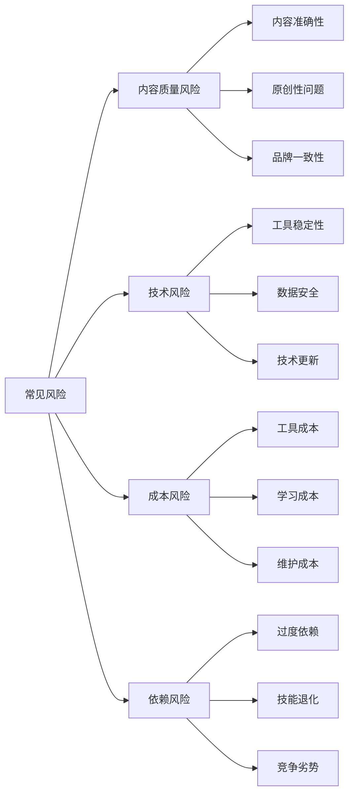

#### 风险控制措施
- **质量检查**：建立内容质量检查机制
- **备份方案**：准备传统方法作为备份
- **成本控制**：合理控制AI工具成本
- **技能保持**：保持传统SEO技能

## 📋 总结

### 核心要点
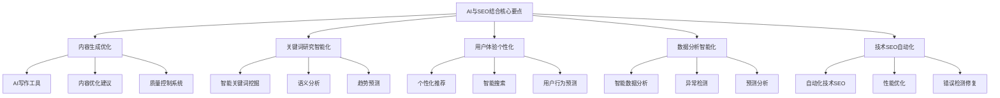

### 成功要素
1. **工具选择**：选择适合的AI SEO工具
2. **人工监督**：AI工具需要人工监督和调整
3. **质量控制**：建立完善的质量控制机制
4. **持续学习**：持续学习AI技术发展
5. **风险控制**：有效控制AI应用风险

### 发展趋势
- **技术成熟**：AI技术不断成熟和完善
- **成本降低**：AI工具成本逐渐降低
- **功能增强**：AI工具功能不断增强
- **集成化**：AI功能与其他工具深度集成
- **个性化**：AI应用更加个性化和定制化
