# 新闻媒体SEO

## 📋 概述

### 什么是新闻媒体SEO
新闻媒体SEO是专门针对新闻网站、媒体平台和内容发布网站的搜索引擎优化技术，旨在提升新闻内容在搜索结果中的排名，增加内容曝光度和流量。

### 核心价值
- **内容曝光**：提升新闻内容在搜索结果中的可见性
- **流量增长**：增加高质量的目标流量
- **品牌影响力**：提升媒体品牌在搜索引擎中的影响力
- **用户获取**：通过搜索获得更多忠实用户

### 新闻媒体SEO特点
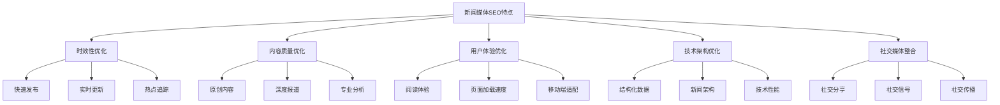

## 📰 新闻内容SEO优化

### 标题优化
#### 新闻标题结构
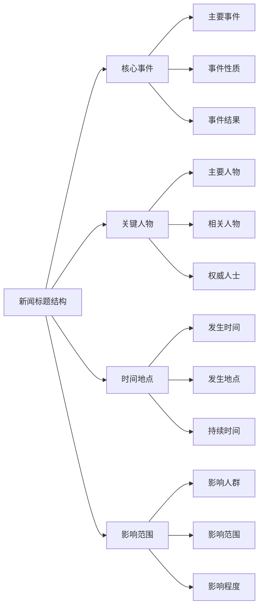

#### 标题优化策略
| 优化要素 | 最佳实践 | 示例 | 注意事项 |
|---------|---------|------|---------|
| **关键词位置** | 核心关键词前置 | "北京冬奥会开幕式成功举办" | 避免关键词堆砌 |
| **标题长度** | 50-60字符 | "2024年北京冬奥会开幕式圆满成功" | 确保完整显示 |
| **时效性** | 包含时间信息 | "今日最新：..." | 突出时效性 |
| **准确性** | 准确描述事件 | "官方确认：..." | 避免误导 |
| **吸引力** | 吸引用户点击 | "重磅消息：..." | 避免标题党 |

### 内容结构优化
#### 新闻内容结构
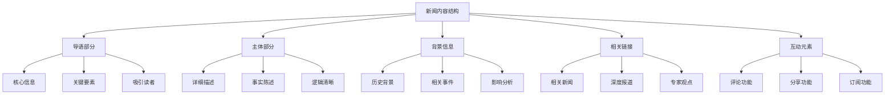

#### 内容优化要点
- **5W1H原则**：确保新闻包含Who、What、When、Where、Why、How
- **关键词自然融入**：在内容中自然使用相关关键词
- **事实准确性**：确保新闻内容的准确性和真实性
- **可读性优化**：使用清晰易懂的语言和结构

### 图片和视频优化
#### 多媒体内容优化
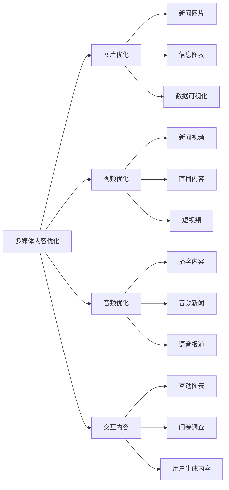

#### 多媒体SEO策略
| 内容类型 | 优化策略 | 技术要求 | 用户体验 |
|---------|---------|---------|---------|
| **新闻图片** | 描述性文件名+Alt标签 | 响应式设计 | 清晰展示 |
| **新闻视频** | 标题+描述+字幕 | 多格式支持 | 流畅播放 |
| **信息图表** | 结构化数据标记 | 矢量格式 | 易于理解 |
| **音频内容** | 标题+描述+转录 | 流媒体技术 | 清晰音质 |
| **交互内容** | 移动端适配 | 跨平台兼容 | 操作简便 |

## 🏗️ 网站架构优化

### 新闻网站结构
#### 网站层级设计
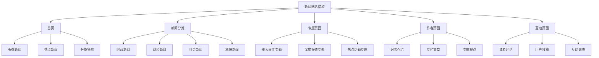

#### 导航结构优化
- **逻辑清晰**：导航结构逻辑清晰，易于理解
- **关键词优化**：在导航中使用相关关键词
- **用户导向**：以用户需求为导向设计导航
- **移动端适配**：确保移动端导航体验良好

### URL结构优化
#### URL设计原则
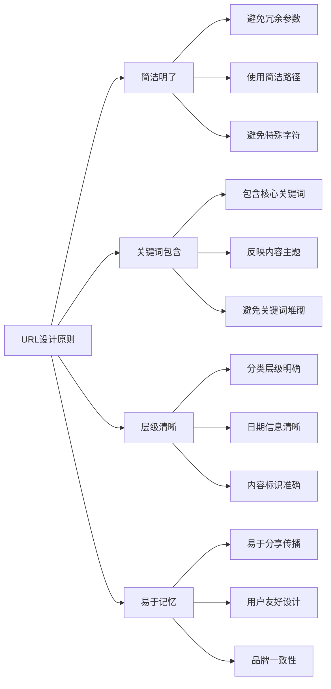

#### URL优化策略
| URL类型 | 设计原则 | 示例 | 优化要点 |
|---------|---------|------|---------|
| **新闻文章** | 分类/日期/标题 | /news/2024/01/15/beijing-olympics | 包含关键词 |
| **专题页面** | 专题/子分类 | /special/beijing-olympics/opening | 层级清晰 |
| **作者页面** | 作者/分类 | /author/zhang-san/opinion | 易于识别 |
| **分类页面** | 分类/子分类 | /news/politics/national | 逻辑明确 |
| **互动页面** | 功能/分类 | /interactive/poll/2024 | 功能明确 |

## 📱 移动端新闻SEO

### 移动端优化
#### 响应式设计
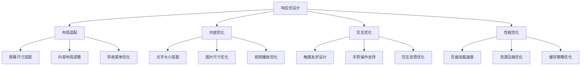

#### 移动端用户体验
- **快速加载**：确保移动端页面快速加载
- **易读性**：优化移动端文字显示和阅读体验
- **操作便捷**：简化移动端操作流程
- **内容适配**：确保内容在移动端完整显示

### 移动端SEO策略
#### 移动端关键词
- **本地新闻**：优化本地新闻搜索
- **实时搜索**：优化实时新闻搜索
- **语音搜索**：考虑语音搜索优化
- **长尾关键词**：优化移动端长尾关键词

## 🔗 链接建设策略

### 内部链接优化
#### 内部链接结构
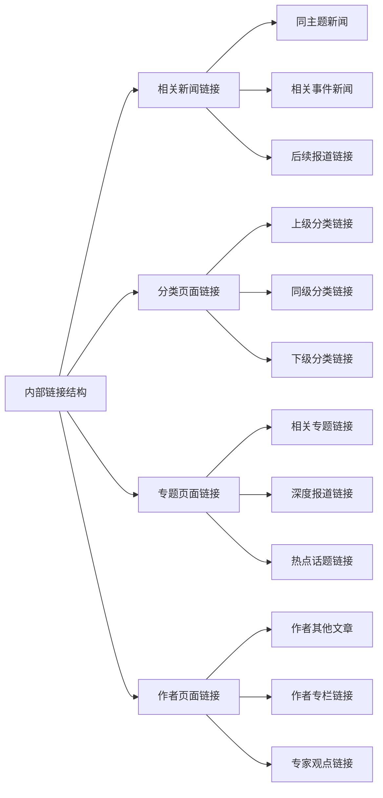

#### 内部链接策略
- **相关性优先**：优先链接相关内容
- **用户体验**：提升用户阅读体验
- **权重传递**：合理分配页面权重
- **更新维护**：定期检查和更新链接

### 外部链接建设
#### 外部链接类型
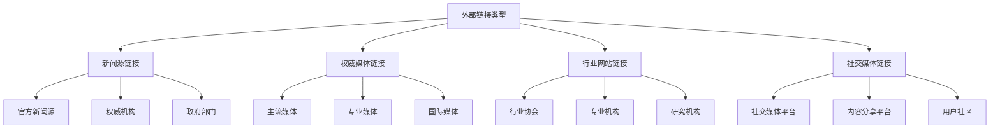

#### 外部链接策略
- **质量优先**：优先获取高质量外部链接
- **相关性**：确保链接来源与内容相关
- **自然获取**：通过优质内容自然获取链接
- **持续建设**：持续进行外部链接建设

## 📊 新闻SEO数据分析

### 关键指标
#### 新闻SEO指标
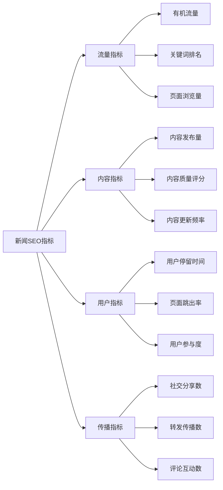

#### 监控工具
| 工具类型 | 工具名称 | 主要功能 | 使用建议 |
|---------|---------|---------|---------|
| **流量分析** | Google Analytics | 流量和用户行为分析 | 设置新闻目标 |
| **搜索分析** | Google Search Console | 搜索表现监控 | 关注新闻关键词 |
| **竞争分析** | SEMrush | 竞争对手分析 | 监控竞品表现 |
| **社交分析** | Hootsuite | 社交媒体分析 | 监控社交传播 |
| **内容分析** | BuzzSumo | 内容传播分析 | 分析热门内容 |

### 数据分析应用
#### 数据驱动优化
- **内容策略**：基于数据调整内容策略
- **关键词优化**：分析关键词表现优化内容
- **用户行为**：分析用户行为优化体验
- **传播效果**：分析传播效果优化策略

#### 优化决策
- **内容创作**：基于数据指导内容创作
- **发布时间**：基于数据优化发布时间
- **标题优化**：基于数据优化标题策略
- **用户体验**：基于数据改进用户体验

## 🚀 新闻媒体SEO最佳实践

### 实施策略
#### 分阶段实施
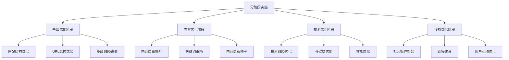

#### 持续优化
- **内容质量**：持续提升内容质量
- **技术更新**：跟进SEO技术发展
- **用户反馈**：收集用户反馈改进
- **竞争分析**：定期分析竞争对手

### 常见错误避免
#### 常见错误
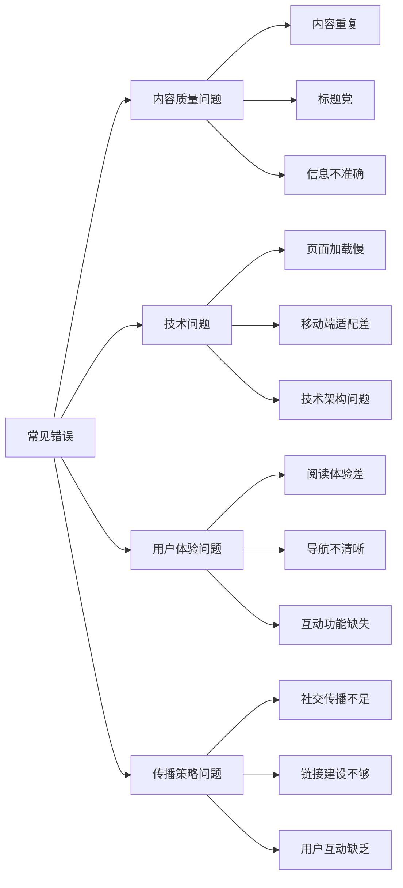

#### 避免方法
- **内容质量**：确保内容质量和准确性
- **技术规范**：遵循SEO技术规范
- **用户体验**：以用户体验为中心
- **传播策略**：制定有效的传播策略

## 📋 总结

### 核心要点
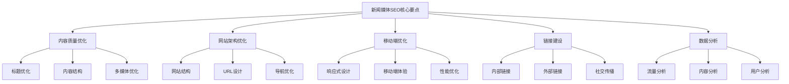

### 成功要素
1. **内容质量**：提供高质量、准确的新闻内容
2. **时效性**：快速发布和更新新闻内容
3. **用户体验**：优化阅读体验和网站性能
4. **技术架构**：建立良好的技术基础
5. **传播策略**：制定有效的内容传播策略

### 发展趋势
- **AI技术应用**：利用AI技术提升内容生产和分发
- **个性化推荐**：提供个性化新闻推荐
- **实时更新**：实现新闻内容的实时更新
- **多媒体融合**：整合文字、图片、视频等多种媒体形式
- **社交化传播**：加强社交媒体传播和用户互动
