# 本地SEO优化

## 📋 概述

### 什么是本地SEO
本地SEO（Local SEO）是针对本地搜索的搜索引擎优化策略，旨在帮助本地企业在搜索引擎中获得更好的本地排名，吸引更多本地客户。

### 核心价值
- **本地客户获取**：吸引更多本地潜在客户
- **竞争差异化**：在本地市场中建立竞争优势
- **品牌本地化**：提升品牌在本地市场的知名度
- **业务增长**：直接促进本地业务增长

### 本地SEO要素
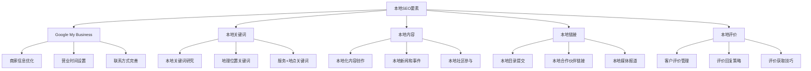

## 🏢 Google My Business优化

### 账户设置
#### 基本信息优化
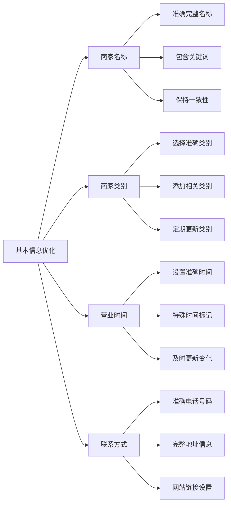

#### 商家资料完善
| 信息类型 | 优化要点 | 最佳实践 | 注意事项 |
|---------|---------|---------|---------|
| **商家名称** | 准确、完整、一致 | 包含主要关键词 | 避免过度优化 |
| **商家类别** | 选择准确类别 | 添加相关类别 | 定期审核更新 |
| **营业时间** | 详细准确时间 | 标记特殊时间 | 及时更新变化 |
| **联系方式** | 完整准确信息 | 多渠道联系方式 | 保持信息一致 |
| **商家描述** | 突出特色服务 | 包含本地关键词 | 避免重复内容 |

### 内容优化
#### 商家描述优化
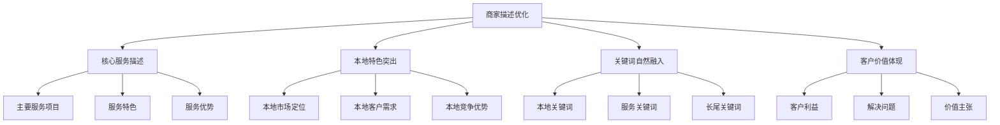

#### 照片和视频优化
- **高质量照片**：上传清晰、专业的商家照片
- **多样化内容**：包含外观、内部、产品、团队等照片
- **定期更新**：定期更新照片保持新鲜度
- **视频内容**：上传介绍视频提升用户体验

### 互动功能
#### 帖子功能
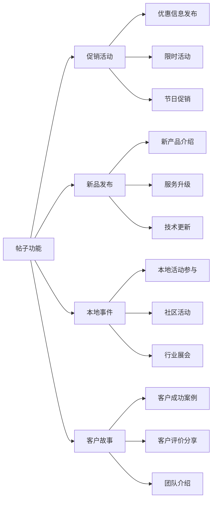

#### Q&A功能
- **常见问题回答**：主动回答客户常见问题
- **及时回复**：快速回复客户提问
- **专业解答**：提供专业、有用的答案
- **关键词优化**：在回答中自然融入关键词

## 🔍 本地关键词策略

### 关键词研究
#### 本地关键词类型
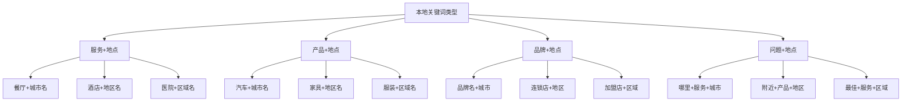

#### 关键词研究工具
| 工具类型 | 工具名称 | 适用场景 | 使用建议 |
|---------|---------|---------|---------|
| **免费工具** | Google Keyword Planner | 基础关键词研究 | 结合本地搜索量 |
| **免费工具** | Google Trends | 本地趋势分析 | 关注地区差异 |
| **免费工具** | Google My Business Insights | 本地搜索数据 | 分析实际搜索词 |
| **付费工具** | SEMrush | 深度关键词分析 | 本地竞争分析 |
| **付费工具** | Ahrefs | 关键词难度分析 | 本地关键词挖掘 |

### 关键词优化
#### 页面标题优化
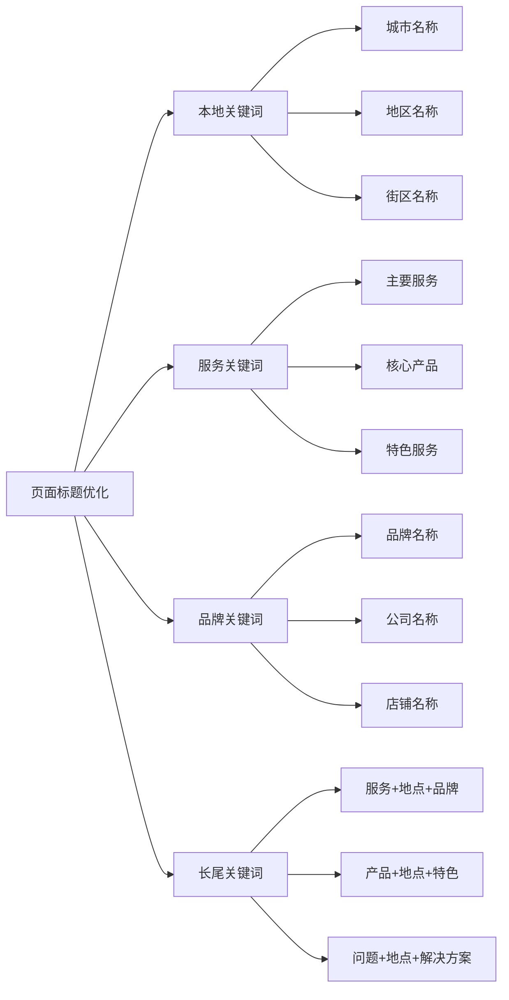

#### 内容优化策略
- **本地化内容**：创作针对本地市场的内容
- **本地新闻**：发布本地相关新闻和事件
- **本地案例**：分享本地客户成功案例
- **本地指南**：提供本地生活指南和建议

## 📍 本地内容策略

### 内容类型
#### 本地化内容创作
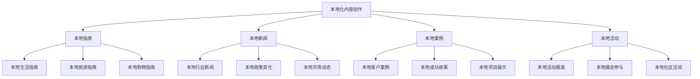

#### 内容优化要点
| 内容类型 | 优化要点 | 关键词策略 | 更新频率 |
|---------|---------|-----------|---------|
| **本地指南** | 实用性强、信息准确 | 自然融入本地关键词 | 每月更新 |
| **本地新闻** | 时效性强、相关性高 | 包含地点和服务关键词 | 每周更新 |
| **本地案例** | 真实可信、有说服力 | 突出本地特色 | 每月更新 |
| **本地活动** | 参与度高、互动性强 | 活动+地点关键词 | 按活动频率 |

### 内容分发
#### 多渠道分发
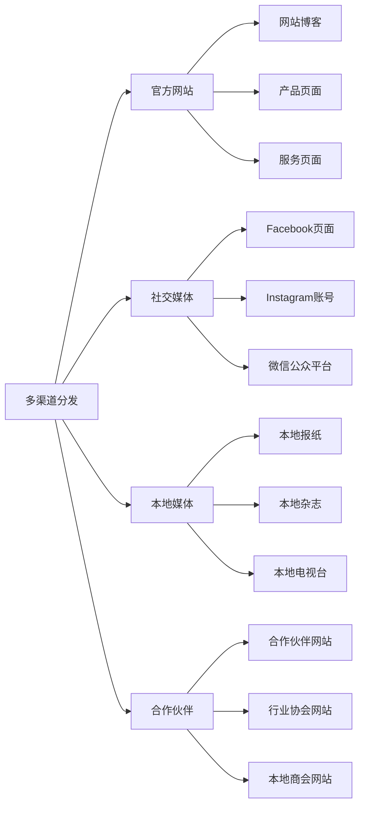

## 🔗 本地链接建设

### 链接类型
#### 本地目录提交
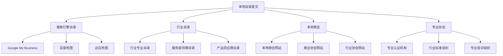

#### 本地媒体合作
- **本地新闻报道**：争取本地媒体报道
- **行业媒体合作**：与行业媒体建立合作关系
- **本地活动赞助**：赞助本地活动获得曝光
- **本地社区参与**：积极参与本地社区活动

### 链接质量评估
#### 链接质量指标
| 指标类型 | 评估标准 | 权重 | 优化建议 |
|---------|---------|------|---------|
| **域名权威性** | DA/DR值 | 高 | 优先高质量目录 |
| **相关性** | 行业相关性 | 高 | 选择相关行业目录 |
| **本地性** | 本地相关性 | 中 | 重视本地目录 |
| **流量质量** | 访问量质量 | 中 | 关注流量质量 |
| **链接位置** | 链接位置 | 低 | 争取首页链接 |

## ⭐ 评价管理策略

### 评价获取
#### 评价获取方法
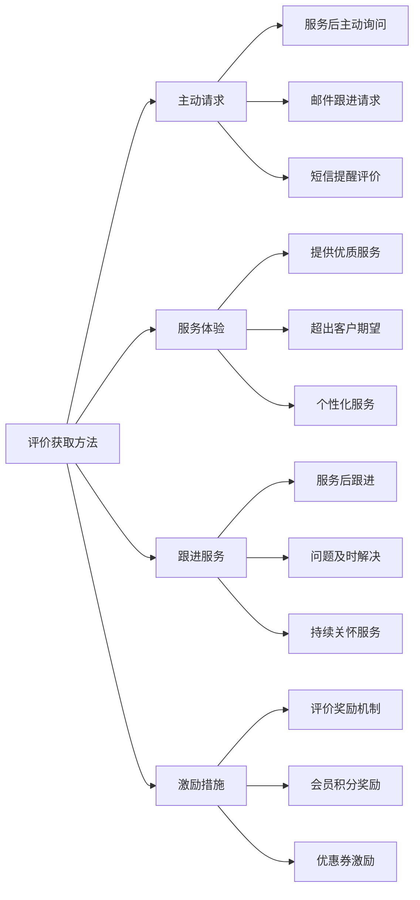

#### 评价获取最佳实践
- **时机选择**：在客户满意度最高时请求评价
- **方式选择**：提供多种评价渠道和方式
- **内容引导**：引导客户写出详细、有用的评价
- **后续跟进**：对评价进行及时回复和感谢

### 评价回复
#### 回复策略
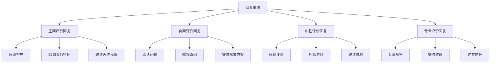

#### 回复最佳实践
| 评价类型 | 回复要点 | 回复模板 | 注意事项 |
|---------|---------|---------|---------|
| **5星评价** | 感谢+特色+邀请 | 感谢您的5星评价，我们很高兴为您提供了优质服务... | 个性化回复 |
| **4星评价** | 感谢+改进+邀请 | 感谢您的评价，我们会继续努力提升服务质量... | 询问改进建议 |
| **3星评价** | 感谢+了解+改进 | 感谢您的反馈，我们很重视您的意见... | 主动沟通 |
| **2星评价** | 道歉+了解+解决 | 很抱歉没有达到您的期望，我们非常重视您的反馈... | 及时处理 |
| **1星评价** | 道歉+解决+改进 | 非常抱歉给您带来了不好的体验，我们会立即处理... | 快速响应 |

## 📊 本地SEO数据分析

### 关键指标
#### 本地SEO指标
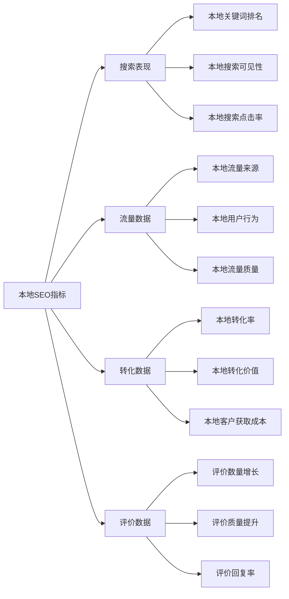

#### 监控工具
| 工具类型 | 工具名称 | 主要功能 | 使用建议 |
|---------|---------|---------|---------|
| **官方工具** | Google My Business Insights | 本地搜索数据 | 定期查看分析 |
| **官方工具** | Google Analytics | 流量分析 | 设置本地目标 |
| **官方工具** | Google Search Console | 搜索表现 | 监控本地关键词 |
| **第三方工具** | BrightLocal | 本地SEO监控 | 专业本地SEO分析 |
| **第三方工具** | Whitespark | 本地排名监控 | 竞争对手分析 |

### 数据分析
#### 数据解读
- **搜索量分析**：分析本地关键词搜索量变化
- **排名趋势**：监控本地关键词排名趋势
- **流量质量**：评估本地流量的质量和转化率
- **竞争分析**：分析本地竞争对手的表现

#### 优化建议
- **关键词优化**：基于数据调整关键词策略
- **内容优化**：根据流量数据优化内容策略
- **链接建设**：基于竞争分析调整链接策略
- **评价管理**：根据评价数据改进服务质量

## 🚀 本地SEO最佳实践

### 实施策略
#### 分阶段实施
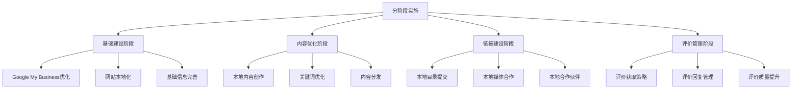

#### 持续优化
- **定期审核**：定期审核本地SEO策略效果
- **数据驱动**：基于数据分析调整策略
- **竞争监控**：持续监控竞争对手表现
- **技术更新**：跟进本地SEO技术发展

### 常见错误避免
#### 常见错误
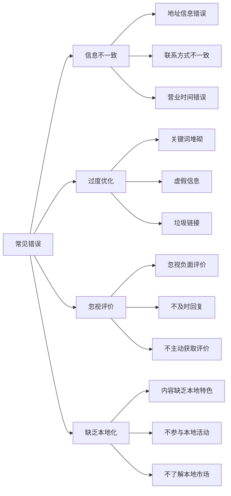

#### 避免方法
- **信息一致性**：确保所有平台信息一致
- **自然优化**：避免过度优化和关键词堆砌
- **重视评价**：积极管理客户评价
- **深度本地化**：深入了解本地市场和客户需求

## 📋 总结

### 核心要点
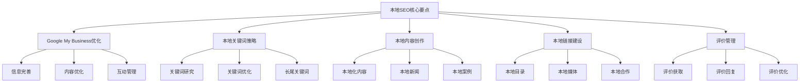

### 成功要素
1. **信息准确性**：确保所有本地信息准确一致
2. **内容本地化**：创作真正本地化的内容
3. **客户服务**：提供优质的本地客户服务
4. **社区参与**：积极参与本地社区活动
5. **持续优化**：基于数据持续优化策略

### 发展趋势
- **语音搜索优化**：优化本地语音搜索
- **移动端优先**：重视移动端本地搜索体验
- **AI技术应用**：利用AI技术提升本地SEO效果
- **个性化服务**：提供更个性化的本地服务
- **跨平台整合**：整合多个平台的本地SEO策略
