# 电商SEO技术

## 📋 概述

### 什么是电商SEO
电商SEO（E-commerce SEO）是专门针对电子商务网站的搜索引擎优化技术，旨在提升电商网站在搜索引擎中的排名，增加产品曝光度，最终提高销售转化率。

### 核心价值
- **产品曝光**：提升产品在搜索结果中的可见性
- **流量增长**：增加高质量的目标流量
- **转化提升**：提高访客到买家的转化率
- **竞争优势**：在竞争激烈的电商市场中建立优势

### 电商SEO特点
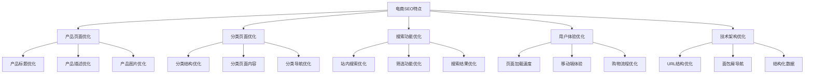

## 🛍️ 产品页面SEO优化

### 产品标题优化
#### 标题结构
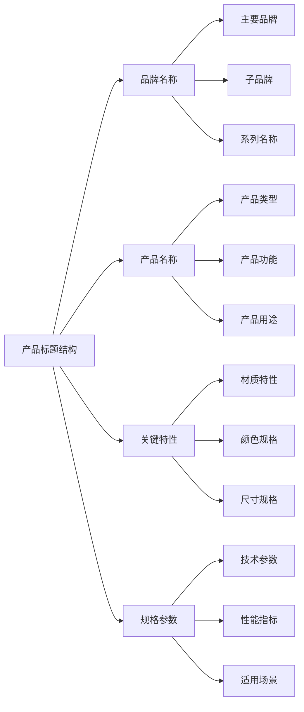

#### 标题优化策略
| 优化要素 | 最佳实践 | 示例 | 注意事项 |
|---------|---------|------|---------|
| **关键词位置** | 主要关键词前置 | "iPhone 15 Pro Max 256GB" | 避免关键词堆砌 |
| **标题长度** | 50-60字符 | "Apple iPhone 15 Pro Max 256GB 深空黑色" | 确保完整显示 |
| **品牌信息** | 包含品牌名称 | "Samsung Galaxy S24 Ultra" | 品牌一致性 |
| **产品特性** | 突出关键特性 | "无线充电 防水 5G" | 用户关注点 |
| **规格信息** | 重要规格参数 | "256GB 存储 6.7英寸" | 购买决策因素 |

### 产品描述优化
#### 描述结构
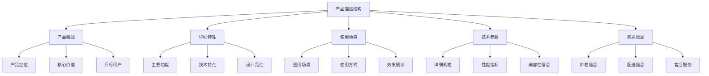

#### 内容优化要点
- **关键词自然融入**：在描述中自然使用相关关键词
- **用户语言**：使用用户容易理解的语言描述产品
- **详细准确**：提供详细准确的产品信息
- **差异化描述**：突出产品独特卖点和优势

### 产品图片优化
#### 图片SEO要素
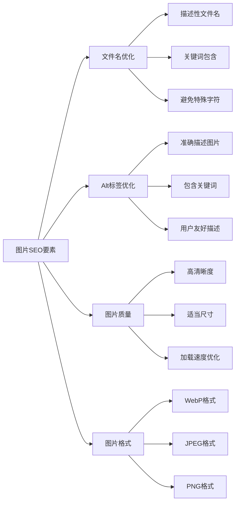

#### 图片优化策略
| 优化类型 | 最佳实践 | 技术要求 | 用户体验 |
|---------|---------|---------|---------|
| **文件名** | "iphone-15-pro-max-256gb-black.jpg" | 小写字母+连字符 | 易于理解 |
| **Alt标签** | "iPhone 15 Pro Max 256GB 深空黑色" | 准确描述 | 无障碍访问 |
| **图片尺寸** | 1200x1200px | 响应式设计 | 清晰显示 |
| **文件大小** | <100KB | 压缩优化 | 快速加载 |
| **图片数量** | 5-8张 | 多角度展示 | 全面了解 |

## 📂 分类页面优化

### 分类结构优化
#### 分类层级设计
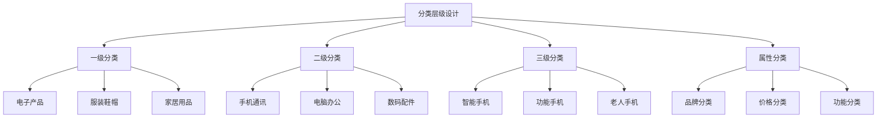

#### 分类命名策略
- **用户导向**：使用用户熟悉的分类名称
- **关键词优化**：在分类名称中包含相关关键词
- **逻辑清晰**：分类逻辑清晰，易于理解
- **避免重复**：避免分类名称重复或混淆

### 分类页面内容
#### 页面内容结构
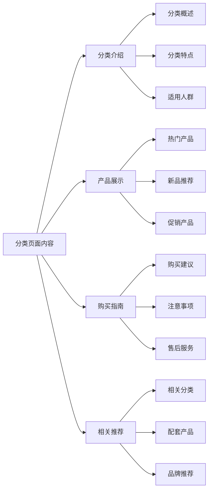

#### 内容优化要点
- **分类描述**：为每个分类提供详细的描述内容
- **关键词优化**：在分类页面中自然使用相关关键词
- **用户价值**：提供对用户有价值的信息和建议
- **更新维护**：定期更新分类页面内容

## 🔍 站内搜索优化

### 搜索功能设计
#### 搜索体验优化
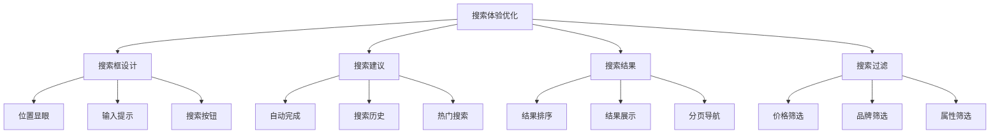

#### 搜索功能要点
| 功能类型 | 设计要求 | 用户体验 | 技术实现 |
|---------|---------|---------|---------|
| **搜索框** | 位置显眼，易于找到 | 快速定位 | 响应式设计 |
| **搜索建议** | 实时显示，准确匹配 | 减少输入 | AJAX技术 |
| **搜索结果** | 相关性排序，清晰展示 | 快速找到 | 算法优化 |
| **搜索过滤** | 多维度筛选，快速筛选 | 精准定位 | 动态过滤 |
| **搜索历史** | 保存历史，快速重复 | 便捷使用 | 本地存储 |

### 搜索结果优化
#### 结果页面优化
- **相关性排序**：确保搜索结果按相关性排序
- **结果展示**：清晰展示产品信息和价格
- **分页设计**：合理设计分页，避免结果过多
- **无结果处理**：提供无结果时的替代建议

## 📱 移动端电商SEO

### 移动端优化
#### 响应式设计
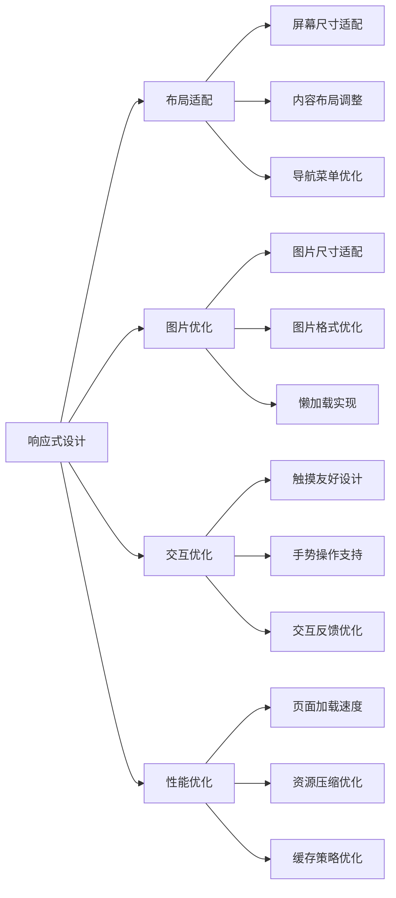

#### 移动端用户体验
- **页面加载速度**：确保移动端页面快速加载
- **触摸友好**：设计适合触摸操作的界面
- **内容可读性**：确保移动端内容清晰可读
- **购物流程**：简化移动端购物流程

### 移动端SEO策略
#### 移动端关键词
- **本地搜索**：优化本地移动搜索
- **语音搜索**：考虑语音搜索优化
- **长尾关键词**：优化移动端长尾关键词
- **本地化内容**：提供本地化移动内容

## 🛒 购物体验优化

### 转化率优化
#### 购物流程优化
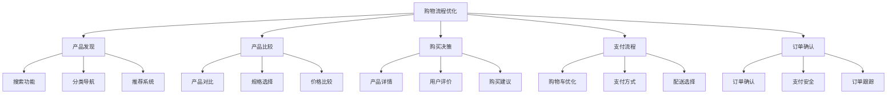

#### 转化优化策略
| 优化环节 | 优化策略 | 技术实现 | 预期效果 |
|---------|---------|---------|---------|
| **产品发现** | 优化搜索和推荐 | 智能推荐算法 | 提升发现率 |
| **产品比较** | 简化比较流程 | 对比功能设计 | 提升比较效率 |
| **购买决策** | 提供决策支持 | 评价系统优化 | 提升决策信心 |
| **支付流程** | 简化支付步骤 | 一键支付功能 | 提升支付成功率 |
| **订单确认** | 清晰确认信息 | 订单详情展示 | 减少订单错误 |

### 用户体验提升
#### 页面性能优化
- **加载速度**：优化页面加载速度
- **图片优化**：压缩和优化产品图片
- **代码优化**：优化CSS和JavaScript代码
- **CDN使用**：使用CDN加速内容分发

#### 用户信任建设
- **安全标识**：显示网站安全认证
- **用户评价**：展示真实用户评价
- **退换货政策**：明确退换货政策
- **客服支持**：提供多渠道客服支持

## 📊 电商SEO数据分析

### 关键指标
#### 电商SEO指标
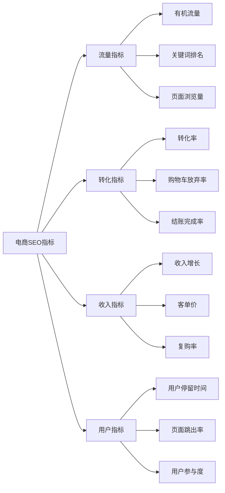

#### 监控工具
| 工具类型 | 工具名称 | 主要功能 | 使用建议 |
|---------|---------|---------|---------|
| **流量分析** | Google Analytics | 流量和转化分析 | 设置电商目标 |
| **搜索分析** | Google Search Console | 搜索表现监控 | 关注产品关键词 |
| **竞争分析** | SEMrush | 竞争对手分析 | 监控竞品表现 |
| **用户体验** | Hotjar | 用户行为分析 | 优化购物体验 |
| **转化分析** | Optimizely | A/B测试 | 优化转化率 |

### 数据分析应用
#### 数据驱动优化
- **关键词分析**：分析产品关键词表现
- **页面分析**：分析产品页面效果
- **用户行为**：分析用户购物行为
- **转化分析**：分析转化漏斗和瓶颈

#### 优化决策
- **内容优化**：基于数据优化产品内容
- **页面优化**：基于数据优化页面设计
- **关键词策略**：基于数据调整关键词策略
- **用户体验**：基于数据改进用户体验

## 🚀 电商SEO最佳实践

### 实施策略
#### 分阶段实施
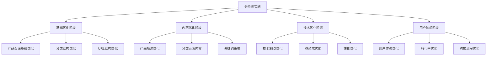

#### 持续优化
- **定期审核**：定期审核SEO策略效果
- **数据监控**：持续监控关键指标
- **竞争分析**：定期分析竞争对手
- **技术更新**：跟进SEO技术发展

### 常见错误避免
#### 常见错误
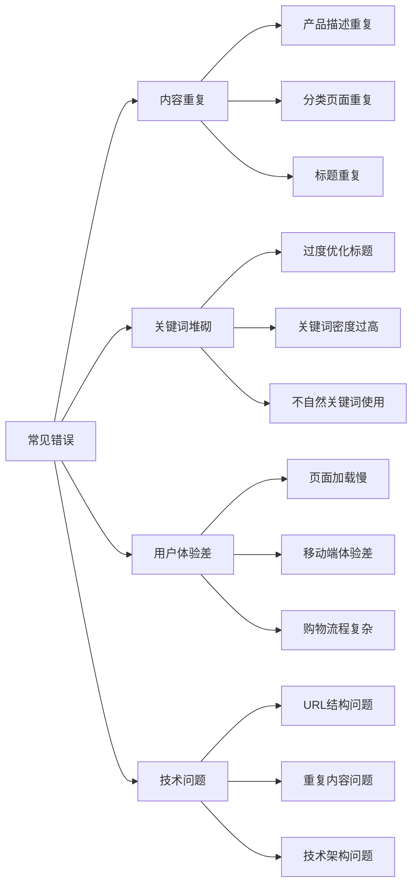

#### 避免方法
- **内容原创**：确保产品内容原创性
- **自然优化**：避免过度优化和关键词堆砌
- **用户体验优先**：始终以用户体验为中心
- **技术规范**：遵循SEO技术规范和最佳实践

## 📋 总结

### 核心要点
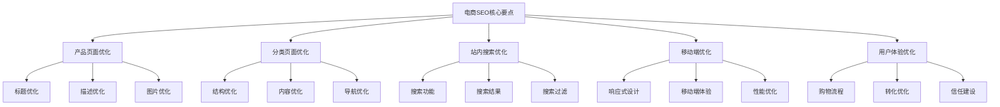

### 成功要素
1. **产品内容质量**：提供高质量的产品信息
2. **用户体验**：优化购物体验和流程
3. **技术架构**：建立良好的技术基础
4. **数据分析**：基于数据持续优化
5. **竞争分析**：了解竞争对手策略

### 发展趋势
- **AI技术应用**：利用AI技术提升个性化推荐
- **语音搜索优化**：优化语音搜索体验
- **视觉搜索**：支持图片搜索和识别
- **个性化体验**：提供个性化购物体验
- **跨平台整合**：整合多个销售渠道的SEO策略
