# B2B企业SEO

## 📋 概述

### 什么是B2B企业SEO
B2B企业SEO是专门针对企业对企业（Business-to-Business）业务的搜索引擎优化策略，旨在帮助B2B企业在搜索引擎中获得更好的排名，吸引更多潜在企业客户。

### 核心价值
- **潜在客户获取**：吸引更多高质量的企业潜在客户
- **品牌影响力**：提升B2B品牌在行业中的影响力
- **销售线索**：生成更多有效的销售线索
- **竞争优势**：在竞争激烈的B2B市场中建立优势

### B2B企业SEO特点
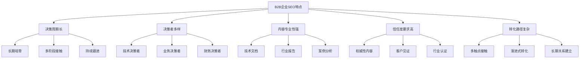

## 🎯 B2B关键词策略

### 关键词类型分析
#### B2B关键词分类
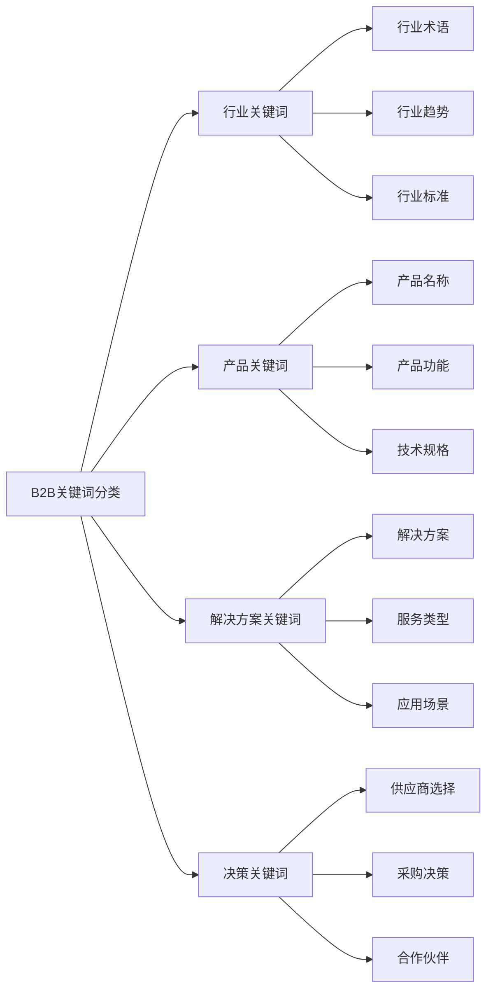

#### 关键词优先级矩阵
| 关键词类型 | 搜索量 | 竞争度 | 商业价值 | 优先级 | 策略建议 |
|-----------|-------|-------|---------|-------|---------|
| **行业核心词** | 高 | 高 | 高 | 高 | 重点优化，长期投入 |
| **产品功能词** | 中 | 中 | 高 | 高 | 重点优化，内容深度 |
| **解决方案词** | 中 | 低 | 高 | 中 | 内容营销，案例展示 |
| **长尾关键词** | 低 | 低 | 中 | 中 | 批量覆盖，快速见效 |
| **品牌关键词** | 低 | 低 | 高 | 低 | 品牌保护，口碑管理 |

### 关键词研究策略
#### B2B关键词研究方法
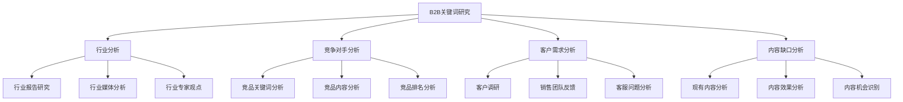

#### 关键词研究工具
| 工具类型 | 工具名称 | 适用场景 | 使用建议 |
|---------|---------|---------|---------|
| **免费工具** | Google Keyword Planner | 基础关键词研究 | 结合B2B行业特点 |
| **免费工具** | Google Trends | 行业趋势分析 | 关注行业热点 |
| **付费工具** | SEMrush | 竞争分析 | 分析竞争对手策略 |
| **付费工具** | Ahrefs | 关键词难度分析 | 评估优化难度 |
| **专业工具** | BrightEdge | B2B关键词研究 | 专业B2B分析 |

## 📝 B2B内容策略

### 内容类型规划
#### B2B内容矩阵
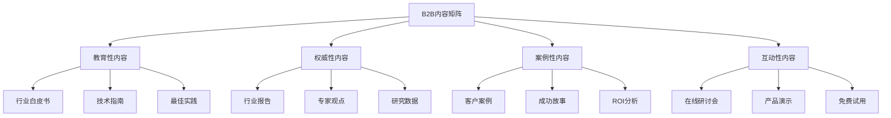

#### 内容策略要点
| 内容类型 | 目标受众 | 内容特点 | 优化重点 | 转化目标 |
|---------|---------|---------|---------|---------|
| **教育性内容** | 技术决策者 | 专业深度 | 技术关键词 | 建立信任 |
| **权威性内容** | 业务决策者 | 行业洞察 | 行业关键词 | 品牌认知 |
| **案例性内容** | 所有决策者 | 实际效果 | 解决方案关键词 | 销售线索 |
| **互动性内容** | 潜在客户 | 体验参与 | 产品关键词 | 直接转化 |

### 内容创作策略
#### 内容创作流程
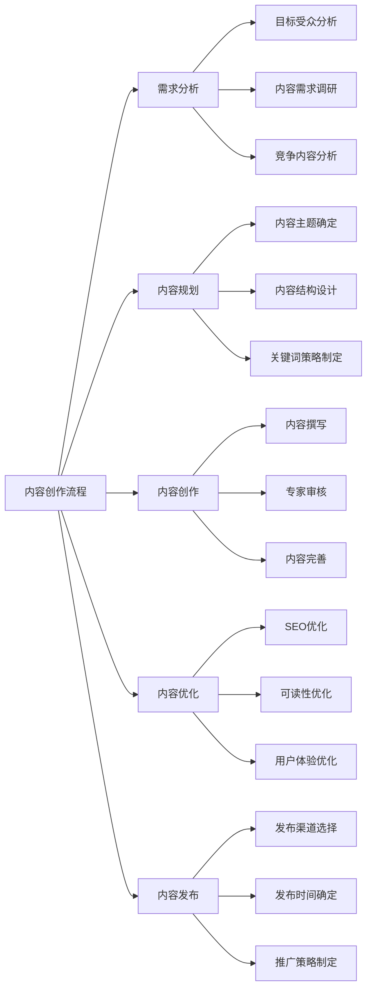

#### 内容优化要点
- **专业深度**：提供专业、深度的内容
- **实用性**：确保内容对目标受众有实际价值
- **权威性**：引用权威数据和研究
- **可操作性**：提供可操作的建议和指导

## 🔗 B2B链接建设

### 链接建设策略
#### B2B链接类型
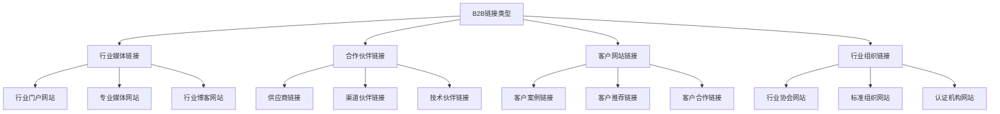

#### 链接建设方法
| 链接类型 | 获取方法 | 质量评估 | 建设策略 | 预期效果 |
|---------|---------|---------|---------|---------|
| **行业媒体** | 内容投稿、媒体合作 | 高权威性 | 长期合作 | 品牌曝光 |
| **合作伙伴** | 业务合作、技术合作 | 高相关性 | 互利共赢 | 业务增长 |
| **客户网站** | 案例展示、推荐合作 | 高可信度 | 客户关系 | 信任建立 |
| **行业组织** | 会员参与、标准制定 | 高权威性 | 行业地位 | 权威建立 |

### 链接质量评估
#### 链接质量指标
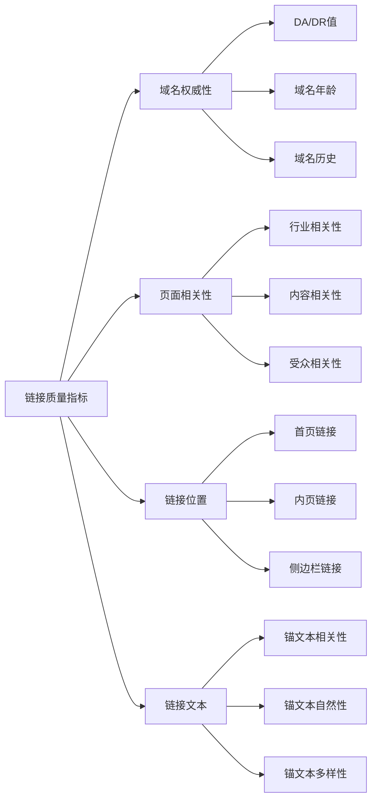

## 📊 B2B转化优化

### 转化路径设计
#### B2B转化漏斗
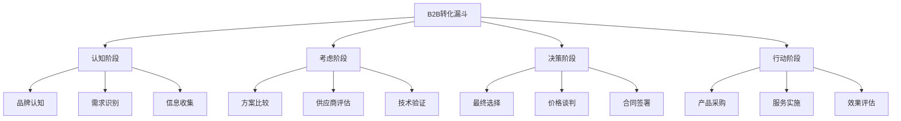

#### 转化优化策略
| 转化阶段 | 优化目标 | 优化策略 | 关键指标 | 优化重点 |
|---------|---------|---------|---------|---------|
| **认知阶段** | 品牌曝光 | 内容营销、SEO | 品牌搜索量 | 内容质量 |
| **考虑阶段** | 信息获取 | 教育资源、案例展示 | 页面停留时间 | 内容深度 |
| **决策阶段** | 信任建立 | 客户见证、专家推荐 | 转化率 | 信任信号 |
| **行动阶段** | 销售线索 | 试用申请、咨询表单 | 线索质量 | 用户体验 |

### 着陆页优化
#### B2B着陆页要素
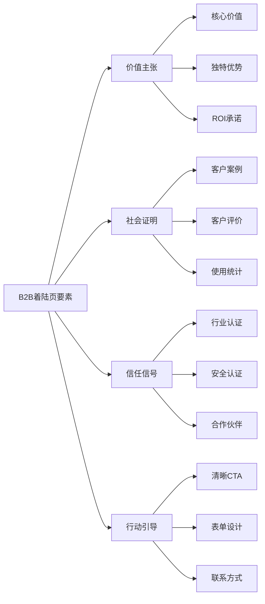

#### 着陆页优化要点
- **价值主张清晰**：明确传达产品价值
- **社会证明充分**：展示客户成功案例
- **信任信号明显**：显示权威认证和合作伙伴
- **行动引导明确**：提供清晰的下一步行动

## 📈 B2B数据分析

### 关键指标监控
#### B2B SEO指标
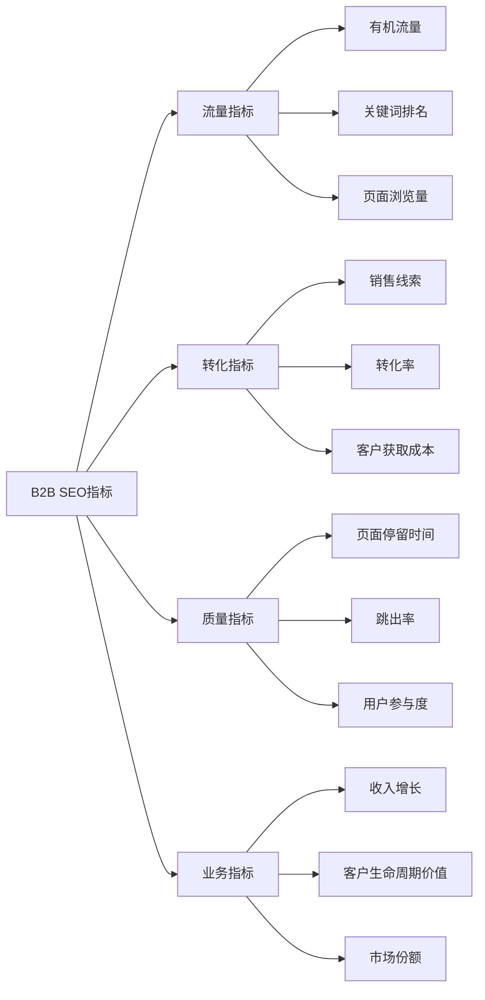

#### 数据分析工具
| 工具类型 | 工具名称 | 主要功能 | 使用建议 |
|---------|---------|---------|---------|
| **流量分析** | Google Analytics | 流量和用户行为分析 | 设置B2B转化目标 |
| **搜索分析** | Google Search Console | 搜索表现监控 | 关注行业关键词 |
| **竞争分析** | SEMrush | 竞争对手分析 | 监控竞品策略 |
| **转化分析** | HubSpot | 销售线索分析 | 跟踪转化漏斗 |
| **业务分析** | Salesforce | 客户关系管理 | 关联SEO和销售数据 |

### 数据驱动优化
#### 优化决策流程
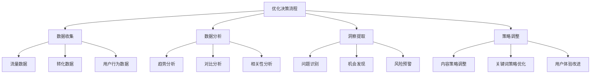

## 🚀 B2B SEO最佳实践

### 实施策略
#### 分阶段实施
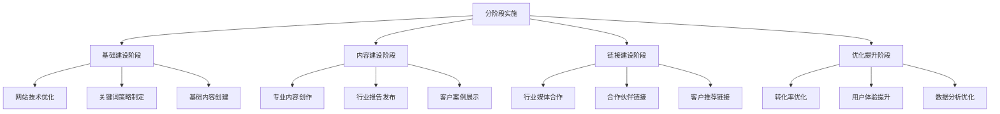

#### 持续优化
- **内容更新**：定期更新专业内容
- **关键词调整**：根据数据调整关键词策略
- **链接维护**：持续维护和建设高质量链接
- **效果监控**：持续监控SEO效果和业务指标

### 常见错误避免
#### 常见错误
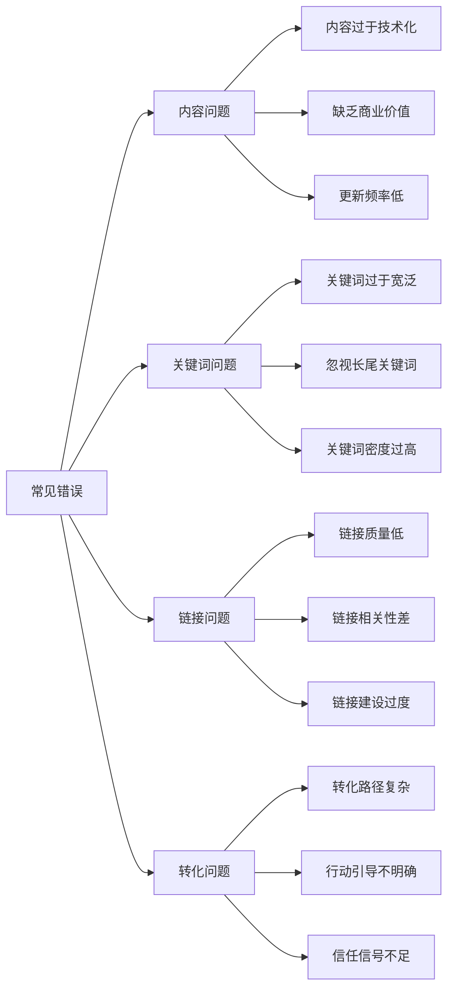

#### 避免方法
- **内容平衡**：平衡技术性和商业性内容
- **关键词精准**：选择精准的目标关键词
- **链接质量**：重视链接质量而非数量
- **转化简化**：简化转化路径和流程

## 📋 总结

### 核心要点
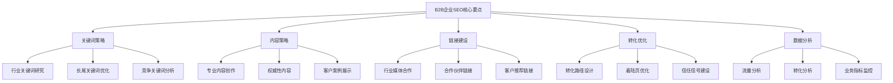

### 成功要素
1. **专业深度**：提供专业、深度的内容
2. **信任建立**：通过权威性和社会证明建立信任
3. **长期培育**：重视长期客户关系培育
4. **数据驱动**：基于数据分析优化策略
5. **业务导向**：以业务目标为导向进行SEO

### 发展趋势
- **AI技术应用**：利用AI技术提升内容生产和分析
- **个性化体验**：提供个性化的B2B用户体验
- **视频内容**：增加视频内容在B2B营销中的应用
- **社交销售**：结合社交媒体进行B2B销售
- **账户营销**：针对特定企业账户进行精准营销
