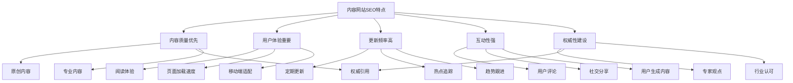
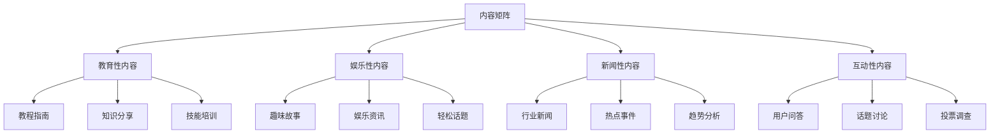
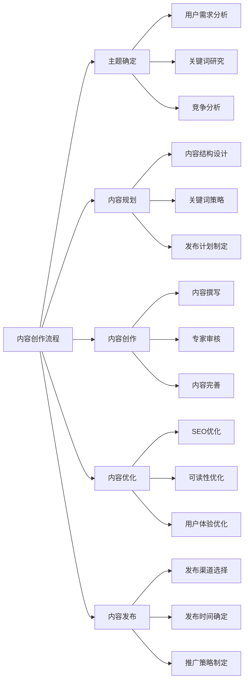
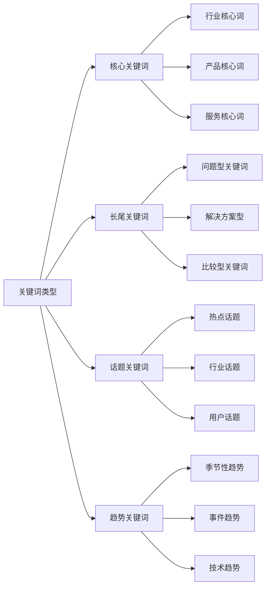
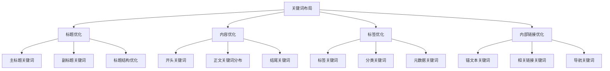
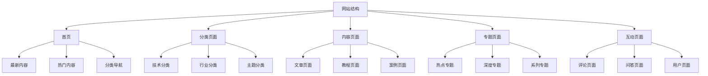
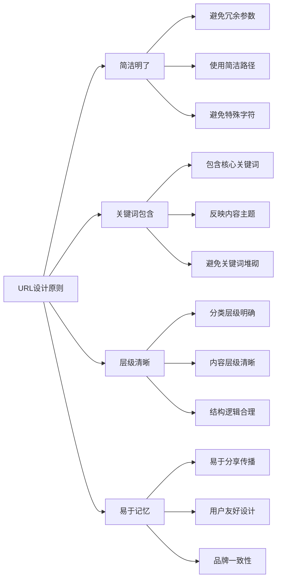
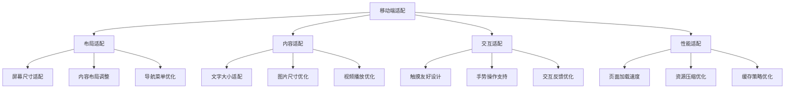

# 内容网站SEO

## 📋 概述

### 什么是内容网站SEO
内容网站SEO是专门针对以内容为核心的网站（如博客、新闻网站、知识分享平台等）的搜索引擎优化策略，旨在提升内容在搜索结果中的排名，增加内容曝光度和用户参与度。

### 核心价值
- **内容曝光**：提升内容在搜索结果中的可见性
- **流量增长**：增加高质量的目标流量
- **用户参与**：提高用户参与度和粘性
- **品牌影响力**：建立内容品牌和行业影响力

### 内容网站SEO特点


## 📝 内容策略优化

### 内容类型规划
#### 内容矩阵设计


#### 内容策略要点
| 内容类型 | 目标受众 | 内容特点 | 优化重点 | 预期效果 |
|---------|---------|---------|---------|---------|
| **教育性内容** | 学习者 | 专业深度 | 知识关键词 | 建立权威 |
| **娱乐性内容** | 普通用户 | 轻松有趣 | 热门关键词 | 增加流量 |
| **新闻性内容** | 关注者 | 时效性强 | 事件关键词 | 快速传播 |
| **互动性内容** | 活跃用户 | 参与度高 | 话题关键词 | 用户粘性 |

### 内容创作策略
#### 内容创作流程


#### 内容优化要点
- **原创性**：确保内容的原创性和独特性
- **专业性**：提供专业、准确的内容
- **实用性**：确保内容对用户有实际价值
- **可读性**：使用清晰易懂的语言和结构

## 🔍 关键词策略

### 关键词研究
#### 关键词类型


#### 关键词研究工具
| 工具类型 | 工具名称 | 主要功能 | 使用建议 |
|---------|---------|---------|---------|
| **免费工具** | Google Keyword Planner | 基础关键词研究 | 结合内容特点 |
| **免费工具** | Google Trends | 趋势分析 | 关注内容趋势 |
| **付费工具** | SEMrush | 竞争分析 | 分析内容竞争 |
| **付费工具** | Ahrefs | 关键词难度分析 | 评估优化难度 |
| **专业工具** | BuzzSumo | 内容分析 | 分析热门内容 |

### 关键词优化
#### 关键词布局


## 🏗️ 网站架构优化

### 网站结构设计
#### 层级结构


#### 导航结构优化
- **逻辑清晰**：导航结构逻辑清晰，易于理解
- **关键词优化**：在导航中使用相关关键词
- **用户导向**：以用户需求为导向设计导航
- **移动端适配**：确保移动端导航体验良好

### URL结构优化
#### URL设计原则


## 📱 移动端优化

### 响应式设计
#### 移动端适配


#### 移动端用户体验
- **快速加载**：确保移动端页面快速加载
- **易读性**：优化移动端文字显示和阅读体验
- **操作便捷**：简化移动端操作流程
- **内容适配**：确保内容在移动端完整显示

### 移动端SEO策略
#### 移动端关键词
- **本地搜索**：优化本地内容搜索
- **语音搜索**：考虑语音搜索优化
- **长尾关键词**：优化移动端长尾关键词
- **实时搜索**：优化实时内容搜索

## 🔗 链接建设策略

### 内部链接优化
#### 内部链接结构
```mermaid
graph LR
    A[内部链接结构] --> B[相关内容链接]
    A --> C[分类页面链接]
    A --> D[专题页面链接]
    A --> E[用户生成链接]
    
    B --> B1[同主题内容]
    B --> B2[相关话题内容]
    B --> B3[系列内容链接]
    
    C --> C1[上级分类链接]
    C --> C2[同级分类链接]
    C --> C3[下级分类链接"]
    
    D --> D1[相关专题链接]
    D --> D2[深度专题链接]
    D --> D3[热点专题链接]
    
    E --> E1[用户评论链接]
    E --> E2[用户分享链接]
    E --> E3[用户生成内容链接]
```

#### 内部链接策略
- **相关性优先**：优先链接相关内容
- **用户体验**：提升用户阅读体验
- **权重传递**：合理分配页面权重
- **更新维护**：定期检查和更新链接

### 外部链接建设
#### 外部链接类型
```mermaid
graph TD
    A[外部链接类型] --> B[内容源链接]
    A --> C[权威媒体链接]
    A --> D[行业网站链接]
    A --> E[社交媒体链接]
    
    B --> B1[官方内容源]
    B --> B2[权威机构]
    B --> B3[研究机构]
    
    C --> C1[主流媒体]
    C --> C2[专业媒体"]
    C --> C3[行业媒体"]
    
    D --> D1[行业协会"]
    D --> D2[专业机构"]
    D --> D3[教育机构"]
    
    E --> E1[社交媒体平台"]
    E --> E2[内容分享平台"]
    E --> E3[用户社区"]
```

## 📊 数据分析与优化

### 关键指标监控
#### 内容网站SEO指标
```mermaid
graph LR
    A[内容网站SEO指标] --> B[流量指标]
    A --> C[内容指标"]
    A --> D[用户指标"]
    A --> E[传播指标"]
    
    B --> B1[有机流量"]
    B --> B2[关键词排名"]
    B --> B3[页面浏览量"]
    
    C --> C1[内容发布量"]
    C --> C2[内容质量评分"]
    C --> C3[内容更新频率"]
    
    D --> D1[用户停留时间"]
    D --> D2[页面跳出率"]
    D --> D3[用户参与度"]
    
    E --> E1[社交分享数"]
    E --> E2[转发传播数"]
    E --> E3[评论互动数"]
```

#### 数据分析工具
| 工具类型 | 工具名称 | 主要功能 | 使用建议 |
|---------|---------|---------|---------|
| **流量分析** | Google Analytics | 流量和用户行为分析 | 设置内容目标 |
| **搜索分析** | Google Search Console | 搜索表现监控 | 关注内容关键词 |
| **竞争分析** | SEMrush | 竞争对手分析 | 监控竞品内容 |
| **社交分析** | Hootsuite | 社交媒体分析 | 监控社交传播 |
| **内容分析** | BuzzSumo | 内容传播分析 | 分析热门内容 |

### 数据驱动优化
#### 优化决策流程
```mermaid
graph TD
    A[优化决策流程] --> B[数据收集"]
    A --> C[数据分析"]
    A --> D[洞察提取"]
    A --> E[策略调整"]
    
    B --> B1[流量数据"]
    B --> B2[内容数据"]
    B --> B3[用户行为数据"]
    
    C --> C1[趋势分析"]
    C --> C2[对比分析"]
    C --> C3[相关性分析"]
    
    D --> D1[问题识别"]
    D --> D2[机会发现"]
    D --> D3[风险预警"]
    
    E --> E1[内容策略调整"]
    E --> E2[关键词策略优化"]
    E --> E3[用户体验改进"]
```

## 🚀 内容网站SEO最佳实践

### 实施策略
#### 分阶段实施
```mermaid
graph TD
    A[分阶段实施] --> B[基础建设阶段"]
    A --> C[内容建设阶段"]
    A --> D[优化提升阶段"]
    A --> E[持续运营阶段"]
    
    B --> B1[网站结构优化"]
    B --> B2[技术SEO优化"]
    B --> B3[基础内容创建"]
    
    C --> C1[内容策略制定"]
    C --> C2[内容创作流程"]
    C --> C3[内容质量提升"]
    
    D --> D1[关键词优化"]
    D --> D2[用户体验优化"]
    D --> D3[链接建设"]
    
    E --> E1[内容持续更新"]
    E --> E2[数据监控分析"]
    E --> E3[策略调整优化"]
```

#### 持续优化
- **内容更新**：定期更新和发布新内容
- **质量提升**：持续提升内容质量
- **用户反馈**：收集用户反馈改进内容
- **数据分析**：基于数据分析优化策略

### 常见错误避免
#### 常见错误
```mermaid
graph LR
    A[常见错误] --> B[内容问题"]
    A --> C[技术问题"]
    A --> D[用户体验问题"]
    A --> E[策略问题"]
    
    B --> B1[内容质量低"]
    B --> B2[更新频率低"]
    B --> B3[内容重复"]
    
    C --> C1[页面加载慢"]
    C --> C2[移动端适配差"]
    C --> C3[技术架构问题"]
    
    D --> D1[阅读体验差"]
    D --> D2[导航不清晰"]
    D --> D3[互动功能缺失"]
    
    E --> E1[关键词策略不当"]
    E --> E2[内容策略混乱"]
    E --> E3[缺乏长期规划"]
```

#### 避免方法
- **内容质量**：确保内容质量和原创性
- **技术规范**：遵循SEO技术规范
- **用户体验**：以用户体验为中心
- **策略规划**：制定长期的内容策略

## 📋 总结

### 核心要点
```mermaid
graph TD
    A[内容网站SEO核心要点] --> B[内容策略优化"]
    A --> C[关键词策略"]
    A --> D[网站架构优化"]
    A --> E[移动端优化"]
    A --> F[链接建设"]
    A --> G[数据分析"]
    
    B --> B1[内容类型规划"]
    B --> B2[内容创作流程"]
    B --> B3[内容质量提升"]
    
    C --> C1[关键词研究"]
    C --> C2[关键词优化"]
    C --> C3[长尾关键词"]
    
    D --> D1[网站结构设计"]
    D --> D2[URL结构优化"]
    D --> D3[导航结构优化"]
    
    E --> E1[响应式设计"]
    E --> E2[移动端体验"]
    E --> E3[性能优化"]
    
    F --> F1[内部链接"]
    F --> F2[外部链接"]
    F --> F3[社交传播"]
    
    G --> G1[流量分析"]
    G --> G2[内容分析"]
    G --> G3[用户分析"]
```

### 成功要素
1. **内容质量**：提供高质量、有价值的原创内容
2. **用户体验**：优化阅读体验和网站性能
3. **技术架构**：建立良好的技术基础
4. **数据分析**：基于数据持续优化策略
5. **持续更新**：保持内容的持续更新和活跃度

### 发展趋势
- **AI技术应用**：利用AI技术提升内容生产和分发
- **个性化推荐**：提供个性化内容推荐
- **多媒体融合**：整合文字、图片、视频等多种媒体形式
- **社交化传播**：加强社交媒体传播和用户互动
- **实时更新**：实现内容的实时更新和动态调整
