# 电商平台SEO

## 📋 概述

### 什么是电商平台SEO
电商平台SEO是专门针对电子商务平台（如淘宝、京东、亚马逊等）的搜索引擎优化策略，旨在提升平台内商品在搜索结果中的排名，增加商品曝光度和销量。

### 核心价值
- **商品曝光**：提升商品在平台搜索结果中的可见性
- **流量增长**：增加高质量的目标流量
- **销量提升**：提高商品销量和转化率
- **竞争优势**：在竞争激烈的电商平台中建立优势

### 电商平台SEO特点
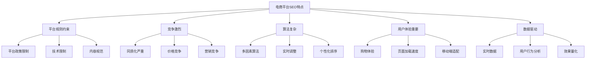

## 🛍️ 商品页面优化

### 商品标题优化
#### 标题结构设计
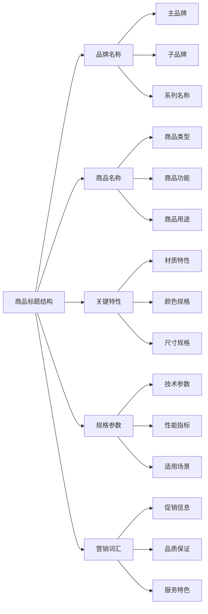

#### 标题优化策略
| 优化要素 | 最佳实践 | 示例 | 注意事项 |
|---------|---------|------|---------|
| **关键词位置** | 核心关键词前置 | "iPhone 15 Pro Max 256GB" | 避免关键词堆砌 |
| **标题长度** | 50-60字符 | "Apple iPhone 15 Pro Max 256GB 深空黑色" | 确保完整显示 |
| **品牌信息** | 包含品牌名称 | "Samsung Galaxy S24 Ultra" | 品牌一致性 |
| **商品特性** | 突出关键特性 | "无线充电 防水 5G" | 用户关注点 |
| **营销词汇** | 适度使用营销词 | "正品保证 全国联保" | 避免过度营销 |

### 商品描述优化
#### 描述结构设计
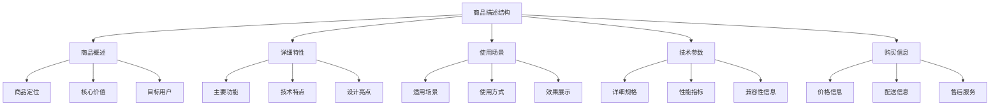

#### 描述优化要点
- **关键词自然融入**：在描述中自然使用相关关键词
- **用户语言**：使用用户容易理解的语言描述商品
- **详细准确**：提供详细准确的商品信息
- **差异化描述**：突出商品独特卖点和优势

### 商品图片优化
#### 图片SEO要素
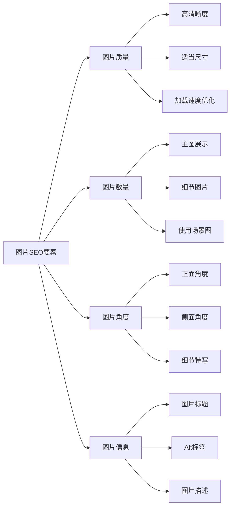

## 🔍 平台搜索优化

### 搜索算法理解
#### 主要搜索因素
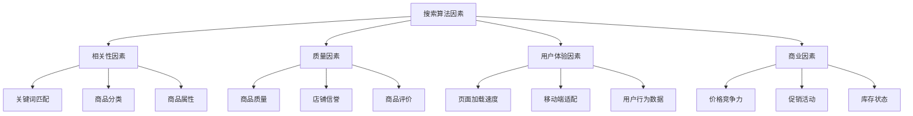

#### 搜索优化策略
| 优化维度 | 优化策略 | 实施方法 | 预期效果 |
|---------|---------|---------|---------|
| **相关性** | 关键词优化 | 标题、描述、属性优化 | 提升搜索相关性 |
| **质量** | 商品质量提升 | 高质量图片、详细描述 | 提升商品质量评分 |
| **用户体验** | 页面优化 | 加载速度、移动端适配 | 提升用户体验评分 |
| **商业** | 价格策略 | 竞争力定价、促销活动 | 提升商业价值评分 |

### 关键词策略
#### 关键词类型
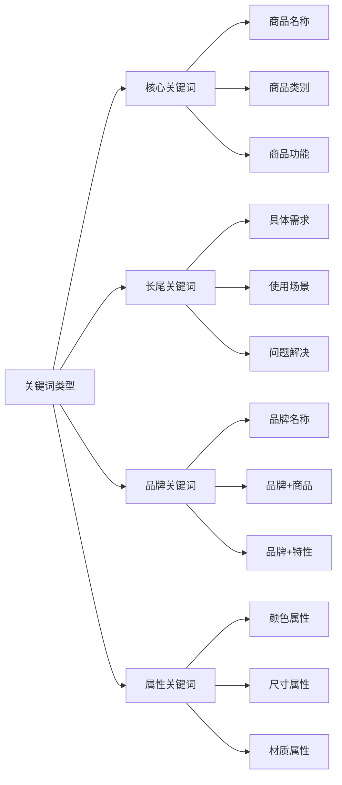

#### 关键词优化方法
- **标题优化**：在商品标题中合理使用关键词
- **描述优化**：在商品描述中自然融入关键词
- **属性优化**：在商品属性中填写相关关键词
- **标签优化**：使用相关标签增加曝光机会

## 📊 数据分析与优化

### 关键指标监控
#### 电商平台SEO指标
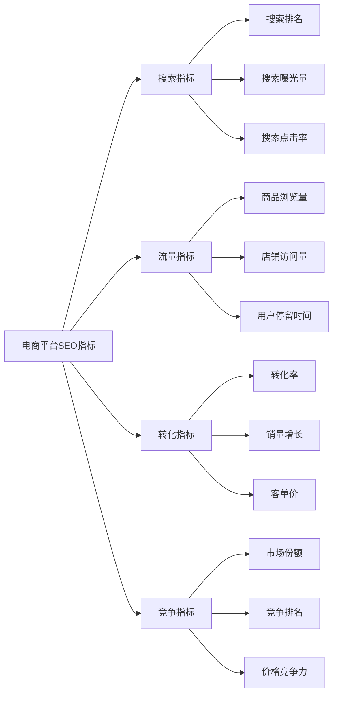

#### 数据分析工具
| 工具类型 | 工具名称 | 主要功能 | 使用建议 |
|---------|---------|---------|---------|
| **平台工具** | 淘宝生意参谋 | 商品和店铺数据分析 | 定期分析商品表现 |
| **平台工具** | 京东商智 | 商品和店铺数据分析 | 关注搜索和转化数据 |
| **第三方工具** | 5118 | 关键词和竞争分析 | 分析竞争对手策略 |
| **第三方工具** | 爱站网 | 网站和关键词分析 | 监控关键词排名 |
| **数据分析** | Excel | 数据整理和分析 | 制作数据分析报告 |

### 优化决策
#### 数据驱动优化
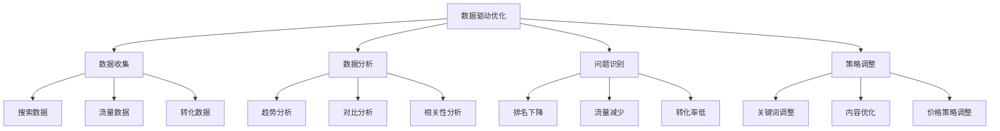

## 🚀 平台SEO最佳实践

### 实施策略
#### 分阶段实施
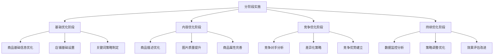

#### 持续优化
- **定期监控**：定期监控商品搜索表现
- **数据分析**：基于数据分析调整策略
- **竞争分析**：持续分析竞争对手策略
- **用户反馈**：收集用户反馈改进商品

### 常见错误避免
#### 常见错误
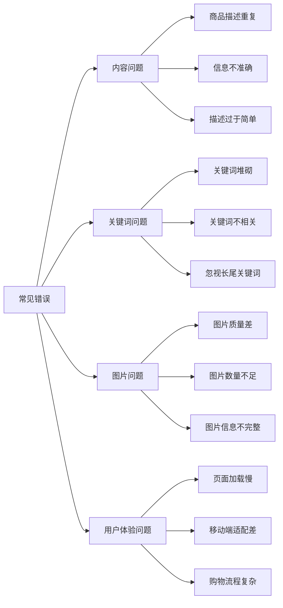

#### 避免方法
- **内容质量**：确保商品内容质量和准确性
- **关键词自然**：避免关键词堆砌，自然使用
- **图片优化**：提供高质量、多角度的商品图片
- **用户体验**：优化页面加载速度和购物体验

## 📋 总结

### 核心要点
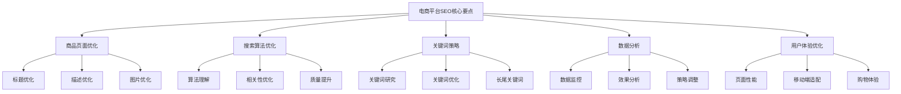

### 成功要素
1. **商品质量**：提供高质量的商品信息
2. **关键词策略**：制定精准的关键词策略
3. **用户体验**：优化购物体验和页面性能
4. **数据分析**：基于数据持续优化
5. **竞争分析**：了解竞争对手策略

### 发展趋势
- **AI技术应用**：利用AI技术提升商品推荐和搜索
- **个性化搜索**：提供个性化搜索结果
- **视频内容**：增加视频内容在商品展示中的应用
- **社交电商**：结合社交媒体进行商品推广
- **直播带货**：利用直播形式提升商品销量
