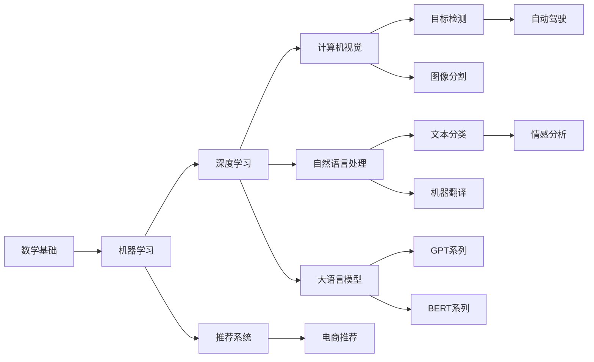
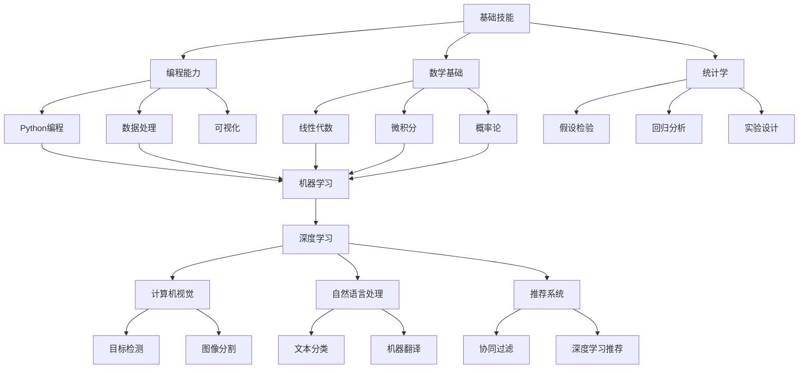

# 知识体系总结

## 概述

本文档是对AI人工智能知识体系的全面总结，涵盖了从基础认知到实践应用的完整学习路径。通过系统化的知识梳理，帮助学习者建立完整的AI知识框架，掌握核心概念和实践技能。

## 知识体系架构

### 整体架构图

```mermaid
graph TD
    A[AI人工智能知识体系] --> B[00-学习指南]
    A --> C[01-基础认知层]
    A --> D[02-理解层]
    A --> E[03-应用层]
    A --> F[04-前沿技术专题]
    A --> G[05-实践项目]
    A --> H[99-学习总结]
    
    B --> B1[学习路径图]
    B --> B2[学习资源汇总]
    B --> B3[学习计划模板]
    B --> B4[知识图谱]
    B --> B5[核心概念速查表]
    B --> B6[学习进度跟踪]
    
    C --> C1[AI基本概念]
    C --> C2[数学基础]
    C --> C3[编程基础]
    
    D --> D1[机器学习核心]
    D --> D2[深度学习基础]
    D --> D3[算法原理]
    
    E --> E1[计算机视觉]
    E --> E2[自然语言处理]
    E --> E3[实际应用领域]
    E --> E4[工程实践]
    
    F --> F1[大语言模型技术]
    F --> F2[生成式AI]
    F --> F3[强化学习]
    
    G --> G1[图像分类器]
    G --> G2[情感分析系统]
    G --> G3[推荐系统]
    
    H --> H1[知识体系总结]
    H --> H2[学习心得与反思]
```

### 知识层次结构

#### 1. 基础认知层 (01-)
**目标**：建立AI的基本认知框架
- **AI基本概念**：定义、分类、发展历程
- **数学基础**：线性代数、概率统计、微积分、信息论
- **编程基础**：Python、数据处理、可视化

#### 2. 理解层 (02-)
**目标**：深入理解AI的核心原理
- **机器学习核心**：监督学习、无监督学习、强化学习
- **深度学习基础**：神经网络、CNN、RNN、Transformer
- **算法原理**：优化算法、正则化、模型评估

#### 3. 应用层 (03-)
**目标**：掌握AI的实际应用技能
- **计算机视觉**：图像处理、目标检测、图像分割
- **自然语言处理**：文本预处理、词向量、语言模型
- **实际应用领域**：推荐系统、自动驾驶、医疗AI
- **工程实践**：数据工程、模型部署、MLOps

#### 4. 前沿技术专题 (04-)
**目标**：了解AI的前沿发展
- **大语言模型技术**：Transformer、预训练、微调
- **生成式AI**：GAN、VAE、扩散模型
- **强化学习**：Q-learning、策略梯度、深度强化学习

#### 5. 实践项目 (05-)
**目标**：通过项目实践巩固知识
- **图像分类器**：CNN实现、模型优化、部署
- **情感分析系统**：NLP技术、序列模型、API开发
- **推荐系统**：协同过滤、深度学习、评估指标

## 核心知识模块

### 1. 数学基础模块

#### 线性代数
- **向量运算**：加法、数乘、内积、外积
- **矩阵运算**：乘法、转置、逆矩阵、特征值
- **空间变换**：线性变换、基变换、正交化
- **应用场景**：神经网络权重、特征变换、降维

#### 概率统计
- **概率基础**：条件概率、贝叶斯定理、独立性
- **分布理论**：正态分布、二项分布、泊松分布
- **统计推断**：假设检验、置信区间、参数估计
- **应用场景**：模型不确定性、贝叶斯推理、统计学习

#### 微积分
- **导数**：偏导数、梯度、链式法则
- **积分**：定积分、多重积分、线积分
- **优化**：极值理论、拉格朗日乘数法
- **应用场景**：梯度下降、反向传播、优化算法

#### 信息论
- **信息量**：熵、互信息、KL散度
- **编码理论**：霍夫曼编码、香农编码
- **应用场景**：特征选择、模型评估、信息增益

### 2. 机器学习模块

#### 监督学习
- **分类算法**：逻辑回归、决策树、SVM、随机森林
- **回归算法**：线性回归、多项式回归、岭回归
- **评估指标**：准确率、精确率、召回率、F1分数
- **实践技巧**：交叉验证、特征工程、超参数调优

#### 无监督学习
- **聚类算法**：K-means、层次聚类、DBSCAN
- **降维算法**：PCA、t-SNE、UMAP
- **关联规则**：Apriori、FP-Growth
- **应用场景**：数据探索、特征提取、异常检测

#### 强化学习
- **基本概念**：环境、智能体、奖励、策略
- **经典算法**：Q-learning、SARSA、策略梯度
- **深度强化学习**：DQN、A3C、PPO
- **应用场景**：游戏AI、机器人控制、资源调度

### 3. 深度学习模块

#### 神经网络基础
- **感知机**：单层感知机、多层感知机
- **激活函数**：Sigmoid、ReLU、Tanh、Softmax
- **损失函数**：MSE、交叉熵、Hinge Loss
- **优化算法**：SGD、Adam、RMSprop

#### 卷积神经网络 (CNN)
- **卷积层**：卷积操作、填充、步长
- **池化层**：最大池化、平均池化
- **经典架构**：LeNet、AlexNet、VGG、ResNet
- **应用场景**：图像分类、目标检测、图像分割

#### 循环神经网络 (RNN)
- **基本RNN**：前向传播、反向传播
- **LSTM**：长短期记忆网络、门控机制
- **GRU**：门控循环单元、简化结构
- **应用场景**：序列建模、语言模型、时间序列

#### Transformer架构
- **注意力机制**：自注意力、多头注意力
- **编码器-解码器**：BERT、GPT、T5
- **位置编码**：绝对位置、相对位置
- **应用场景**：机器翻译、文本生成、预训练模型

### 4. 计算机视觉模块

#### 图像处理基础
- **图像表示**：像素、通道、分辨率
- **基本操作**：缩放、旋转、裁剪、翻转
- **滤波技术**：高斯滤波、边缘检测、形态学操作
- **特征提取**：SIFT、SURF、HOG

#### 目标检测
- **传统方法**：Viola-Jones、HOG+SVM
- **深度学习方法**：R-CNN、YOLO、SSD
- **评估指标**：mAP、IoU、FPS
- **应用场景**：自动驾驶、安防监控、医学影像

#### 图像分割
- **语义分割**：FCN、U-Net、DeepLab
- **实例分割**：Mask R-CNN、YOLACT
- **全景分割**：Panoptic FPN
- **应用场景**：医学影像、自动驾驶、图像编辑

### 5. 自然语言处理模块

#### 文本预处理
- **分词技术**：基于规则、基于统计、基于深度学习
- **词性标注**：HMM、CRF、神经网络
- **命名实体识别**：BIO标注、序列标注
- **文本清洗**：去噪、标准化、去重

#### 词向量技术
- **传统方法**：TF-IDF、词袋模型
- **分布式表示**：Word2Vec、GloVe、FastText
- **上下文表示**：ELMo、BERT、GPT
- **应用场景**：文本分类、情感分析、机器翻译

#### 语言模型
- **统计语言模型**：N-gram、平滑技术
- **神经网络语言模型**：RNN、LSTM、GRU
- **预训练语言模型**：BERT、GPT、T5
- **应用场景**：文本生成、机器翻译、问答系统

### 6. 工程实践模块

#### 数据工程
- **数据收集**：爬虫、API、数据库
- **数据存储**：关系型数据库、NoSQL、数据湖
- **数据处理**：ETL、ELT、流处理
- **数据质量**：清洗、验证、监控

#### 模型部署
- **模型打包**：序列化、版本管理
- **服务化**：API、微服务、容器化
- **性能优化**：量化、剪枝、蒸馏
- **监控运维**：日志、指标、告警

#### MLOps实践
- **持续集成**：代码管理、自动化测试
- **持续部署**：模型发布、A/B测试
- **模型监控**：性能监控、数据漂移
- **实验管理**：参数跟踪、结果对比

## 知识关联图谱

### 概念关联图

### 技能发展路径

## 学习成果评估

### 知识掌握程度评估

#### 基础认知层评估
- **AI基本概念**：能够准确描述AI的定义、分类和发展历程
- **数学基础**：掌握线性代数、概率统计、微积分的基本概念和运算
- **编程基础**：熟练使用Python进行数据处理和可视化

#### 理解层评估
- **机器学习核心**：理解监督学习、无监督学习、强化学习的基本原理
- **深度学习基础**：掌握神经网络、CNN、RNN、Transformer的基本概念
- **算法原理**：理解优化算法、正则化、模型评估的基本方法

#### 应用层评估
- **计算机视觉**：能够实现图像分类、目标检测、图像分割的基本功能
- **自然语言处理**：能够进行文本预处理、词向量训练、语言模型构建
- **实际应用领域**：了解推荐系统、自动驾驶、医疗AI的基本原理
- **工程实践**：掌握数据工程、模型部署、MLOps的基本技能

#### 前沿技术专题评估
- **大语言模型技术**：了解Transformer架构、预训练、微调的基本原理
- **生成式AI**：理解GAN、VAE、扩散模型的基本概念
- **强化学习**：掌握Q-learning、策略梯度等基本算法

#### 实践项目评估
- **图像分类器**：能够独立完成CNN模型的训练、优化和部署
- **情感分析系统**：能够构建NLP模型并进行API服务开发
- **推荐系统**：能够实现协同过滤和深度学习推荐算法

### 技能水平评估

#### 初级水平 (0-40分)
- 了解AI的基本概念和分类
- 掌握基本的数学和编程技能
- 能够使用现成的工具和库
- 完成简单的机器学习任务

#### 中级水平 (40-70分)
- 深入理解机器学习和深度学习原理
- 能够设计和实现复杂的模型
- 掌握数据预处理和特征工程
- 能够进行模型评估和优化

#### 高级水平 (70-90分)
- 精通多种AI算法和技术
- 能够解决复杂的实际问题
- 掌握工程实践和部署技能
- 能够进行技术创新和改进

#### 专家水平 (90-100分)
- 在特定领域有深入研究
- 能够进行原创性研究
- 掌握前沿技术和趋势
- 能够指导他人学习和研究

## 知识应用场景

### 学术研究场景
- **理论研究**：算法改进、模型创新、理论分析
- **实验研究**：数据收集、模型训练、结果分析
- **论文写作**：文献综述、方法描述、结果展示

### 工业应用场景
- **产品开发**：需求分析、技术选型、系统设计
- **模型部署**：服务化、性能优化、监控运维
- **业务优化**：数据分析、效果评估、持续改进

### 创业创新场景
- **技术创业**：AI产品开发、技术商业化
- **创新应用**：跨领域应用、技术融合
- **市场拓展**：技术推广、客户服务

## 持续学习建议

### 学习资源更新
- **学术论文**：关注顶级会议和期刊的最新研究
- **技术博客**：跟踪业界专家的技术分享
- **开源项目**：参与开源项目的开发和贡献
- **在线课程**：持续学习新的技术和工具

### 实践项目拓展
- **个人项目**：开发个人AI应用和工具
- **开源贡献**：参与开源项目的开发和维护
- **竞赛参与**：参加Kaggle等数据科学竞赛
- **技术分享**：撰写技术博客和分享经验

### 知识体系维护
- **定期复习**：定期回顾和巩固已学知识
- **知识更新**：及时更新过时的知识和方法
- **技能提升**：持续提升编程和工程技能
- **思维拓展**：培养批判性思维和创新思维

## 总结

AI人工智能知识体系是一个庞大而复杂的系统，涵盖了数学、计算机科学、统计学等多个学科的知识。通过系统化的学习和实践，可以逐步建立完整的知识框架，掌握核心技能，并在实际应用中不断深化和拓展。

学习AI需要：
1. **扎实的基础**：数学、编程、统计学基础
2. **系统的学习**：按照知识体系循序渐进
3. **持续的实践**：通过项目实践巩固知识
4. **不断的更新**：跟踪前沿技术和趋势

只有通过持续的学习和实践，才能真正掌握AI技术，并在实际应用中发挥价值。

## 相关链接

- [[00-01-学习路径图]] - 学习路径规划
- [[00-04-知识图谱]] - 知识关系图谱
- [[00-05-核心概念速查表]] - 核心概念参考
- [[99-02-学习心得与反思]] - 学习心得分享
- [[99-03-未来学习规划]] - 学习规划制定