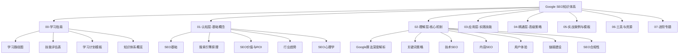

# Google SEO知识体系概览

## 🎯 体系目标
构建完整的Google SEO知识体系，从基础认知到专家精通，形成系统化的学习路径。

## 🏗️ 知识体系架构

## 📚 知识模块详解

### 00-学习指南模块
**目标**：提供学习指导和规划工具

| 文件 | 内容 | 作用 |
|------|------|------|
| [[raw/Google SEO/00-学习指南/01-学习路径图]] | 学习路径规划 | 指导学习方向 |
| [[02-技能评估表]] | 技能水平评估 | 了解当前水平 |
| [[03-学习计划模板]] | 学习计划制定 | 规划学习进度 |
| [[04-知识体系概览]] | 体系结构总览 | 掌握整体框架 |

### 01-认知层-基础概念模块
**目标**：建立SEO基础认知框架

#### 1.1-SEO基础
- [[01-SEO定义与核心概念]] - SEO本质理解
- [[02-SEO发展历史]] - 发展脉络掌握
- [[03-SEO类型分类]] - 分类体系认知
- [[04-SEO与SEM关系]] - 相关概念区分

#### 1.2-搜索引擎原理
- [[01-Google搜索工作原理]] - 搜索机制理解
- [[02-搜索引擎算法基础]] - 算法概念掌握
- [[03-搜索意图理解]] - 搜索意图分析
- [[04-搜索结果页面结构]] - SERP结构认知

#### 1.3-SEO价值与ROI
- [[01-SEO商业价值]] - 商业价值理解
- [[02-SEO对业务影响]] - 业务影响分析
- [[03-SEO投资回报]] - ROI计算方法
- [[04-SEO风险与挑战]] - 风险识别

#### 1.4-行业趋势
- [[01-SEO发展趋势]] - 趋势分析
- [[02-AI对SEO影响]] - AI影响评估
- [[03-移动优先索引]] - 移动端重要性
- [[04-语音搜索优化]] - 语音搜索趋势

#### 1.5-SEO心理学
- [[01-用户搜索行为分析]] - 用户行为理解
- [[02-搜索心理因素]] - 心理因素分析
- [[03-用户决策过程]] - 决策过程掌握

### 02-理解层-核心机制模块
**目标**：深入理解SEO核心机制

#### 2.1-Google算法深度解析
- [[01-Google核心算法]] - PageRank等核心算法
- [[02-算法更新历史]] - 重要更新影响
- [[03-E-A-T概念详解]] - 专业性、权威性、可信度
- [[04-Core Web Vitals]] - 核心网页指标
- [[05-算法惩罚机制]] - 惩罚类型及恢复

#### 2.2-关键词策略
- [[01-关键词研究基础]] - 研究方法掌握
- [[02-长尾关键词策略]] - 长尾词价值
- [[raw/Google SEO/03-应用层-实践技能/3.3-竞争分析/03-关键词竞争分析]] - 竞争度评估
- [[04-关键词布局策略]] - 布局方法
- [[05-语义关键词]] - 语义相关性

#### 2.3-技术SEO
- [[01-网站结构优化]] - 结构设计
- [[02-页面速度优化]] - 速度提升
- [[03-移动端适配]] - 移动优化
- [[04-结构化数据]] - Schema标记
- [[05-网站安全]] - 安全优化
- [[06-爬虫优化]] - 爬虫友好

#### 2.4-内容SEO
- [[01-内容策略规划]] - 策略制定
- [[02-标题标签优化]] - 标签优化
- [[03-内容质量评估]] - 质量标准
- [[04-内容更新策略]] - 更新方法
- [[05-多媒体优化]] - 多媒体SEO

#### 2.5-用户体验
- [[01-用户体验指标]] - UX指标
- [[02-页面停留时间]] - 参与度指标
- [[03-跳出率优化]] - 跳出率降低
- [[04-网站易用性]] - 易用性提升
- [[05-页面布局设计]] - 布局优化

#### 2.6-链接建设
- [[01-链接建设原理]] - 链接价值
- [[02-内部链接策略]] - 内链布局
- [[03-外部链接获取]] - 外链建设
- [[04-链接质量评估]] - 质量评估
- [[05-链接风险控制]] - 风险控制

#### 2.7-SEO合规性
- [[01-SEO法律合规]] - 法律风险
- [[02-隐私政策与GDPR]] - 隐私保护
- [[03-版权与内容合规]] - 版权合规

### 03-应用层-实践技能模块
**目标**：具备实际操作能力

#### 3.1-SEO工具精通
- [[01-Google工具套件]] - Google工具使用
- [[02-第三方SEO工具]] - 第三方工具
- [[03-关键词工具使用]] - 关键词工具
- [[04-技术分析工具]] - 技术分析工具
- [[05-竞争对手分析工具]] - 竞品分析工具

#### 3.2-网站审计
- [[01-SEO审计清单]] - 审计项目
- [[02-技术问题诊断]] - 技术诊断
- [[03-内容审计方法]] - 内容审计
- [[04-链接审计流程]] - 链接审计
- [[05-性能优化审计]] - 性能审计

#### 3.3-竞争分析
- [[01-竞争对手识别]] - 竞品识别
- [[02-竞争分析框架]] - 分析框架
- [[raw/Google SEO/03-应用层-实践技能/3.3-竞争分析/03-关键词竞争分析]] - 关键词竞争
- [[04-内容差距分析]] - 内容差距
- [[05-链接竞争分析]] - 链接竞争

#### 3.4-项目管理
- [[01-SEO项目规划]] - 项目规划
- [[02-SEO团队协作]] - 团队协作
- [[03-SEO预算管理]] - 预算管理
- [[04-SEO进度跟踪]] - 进度跟踪
- [[05-SEO报告制作]] - 报告制作

#### 3.5-数据分析与统计学
- [[01-SEO数据指标]] - 数据指标
- [[02-数据收集方法]] - 数据收集
- [[03-数据分析技巧]] - 分析技巧
- [[04-统计学基础]] - 统计学基础
- [[05-A-B测试方法]] - A-B测试
- [[06-数据驱动决策]] - 数据决策

#### 3.6-问题诊断与解决
- [[01-排名下降诊断]] - 排名诊断
- [[02-流量下降分析]] - 流量分析
- [[03-索引问题解决]] - 索引问题
- [[04-惩罚恢复策略]] - 惩罚恢复
- [[05-技术问题修复]] - 技术修复

#### 3.7-SEO整合营销
- [[01-SEO与PPC整合]] - PPC整合
- [[02-SEO与社交媒体]] - 社交媒体整合
- [[03-SEO与内容营销]] - 内容营销整合
- [[04-SEO与邮件营销]] - 邮件营销整合
- [[05-全渠道SEO策略]] - 全渠道策略

### 04-精通层-高级策略模块
**目标**：成为SEO专家

#### 4.1-企业级SEO策略
- [[01-企业级SEO策略]] - 企业级策略
- [[02-多语言SEO]] - 多语言优化
- [[03-大规模网站SEO]] - 大规模优化
- [[04-垂直行业SEO]] - 行业优化
- [[05-品牌SEO策略]] - 品牌优化

#### 4.2-国际SEO与文化因素
- [[01-国际SEO基础]] - 国际化基础
- [[02-hreflang标签]] - 语言定位
- [[03-国际域名策略]] - 域名策略
- [[04-国际内容策略]] - 内容策略
- [[05-文化因素考虑]] - 文化因素

#### 4.3-本地SEO
- [[01-本地SEO基础]] - 本地化基础
- [[02-Google My Business]] - GMB优化
- [[03-本地关键词策略]] - 本地关键词
- [[04-本地链接建设]] - 本地链接
- [[05-本地内容营销]] - 本地内容

#### 4.4-电商SEO
- [[01-电商SEO特点]] - 电商特点
- [[02-产品页面优化]] - 产品页优化
- [[03-分类页面优化]] - 分类页优化
- [[04-电商技术SEO]] - 电商技术
- [[05-电商内容策略]] - 电商内容

#### 4.5-SEO自动化与AI
- [[01-SEO自动化工具]] - 自动化工具
- [[02-数据监控自动化]] - 监控自动化
- [[03-报告生成自动化]] - 报告自动化
- [[04-AI在SEO中的应用]] - AI应用
- [[05-SEO任务自动化]] - 任务自动化

#### 4.6-未来趋势
- [[01-SEO未来趋势]] - 未来趋势
- [[02-AI搜索影响]] - AI搜索影响
- [[03-语音搜索发展]] - 语音搜索
- [[04-视觉搜索优化]] - 视觉搜索
- [[05-新兴技术SEO]] - 新兴技术

#### 4.7-SEO危机管理
- [[01-SEO危机管理]] - 危机管理
- [[02-算法更新应对]] - 算法更新应对
- [[03-竞争攻击应对]] - 竞争攻击应对
- [[04-技术故障处理]] - 技术故障处理
- [[05-危机恢复策略]] - 危机恢复

### 05-实战案例与模板模块
**目标**：通过案例学习提升实战能力

#### 5.1-成功案例分析
- [[01-成功案例研究]] - 成功案例
- [[02-小企业SEO案例]] - 小企业案例
- [[03-大企业SEO案例]] - 大企业案例
- [[04-行业案例对比]] - 行业对比

#### 5.2-失败案例研究
- [[01-失败案例分析]] - 失败案例
- [[02-常见错误案例]] - 常见错误
- [[03-惩罚案例研究]] - 惩罚案例
- [[04-失败原因分析]] - 失败原因

#### 5.3-行业对比分析
- [[01-行业对比分析]] - 行业对比
- [[02-B2B vs B2C SEO]] - B2B与B2C
- [[03-传统行业vs互联网]] - 传统vs互联网
- [[04-不同规模企业对比]] - 规模对比

#### 5.4-模板资源库
- [[01-SEO模板资源库]] - 模板库
- [[02-审计模板]] - 审计模板
- [[03-报告模板]] - 报告模板
- [[04-检查清单模板]] - 检查清单
- [[05-工作流程模板]] - 工作流程

### 06-工具与资源模块
**目标**：提供工具和资源支持

#### 6.1-SEO工具大全
- [[01-SEO工具大全]] - 工具总览
- [[02-免费SEO工具]] - 免费工具
- [[03-付费SEO工具]] - 付费工具
- [[04-工具选择指南]] - 工具选择

#### 6.2-学习资源
- [[01-学习资源推荐]] - 资源推荐
- [[02-SEO书籍推荐]] - 书籍推荐
- [[03-在线课程推荐]] - 课程推荐
- [[04-博客与网站推荐]] - 博客推荐

#### 6.3-行业报告
- [[01-行业报告收集]] - 报告收集
- [[02-Google官方报告]] - 官方报告
- [[03-第三方研究报告]] - 第三方报告
- [[04-年度趋势报告]] - 趋势报告

#### 6.4-检查清单
- [[01-SEO检查清单]] - 检查清单
- [[02-技术SEO检查清单]] - 技术检查
- [[03-内容SEO检查清单]] - 内容检查
- [[04-链接建设检查清单]] - 链接检查

### 07-进阶专题模块
**目标**：掌握前沿技术和趋势

#### 7.1-SEO与AI
- [[01-SEO与AI]] - AI技术应用
- [[02-ChatGPT与SEO]] - ChatGPT应用
- [[03-AI内容生成]] - AI内容生成
- [[04-AI数据分析]] - AI数据分析

#### 7.2-移动端SEO
- [[01-移动端SEO]] - 移动端优化
- [[02-移动优先设计]] - 移动优先
- [[03-AMP优化]] - AMP技术
- [[04-移动用户体验]] - 移动UX

#### 7.3-语音搜索
- [[01-语音搜索]] - 语音搜索优化
- [[02-语音搜索关键词]] - 语音关键词
- [[03-语音搜索内容]] - 语音内容
- [[04-语音搜索技术]] - 语音技术

#### 7.4-视觉搜索
- [[01-视觉搜索]] - 视觉搜索优化
- [[02-图像SEO]] - 图像优化
- [[03-视频SEO]] - 视频优化
- [[04-视觉搜索技术]] - 视觉技术

## 🔗 知识关联网络

### 核心关联
- **SEO基础** → **搜索引擎原理** → **Google算法**
- **关键词策略** → **内容SEO** → **用户体验**
- **技术SEO** → **网站审计** → **问题诊断**
- **竞争分析** → **项目管理** → **高级策略**

### 进阶关联
- **企业级策略** → **国际SEO** → **本地SEO**
- **电商SEO** → **自动化AI** → **未来趋势**
- **实战案例** → **工具资源** → **进阶专题**

## 📊 学习进度指标

### 认知层指标
- 概念理解度：能解释核心概念
- 原理掌握度：理解工作原理
- 价值认知度：了解商业价值

### 理解层指标
- 机制理解度：掌握核心机制
- 策略制定度：能制定基础策略
- 分析能力度：具备分析能力

### 应用层指标
- 工具使用度：熟练使用工具
- 实践能力度：能独立实践
- 问题解决度：能解决问题

### 精通层指标
- 策略制定度：能制定高级策略
- 创新思维度：具备创新思维
- 领导能力度：能领导团队

## 📖 相关链接
- [[raw/Google SEO/00-学习指南/01-学习路径图]] - 学习路径规划
- [[02-技能评估表]] - 技能水平评估
- [[03-学习计划模板]] - 学习计划制定
