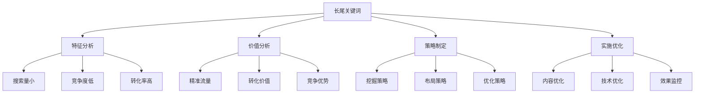
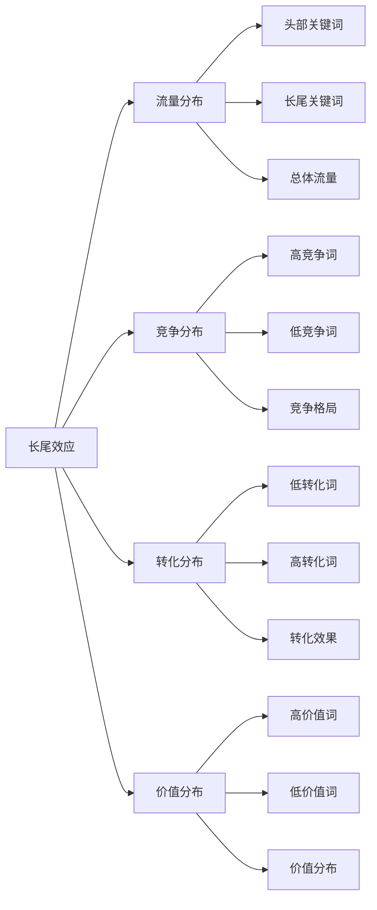
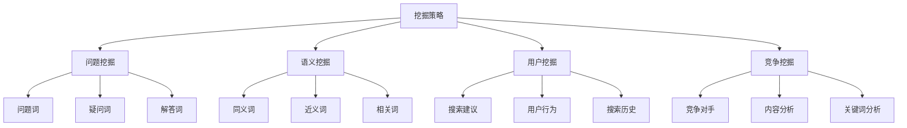
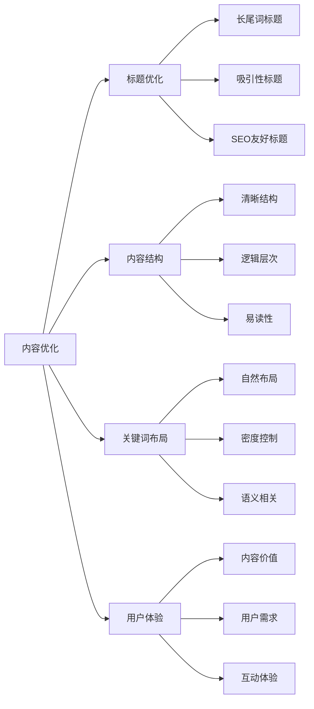
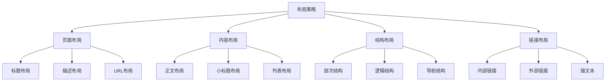
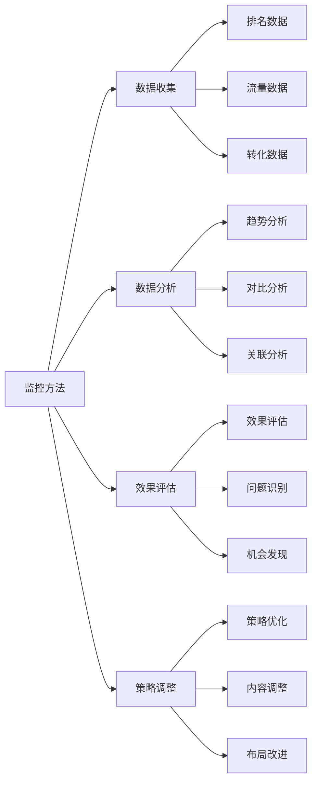
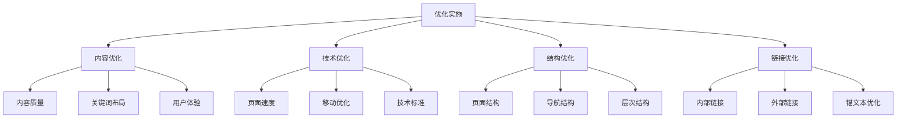
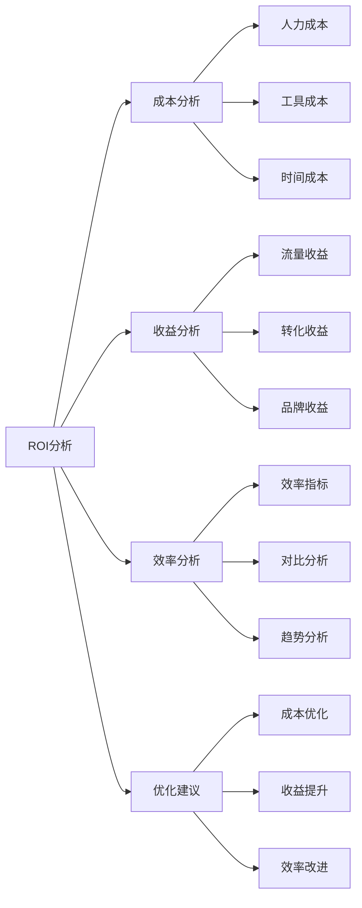
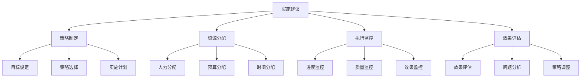

# 长尾关键词策略

## 🎯 学习目标
- 深入理解长尾关键词的价值和特点
- 掌握长尾关键词的挖掘和优化方法
- 学会长尾关键词策略制定和实施
- 建立长尾关键词优化认知框架

## 🔍 长尾关键词概述

### 核心概念
**长尾关键词**：搜索量相对较小、竞争度较低、但转化率较高的长短语关键词

### 长尾关键词特点
| 特点维度 | 具体表现 | 优势分析 | 应用价值 |
|----------|----------|----------|----------|
| **搜索量** | 相对较小，但总量巨大 | 竞争压力小 | 容易获得排名 |
| **竞争度** | 竞争激烈程度低 | 优化成本低 | 快速见效 |
| **转化率** | 转化率相对较高 | 商业价值高 | 精准用户获取 |
| **意图性** | 搜索意图明确 | 用户需求精准 | 内容匹配度高 |

## 📊 长尾关键词价值分析

### 1. 商业价值
| 价值类型 | 具体表现 | 量化指标 | 商业意义 |
|----------|----------|----------|----------|
| **流量价值** | 精准流量获取 | 点击率、访问量 | 目标用户获取 |
| **转化价值** | 高转化率 | 转化率、订单量 | 直接商业收益 |
| **成本价值** | 优化成本低 | CPC、CAC | 成本效益优势 |
| **竞争价值** | 竞争压力小 | 排名提升速度 | 竞争优势获得 |

### 2. 长尾效应

### 3. 长尾价值计算
- **流量价值**：长尾关键词带来的精准流量
- **转化价值**：长尾关键词的转化率和转化量
- **成本价值**：长尾关键词的优化成本
- **综合价值**：长尾关键词的综合商业价值

## 🛠️ 长尾关键词挖掘方法

### 1. 挖掘工具
| 工具类型 | 工具名称 | 功能特点 | 应用场景 |
|----------|----------|----------|----------|
| **关键词工具** | Google Keyword Planner | 搜索量、竞争度 | 基础关键词研究 |
| **长尾工具** | Answer The Public | 问题挖掘 | 长尾问题发现 |
| **语义工具** | SEMrush | 语义关键词 | 相关词挖掘 |
| **用户工具** | Google Suggest | 搜索建议 | 实时长尾发现 |

### 2. 挖掘策略

### 3. 挖掘技巧
- **问题导向**：基于用户问题挖掘长尾词
- **语义扩展**：基于语义关系扩展关键词
- **用户行为**：基于用户搜索行为挖掘
- **竞争分析**：基于竞争对手分析挖掘

## 📝 长尾关键词内容策略

### 1. 内容类型
| 内容类型 | 长尾词特点 | 内容策略 | 优化重点 |
|----------|------------|----------|----------|
| **问答内容** | 问题型长尾词 | FAQ页面、问答文章 | 问题解答、用户帮助 |
| **教程内容** | 教程型长尾词 | 操作指南、教程文章 | 步骤详细、操作清晰 |
| **比较内容** | 比较型长尾词 | 产品对比、服务对比 | 客观对比、详细分析 |
| **评价内容** | 评价型长尾词 | 产品评价、服务评价 | 真实评价、客观分析 |

### 2. 内容优化

### 3. 内容策略
- **价值导向**：以用户价值为导向创作内容
- **问题解决**：解决用户具体问题
- **深度内容**：提供深度、专业的内容
- **用户互动**：鼓励用户互动和参与

## 🎯 长尾关键词布局策略

### 1. 布局原则
| 布局原则 | 具体内容 | 实施方法 | 效果评估 |
|----------|----------|----------|----------|
| **自然布局** | 关键词自然分布 | 语义相关、上下文匹配 | 可读性、相关性 |
| **密度控制** | 关键词密度适中 | 2-3%密度、自然分布 | 搜索引擎友好 |
| **语义相关** | 语义相关词汇 | 同义词、近义词使用 | 语义理解提升 |
| **用户导向** | 以用户需求为导向 | 用户价值、体验优化 | 用户满意度 |

### 2. 布局策略

### 3. 布局实施
- **标题优化**：在标题中自然使用长尾词
- **内容优化**：在内容中自然分布长尾词
- **结构优化**：优化页面结构和层次
- **链接优化**：优化内部链接和锚文本

## 📈 长尾关键词效果监控

### 1. 监控指标
| 指标类型 | 具体指标 | 监控方法 | 优化方向 |
|----------|----------|----------|----------|
| **排名指标** | 长尾词排名 | 排名监控工具 | 排名提升 |
| **流量指标** | 长尾词流量 | Analytics分析 | 流量增长 |
| **转化指标** | 长尾词转化 | 转化跟踪 | 转化优化 |
| **竞争指标** | 竞争度变化 | 竞争分析 | 竞争策略 |

### 2. 监控方法

### 3. 监控工具
- **排名监控**：使用排名监控工具跟踪长尾词排名
- **流量分析**：使用Analytics分析长尾词流量
- **转化跟踪**：使用转化跟踪工具监控转化效果
- **竞争分析**：使用竞争分析工具监控竞争变化

## 🎯 长尾关键词优化策略

### 1. 优化策略
| 策略类型 | 策略内容 | 实施方法 | 预期效果 |
|----------|----------|----------|----------|
| **内容优化** | 内容质量提升 | 深度内容、用户价值 | 排名提升、流量增长 |
| **技术优化** | 技术SEO优化 | 页面速度、移动优化 | 用户体验提升 |
| **结构优化** | 页面结构优化 | 层次结构、导航优化 | 搜索引擎友好 |
| **链接优化** | 内部链接优化 | 链接结构、锚文本 | 权重传递、排名提升 |

### 2. 优化实施

### 3. 优化重点
- **内容质量**：提升内容质量和用户价值
- **关键词布局**：优化长尾词布局和密度
- **用户体验**：优化用户体验和交互
- **技术标准**：符合搜索引擎技术标准

## 📊 长尾关键词ROI分析

### 1. ROI计算
| 计算维度 | 计算公式 | 数据来源 | 分析价值 |
|----------|----------|----------|----------|
| **流量ROI** | 长尾词流量/优化成本 | Analytics、成本统计 | 流量获取效率 |
| **转化ROI** | 长尾词转化价值/优化成本 | 转化数据、成本统计 | 转化获取效率 |
| **排名ROI** | 排名提升价值/优化成本 | 排名数据、成本统计 | 排名提升效率 |
| **综合ROI** | 综合价值/综合成本 | 综合数据、成本统计 | 整体投资回报 |

### 2. ROI分析

### 3. ROI优化
- **成本控制**：控制长尾词优化成本
- **收益提升**：提升长尾词收益
- **效率改进**：改进优化效率
- **投资决策**：基于ROI做投资决策

## 🎯 长尾关键词实践建议

### 1. 策略建议
- **长期规划**：制定长期长尾词策略
- **持续优化**：持续优化长尾词效果
- **数据驱动**：基于数据制定策略
- **用户导向**：以用户需求为导向

### 2. 实施建议

### 3. 最佳实践
- **质量优先**：优先保证内容质量
- **用户价值**：以用户价值为核心
- **持续改进**：持续改进和优化
- **数据驱动**：基于数据做决策

## 📚 学习路径

### 基础理解
1. [[01-关键词研究基础]] - 关键词研究基础
2. [[raw/Google SEO/02-理解层-核心机制/2.2-关键词策略/03-关键词竞争分析]] - 关键词竞争分析
3. [[04-关键词布局策略]] - 关键词布局策略

### 深入应用
1. [[02-理解层-核心机制#2.4-内容SEO]] - 内容SEO
2. [[03-应用层-实践技能#3.1-SEO工具精通]] - 工具应用
3. [[04-精通层-高级策略#4.1-企业级SEO策略]] - 企业级策略

### 实战练习
1. [[03-应用层-实践技能#3.2-网站审计]] - 网站审计
2. [[05-实战案例与模板#5.1-成功案例分析]] - 案例分析
3. [[06-工具与资源#6.1-SEO工具大全]] - 工具资源

## 📖 相关链接
- [[01-关键词研究基础]] - 关键词研究基础
- [[raw/Google SEO/02-理解层-核心机制/2.2-关键词策略/03-关键词竞争分析]] - 关键词竞争分析
- [[04-关键词布局策略]] - 关键词布局策略
- [[02-理解层-核心机制#2.4-内容SEO]] - 内容SEO
- [[03-应用层-实践技能]] - 实践技能
- [[04-精通层-高级策略]] - 高级策略
