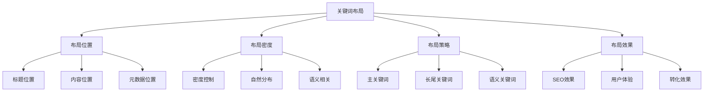
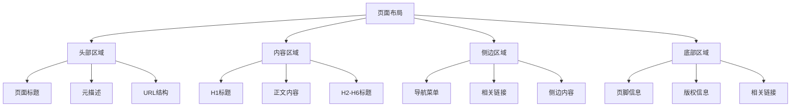
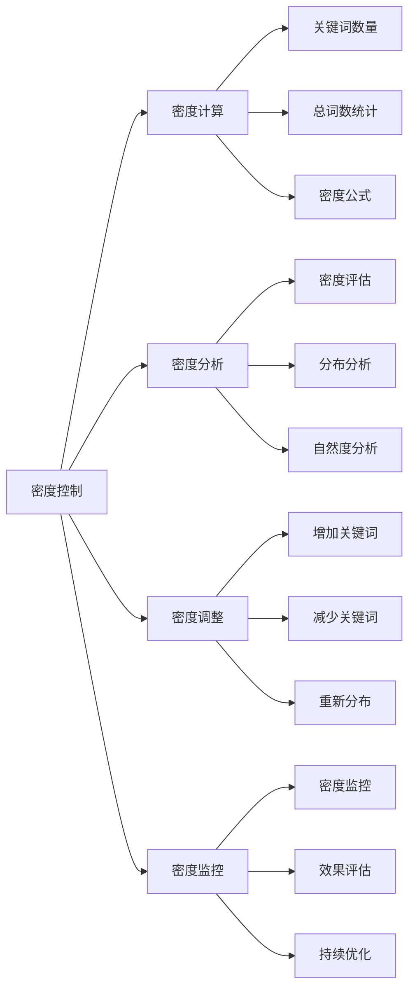
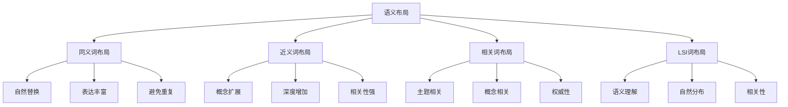
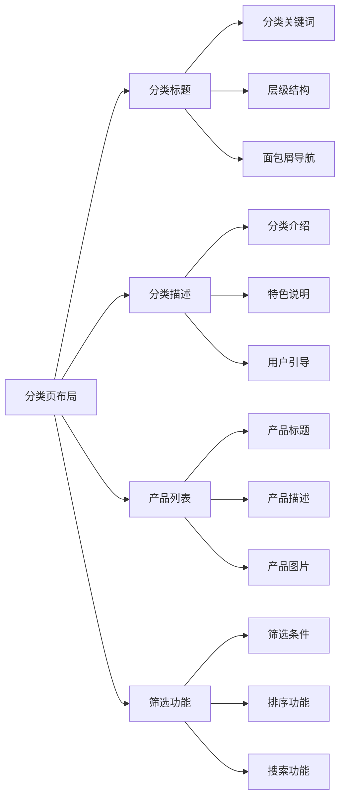
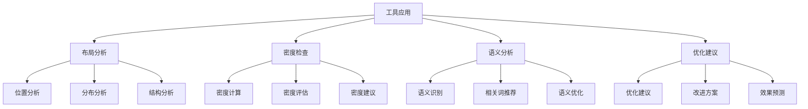
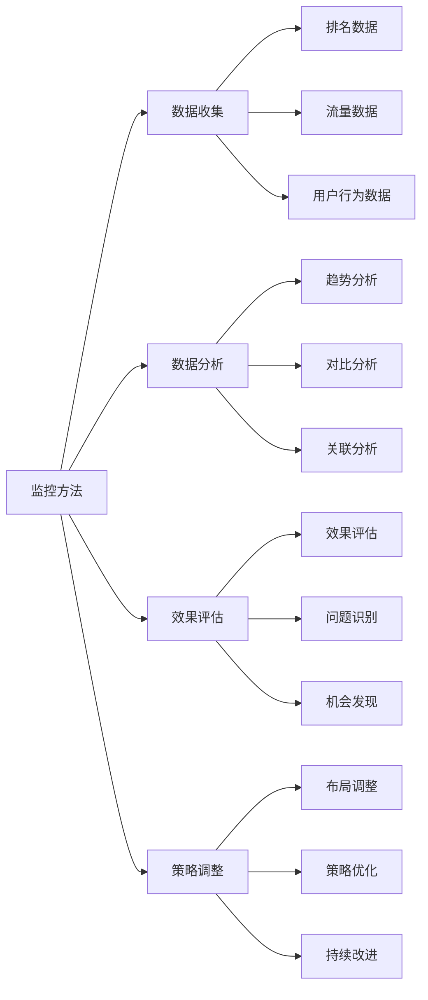
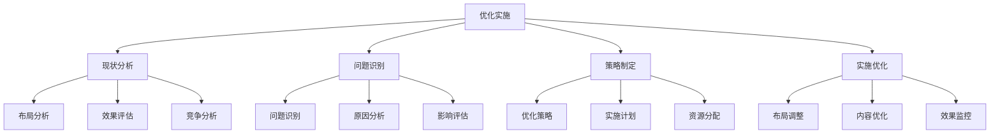
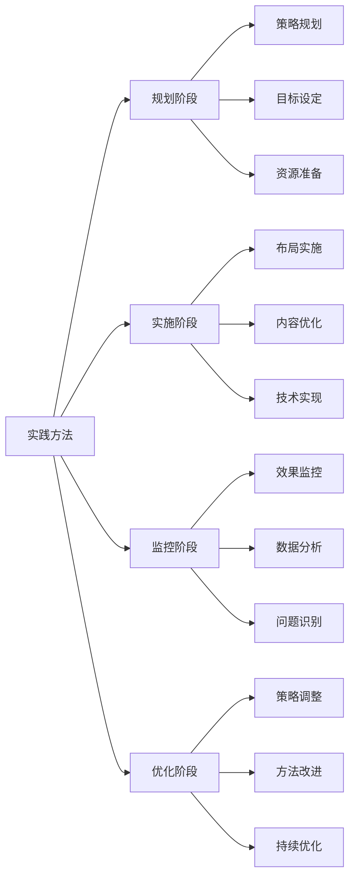

# 关键词布局策略

## 🎯 学习目标
- 深入理解关键词布局的重要性和原则
- 掌握关键词在页面各位置的布局方法
- 学会关键词密度控制和语义优化
- 建立关键词布局策略认知框架

## 📍 关键词布局概述

### 核心概念
**关键词布局**：在网页的各个位置合理分布关键词，以实现SEO优化和用户体验的平衡

### 布局重要性
| 重要性维度 | 具体表现 | 影响程度 | 优化价值 |
|------------|----------|----------|----------|
| **SEO效果** | 搜索引擎理解和排名 | 高 | 排名提升 |
| **用户体验** | 内容可读性和相关性 | 高 | 用户满意度 |
| **转化效果** | 用户行为引导 | 中 | 转化率提升 |
| **内容质量** | 内容专业性和权威性 | 中 | 内容价值 |

## 🎯 关键词布局位置

### 1. 重要位置分析
| 位置类型 | 重要性 | 布局要点 | 优化建议 |
|----------|--------|----------|----------|
| **页面标题** | 极高 | 主关键词、品牌词 | 标题优化、长度控制 |
| **H1标签** | 极高 | 主关键词、页面主题 | 唯一性、相关性 |
| **H2-H6标签** | 高 | 长尾词、相关词 | 层次结构、语义相关 |
| **首段内容** | 高 | 主关键词、核心概念 | 自然出现、价值突出 |
| **元描述** | 中 | 主关键词、吸引性 | 描述优化、点击率 |

### 2. 布局位置图

### 3. 位置权重
- **标题位置**：权重最高，关键词效果最好
- **内容位置**：权重较高，自然分布效果佳
- **元数据位置**：权重中等，影响点击率
- **其他位置**：权重较低，辅助优化作用

## 📊 关键词密度控制

### 1. 密度标准
| 密度范围 | 密度表现 | 优化建议 | 风险程度 |
|----------|----------|----------|----------|
| **1-2%** | 密度偏低 | 适当增加关键词 | 低风险 |
| **2-3%** | 密度适中 | 保持当前密度 | 无风险 |
| **3-5%** | 密度偏高 | 适当减少关键词 | 中等风险 |
| **5%以上** | 密度过高 | 大幅减少关键词 | 高风险 |

### 2. 密度控制

### 3. 密度优化
- **自然分布**：关键词自然分布在内容中
- **语义相关**：使用同义词和相关词汇
- **上下文匹配**：关键词与上下文内容匹配
- **用户导向**：以用户阅读体验为导向

## 🔗 语义关键词布局

### 1. 语义关键词类型
| 关键词类型 | 特点描述 | 布局策略 | 优化效果 |
|------------|----------|----------|----------|
| **同义词** | 意思相同、表达不同 | 自然替换、丰富表达 | 语义理解提升 |
| **近义词** | 意思相近、略有差异 | 相关使用、扩展概念 | 内容深度增加 |
| **相关词** | 主题相关、概念相关 | 关联使用、主题扩展 | 主题权威性 |
| **LSI关键词** | 潜在语义索引词 | 语义相关、自然分布 | 搜索引擎理解 |

### 2. 语义布局策略

### 3. 语义优化
- **语义丰富**：使用丰富的语义词汇
- **自然表达**：保持自然的语言表达
- **主题相关**：确保词汇与主题相关
- **用户友好**：以用户理解为导向

## 📝 不同类型页面布局

### 1. 首页布局
| 布局要素 | 关键词类型 | 布局方法 | 优化重点 |
|----------|------------|----------|----------|
| **主标题** | 品牌词、核心词 | 突出显示、唯一性 | 品牌识别、核心定位 |
| **导航菜单** | 分类词、服务词 | 清晰分类、易导航 | 用户体验、信息架构 |
| **首屏内容** | 核心词、价值词 | 价值突出、吸引注意 | 用户吸引、价值传递 |
| **产品/服务** | 产品词、服务词 | 特色展示、优势突出 | 产品推广、服务介绍 |

### 2. 分类页布局

### 3. 产品页布局
| 布局要素 | 关键词类型 | 布局方法 | 优化重点 |
|----------|------------|----------|----------|
| **产品标题** | 产品名、型号 | 准确描述、唯一性 | 产品识别、搜索匹配 |
| **产品描述** | 功能词、特性词 | 详细描述、优势突出 | 产品了解、购买决策 |
| **技术参数** | 技术词、规格词 | 准确参数、专业术语 | 技术了解、专业形象 |
| **用户评价** | 评价词、体验词 | 真实评价、用户反馈 | 信任建立、社会证明 |

## 🛠️ 关键词布局工具

### 1. 布局分析工具
| 工具类型 | 工具名称 | 功能特点 | 应用场景 |
|----------|----------|----------|----------|
| **密度分析** | Yoast SEO、RankMath | 密度分析、建议优化 | 密度控制、布局优化 |
| **语义分析** | TextRazor、Semantic API | 语义分析、相关词推荐 | 语义优化、内容丰富 |
| **布局检查** | Screaming Frog、Sitebulb | 布局检查、结构分析 | 技术检查、结构优化 |
| **内容分析** | Clearscope、MarketMuse | 内容分析、优化建议 | 内容优化、竞争分析 |

### 2. 工具应用

### 3. 工具使用技巧
- **多工具结合**：使用多种工具综合分析
- **定期检查**：定期检查关键词布局
- **数据验证**：验证工具分析结果
- **持续优化**：基于工具建议持续优化

## 📈 布局效果监控

### 1. 监控指标
| 指标类型 | 具体指标 | 监控方法 | 优化方向 |
|----------|----------|----------|----------|
| **排名指标** | 关键词排名变化 | 排名监控工具 | 排名提升 |
| **流量指标** | 关键词流量变化 | Analytics分析 | 流量增长 |
| **点击指标** | 点击率、点击量 | Search Console | 点击优化 |
| **转化指标** | 转化率、转化量 | 转化跟踪 | 转化优化 |

### 2. 监控方法

### 3. 监控周期
- **日常监控**：每日监控关键指标
- **周度分析**：每周分析布局效果
- **月度评估**：每月评估整体效果
- **季度调整**：每季度调整布局策略

## 🎯 布局优化策略

### 1. 优化策略
| 策略类型 | 策略内容 | 实施方法 | 预期效果 |
|----------|----------|----------|----------|
| **位置优化** | 关键词位置调整 | 重要位置优先、自然分布 | 排名提升、用户体验 |
| **密度优化** | 关键词密度调整 | 密度控制、自然分布 | 避免过度优化、自然度提升 |
| **语义优化** | 语义关键词丰富 | 同义词使用、语义相关 | 语义理解提升、内容丰富 |
| **结构优化** | 页面结构优化 | 层次清晰、逻辑合理 | 用户体验提升、搜索引擎友好 |

### 2. 优化实施

### 3. 优化重点
- **用户体验**：以用户体验为导向优化
- **自然度**：保持关键词布局的自然度
- **相关性**：确保关键词与内容相关
- **效果监控**：持续监控优化效果

## 🎯 布局最佳实践

### 1. 实践原则
| 实践原则 | 具体内容 | 实施要点 | 注意事项 |
|----------|----------|----------|----------|
| **自然原则** | 关键词自然分布 | 自然语言、流畅表达 | 避免堆砌、保持可读性 |
| **相关原则** | 关键词与内容相关 | 主题相关、语义相关 | 避免无关、保持相关性 |
| **平衡原则** | SEO与用户体验平衡 | 优化效果、用户体验 | 避免过度优化、保持平衡 |
| **持续原则** | 持续优化和改进 | 定期检查、持续改进 | 避免一次性、保持持续性 |

### 2. 实践方法

### 3. 实践建议
- **用户导向**：以用户需求为导向
- **自然优化**：保持优化的自然性
- **数据驱动**：基于数据做决策
- **持续改进**：持续改进和优化

## 📚 学习路径

### 基础理解
1. [[01-关键词研究基础]] - 关键词研究基础
2. [[02-长尾关键词策略]] - 长尾关键词策略
3. [[raw/Google SEO/02-理解层-核心机制/2.2-关键词策略/03-关键词竞争分析]] - 关键词竞争分析

### 深入应用
1. [[02-理解层-核心机制#2.4-内容SEO]] - 内容SEO
2. [[02-理解层-核心机制#2.3-技术SEO]] - 技术SEO
3. [[03-应用层-实践技能#3.1-SEO工具精通]] - 工具应用

### 实战练习
1. [[03-应用层-实践技能#3.2-网站审计]] - 网站审计
2. [[05-实战案例与模板#5.1-成功案例分析]] - 案例分析
3. [[06-工具与资源#6.1-SEO工具大全]] - 工具资源

## 📖 相关链接
- [[01-关键词研究基础]] - 关键词研究基础
- [[02-长尾关键词策略]] - 长尾关键词策略
- [[raw/Google SEO/02-理解层-核心机制/2.2-关键词策略/03-关键词竞争分析]] - 关键词竞争分析
- [[02-理解层-核心机制#2.4-内容SEO]] - 内容SEO
- [[02-理解层-核心机制#2.3-技术SEO]] - 技术SEO
- [[03-应用层-实践技能]] - 实践技能
