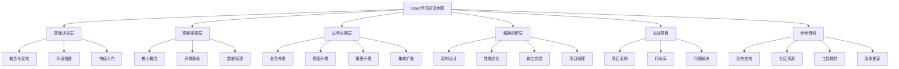

# Odoo学习知识地图

## 📚 学习路径概览



## 🎯 学习目标层次

### 基础认知层 (Foundation)
- **目标**: 建立Odoo基础认知
- **时间**: 1-2周
- **重点**: 概念理解、环境搭建、快速体验

### 理解掌握层 (Understanding)
- **目标**: 深入理解核心机制
- **时间**: 2-4周
- **重点**: 模型、视图、数据流、开发模式

### 应用实践层 (Application)
- **目标**: 能够独立开发功能
- **时间**: 4-8周
- **重点**: 业务逻辑、界面设计、报表制作、系统集成

### 精通创新层 (Mastery)
- **目标**: 架构设计和性能优化
- **时间**: 8-16周
- **重点**: 系统架构、性能调优、最佳实践、项目管理

## 📖 学习建议

### 费曼学习法应用
1. **概念解释**: 每个知识点都要能用简单语言解释
2. **实例验证**: 通过具体例子验证理解
3. **知识连接**: 建立知识点之间的关联
4. **教学输出**: 能够向他人解释所学内容

### 刻意练习策略
1. **分解练习**: 将复杂任务分解为小步骤
2. **重复练习**: 重点内容多次练习
3. **反馈循环**: 及时获取反馈并调整
4. **挑战提升**: 逐步增加难度

### 金字塔学习模型
```
应用层: 实际项目开发
理解层: 概念理解和机制掌握
记忆层: 基础概念和操作记忆
```

## 🔗 快速导航

### 新手入门路径
[[Odoo概述]] → [[开发环境配置]] → [[第一个模块开发]]

### 开发者进阶路径
[[02-理解掌握层/01-核心概念/ORM模型]] → [[02-理解掌握层/02-开发基础/模块结构]] → [[业务逻辑开发]]

### 架构师精通路径
[[04-精通创新层/01-架构设计/系统架构]] → [[04-精通创新层/02-性能优化/性能调优]] → [[04-精通创新层/03-最佳实践/开发规范]]

## 📊 学习进度跟踪

| 层次 | 状态 | 完成度 | 预计时间 |
|------|------|--------|----------|
| 基础认知层 | 🔄 进行中 | 0% | 1-2周 |
| 理解掌握层 | ⏳ 待开始 | 0% | 2-4周 |
| 应用实践层 | ⏳ 待开始 | 0% | 4-8周 |
| 精通创新层 | ⏳ 待开始 | 0% | 8-16周 |

## 🎓 学习成果检验

### 基础认知层检验
- [ ] 能够解释Odoo的基本概念
- [ ] 能够搭建开发环境
- [ ] 能够创建简单的模块

### 理解掌握层检验
- [ ] 理解ORM模型机制
- [ ] 掌握视图开发方法
- [ ] 了解数据管理流程

### 应用实践层检验
- [ ] 能够开发完整业务模块
- [ ] 能够设计用户界面
- [ ] 能够制作报表

### 精通创新层检验
- [ ] 能够设计系统架构
- [ ] 能够优化系统性能
- [ ] 能够管理开发项目

---

**下一步**: 开始 [[Odoo概述|基础认知层学习]]

